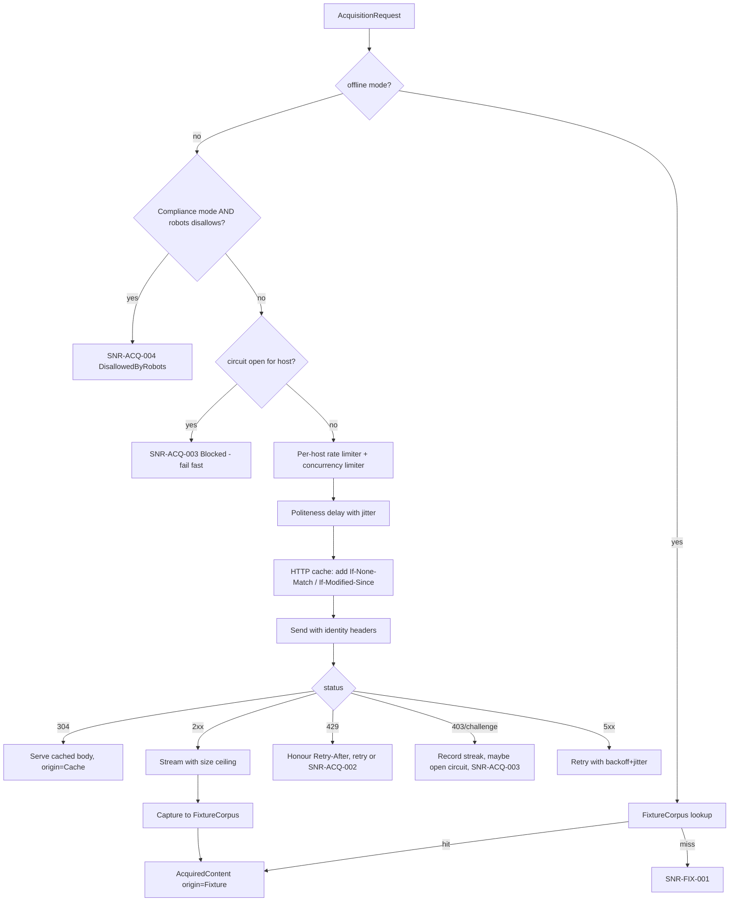

# Acquisition Pipeline

> Feature spec for code-forge implementation planning.
> Source: extracted from docs/sanare/tech-design.md §8
> Created: 2026-09-06
> Implementation status: partial — `Sanare.Core.Acquisition.HttpContentAcquirer` provides the controlled HTTP/fixture boundary described below, but it is not yet integrated with `FixtureScrapeRunner` or the planned runtime.

| Field | Value |
|-------|-------|
| Component | acquisition-pipeline |
| Priority | P0 |
| SRS Refs | — (no SRS; traces to tech-design §3.6 AC-008, AC-009, AC-010, AC-011, AC-012, AC-027, AC-032, AC-033) |
| Tech Design | §8.1 — row 6 "Acquisition Pipeline"; §7.4 (system limits); §7.6 (retry/circuit breaker); §8.4 (data flow); §11.3; §11.4 (DR-014 adaptive rate limiting + manual challenge hand-off) |
| Depends On | scrape-api-contracts, fixture-corpus |
| Blocks | browsing-identity, browser-tier, plan-runtime |

## Purpose

Everything that touches the network goes through one pipeline, so acquisition-mode policy, politeness, caching, robots.txt handling, rate limiting, circuit breaking, and fixture capture are enforced in exactly one place. `Compliance` is the default and enforces robots rules with a bot-identifying identity; audited `Stealth` configuration may enable supported mitigation capabilities for public data. Both modes retain the same per-host request-volume safeguards, and offline replay substitutes disk for sockets.

## Scope

**Included:**

- The `IContentAcquirer` abstraction and its HTTP implementation over `HttpClient`/`SocketsHttpHandler`.
- Per-host rate limiting (requests/minute with burst) and per-host concurrency limiting, shared across all
  runs in the process; optional per-source **adaptive (AIMD) rate mode** that climbs toward a configured
  ceiling on clean responses and halves immediately on any block signal (DR-014).
- Politeness delay with jitter between sequential requests to the same host.
- `robots.txt` fetching, parsing, and caching for every source (always on, needed for `llms.txt` discovery
  and crawl-delay information); **enforcement** of its `Disallow` rules is an explicit per-source opt-in
  (`RespectRobots`, default `false` — see §11.4/DR-016). Crawl-delay is honoured as a politeness floor
  whenever robots.txt is readable, independent of the `RespectRobots` switch.
- Discovery-document (`llms.txt`) acquisition when referenced by robots.txt, through the same governed path
  as any other target request — this fetch/parse is independent of whether `Disallow` enforcement is on.
- Conditional-request HTTP caching (`ETag`/`Last-Modified`) persisted under `cache/http/`.
- Retry with exponential back-off and full jitter for transient failures; `Retry-After` obedience.
- Circuit breaker per host on 403/challenge streaks, plus a distinct non-auto-closing `ChallengePaused`
  state for hard challenge/IP-block signatures, clearable only by a clean probe or an operator-invoked
  manual browser hand-off (DR-014) — never by automated bypass.
- Redirect handling with a bounded chain and cross-host policy.
- Response size ceiling and streaming abort.
- Content-type gating and charset detection.
- Fixture capture of every fetched response (delegated to `fixture-corpus`).
- Offline mode: resolve from fixtures, never open a socket.
- Cookie jar scoped per source (needed for consent walls), with cookies never persisted to fixtures.

**Excluded:**

- What headers to send and what identity to present — `browsing-identity` supplies the header set.
- Driving a real browser — `browser-tier` sits beside this component and reuses its limiter, robots, and
  capture services.
- Interpreting the response body — `plan-runtime`.
- Result caching of typed payloads — that is a higher layer keyed by plan commit.

## Core Responsibilities

1. **Fetch** a URL and return a normalised `AcquiredContent` (bytes, content type, charset, final URL,
   status, headers, origin).
2. **Pace** all traffic per host so the target never sees a burst the library would not want to receive.
3. **Honor** `Retry-After` and cache headers unconditionally; read robots.txt for crawl-delay and discovery
   hints by default, and enforce its `Disallow` rules only when `RespectRobots` is explicitly enabled for
   that source (default: bypass — see §11.4/DR-016).
4. **Stop** rather than escalate when a host signals blocking.
5. **Capture** every response into the fixture corpus so the corpus grows naturally from real runs.
6. **Replay** from the corpus when offline, with a hard guarantee of no network I/O.

## Interfaces

### Inputs

- **`AcquisitionRequest`** (from `plan-runtime`, `pagination-engine`, `authoring-workflow`) — URL, source
  id, method, expected content types, page role, cancellation token.
- **`BrowsingIdentity` header set** (from `browsing-identity`).
- **`AcquisitionOptions`** (from `hosting-configuration`) — per-host limits, timeouts, robots policy,
  cache policy, offline flag, `AllowInsecureTransport`.

### Outputs

- **`AcquiredContent`** (to `plan-runtime`, `browser-tier`, `authoring-workflow`).
- **`CaptureRequest`** (to `fixture-corpus`).
- **Acquisition diagnostics and metrics** (to `observability`).

### Dependencies

- **`fixture-corpus`** — capture and offline replay.
- **`browsing-identity`** — header profile per request.
- **`Microsoft.Extensions.Http.Resilience` / Polly** — retry and circuit-breaker pipelines.
- **`System.Threading.RateLimiting`** — token-bucket and concurrency limiters.

## Data Flow



## Key Behaviors

### Interface

```csharp
public interface IContentAcquirer
{
    ValueTask<AcquiredContent> AcquireAsync(
        AcquisitionRequest request, CancellationToken ct = default);
}

public sealed record AcquiredContent(
    Uri RequestedUrl, Uri FinalUrl, int StatusCode, string ContentType,
    Encoding Charset, ReadOnlyMemory<byte> Body,
    IReadOnlyDictionary<string, string> Headers,
    ContentOrigin Origin, string? FixtureId, TimeSpan Elapsed);

public enum ContentOrigin { Network, Cache, Fixture, Browser }
```

### Rate limiting and politeness

1. One `PartitionedRateLimiter<string>` partitioned by host, configured as a token bucket: 20 requests per
   minute with burst 5 by default (§7.4), overridable per host, and per-source `RateLimit.Mode` (DR-014):
   - `Fixed` (default off): the classic static token bucket described above, unchanged.
   - `Adaptive` (opt-in per source): an AIMD (additive-increase/multiplicative-decrease) controller wraps
     the same token bucket. Every clean response window (no `429`/`503`/`403`/challenge signature) grows the
     effective rate by a small additive step, up to a source-configured ceiling (e.g. up to 60 req/min for
     a permissive site, never above the configured `RateLimit.MaxRequestsPerMinute` ceiling). Any
     `429`/`503`/`403`/challenge signature halves the effective rate immediately (multiplicative decrease)
     and restarts the additive climb from there. The intent is the ceiling the user calibrated empirically —
     "1000/min gets blocked, 60/min never does" — reached automatically and conservatively rather than
     hard-coded per source.
   - The AIMD state (current effective rate, last adjustment reason/timestamp) is exposed on
     `sanare.acquisition.rate_limit_effective` (tag `source`) so operators can see the controller converge.
2. One `SemaphoreSlim`-backed concurrency limiter per host, default 2.
3. Both limiters are **process-wide singletons**, so two concurrent `RunAsync` calls against the same host
   share one budget (AC-027) — this is asserted directly, because it is the difference between polite and
   accidentally hostile.
4. Politeness delay: after each response, wait `max(configuredDelay, robotsCrawlDelay)` ± 20 % jitter
   before the next request to the same host. Jitter uses a seeded `Random` in tests for determinism. Under
   `Adaptive` mode this delay is derived from the current AIMD rate rather than the static configured value.
5. Requests queue rather than fail when a limit is reached; only the run wall-clock (30 min) or
   cancellation ends the wait.
6. Adaptive mode never raises the ceiling in response to a block signal — multiplicative decrease is
   one-directional per incident; it only ever makes the pipeline more conservative in reaction to pushback,
   never more aggressive (this is the AIMD half that keeps the design's "polite by default" posture intact).

### robots.txt

- Fetched once per host and cached in memory for 24 hours and on disk under `cache/http/robots/`, regardless of mode, because crawl-delay and `llms.txt` discovery depend on it.
- Parsed for `User-agent`, `Disallow`, `Allow` (longest-match wins), `Crawl-delay`, and `Sitemap`, matching the configured identity token first and falling back to `*`.
- An unreachable robots file is logged and treated as no restrictions after the short retry budget; a `404` means no restrictions. This does not relax any other traffic controls.
- **`AcquisitionMode.Compliance` (default):** an applicable `Disallow` fails with `SNR-ACQ-004` before a socket is opened. Its identity identifies Sanare as an automated client.
- **`AcquisitionMode.Stealth`:** an applicable `Disallow` may proceed only through the normal governed path and is emitted as a mode/robots diagnostic. `Crawl-delay` remains a politeness floor. This mode does not permit login, paywall, authentication, authorization, or access-control bypass.

### Discovery documents (`llms.txt`)

- After a successful `robots.txt` fetch, the parser looks for a valid discovery-document reference (a
  `Sitemap`-style line or documented `llms.txt` convention). When one resolves to a same-host, `https://`
  URL, it is fetched through the normal `IContentAcquirer` path — same identity, limiter, cache, retry,
  circuit breaker, and redaction as any other request. There is no separate network path.
- The response is capped at 512 KiB while streaming; exceeding the cap aborts the read and fails
  `SNR-ACQ-010` without buffering the full body.
- Any failure to resolve, fetch, or parse the discovery document — absent reference, timeout, non-2xx,
  disallowed by its own robots check, wrong content type, or over the size cap — fails with
  `SNR-ACQ-009` and is treated as **non-fatal**: the caller (authoring workflow) proceeds without discovery
  evidence. This request never triggers a retry escalation, a circuit-breaker trip shared with page
  content, or a browser-tier fallback.
- A successful fetch is always offered to the fixture corpus with page role `discovery-llms`, redacted
  exactly like any other captured response, so offline replay and regression fixtures can include it.
- Discovery-document fetches are cached the same way as any other GET (`ETag`/`Last-Modified`, header-driven
  TTL) so repeated authoring/healing runs for the same source do not re-fetch it needlessly.

### Retry and circuit breaking

| Condition | Behaviour |
|-----------|-----------|
| `408`, `425`, `429`, `500`, `502`, `503`, `504`, socket/timeout | Retry up to 3 times, exponential base 500 ms, full jitter, cap 30 s |
| `429`/`503` with `Retry-After` | Wait exactly the indicated delay (seconds or HTTP-date), capped at 120 s; exceeding the cap fails `SNR-ACQ-002` immediately rather than sleeping |
| `403` or a challenge-page signature | No retry; increment the host's block streak |
| 5 consecutive 403/challenge within 5 min | Open the circuit for 30 min; subsequent requests fail fast with `SNR-ACQ-003` without touching the network |
| Circuit reopens on a **hard** challenge signature (Cloudflare-style interstitial, IP-block page) rather than a generic 403 streak | Open the circuit indefinitely (no 30-min auto-close) and enter `ChallengePaused` (`SNR-ACQ-011`, DR-014); automated retries stop for that source until an operator acts |
| `404`/`410` | No retry; returned to the caller so a plan's `notFound` predicate can classify it |

Challenge detection is signature-based (known interstitial markers in a small body, or a `cf-mitigated`
style header); it never attempts to solve anything (DR-006). When the circuit opens on a generic 403 streak,
the run returns `Blocked` and auto-closes after the cool-down; escalation to the browser tier as a blocking
workaround is explicitly not performed.

When the circuit instead opens on a **hard** challenge/IP-block signature, the pipeline moves the source to
`ChallengePaused` rather than a time-boxed `Blocked`. There are exactly two ways out, both consistent with
DR-006/NG-1–NG-3 (never automate around a block):

1. **Cool-down and retry** — the breaker still re-probes at a slow, widening interval (never faster than the
   30-min baseline) and self-clears if a probe succeeds cleanly.
2. **Manual challenge hand-off** — an operator, in a development or investigation context, explicitly
   invokes `IChallengeHandoff.OpenAsync(sourceId)`, which launches a real, visible browser (the same
   `browser-tier` browser binary, not a stealth/automation-evasion build) against the source's URL, under
   the operator's own network path and interactively-supplied credentials/cookies where relevant. The
   operator manually satisfies the page (e.g. by simply browsing normally until the site's own risk
   scoring resets). Nothing about this path solves a CAPTCHA programmatically, spoofs a fingerprint, or
   forges identity — it is a human doing what a human is allowed to do, then telling the pipeline "the block
   is likely cleared, please re-probe." On completion the pipeline runs one supervised probe request and, if
   clean, closes the circuit and logs `ManualChallengeHandoffResolved`; a repeated 403/challenge keeps
   `ChallengePaused` open. `IChallengeHandoff` has no automated caller anywhere in the codebase — it is
   reachable only from an explicit CLI/API action gated the same way as other operator-only surfaces
   (§11.2 authorization matrix), and is disabled entirely in `ExecutionMode.OfflineFixture`/CI profiles.

### Caching

- Conditional requests are issued whenever a cached entry has an `ETag` or `Last-Modified`.
- Freshness honours `Cache-Control`/`Expires` with a floor of 5 minutes and a ceiling of 7 days (§7.4).
- `no-store` responses are never written to the HTTP cache (but may still be captured as a fixture, since
  fixtures serve a different, explicitly-recorded purpose).
- Cache entries store body + a header subset with `Set-Cookie` removed.
- Storage is a two-level hash-prefixed directory (`cache/http/ab/cd/{key}`) per §10.3.

### Safety limits

- Response body ceiling 16 MiB, enforced while streaming; exceeding it aborts the read and fails
  `SNR-ACQ-007` without buffering the whole payload.
- Redirect chain ≤ 10; exceeding fails `SNR-ACQ-008`. Cross-host redirects are followed but re-checked
  against robots and the destination host's limiter.
- `AllowInsecureTransport = false` by default: an `http://` target or a redirect to `http://` fails; TLS
  validation is never disabled.
- Unexpected content type (e.g. `application/pdf` when markup was expected) fails `SNR-ACQ-006` rather
  than being parsed as HTML.
- Charset detection order: `Content-Type` charset → BOM → `<meta charset>` → UTF-8 fallback with a
  warning diagnostic.
- Discovery-document body ceiling 512 KiB, enforced while streaming; exceeding it aborts the read and fails
  `SNR-ACQ-010` without buffering the whole payload, and never blocks the caller's page-content acquisition.

## Constraints

- **Single choke point** — no component other than `browser-tier` may create an `HttpClient` for target
  traffic; asserted by an architecture test.
- **Limiters are shared and process-wide** — per-host budgets are not per-run.
- **Offline mode opens no sockets** — asserted with a connect-throwing handler.
- **Never increase traffic around a block** — a blocked host yields `Blocked`; an explicitly preconfigured Stealth profile may be used only on a later governed run, never as an automatic response.
- **Stealth capabilities are explicit and provider-backed** (DR-006); optional proxy rotation and validated TLS/JA3 or UA/fingerprint profiles are configured before a run, never selected in response to a block.
- Every response, including error responses that carry a body, is offered to the fixture corpus so that
  consent walls and empty results become testable artefacts.
- **Adaptive rate limiting only ever tightens automatically** — the additive-increase step is the sole
  automated way the ceiling moves up; a block signal always moves it down immediately (DR-014).
- **The manual challenge hand-off is not an automated pipeline branch** — `IChallengeHandoff` has zero
  in-pipeline callers; it is reachable only through an explicit operator action, disabled in offline/CI
  profiles, and never solves a challenge programmatically (DR-006, DR-014, mirrors `browser-tier` DR-004).

## Acceptance Criteria

| AC-ID | Priority | Criterion | Expected Result | Verification Method |
|-------|----------|-----------|-----------------|---------------------|
| AC-008 | P0 | Given a per-host limit of 20/min and 60 queued requests | Requests are paced; none are dropped; the observed rate never exceeds 20/min in any sliding minute | Integration — WireMock server with a request-timestamp log; assert windowed counts |
| AC-009 | P0 | Given a `429` with `Retry-After: 5` | The next attempt occurs no earlier than 5 s later; exactly one retry is issued | Integration — fake clock + stub server |
| AC-009b | P0 | Given a `429` with `Retry-After: 600` (over the 120 s cap) | Fails immediately with `SNR-ACQ-002`; no sleep occurs | Unit — cap boundary |
| AC-010 | P0 | Given 5 consecutive `403` responses within 5 minutes | The circuit opens; the 6th request fails with `SNR-ACQ-003` **without** a network call; it closes after 30 min | Integration — assert stub server receives exactly 5 requests |
| AC-010b | P0 | Given 4 consecutive `403` then a `200` | The circuit stays closed and the streak resets | Integration — boundary below the threshold |
| AC-011 | P0 | Given `robots.txt` disallows the path and `RespectRobots = true` for that source | Fails with `SNR-ACQ-004`; the stub server records zero requests for that path | Integration — robots enforcement |
| AC-011a | P0 | Given robots.txt disallows the path in explicit `AcquisitionMode.Stealth` | The request proceeds through the normal governed path with a mode/robots audit record; rate limiting, circuit breaker, and `Retry-After` still apply | Integration — explicit-stealth conformance |
| AC-011b | P0 | Given `robots.txt` returns 404 | The request proceeds (no restrictions), regardless of `RespectRobots` | Integration — standard-conformance |
| AC-012 | P0 | Given offline mode | Content resolves from the fixture corpus and no socket is opened | Integration — connect-throwing handler |
| AC-027 | P1 | Given two concurrent runs against the same host | They share one per-host limiter; combined rate respects the single budget | Integration — two parallel runners, one stub host |
| AC-ACQ-001 | P0 | Given a `Crawl-delay: 10` in robots.txt and a configured delay of 2 s | The larger (10 s) is used | Unit — delay selection |
| AC-ACQ-002 | P0 | Given a cached entry with an `ETag` and a `304` response | The cached body is returned with `Origin = Cache`; no body is transferred | Integration — conditional request |
| AC-ACQ-003 | P0 | Given a response with `Cache-Control: no-store` | Nothing is written to `cache/http/`; a fixture may still be captured | Unit — cache-policy negative |
| AC-ACQ-004 | P0 | Given a response whose body exceeds 16 MiB | The read aborts with `SNR-ACQ-007`; peak memory stays bounded well below the body size | Integration — streaming abort with a 32 MiB stub response |
| AC-ACQ-005 | P0 | Given a body of exactly 16 MiB | It is accepted | Integration — the exact boundary |
| AC-ACQ-006 | P0 | Given a redirect chain of 11 hops | Fails with `SNR-ACQ-008`; 10 hops succeeds | Integration — both boundaries |
| AC-ACQ-007 | P0 | Given an `http://` target with `AllowInsecureTransport = false` | Fails before connecting | Unit — transport policy |
| AC-ACQ-008 | P0 | Given a `200` with `Content-Type: application/pdf` when markup was expected | Fails with `SNR-ACQ-006`; the body is not parsed | Unit — content-type gate |
| AC-ACQ-009 | P0 | Given a `503` then a `200` | One retry occurs with back-off; the caller sees success | Integration — transient retry |
| AC-ACQ-010 | P0 | Given a `403` | No retry is attempted | Integration — assert exactly one request |
| AC-ACQ-011 | P0 | Given cancellation during the politeness delay | The operation cancels promptly (< 100 ms) with `OperationCanceledException`, and the limiter lease is released | Unit — cancellation |
| AC-ACQ-012 | P0 | Given any successful fetch | A capture is offered to the fixture corpus with the correct source id, page role, and tier | Unit — capture invocation with a fake corpus |
| AC-ACQ-013 | P1 | Given a page declaring `charset=ISO-8859-1` with accented Dutch text | Text decodes correctly; no mojibake | Unit — charset detection |
| AC-ACQ-014 | P1 | Given a page with no charset anywhere | UTF-8 is used and a warning diagnostic is recorded | Unit — fallback path |
| AC-ACQ-015 | P1 | Given robots.txt is unreachable 3 times | Requests proceed with a warning; the failure is recorded in the compliance report | Integration — fail-open grace |
| AC-ACQ-016 | P1 | Given a cross-host redirect | Robots (crawl-delay, and `Disallow` enforcement if `RespectRobots` is enabled) and limiters for the **destination** host are applied | Integration — two stub hosts |
| AC-ACQ-017 | P1 | Given `robots.txt` validly references an `llms.txt` document | It is fetched through the normal `IContentAcquirer` path (same identity, limiter, cache, retries) and captured as a `discovery-llms` fixture | Integration — stub robots + `llms.txt` responses; assert identical governance and fixture capture |
| AC-ACQ-018 | P1 | Given the discovery-document fetch fails, is disallowed, is malformed, or is absent | Fails with `SNR-ACQ-009` as a non-fatal diagnostic; the caller's primary page-content acquisition proceeds unaffected and no browser-tier fallback is triggered | Integration — each failure mode; assert page acquisition still succeeds |
| AC-ACQ-019 | P1 | Given a discovery-document response exceeding 512 KiB | The read aborts and fails `SNR-ACQ-010` without buffering the full body | Integration — streaming abort with an oversized stub response |
| AC-ACQ-020 | P1 | Given `RateLimit.Mode = Adaptive` and a sustained run of clean `200` responses | The effective rate climbs additively toward, but never above, the configured ceiling | Integration — fake clock; assert monotonic non-decreasing rate bounded by the ceiling |
| AC-ACQ-021 | P1 | Given `RateLimit.Mode = Adaptive` and a `429`/`403`/challenge signature mid-run | The effective rate is immediately halved and the additive climb restarts from the reduced value; the rate never increases as a reaction to a block signal | Integration — inject a block response mid-run; assert rate trajectory |
| AC-033 | P1 | Given 5 consecutive hard challenge/IP-block signatures (not a generic 403 streak) | The circuit opens as `ChallengePaused` (`SNR-ACQ-011`) with no auto-close timer; subsequent requests fail fast without a network call until either a successful slow-interval probe or an operator-invoked manual hand-off clears it; no automated CAPTCHA solving or access-control bypass occurs; identity/proxy capabilities remain fixed for the run | Integration — assert no requests during pause window; assert clearance paths |
| AC-ACQ-022 | P1 | Given a source in `ChallengePaused` and an operator invokes `IChallengeHandoff.OpenAsync` followed by one clean probe | The circuit closes, `ManualChallengeHandoffResolved` is logged, and normal acquisition resumes | Integration — fake handoff completion + stub clean probe |
| AC-ACQ-023 | P0 | Given `ExecutionMode.OfflineFixture` or a CI profile | `IChallengeHandoff.OpenAsync` throws immediately without attempting to launch a browser | Unit — mode gate |

## Error Handling

| Code | Raised when | Severity | Status | Retryable |
|------|-------------|----------|--------|-----------|
| `SNR-ACQ-001` | Transport failure after retries | Error | `ExtractionFailed` | Yes |
| `SNR-ACQ-002` | Rate limited beyond the wait cap | Error | `RateLimited` | Yes, later |
| `SNR-ACQ-003` | Blocked / circuit open | Error | `Blocked` | No (until the circuit closes) |
| `SNR-ACQ-004` | robots.txt disallows **and** `RespectRobots = true` for that source (never raised when `RespectRobots` is `false`, the default) | Error | `DisallowedByRobots` | No |
| `SNR-ACQ-005` | Consent wall detected and unhandled | Error | `ConsentWallBlocked` | No |
| `SNR-ACQ-006` | Unsupported content type | Error | `ExtractionFailed` | No |
| `SNR-ACQ-007` | Response body exceeds the ceiling | Error | `ExtractionFailed` | No |
| `SNR-ACQ-008` | Redirect chain too long | Error | `ExtractionFailed` | No |
| `SNR-ACQ-009` | Discovery document unavailable, malformed, disallowed, or unresolved | Warning | n/a — non-fatal, caller proceeds | No |
| `SNR-ACQ-010` | Discovery document body exceeds 512 KiB | Warning | n/a — non-fatal, caller proceeds | No |
| `SNR-ACQ-011` | Hard challenge/IP-block signature circuit opens (DR-014) | Error | `ChallengePaused` | No (until a clean probe or manual hand-off clears it) |

Every acquisition diagnostic carries the host, the final URL, the status code, the attempt number, and the
origin, so a failed run explains itself without a debugger. `SNR-ACQ-009`/`SNR-ACQ-010` are logged at
warning severity rather than error because they never fail the caller's primary acquisition. `SNR-ACQ-011`
is distinct from `SNR-ACQ-003` (`Blocked`): `Blocked` is a short, self-clearing 403 streak; `ChallengePaused`
is a hard challenge/IP-block signature that does not auto-close and requires a clean probe or an
operator-invoked manual hand-off (DR-014) to resolve.

## File Structure

```
src/
└── Sanare.Http/
    ├── IContentAcquirer.cs
    ├── HttpContentAcquirer.cs
    ├── AcquisitionRequest.cs
    ├── AcquiredContent.cs
    ├── ContentOrigin.cs
    ├── AcquisitionOptions.cs
    ├── Politeness/
    │   ├── IHostLimiterRegistry.cs
    │   ├── HostLimiterRegistry.cs
    │   ├── PolitenessDelay.cs
    │   ├── HostBudget.cs
    │   └── AdaptiveRateController.cs
    ├── Robots/
    │   ├── IRobotsPolicy.cs
    │   ├── RobotsPolicy.cs
    │   ├── RobotsTxtParser.cs
    │   └── RobotsRuleSet.cs
    ├── Discovery/
    │   ├── IDiscoveryDocumentResolver.cs
    │   ├── DiscoveryDocumentResolver.cs
    │   └── DiscoveryDocument.cs
    ├── Resilience/
    │   ├── AcquisitionResiliencePipeline.cs
    │   ├── RetryAfterPolicy.cs
    │   ├── BlockCircuitBreaker.cs
    │   ├── ChallengeDetector.cs
    │   └── IChallengeHandoff.cs
    ├── Caching/
    │   ├── IHttpResponseCache.cs
    │   ├── FileHttpResponseCache.cs
    │   └── CachePolicy.cs
    └── Content/
        ├── CharsetDetector.cs
        ├── ContentTypeGate.cs
        └── BoundedStreamReader.cs
```

## Test Module

**Test file**: `tests/Sanare.Http.Tests/HttpContentAcquirerTests.cs`

**Test scope**:

- **Unit**: `RobotsTxtParser` (longest-match, wildcards, crawl-delay, malformed input); `RetryAfterPolicy`
  seconds and HTTP-date forms plus the 120 s cap; `BlockCircuitBreaker` streak/threshold/reset windows
  with a fake clock, including the `ChallengePaused` (no auto-close) branch; `CharsetDetector` precedence;
  `ContentTypeGate`; `BoundedStreamReader` at the exact ceiling; `HostLimiterRegistry` partition identity
  (same host ⇒ same limiter instance); `AdaptiveRateController` additive-increase/multiplicative-decrease
  trajectory and ceiling clamp with a fake clock; `IChallengeHandoff` mode gate (throws outside interactive
  execution modes).
- **Integration**: a real local stub server (WireMock.Net) exercising pacing windows, `Retry-After`,
  403 streaks, hard-challenge signatures (`ChallengePaused` open/clear), redirects, conditional requests,
  oversized bodies, and cross-host redirect policy; two-runner shared-limiter test; offline replay with a
  connect-throwing handler; discovery-document resolution against a stub `robots.txt`/`llms.txt` pair
  covering success, absence, oversize, and disallow; adaptive-mode end-to-end run against a stub server that
  intermittently returns `429` to assert the rate never climbs in response to a block.
- **Fixtures / Mocks**: WireMock.Net stubs defined in code plus response bodies drawn from
  `tests/Sanare.Http.Tests/Data/` (`lenovo-tablets-page1.html`, `robots-allow.txt`,
  `robots-disallow-tablets.txt`, `challenge-interstitial.html`, `consent-wall.html`,
  `robots-with-llms-reference.txt`, `llms.txt`); a fake `TimeProvider` for all delay and window assertions
  so no test sleeps in real time; a fake `IFixtureCorpus` to assert capture calls.

Companion test files: `tests/Sanare.Http.Tests/RobotsPolicyTests.cs`,
`tests/Sanare.Http.Tests/PolitenessTests.cs`,
`tests/Sanare.Http.Tests/ResilienceTests.cs`,
`tests/Sanare.Http.Tests/HttpResponseCacheTests.cs`,
`tests/Sanare.Http.Tests/DiscoveryDocumentResolverTests.cs`.
