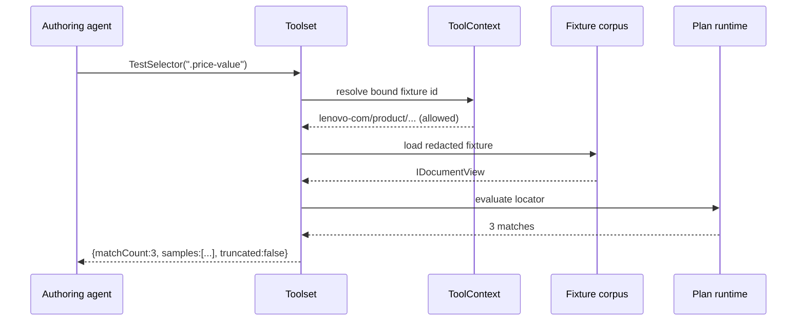

# Agent Toolset

> Feature spec for code-forge implementation planning.
> Source: extracted from docs/sanare/tech-design.md §8
> Created: 2026-09-06

| Field | Value |
|-------|-------|
| Component | agent-toolset |
| Priority | P0 |
| SRS Refs | — (no SRS; traces to tech-design §3.6 AC-019, AC-020, AC-023) |
| Tech Design | §8.1 — row 13 "Agent Toolset"; §8.3.2 step 3 (agent node + tools); §11.3 (redaction); §7.4 (prompt budget) |
| Depends On | fixture-corpus, plan-runtime |
| Blocks | authoring-workflow, healing-workflow |

## Purpose

An LLM asked to write a selector for a page it can only see in summary will guess. This component removes
the guessing: it gives the authoring and healing agents a small set of **typed function tools** that let
them interrogate the captured fixture directly — query the DOM, test a selector and see what it actually
matches, slice out a region of the document, and dry-run a candidate plan to get a per-field report.

Every tool is read-only, offline, and bounded. The agent can look at the page as much as it likes; it can
never reach the network, never write anything, and never return an unbounded payload into its own context.

## Scope

**Included:**

- The tool surface exposed to agents, as typed .NET methods wrapped with `AIFunctionFactory.Create`.
- Tools: `QueryDocument`, `TestSelector`, `GetDocumentOutline`, `SliceDocument`, `FindByText`,
  `ListStructuredData`, `DryRunPlan`, `DryRunField`, `ListFixtures`, `DiffFixtures`.
- Per-tool result truncation with explicit truncation markers.
- Cross-cutting `ContentView` (`Reduced` default / explicit bounded `Full`) and deterministic
  `ToolOutputFormat.Toon` serialization of JSON-shaped results, applied at the tool-output boundary of the
  existing ten tools — not an additional tool.
- The tool invocation context (which fixture, which schema, which culture) and its enforcement.
- Tool-call budgeting and telemetry.
- Deterministic, replayable behaviour for tests.

**Excluded:**

- The workflow that orchestrates the agent — `authoring-workflow` / `healing-workflow`.
- The document adapters and operation interpreter — `plan-runtime` (this component wraps them).
- Fixture capture and redaction — `fixture-corpus`.
- Any tool with a side effect. There are none by design.

## Core Responsibilities

1. **Expose** a fixed, typed, documented tool surface to agents.
2. **Bind** each tool invocation to an explicit fixture/schema context the agent cannot widen.
3. **Bound** every result so a single tool call cannot blow the context window.
4. **Guarantee** read-only, offline execution.
5. **Record** tool usage for cost and diagnosis.

## Interfaces

### Inputs

- **`ToolContext`** — `SourceId`, `FixtureId`, `SchemaDescriptor`, `Culture`, `AllowedFixtureIds`,
  `CallBudget`. Constructed by the workflow, never by the agent.

### Outputs

- **`IReadOnlyList<AITool>`** — the tool collection passed to `chatClient.AsAIAgent(..., tools: [...])`.
- **`ToolUsageReport`** — per-tool call counts, truncation counts, total result bytes.

### Dependencies

- **`Microsoft.Extensions.AI`** — `AIFunctionFactory.Create`, `AITool`, `AIFunction`.
- **`plan-runtime`** — `IDocumentView`, locator evaluation, `IPlanExecutor` for dry-runs.
- **`fixture-corpus`** — fixture loading (redacted content only).
- **AngleSharp** (+ `AngleSharp.XPath`) — via the document adapters.

## Data Flow



## Key Behaviors

### Tool surface

Each tool is an ordinary typed method; `AIFunctionFactory.Create` derives the JSON schema from the
signature and the XML documentation, so the description the model sees and the code that runs cannot
drift apart.

```csharp
[Description("Return the elements matching a CSS or XPath selector, with a bounded sample of their text and attributes.")]
ToolQueryResult QueryDocument(
    [Description("CSS selector, or an XPath expression prefixed with 'xpath:'.")] string selector,
    [Description("Maximum number of matches to return (1-20).")] int limit = 5);

[Description("Test whether a selector matches, how many nodes it matches, and what the first match yields after the given transforms.")]
ToolSelectorTestResult TestSelector(string selector, string[]? transforms = null, string? targetType = null);

[Description("Return the heading/landmark outline of the document to help locate a region.")]
ToolOutlineResult GetDocumentOutline(int maxDepth = 4);

[Description("Return a reduced slice of the document rooted at a selector, so a specific region can be inspected in detail.")]
ToolSliceResult SliceDocument(string rootSelector, int maxChars = 4000);

[Description("Find nodes whose visible text contains or matches the given text, useful for locating a label seen in the schema.")]
ToolFindResult FindByText(string text, bool exact = false, int limit = 10);

[Description("List JSON-LD, microdata, and embedded state blobs present in the document, with their top-level keys.")]
ToolStructuredDataResult ListStructuredData();

[Description("Execute a candidate extraction plan against the bound fixture and return the per-field extraction report.")]
ToolDryRunResult DryRunPlan(ExtractionPlanDraft plan);

[Description("Execute a field's primary and fallback locator candidates and transforms against the bound fixture. Returns per-candidate match, transformed-value, coercion, constraint, and selected-candidate evidence.")]
ToolFieldResult DryRunField(FieldPlanDraft field);

[Description("List the fixtures available for this source, with their capture time, tier, and role.")]
ToolFixtureListResult ListFixtures();

[Description("Summarise the structural difference between the bound fixture and an earlier fixture: added/removed classes and ids, and depth changes around a selector.")]
ToolDiffResult DiffFixtures(string baselineFixtureId, string? aroundSelector = null);
```

`DryRunField` and `DryRunPlan` expose the chosen candidate index and the primary failure reason even when
the fallback recovers, so authoring and healing can distinguish genuine success from masked drift.

`DiffFixtures` exists primarily for the healing agent; it is registered for both workflows because an
authoring agent that can see how a page changed sometimes authors a more resilient locator the first time.

### Context binding

The agent supplies no fixture id. `ToolContext` carries the bound fixture, and `ListFixtures`/`DiffFixtures`
accept ids only from `AllowedFixtureIds` — the fixtures for **this source**. A request for a fixture outside
that set returns a tool error, not data. Cross-source fixture access would be both a leak and a
correctness hazard (a plan validated against another site's page).

The context is `AsyncLocal`-free and passed explicitly to the tool factory, so two concurrent authoring
runs cannot see each other's fixtures.

### Result bounding

| Tool | Bound |
|------|-------|
| `QueryDocument` | `limit` clamped to 1–20; per-node text truncated to 500 chars; attributes limited to `id`, `class`, `itemprop`, `data-*`, `href`, `src` |
| `TestSelector` | first 3 matches, 500 chars each |
| `GetDocumentOutline` | 200 nodes, depth clamped to 1–8 |
| `SliceDocument` | `maxChars` clamped to 200–8000 |
| `FindByText` | `limit` clamped to 1–25 |
| `ListStructuredData` | key names and types only, values truncated to 200 chars |
| `DryRunPlan` | full per-field report, sample values truncated to 200 chars |
| `DiffFixtures` | 100 change entries |

Truncation always sets `Truncated = true` and includes the true total (`matchCount`, `totalChars`). A
silently truncated tool result is worse than no result — the model would conclude a selector matches 5
nodes when it matches 500, and author a plan that picks the wrong one.

### Content views (`Reduced` / `Full`)

`ContentView` is a cross-cutting parameter on every tool above, not an eleventh tool. It selects the
projection produced by the shared `ContentTransformationPipeline` (tech-design §7.3) before a result is
bounded and returned:

- **`Reduced` (default, implicit)** — every call above already returns a `Reduced` view; the bounds in
  the table above **are** the `Reduced` view's contract. No caller opt-in is required.
- **`Full` (explicit)** — `QueryDocument`, `SliceDocument`, and `ListStructuredData` accept an optional
  `view: "full"` argument that requests the fixture-backed, redacted, unbounded-selector projection instead
  of the default bounds, subject to the shared full-view ceiling (256 KiB / 16 000 tokens per call,
  tech-design §7.4). A request that would exceed the ceiling returns the largest slice that fits, with
  `Truncated = true` and the true total — the same truthful-truncation contract as `Reduced`, never a
  silent cut. `TestSelector`, `GetDocumentOutline`, `FindByText`, `DryRunPlan`, `DryRunField`,
  `ListFixtures`, and `DiffFixtures` have no `Full` view: their results are already complete-but-summarised
  by design, so there is nothing a wider view would add.
- Every `Full` request is recorded in authoring/healing telemetry as an audited event (tool name, selector,
  byte/token count returned) so a run's context-budget story stays inspectable end to end.
- `Full` never reads the network and never bypasses redaction — it is a wider slice of the same redacted
  fixture, not an escape hatch to raw or live content.

### TOON serialization for JSON-shaped results

Tool results whose payload is JSON-shaped (`ToolQueryResult`, `ToolStructuredDataResult`,
`ToolDryRunResult`, `ToolFieldResult`, `ToolFixtureListResult`, `ToolDiffResult`) are serialized at the
tool-output boundary using `ToolOutputFormat.Toon` — a deterministic, token-efficient encoding applied only
to what the model receives. The in-process C# result types remain ordinary typed objects; `DryRunPlan`'s
report persisted to telemetry and `ListFixtures`' data read from the fixture manifest are unaffected. TOON
serialization is a pure, repeatable function of the typed result: the same result serializes to
byte-identical TOON on every call, which keeps recorded-model tests reproducible.

### Read-only and offline

- Tools receive an `IDocumentView` over an already-loaded fixture. There is no `HttpClient` in this
  component's dependency graph, and the test suite asserts it (AC-020).
- No tool writes to the state root. `DryRunPlan` executes in the runtime's dry-run mode — no cache writes,
  no telemetry writes, no fixture writes.
- Tools are pure functions of `(fixture, arguments)`: called twice with the same arguments they return
  byte-identical results, which is what makes recorded-model integration tests reproducible.

### Error semantics

A malformed selector is a **normal tool result**, not an exception: `{ ok: false, error: "…", hint: "…" }`.
The agent is expected to make mistakes and correct them; throwing would abort the workflow turn and waste
the whole attempt. The hint names the specific parse failure (e.g. "unbalanced bracket at position 14")
because that is what lets the model fix it in one turn instead of three.

### Budgeting

`CallBudget` (default 40 tool calls per authoring run, 25 per healing run) prevents a model from looping on
exploratory queries. On exhaustion, further calls return
`{ ok: false, error: "tool call budget exhausted" }`, which nudges the model to commit to a plan with what
it has rather than silently hanging. Budget exhaustion is recorded in telemetry as a signal that the page
is hard.

## Constraints

- **Ten tools, fixed.** New tools require a design change; the surface is part of the security boundary.
- **No network, no writes, no side effects.** Structurally enforced by the dependency graph.
- **Every result bounded and explicitly marked when truncated.**
- **Fixture access limited to the bound source.**
- Tool descriptions are derived from `[Description]` attributes so documentation and behaviour stay in
  sync.
- Tool results are plain data records serialized with the source-generated `System.Text.Json` context —
  no reflection-based serialization on the agent path.

## Acceptance Criteria

| AC-ID | Priority | Criterion | Expected Result | Verification Method |
|-------|----------|-----------|-----------------|---------------------|
| AC-019 | P0 | Given an agent testing a selector that matches nothing | `TestSelector` returns `matchCount: 0` with a hint, not an exception | Unit — miss path |
| AC-020 | P0 | Given the toolset assembly | No tool has access to `HttpClient`; a network attempt is structurally impossible | Unit — dependency assertion |
| AC-023 | P0 | Given `DryRunPlan` | Execution writes nothing to the state root and emits no cache entries | Integration — filesystem snapshot |
| AC-TL-001 | P0 | Given `QueryDocument(limit: 50)` | The limit is clamped to 20 and `Truncated = true` with the true `matchCount` | Unit — clamping |
| AC-TL-002 | P0 | Given `QueryDocument` on a selector matching 500 nodes | At most `limit` samples are returned and `matchCount = 500` is reported honestly | Unit — truncation honesty |
| AC-TL-003 | P0 | Given a malformed selector `div[class=` | Result is `ok: false` with a parse-position hint; no exception escapes | Unit — error as data |
| AC-TL-004 | P0 | Given `DiffFixtures` with a fixture id from another source | Result is `ok: false` ("fixture not available for this source"); no content is returned | Unit — isolation |
| AC-TL-005 | P0 | Given two concurrent tool contexts for different sources | Neither can observe the other's fixtures | Integration — concurrency isolation |
| AC-TL-006 | P0 | Given the same tool call issued twice | Results are byte-identical | Unit — determinism |
| AC-TL-007 | P0 | Given a fixture containing a session cookie value | No tool result contains it (redaction happened at capture) | Unit — redaction propagation |
| AC-TL-008 | P0 | Given a call budget of 40 and a 41st call | The call returns `ok: false, error: "tool call budget exhausted"`; the workflow continues | Unit — budget boundary |
| AC-TL-009 | P0 | Given `SliceDocument(maxChars: 100000)` | Clamped to 8000 with `Truncated = true` | Unit — clamping |
| AC-TL-010 | P0 | Given `DryRunField` on a field whose transform chain fails coercion | The result reports the raw matched value **and** the coercion error | Unit — diagnostic quality |
| AC-TL-011 | P0 | Given tool registration | Each tool's JSON schema is generated from its signature and `[Description]`, with no hand-written duplicate | Unit — schema generation |
| AC-TL-012 | P0 | Given `ListStructuredData` on the Lenovo product fixture | JSON-LD `Product` and any embedded state blob are listed with top-level keys | Integration — real fixture |
| AC-TL-013 | P1 | Given `FindByText("Batterij")` on the Dutch spec-table fixture | The matching label cell is returned with a selector suggestion | Integration — real fixture |
| AC-TL-014 | P1 | Given `GetDocumentOutline` on a 5000-node page | At most 200 nodes are returned with `Truncated = true` | Unit — bound |
| AC-TL-015 | P1 | Given a completed run | `ToolUsageReport` records per-tool counts, truncations, and total bytes | Unit — telemetry |
| AC-TL-016 | P1 | Given an XPath selector prefixed `xpath:` | It is evaluated as XPath; an unprefixed value is evaluated as CSS | Unit — dispatch |
| AC-TL-017 | P0 | Given any tool call without a `view` argument | The result is the `Reduced` view already described by the Result-bounding table; behaviour is unchanged from before content views existed | Unit — default-view regression |
| AC-TL-018 | P1 | Given `QueryDocument`/`SliceDocument`/`ListStructuredData` called with `view: "full"` on an oversized fixture region | The result stays within the 256 KiB / 16 000-token ceiling, is redacted, and sets `Truncated = true` with the true total when the ceiling is hit | Integration — oversized fixture region |
| AC-TL-019 | P1 | Given a `Full`-view request | An audited event is recorded with the tool name, selector, and returned size, independent of normal tool-usage telemetry | Unit — audit event assertion |
| AC-TL-020 | P1 | Given a JSON-shaped tool result (e.g. `ToolQueryResult`) is serialized twice from the same typed result | The TOON-serialized tool output is byte-identical both times, and the underlying typed C# result and any persisted fixture/telemetry data are unaffected by the serialization format | Unit — deterministic serialization |

## Error Handling

Tool failures are returned as data. The only exceptions that escape are programming errors in the host.

| Condition | Result shape | Notes |
|-----------|--------------|-------|
| Malformed selector | `ok:false, error, hint` | Hint names the parse position |
| Selector matches nothing | `ok:true, matchCount:0` | Not an error — a valid answer |
| Fixture not in `AllowedFixtureIds` | `ok:false, error` | No content leaked |
| Fixture unreadable | `ok:false, error` | Surfaces `SNR-FIX-002` text |
| Plan draft fails static validation | `ok:true` with `validationErrors[]` | The agent needs the detail to fix it |
| Call budget exhausted | `ok:false, error` | Recorded in telemetry |
| Argument out of range | clamped, `Truncated`/`Clamped` set | Never throws |

## File Structure

```
src/
└── Sanare.Agents/
    └── Tools/
        ├── ScraperToolset.cs
        ├── ToolContext.cs
        ├── ToolFactory.cs
        ├── ToolUsageReport.cs
        ├── ToolCallBudget.cs
        ├── Document/
        │   ├── QueryDocumentTool.cs
        │   ├── TestSelectorTool.cs
        │   ├── GetDocumentOutlineTool.cs
        │   ├── SliceDocumentTool.cs
        │   ├── FindByTextTool.cs
        │   └── ListStructuredDataTool.cs
        ├── Planning/
        │   ├── DryRunPlanTool.cs
        │   └── DryRunFieldTool.cs
        ├── Fixtures/
        │   ├── ListFixturesTool.cs
        │   └── DiffFixturesTool.cs
        ├── Results/
        │   ├── ToolQueryResult.cs
        │   ├── ToolSelectorTestResult.cs
        │   ├── ToolOutlineResult.cs
        │   ├── ToolSliceResult.cs
        │   ├── ToolFindResult.cs
        │   ├── ToolStructuredDataResult.cs
        │   ├── ToolDryRunResult.cs
        │   ├── ToolFieldResult.cs
        │   ├── ToolFixtureListResult.cs
        │   ├── ToolDiffResult.cs
        │   └── ToolResultLimits.cs
        └── ToolJsonContext.cs
```

## Test Module

**Test file**: `tests/Sanare.Agents.Tests/Tools/ScraperToolsetTests.cs`

**Test scope**:

- **Unit**: every tool's happy path, empty-match path, malformed-argument path, and clamping boundary
  (limit 0 / 1 / 20 / 21, maxChars 199 / 200 / 8000 / 8001, depth 0 / 1 / 8 / 9); truncation flags and
  honest totals; error-as-data shapes; call-budget boundary at 40 and 41; determinism (same call twice);
  cross-source fixture rejection; JSON schema generation from signatures.
- **Integration**: the full toolset bound to real Lenovo fixtures — `ListStructuredData` finding the
  JSON-LD `Product`, `FindByText` locating a Dutch spec label, `TestSelector` on the spec table's
  label/value cells, `DryRunPlan` on a known-good plan producing a full-score report and on a
  known-broken plan producing a per-field failure report; a filesystem snapshot before and after
  `DryRunPlan` proving zero writes; two concurrent contexts for different sources proving isolation.
- **Fixtures / Mocks**: `tests/Sanare.Agents.Tests/Fixtures/Data/lenovo-com/tablet-product-yoga-tab-gen2.html`,
  `lenovo-tablets-page1.html`, an older `lenovo-tablets-page1-baseline.html` for `DiffFixtures`, a fixture
  containing a pre-redaction cookie to prove redaction propagation, and a fake `TimeProvider`. No test
  sleeps and no test constructs an `HttpClient`.

Companion test files: `tests/Sanare.Agents.Tests/Tools/DocumentToolsTests.cs`,
`tests/Sanare.Agents.Tests/Tools/DryRunToolsTests.cs`,
`tests/Sanare.Agents.Tests/Tools/ToolContextIsolationTests.cs`,
`tests/Sanare.Agents.Tests/Tools/ToolResultLimitsTests.cs`.
