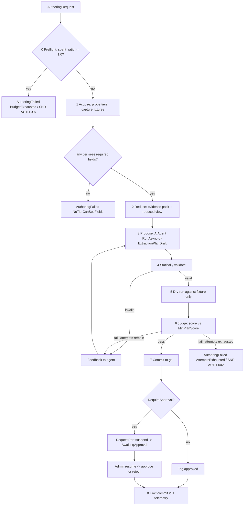

# Authoring Workflow

> Feature spec for code-forge implementation planning.
> Source: extracted from docs/sanare/tech-design.md §8
> Created: 2026-09-06

| Field | Value |
|-------|-------|
| Component | authoring-workflow |
| Priority | P0 |
| SRS Refs | — (no SRS; traces to tech-design §3.6 AC-008, AC-009, AC-012, AC-019, AC-020, AC-024) |
| Tech Design | §8.1 — row 12 "Authoring Workflow"; §8.3.2 (workflow + MAF mapping); §7.5 (tier selection, scoring); §7.4 (attempt, prompt, and budget limits); §17 DR-010, DR-012 |
| Depends On | schema-engine, extraction-plan-model, script-repository, fixture-corpus, plan-runtime, agent-toolset |
| Blocks | plan-resolver (miss path), healing-workflow (shares nodes), sample-app-lenovo |

## Purpose

This is the component the user's brief is really about: give the system a site and a schema, and it works
out how to scrape it. It is a Microsoft Agent Framework workflow that probes the source across tiers,
captures fixtures, asks an LLM to *propose a declarative plan* (never to scrape, never to emit code that
runs), validates that proposal against the captured fixture offline, feeds failures back for a bounded
number of repair turns, and commits the winner to git with its rationale.

The critical property: **the model's output is data that a deterministic runtime interprets**, and it is
proven against a real captured page before it is ever allowed near production traffic.

## Scope

**Included:**

- `IAuthoringWorkflow` — author a plan for `(sourceId, schema, url)`.
- The Agent Framework workflow graph: Acquire → Reduce → Propose → Validate → Dry-run → Judge → Commit →
  Emit, with steps 3–6 forming the bounded refinement loop.
- Tier probing and tier selection (§7.5), recorded in the plan.
- Prompt construction: reduced DOM/JSON view, evidence pack, schema and field metadata.
- Structured-output agent invocation returning `ExtractionPlanDraft`.
- The scoring gate (`MinPlanScore`) and the attempt budget (5).
- Human-in-the-loop approval via a `RequestPort` suspension point.
- Checkpointing so an interrupted authoring run resumes.
- Authoring telemetry: attempts, tokens, duration, final tier, score trajectory.
- Prompt-payload budgeting with progressive slicing and per-field fallback turns.

**Excluded:**

- The tools the agent calls — `agent-toolset` (they are injected here, defined there).
- Executing plans — `plan-runtime` (called for dry-runs).
- Repairing an existing degraded plan — `healing-workflow` (a sibling workflow that reuses the validate,
  dry-run, and commit nodes).
- Chat-client configuration and model selection — `hosting-configuration`.
- Any network access outside step 1 (probing). Steps 2–7 are strictly offline.

## Core Responsibilities

1. **Probe** the source across tiers and capture everything into the fixture corpus.
2. **Select** the cheapest tier that can see the required fields.
3. **Reduce** the page to a prompt-safe evidence pack.
4. **Elicit** a declarative plan as structured output.
5. **Prove** it offline against the fixture, and iterate on failure within a budget.
6. **Commit** the plan, its rationale, and its fixture references to git.
7. **Gate** promotion behind approval when configured.

## Interfaces

### Inputs

- **`AuthoringRequest`** — `SourceId`, `Url`, `SchemaDescriptor`, `Culture`, `PageRole`
  (`Lister` | `Detail`), `AllowBrowserTier`, `AttemptBudget`, `CorrelationId`.

### Outputs

- **`AuthoringResult`** — `PlanCommitId`, `PlanState` (`Approved` | `AwaitingApproval`), `Tier`,
  `Score`, `Attempts`, `FixtureIds`, `TokensUsed`, `Duration`, `Rationale`.
- **`AuthoringFailure`** — reason (`NoTierCanSeeFields`, `ScoreGateNotMet`, `AttemptsExhausted`,
  `BrowserTierDisabled`, `BudgetExhausted`), the best attempt's score, and the per-field report of the last
  attempt. `AttemptsExhausted` (`SNR-AUTH-002`) means the 5-attempt loop ran out below the score gate;
  `BudgetExhausted` (`SNR-AUTH-007`, DR-012) means the source's monthly LLM spend cap was already reached
  at Step 0 preflight — the two are distinct failure modes and are never conflated.

### Dependencies

- **`Microsoft.Agents.AI`** / **`.Workflows`** 1.20.0 — executors, `WorkflowBuilder`,
  `InProcessExecution`, `RequestPort`, `CheckpointManager`.
- **`Microsoft.Extensions.AI`** `IChatClient` → `AsAIAgent(...)`, resolved from `hosting-configuration`'s
  named `"Authoring"` model profile (DR-010) — this component asks for a role, never a concrete model name
  or proxy endpoint, so an OmniRoute-routed model/combo is indistinguishable from any other `IChatClient`.
- **`acquisition-pipeline`** / **`browser-tier`** — probing.
- **`fixture-corpus`**, **`plan-runtime`**, **`schema-engine`**, **`extraction-plan-model`**,
  **`script-repository`**, **`agent-toolset`**.

## Data Flow



## Key Behaviors

### Interface

```csharp
public interface IAuthoringWorkflow
{
    ValueTask<AuthoringOutcome> AuthorAsync(
        AuthoringRequest request, CancellationToken ct = default);

    ValueTask<AuthoringOutcome> ResumeAsync(
        string workflowRunId, PlanApprovalDecision decision, CancellationToken ct = default);
}
```

### Agent Framework mapping (verified at 1.20.0)

| Step | Node type | Detail |
|------|-----------|--------|
| 1 Acquire | `Executor<AuthoringRequest, ProbeResult>` | deterministic; `partial` class with `[MessageHandler]` |
| 2 Reduce | `Executor<ProbeResult, EvidencePack>` | deterministic |
| 3 Propose | `AIAgent` node | `chatClient.AsAIAgent(instructions, name, tools: [...])`, invoked via `RunAsync<ExtractionPlanDraft>(...)`, result read from `AgentResponse<T>.Result` |
| 4 Validate | `Executor<ExtractionPlanDraft, ValidationReport>` | static validation only |
| 5 Dry-run | `Executor<ValidationReport, DryRunReport>` | calls `IPlanExecutor` against fixtures |
| 6 Judge | `Executor<DryRunReport, JudgeDecision>` | score gate; loop edge back to 3 via `AddEdge<T>(…, condition:)` |
| 7 Commit | `Executor<JudgeDecision, CommitResult>` | git write |
| Approval | `RequestPort.Create<PlanApprovalRequest, PlanApprovalDecision>("plan-approval")` | suspends, surfaces `RequestInfoEvent`; resumed with `ResumeStreamingAsync` |

Graph assembly uses `WorkflowBuilder(startBinding)` with `.AddEdge(...)` / `.AddEdge<T>(…, condition:)`
and `.Build(validateOrphans: true)`. Execution is `InProcessExecution.RunStreamingAsync`, driven by
`run.TrySendMessageAsync(new TurnToken(emitEvents: true))` and consumed via `run.WatchStreamAsync()`.
Outputs leave the graph through `YieldOutputAsync` and are read with `WorkflowOutputEvent.As<T>()`.

There are no `AddSwitch*` / `AddMultiSelection*` builder methods in 1.20.0; conditional routing uses
`AddEdge<T>(…, condition:)` and fan-out uses `AddFanOutEdge<T>(…, targetSelector:)`.

**One session for the loop.** The refinement loop reuses a single `AgentSession` created with
`await agent.CreateSessionAsync(ct)` so failure feedback accumulates as conversation. Re-prompting from
scratch each attempt would both cost more and lose the model's earlier reasoning about the page.

### Step 0 — Budget preflight (DR-012)

Before Step 1 probes anything, the workflow checks the source's `sanare.budget.spent_ratio` against its
configured `MonthlyLlmBudget` (nullable — unset is unbounded). If the ratio is already ≥ 1.0, the run
fails immediately with `AuthoringFailed (BudgetExhausted)` / `SNR-AUTH-007 BudgetExhausted` **without probing the
site or invoking the model** — the preflight check is deliberately the first thing the workflow does, ahead
of any network or token cost. Existing approved plans are unaffected and continue to serve cached/replayed
results; only *new* authoring/healing attempts for that source are paused until the next budget period or
an explicit operator override.

### Step 1 — Probe and tier selection

Probing follows §7.5 in order, stopping at the first tier that can see every **required** field:

1. Declared or discovered JSON endpoint returning the target fields → `JsonApi`.
2. JSON-LD / microdata / `__NEXT_DATA__` / `__NUXT__` / `window.__INITIAL_STATE__` → `StructuredData`.
3. Fields present in the raw HTTP HTML → `Html`.
4. Browser escalation, only if enabled globally **and** per source → `Browser`.
5. Otherwise `AuthoringFailed (BrowserTierDisabled)` or `NoTierCanSeeFields`.

Every probe response is captured as a fixture, including the ones for tiers that were rejected — when a
site later changes, knowing that Tier 2 *used* to be insufficient is diagnostic evidence.

The selected tier is written into the plan and reused at run time; it is never re-decided per run
(DR-004).

### Step 2 — Reduce and the evidence pack

The evidence pack contains, in priority order: JSON-LD blocks; embedded state blobs; table and
definition-list skeletons (labels only, values truncated); repeated-structure candidates for collections
(the top N sibling groups by cardinality); and the reduced DOM — attributes limited to `id`, `class`,
`itemprop`, `data-*`, text truncated per node, `<script>`/`<style>`/`<svg>` dropped.

The reduction is built **from the redacted fixture**, so no cookie, token, or PII ever reaches a prompt —
redaction happens once, upstream, in `fixture-corpus`.

### Discovery-document evidence (`llms.txt`)

When Step 1 captured a `discovery-llms` fixture (a `robots.txt`-referenced discovery document acquired via
`acquisition-pipeline`), Step 2 may append a reduced excerpt to the evidence pack as its **lowest-priority**
item — after JSON-LD, state blobs, table skeletons, repeated-structure candidates, and the reduced DOM —
and only when the discovery document names a page, endpoint, or field term relevant to the requested
schema or source. It is included through the same deterministic content-transformation pipeline used for
every other evidence item (no additional LLM call), and it is capped separately at 8 000 tokens (§7.4); if
it does not fit, it is dropped before any other evidence item is reduced further.

Discovery evidence is advisory only. It cannot: select a tier, satisfy schema validation, override a
locator produced from the fixture, relax a safety limit, or substitute for missing fixture evidence. When
the discovery document is absent, unusable, or irrelevant (`SNR-ACQ-009`/`SNR-ACQ-010`, or no relevant
terms found), Step 2 proceeds exactly as it would without this section — no additional prompt turn, no
retry, no fallback path.

### Prompt budget (§7.4)

Ceiling: 60 000 tokens per authoring turn. On breach, in order:

1. Tighten the reducer (shorter text truncation, fewer candidate groups, drop low-signal subtrees).
2. If still over, switch to **per-field turns**: author the plan field-group by field-group, each turn
   carrying only the DOM neighbourhood relevant to those fields.
3. If a single field's neighbourhood alone exceeds the budget, fail that field with a diagnostic rather
   than truncating silently — a silently truncated prompt produces a plausible plan for a page the model
   never fully saw.

### Steps 4–6 — Validate, dry-run, judge

- **Static validation** failures (unknown operation, unparseable selector, size cap) are returned to the
  agent as feedback, never thrown. The loop is the error handler.
- **Dry-run is offline.** The runtime executes the candidate against the fixture with a network handler
  that throws on connect (AC-020). This is asserted, because an accidental live fetch during a 5-attempt
  loop is 5× the traffic at the target and defeats the whole fixture-based design.
- **Score** per §7.5: `fieldScore = 1.0` when extracted, coerced, and constraint-passing; `0.5` when a
  fallback locator was used; `0.0` otherwise. Weighted `w_req = 3`, `w_opt = 1`. A candidate is
  `Validated` when `score ≥ MinPlanScore` (default 0.9) **and** every required field scores 1.0 **and**,
  for collection schemas, `itemCount ≥ MinItemsPerPage` (default 1). The required-fields-at-1.0 clause is
  the one that matters: a 0.92 average that hides a missing required field must not pass.
- **Judge feedback** contains, per failing field: the pointer, the attempted locators, why each failed
  (no match / matched-but-uncoercible), and the DOM neighbourhood of the most likely candidate node.

### Step 7 — Commit

- Plan written to `plans/{source-id}/{schema-name}@{version}.plan.json`.
- Rationale note written to `notes/{source-id}/{timestamp}-authoring.md` — the tier decision, what the
  model tried and rejected, and the final per-field scores. This is what makes a later human review or
  heal comprehensible.
- Commit message: source, schema, tier, score, attempts, model, fixture ids.
- `RequireApproval = true` ⇒ candidate branch + `AwaitingApproval`; otherwise approval tag applied.

### Checkpointing

`CheckpointManager` over `FileSystemJsonCheckpointStore` rooted at `{StateRoot}/checkpoints/authoring/`.
Checkpoints land at superstep boundaries, so a host restart mid-authoring resumes from the last completed
node rather than re-probing the site. (`InMemoryCheckpointStorage` and `CosmosCheckpointStorage` are
Python-only and are not used.)

### Attempt budget

5 attempts (§7.4). On exhaustion: `AuthoringFailed`, the **best-scoring** attempt is retained as a
candidate on a branch with its score, and the failure report names the fields that never resolved. Keeping
the best failed attempt matters — a 0.8-scoring plan is a much better starting point for a human than a
blank page.

## Constraints

- **The model never executes anything** — its only output is a JSON plan drawn from the closed allow-list.
- **Dry-runs never touch the network** — enforced by a throwing handler, not by convention.
- **Probing is the only network phase**, and it obeys the same rate limiter, configured `RespectRobots`
  setting (bypassed by default, per source opt-in — see `acquisition-pipeline`), and identity as normal runs.
- **Attempt budget is hard** at 5; prompt budget is hard at 60 000 tokens per turn.
- **Deterministic nodes must be deterministic** — steps 1, 2, 4, 5, 7 contain no model calls, so a
  workflow replay from a checkpoint reproduces them exactly.
- Authoring is coalesced upstream by `plan-resolver`; this component assumes one run per
  `(sourceId, schemaHash)`.
- Model identity (`model`, `provider`) is recorded in plan provenance for reproducibility.
- **Model selection is by named profile, never a hard-coded model or endpoint** (DR-010) — this component
  requests the `"Authoring"` profile from `hosting-configuration` and is agnostic to whether it resolves to
  Azure OpenAI, OpenAI, a local model, or an OmniRoute-compatible proxy/model-combo.
- **The budget preflight (Step 0, DR-012) runs before any network or model cost is incurred** — a source at
  or over its `MonthlyLlmBudget` never reaches Step 1, so `BudgetExhausted` never bills a probe or a turn.

## Acceptance Criteria

| AC-ID | Priority | Criterion | Expected Result | Verification Method |
|-------|----------|-----------|-----------------|---------------------|
| AC-008 | P0 | Given the Lenovo product page fixture and a product schema | Authoring produces a plan scoring ≥ `MinPlanScore` within the attempt budget | Integration — recorded-model replay |
| AC-009 | P0 | Given a source whose fields are present in raw HTML | The selected tier is `Html`, not `Browser`, and no browser process starts | Integration — tier selection |
| AC-009b | P0 | Given a source whose fields appear only after JS and `AllowBrowserTier = false` | Authoring fails with `BrowserTierDisabled`; no browser starts | Unit — negative gating |
| AC-012 | P0 | Given `RequireApproval = true` | The workflow suspends at the `RequestPort` and reports `AwaitingApproval`; no approval tag is created | Integration — HITL |
| AC-019 | P0 | Given a first attempt scoring below the gate | The failing fields and their DOM neighbourhoods are fed back and a second attempt is made in the **same** `AgentSession` | Integration — session reuse assertion |
| AC-020 | P0 | Given a dry-run | Zero network connections occur; a connect attempt would throw | Integration — throwing handler |
| AC-024 | P0 | Given a committed plan | The commit contains the plan, a rationale note, and references to the fixtures it was validated on | Integration — repository inspection |
| AC-AUT-001 | P0 | Given 5 consecutive failing attempts | `AuthoringFailed (AttemptsExhausted)` / `SNR-AUTH-002`; exactly 5 model calls; the best attempt is retained on a branch | Integration — attempt-budget boundary |
| AC-AUT-002 | P0 | Given 4 failing attempts and a 5th that passes | The plan is committed; exactly 5 model calls | Integration — boundary |
| AC-AUT-003 | P0 | Given a proposal containing an operation outside the allow-list | Static validation rejects it and the rejection is fed back as agent input, not thrown | Unit — allow-list feedback |
| AC-AUT-004 | P0 | Given an evidence pack exceeding 60 000 tokens | The reducer tightens first; if still over, per-field turns are used; neither path silently truncates | Unit — budget escalation |
| AC-AUT-005 | P0 | Given a single field's neighbourhood exceeding the budget alone | That field fails with a diagnostic; the rest of the plan is still authored | Unit — degradation boundary |
| AC-AUT-006 | P0 | Given a host restart after the Dry-run node completes | Resume continues from Judge; the site is not re-probed | Integration — checkpoint replay |
| AC-AUT-007 | P0 | Given probing across four tiers | Every probe response is captured as a fixture, including rejected tiers | Integration — fixture count |
| AC-AUT-008 | P0 | Given a page containing a cookie/session value | The prompt built for the agent contains no cookie value (it was redacted upstream) | Unit — prompt inspection |
| AC-AUT-009 | P0 | Given approval rejection at the `RequestPort` | No approval tag is created and the candidate branch remains for inspection | Integration — HITL negative |
| AC-AUT-010 | P0 | Given a required field the model never resolves | The final status is `AuthoringFailed`, never a plan reporting `Succeeded` with that field missing | Integration — honesty |
| AC-AUT-011 | P0 | Given a workflow graph build | `Build(validateOrphans: true)` succeeds with no orphaned nodes | Unit — graph validation |
| AC-AUT-016 | P0 | Given a candidate scoring 0.92 overall but with one required field at 0.0 | The gate rejects it despite `score ≥ MinPlanScore` | Unit — score gate boundary |
| AC-AUT-017 | P0 | Given a collection schema whose plan extracts 0 items from a populated fixture | The gate rejects it (`itemCount < MinItemsPerPage`) | Unit — collection gate |
| AC-AUT-018 | P1 | Given a captured `discovery-llms` fixture naming a page/field relevant to the requested schema | A reduced excerpt is appended to the evidence pack as the lowest-priority item, within the 8 000-token discovery budget | Unit — evidence-pack ordering and budget |
| AC-AUT-019 | P1 | Given no `discovery-llms` fixture, or one that is irrelevant to the requested schema | Step 2 proceeds identically to the no-discovery case; no extra prompt turn, retry, or fallback occurs | Unit — fail-open evidence pack |
| AC-AUT-020 | P1 | Given a proposal whose only supporting evidence is a discovery-document hint with no corroborating fixture locator | Static/dry-run validation rejects the proposal like any other unsupported locator; discovery evidence alone cannot pass validation | Unit — discovery evidence cannot override validation |
| AC-AUT-012 | P1 | Given the Lenovo lister page | The authored plan includes a pagination strategy consistent with the page's actual mechanism | Integration — end-to-end |
| AC-AUT-013 | P1 | Given a completed authoring run | Telemetry records attempts, tokens, duration, tier, score trajectory, and model identity | Unit — telemetry assertion |
| AC-AUT-014 | P1 | Given a JSON endpoint discoverable from the browser network log | The selected tier is `JsonApi` on a subsequent authoring pass | Integration — tier downgrade |
| AC-AUT-015 | P1 | Given cancellation mid-loop | The run stops within one node, leaves a checkpoint, and creates no partial commit | Integration — cancellation |
| AC-032 | P1 | Given a source's monthly LLM spend reaches its configured budget | The Step 0 preflight returns `AuthoringFailed (BudgetExhausted)` / `SNR-AUTH-007` before Step 1 probes or any model call; existing approved plans keep serving cached/replayed results | Unit — simulate a ledger at/over the cap, assert no probe and no `IChatClient` invocation (mirrors tech-design AC-032) |
| AC-AUT-021 | P1 | Given a source below its `MonthlyLlmBudget` cap | The Step 0 preflight passes and authoring proceeds normally, recording actual spend against the ledger on completion | Integration — spend accounting |
| AC-AUT-022 | P1 | Given a host registers the `"Authoring"` model profile as an OmniRoute-routed `IChatClient` | Step 3 Propose invokes that profile exactly as it would any other `IChatClient`; no code path branches on the proxy identity | Integration — profile substitution |

## Error Handling

| Code | Raised when | Severity | Status | Behavior |
|------|-------------|----------|--------|----------|
| `SNR-AUTH-001` | No tier can see the required fields | Error | `AuthoringFailed` | Report which tiers were probed and which fields were invisible |
| `SNR-AUTH-002` | Attempt budget exhausted below the score gate | Error | `AuthoringFailed` | Retain the best attempt on a branch |
| `SNR-AUTH-003` | Browser tier required but disabled | Error | `AuthoringFailed` | Actionable message naming both flags |
| `SNR-AUTH-004` | Prompt budget cannot be met even per-field | Warning | `PartialExtraction` | Affected fields fail; the rest proceeds |
| `SNR-AUTH-005` | Model returned unparseable or schema-invalid structured output twice in a row | Error | `AuthoringFailed` | Counts against the attempt budget |
| `SNR-AUTH-006` | Checkpoint store unwritable | Error | `AuthoringFailed` | Fail fast; a workflow that cannot checkpoint cannot resume |
| `SNR-AUTH-007` | Source's `sanare.budget.spent_ratio` ≥ 1.0 at Step 0 preflight (DR-012) | Error | `AuthoringFailed (BudgetExhausted)` | Refuse to probe or invoke the model; existing approved plans keep serving cached/replayed results until the next budget period or an explicit operator override |

## File Structure

```
src/
└── Sanare.Agents/
    └── Authoring/
        ├── IAuthoringWorkflow.cs
        ├── AuthoringWorkflow.cs
        ├── AuthoringRequest.cs
        ├── AuthoringOutcome.cs
        ├── AuthoringOptions.cs
        ├── Executors/
        │   ├── BudgetPreflightExecutor.cs
        │   ├── AcquireExecutor.cs
        │   ├── ReduceExecutor.cs
        │   ├── ValidateExecutor.cs
        │   ├── DryRunExecutor.cs
        │   ├── JudgeExecutor.cs
        │   └── CommitExecutor.cs
        ├── Agents/
        │   ├── PlanAuthoringAgentFactory.cs
        │   └── AuthoringInstructions.cs
        ├── Evidence/
        │   ├── EvidencePack.cs
        │   ├── EvidencePackBuilder.cs
        │   ├── DomReducer.cs
        │   ├── RepeatedStructureDetector.cs
        │   └── PromptBudget.cs
        ├── Scoring/
        │   ├── PlanScorer.cs
        │   ├── DryRunReport.cs
        │   └── JudgeDecision.cs
        ├── Tiers/
        │   ├── TierProbe.cs
        │   └── TierSelector.cs
        ├── Approval/
        │   ├── PlanApprovalRequest.cs
        │   └── PlanApprovalDecision.cs
        └── Checkpointing/
            └── AuthoringCheckpointStoreFactory.cs
```

## Test Module

**Test file**: `tests/Sanare.Agents.Tests/Authoring/AuthoringWorkflowTests.cs`

**Test scope**:

- **Unit**: `BudgetPreflightExecutor` at and below `MonthlyLlmBudget`, including the proof that an exhausted
  source invokes neither a tier probe nor `IChatClient`; `TierSelector` decision table across all five
  outcomes; `DomReducer` output size and attribute filtering; `RepeatedStructureDetector` on a product grid;
  `PromptBudget` escalation ladder including the single-field-too-large case; `PlanScorer` weighting with
  required vs optional fields at the gate boundary (0.94 / 0.95 / 0.96); static-validation feedback
  formatting; graph assembly with `validateOrphans: true`. 
- **Integration**: full workflow against Lenovo fixtures with a **scripted `IChatClient`** that replays
  recorded model responses (deterministic, no API key, no cost) covering: first-attempt success;
  fail-then-succeed with an assertion that both turns shared one `AgentSession`; five-attempt exhaustion;
  invalid-operation feedback; approval suspension and resume for both approve and reject; checkpoint
  resume after a simulated crash between nodes; the zero-network dry-run assertion via a
  connect-throwing `HttpMessageHandler`.
- **Fixtures / Mocks**: `tests/Sanare.Agents.Tests/Fixtures/Data/lenovo-com/` (lister and
  product pages, plus a JS-only variant), `ScriptedChatClient` with recorded responses under
  `Fixtures/ModelResponses/authoring-*.json`, an in-memory `IScriptRepository`, a temp-directory
  checkpoint store, and a fake `TimeProvider`.

Companion test files: `tests/Sanare.Agents.Tests/Authoring/TierSelectorTests.cs`,
`tests/Sanare.Agents.Tests/Authoring/EvidencePackBuilderTests.cs`,
`tests/Sanare.Agents.Tests/Authoring/PlanScorerTests.cs`,
`tests/Sanare.Agents.Tests/Authoring/PromptBudgetTests.cs`,
`tests/Sanare.Agents.Tests/Authoring/ApprovalGateTests.cs`,
`tests/Sanare.Agents.Tests/Authoring/CheckpointResumeTests.cs`.
