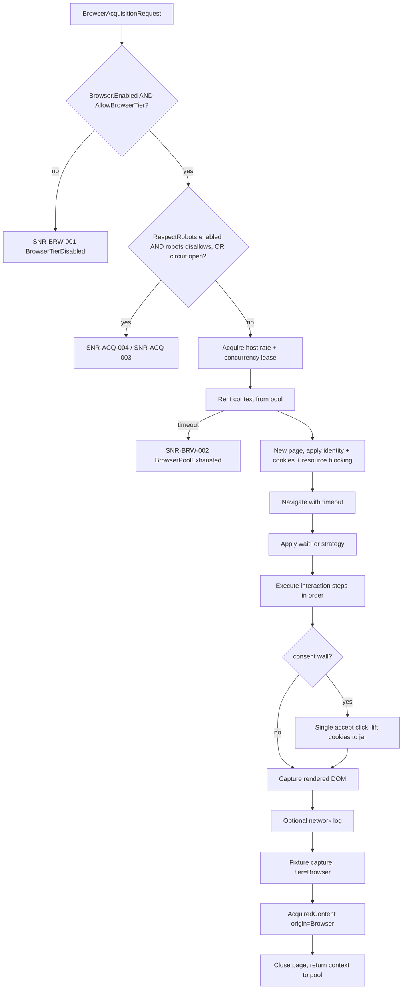

# Browser Tier

> Feature spec for code-forge implementation planning.
> Source: extracted from docs/sanare/tech-design.md §8
> Created: 2026-09-06

| Field | Value |
|-------|-------|
| Component | browser-tier |
| Priority | P0 |
| SRS Refs | — (no SRS; traces to tech-design §3.6 AC-006, AC-007, AC-010, AC-026, AC-033) |
| Tech Design | §8.1 — row 8 "Browser Tier"; §7.5 (tier selection); §7.4 (limits); §17 DR-004, DR-014 |
| Depends On | acquisition-pipeline, browsing-identity |
| Blocks | plan-runtime (Tier 3 execution), pagination-engine (LoadMoreButton / InfiniteScroll) |

## Purpose

Playwright is the last resort, exactly as the brief demanded: prefer networked and normal scraping, and run
a browser only when the data cannot be reached otherwise. This component owns that escape hatch — a pooled,
bounded, opt-in Playwright surface that executes only the closed set of browser interaction steps a plan is
allowed to declare, captures the resulting DOM as a fixture, and hands it to the same deterministic runtime
the HTTP tiers use. It is also where "we tried and the site said no" ends: the browser is not used to work
around a block.

## Scope

**Included:**

- `IBrowserSession` / `IBrowserPool` over Playwright for .NET (Chromium).
- Browser and context lifecycle: launch once, pool contexts, bounded concurrency (default 2), idle eviction.
- Execution of the closed browser step allow-list: `click`, `waitForSelector`, `waitForNetworkIdle`,
  `scroll`, `selectOption`, `type`.
- Wait strategies and their timeouts, including a deterministic `waitFor` contract.
- Context realism: viewport, locale, timezone, and UA taken from the `DesktopChrome` identity profile.
- Cookie hand-off in both directions with the per-host jar (consent cookies obtained in the browser become
  usable by the HTTP tier).
- Resource blocking (images, media, fonts, analytics) to cut cost and load on the target.
- Rendered-DOM capture and fixture write, tagged `tier: Browser`.
- Optional network-log capture (HAR-style) so authoring can discover a JSON endpoint and **downgrade** the
  source to Tier 0 on the next authoring pass.
- Enforcement of the global and per-source opt-in flags.
- The `IChallengeHandoff` implementation used for the operator-invoked manual challenge hand-off
  (`ChallengePaused` recovery, DR-014) — an interactive-mode-only, non-automated escape hatch owned in
  contract by `acquisition-pipeline` (§`SNR-ACQ-011`).

**Excluded:**

- Deciding that Tier 3 is required — that is authoring-time tier selection (`authoring-workflow`).
- Interpreting the DOM into typed values — `plan-runtime` (identical code path for HTML and rendered HTML).
- Rate limiting and robots policy (including `RespectRobots` enforcement/bypass) — reused from
  `acquisition-pipeline`; the browser tier is not a separate policy path.
- Fingerprint randomisation, stealth plugins, or automation-flag patching beyond the ordinary defaults
  (DR-006).

## Core Responsibilities

1. **Gate** — refuse to run unless both the global `Browser.Enabled` and the per-source `AllowBrowserTier`
   are true.
2. **Pool** — reuse one browser process and a small number of contexts; never leak a page or a context.
3. **Execute** the declared interaction steps deterministically, with per-step timeouts.
4. **Capture** the rendered DOM (and optionally the network log) as a fixture.
5. **Share** identity, cookies, robots policy state, and pacing with the HTTP tier.
6. **Fail honestly** — a block in the browser is still `Blocked`.

## Interfaces

### Inputs

- **`BrowserAcquisitionRequest`** — URL, source id, culture, plan `acquisition.waitFor`, plan
  `acquisition.interactions[]`, page role, capture-network flag.
- **`BrowsingIdentity`** (`DesktopChrome` profile) from `browsing-identity`.
- **`BrowserOptions`** (from `hosting-configuration`) — enabled flag, max contexts, wait timeout, pool wait
  timeout, resource-blocking rules, headless flag, executable path.

### Outputs

- **`AcquiredContent`** with `Origin = Browser` and the rendered HTML body.
- **`BrowserNetworkLog`** (optional) for endpoint discovery.
- **`CaptureRequest`** to `fixture-corpus`.
- Browser metrics and diagnostics to `observability`.

### Dependencies

- **`Microsoft.Playwright`** — browser automation.
- **`acquisition-pipeline`** — host limiter, robots policy, circuit breaker.
- **`browsing-identity`** — profile, cookie jar, consent policy.
- **`fixture-corpus`** — capture.

## Data Flow



## Key Behaviors

### Interface

```csharp
public interface IBrowserContentAcquirer
{
    ValueTask<AcquiredContent> AcquireAsync(
        BrowserAcquisitionRequest request, CancellationToken ct = default);
}

public interface IBrowserPool : IAsyncDisposable
{
    ValueTask<IBrowserLease> RentAsync(string sourceId, CancellationToken ct = default);
    BrowserPoolStatistics GetStatistics();
}

public interface IBrowserLease : IAsyncDisposable
{
    IBrowserContext Context { get; }
}
```

### Gating (DR-004)

1. `Browser.Enabled` is `false` by default, globally.
2. `AllowBrowserTier` is `false` by default, per source.
3. Both must be true. A Tier 3 plan executed with the tier disabled fails immediately with
   `SNR-BRW-001` and status `BrowserFailed` — it does **not** silently fall back to Tier 2, because a
   silent downgrade would return wrong data rather than an honest failure.
4. Conversely, a Tier 0–2 plan that fails at run time does **not** escalate to the browser; it records the
   failure and lets the evaluator dispatch a heal (DR-004). This is asserted explicitly, because
   auto-escalation is the single most tempting way to hide decay.

### Pooling and lifecycle

- One `IBrowser` per process, launched lazily on first use and disposed on host shutdown.
- Contexts are pooled, default maximum 2 concurrent (§7.4); `RentAsync` waits up to `BrowserWaitTimeout`
  (default 30 s) then fails `SNR-BRW-002`.
- One page per operation, always closed in a `finally`; a lease returned to the pool has zero open pages.
- Contexts are recycled after `MaxOperationsPerContext` (default 50) or `MaxContextAge` (default 15 min) to
  bound memory growth.
- Idle contexts are evicted after `ContextIdleTimeout` (default 2 min); an idle pool ends with zero
  processes so a long-lived host does not carry a browser it is not using.
- Every lease path is exception-safe: an exception during navigation still returns or disposes the context.

### Context realism

| Setting | Value |
|---------|-------|
| `UserAgent` | `DesktopChrome` profile UA (matching the actual bundled Chromium major version) |
| `Locale` | the request culture, e.g. `nl-NL` |
| `TimezoneId` | the source's configured timezone, e.g. `Europe/Amsterdam` |
| `ViewportSize` | 1280 × 800 |
| `DeviceScaleFactor` | 1 |
| `ExtraHTTPHeaders` | `Accept-Language` from the identity profile |
| `JavaScriptEnabled` | true |

No stealth plugin, no `navigator.webdriver` patching, no fingerprint randomisation. Realism here means
"a coherent ordinary headless Chromium deployment", not "a disguise".

### Wait strategies

`acquisition.waitFor` is a closed union:

| Strategy | Semantics | Default timeout |
|----------|-----------|-----------------|
| `Load` | `LoadState.Load` | 30 s |
| `DomContentLoaded` | `LoadState.DOMContentLoaded` | 30 s |
| `NetworkIdle` | `LoadState.NetworkIdle` | 30 s |
| `Selector` | `WaitForSelectorAsync(selector, Visible)` | 15 s |
| `Function` | a **predicate from the allow-list only** (e.g. "item count ≥ n"), never arbitrary JS | 15 s |

A wait timeout is `SNR-BRW-003`, and the partially-rendered DOM is still captured as a fixture so the heal
workflow can see what the page actually looked like when it failed. This is deliberate: the failure case is
where fixtures are most valuable.

### Interaction steps

Only the six allow-listed browser steps may appear in a plan. Each carries its own timeout and each is
validated before execution:

- `click(selector, optional: nth)` — fails `SNR-BRW-004` if the selector matches nothing.
- `waitForSelector(selector, state)`.
- `waitForNetworkIdle(quietMillis)`.
- `scroll(to: bottom | selector | pixels, times, delayMillis)` — bounded by `MaxScrolls` (default 50).
- `selectOption(selector, value)`.
- `type(selector, text)` — `text` may not be sourced from run input; it is a constant in the plan, so the
  step cannot become an injection vector.

Arbitrary `page.EvaluateAsync` of model-authored JavaScript is not supported; that is the same security
boundary the extraction allow-list draws, applied to the browser.

### Resource blocking

By default, requests whose resource type is `image`, `media`, `font`, or whose host matches a configured
analytics/ads block-list are aborted. This cuts bandwidth (typically 60–80 % on a retail product page),
speeds the run, and reduces load on the target — politeness and cost aligned. Blocking is disabled
automatically when a plan's wait strategy depends on `NetworkIdle` **and** the source is flagged
`RequiresImages`, so lazy-loading listers still work.

### Endpoint discovery

When `CaptureNetwork = true` (used during authoring, not during normal runs), responses with a JSON
content type are recorded as `{method, url, status, bytes, sampleOfBody}`. The authoring workflow uses this
to find an internal JSON API and re-author the source at Tier 0 — the browser thereby earns its own
retirement for that source.

### Manual challenge hand-off (DR-014)

`acquisition-pipeline` owns the `ChallengePaused` circuit-breaker state (`SNR-ACQ-011`) and the
`IChallengeHandoff` contract; `browser-tier` supplies the one implementation, because it already owns the
only real, visible browser surface in the library. This is an **additive, operator-only escape hatch**, not
a new autonomous capability, and it must not be read as loosening DR-004 (double opt-in) or the "no stealth
tooling" constraint below:

1. `PlaywrightChallengeHandoff : IChallengeHandoff` launches a **non-headless**, ordinary Playwright browser
   context — the same Chromium binary and the same absence of stealth/evasion packages as every other
   browser-tier session — navigated to the paused source's URL, and leaves it open for the operator.
2. It never runs any interaction step from a plan's allow-list, solves a challenge programmatically, injects
   automation-flag patches, or rotates identity/fingerprint. The only actor doing anything to the page is the
   human operator, through the real browser window they are looking at.
3. It reuses the ordinary context-realism defaults (`DesktopChrome` identity, standard viewport/locale/UA) so
   the operator sees exactly what the automated pipeline would have presented — no special "unblock" identity
   is fabricated.
4. It is available **only** when both `Browser.Enabled` is true and the process is running in an interactive
   execution mode (`ExecutionMode.Development`/`Investigation`); it throws immediately in
   `ExecutionMode.OfflineFixture` or a CI profile, and it is unreachable unless an operator explicitly invokes
   it (§11.2 authorization matrix) — there is no automated caller anywhere in `plan-runtime` or the evaluator.
5. On operator confirmation ("done"), it closes the hand-off context and hands control back to
   `acquisition-pipeline`, which performs one supervised probe request through the normal HTTP path; the
   hand-off itself never reports the source as unblocked — only a clean probe does.

## Constraints

- **Opt-in twice** — global and per-source; default off.
- **No run-time escalation into or out of the browser tier** (DR-004).
- **Shared politeness** — the browser acquires the same per-host rate and concurrency leases as HTTP, so a
  browser run cannot exceed the budget.
- **Bounded resources** — contexts, pages, scrolls, operations per context, and context age are all capped.
- **No leaks** — an integration test asserts zero orphaned Chromium processes after a fault-injected run.
- **No stealth tooling** — no evasion packages are referenced; the dependency list is asserted. This
  constraint applies identically to the manual challenge hand-off path — it launches the same plain
  Chromium build, never a hardened/evasion variant.
- Playwright browsers must be installed; a missing installation fails at startup with actionable guidance
  (`SNR-BRW-005`), never at the first user request.
- **Manual challenge hand-off is operator-invoked only** (DR-014) — `PlaywrightChallengeHandoff` has no
  in-pipeline caller, is disabled outside interactive execution modes, and never automates the challenge
  itself; it only opens a real window for a human to use normally. It does not weaken DR-004: the gating
  flags still govern every *automated* Tier 3 run, and the hand-off never executes a plan's interaction
  steps.

## Acceptance Criteria

| AC-ID | Priority | Criterion | Expected Result | Verification Method |
|-------|----------|-----------|-----------------|---------------------|
| AC-006 | P0 | Given a source whose fields exist only after JS rendering and the tier is enabled | The browser tier extracts them and the fixture records `tier: Browser` | Integration — local JS-rendered test page |
| AC-007 | P0 | Given a Tier 3 plan and `Browser.Enabled = false` | Fails with `SNR-BRW-001` / `BrowserFailed`; no Chromium process starts | Unit + integration — process count before/after |
| AC-007b | P0 | Given `Browser.Enabled = true` but `AllowBrowserTier = false` for the source | Same failure; the global flag alone is insufficient | Unit — gating boundary |
| AC-010 | P0 | Given the browser tier encounters a block | It reports `Blocked` and does not retry with altered fingerprints | Integration — assert one attempt, unchanged UA |
| AC-026 | P0 | Given a Tier 2 plan that fails validation at run time | No browser escalation occurs; the result is degraded and a heal is dispatched | Integration — assert zero browser launches |
| AC-BRW-001 | P0 | Given 4 concurrent browser requests with `MaxContexts = 2` | Two run, two queue; none fail while within `BrowserWaitTimeout` | Integration — concurrency |
| AC-BRW-002 | P0 | Given 4 concurrent requests where the pool wait exceeds the timeout | The excess fails with `SNR-BRW-002`; the successful ones are unaffected | Integration — pool exhaustion boundary |
| AC-BRW-003 | P0 | Given a navigation that throws mid-flight | The page is closed, the context is returned or disposed, and pool statistics show zero leaked pages | Integration — fault injection |
| AC-BRW-004 | P0 | Given 20 sequential browser runs | Exactly one Chromium process exists throughout; zero remain after disposal | Integration — process inspection |
| AC-BRW-005 | P0 | Given `waitFor: Selector` whose selector never appears | Fails with `SNR-BRW-003` after the timeout, **and** the partial DOM is captured as a fixture | Integration — timeout path |
| AC-BRW-006 | P0 | Given an interaction step whose selector matches nothing | Fails with `SNR-BRW-004` naming the step index and selector | Unit — step validation |
| AC-BRW-007 | P0 | Given a plan containing a browser step outside the six-item allow-list | Plan validation rejects it before execution with `SNR-PLAN-002` | Unit — allow-list negative |
| AC-BRW-008 | P0 | Given a `scroll` step requesting 500 iterations | It is clamped to `MaxScrolls = 50` with a warning diagnostic | Unit — bound |
| AC-BRW-009 | P0 | Given a browser run for a host at its rate limit | The run waits for the same per-host lease as HTTP; the combined rate stays within budget | Integration — shared limiter |
| AC-BRW-010 | P0 | Given a consent wall in the browser | One accept click is performed, the cookies are lifted into the per-host jar, and a subsequent HTTP-tier request carries them | Integration — cookie hand-off |
| AC-BRW-011 | P0 | Given Playwright browsers are not installed | Startup validation fails with `SNR-BRW-005` and a message naming the install command | Unit — environment validation |
| AC-BRW-012 | P0 | Given the shipped dependency list | No stealth/evasion package is referenced | Unit — dependency assertion test |
| AC-BRW-013 | P1 | Given resource blocking enabled on a product page | Image/media/font requests are aborted and total bytes drop by ≥ 50 % versus unblocked | Integration — byte accounting on a recorded page |
| AC-BRW-014 | P1 | Given a source flagged `RequiresImages` with `NetworkIdle` | Resource blocking is automatically disabled | Unit — interaction rule |
| AC-BRW-015 | P1 | Given `CaptureNetwork = true` on a page that fetches a JSON API | The network log contains that endpoint with method, URL, and status | Integration — endpoint discovery |
| AC-BRW-016 | P1 | Given a context that has served 50 operations | It is recycled before the 51st | Unit — recycling boundary with a fake clock |
| AC-BRW-017 | P1 | Given an idle pool for longer than `ContextIdleTimeout` | Contexts are evicted and the browser process is shut down | Integration — idle eviction |
| AC-BRW-018 | P1 | Given a source in `ChallengePaused` and an operator invokes the manual hand-off in `ExecutionMode.Development` | A non-headless, plain Chromium context opens at the source URL with standard `DesktopChrome` realism and no interaction steps are executed | Integration — assert visible context, zero step invocations |
| AC-BRW-019 | P0 | Given `ExecutionMode.OfflineFixture` or a CI profile | Invoking the manual hand-off throws immediately without launching a browser | Unit — mode gate |
| AC-BRW-020 | P1 | Given the manual hand-off's shipped dependency list | No stealth/evasion package is referenced, identical to the assertion for the automated tier (AC-BRW-012) | Unit — dependency assertion test |

## Error Handling

| Code | Raised when | Severity | Status | Retryable |
|------|-------------|----------|--------|-----------|
| `SNR-BRW-001` | Browser tier required but disabled globally or per source | Error | `BrowserFailed` | No |
| `SNR-BRW-002` | Pool exhausted beyond `BrowserWaitTimeout` | Error | `BrowserFailed` | Yes |
| `SNR-BRW-003` | Wait strategy timed out | Error | `BrowserFailed` | Yes (once) |
| `SNR-BRW-004` | Interaction step failed (selector missing, not actionable) | Error | `BrowserFailed` | No — heal trigger |
| `SNR-BRW-005` | Playwright browsers not installed / launch failed | Fatal | — | No |

Every browser failure captures the DOM at failure time when a page exists, because the fixture is what makes
the subsequent heal possible. The manual challenge hand-off raises `SNR-ACQ-011`'s owning circuit-breaker
state changes (owned by `acquisition-pipeline`, §"Manual challenge hand-off (DR-014)" above) rather than a
new `SNR-BRW-*` code, since `browser-tier` is only the delivery mechanism for that state's resolution.

## File Structure

```
src/
└── Sanare.Browser/
    ├── IBrowserContentAcquirer.cs
    ├── BrowserContentAcquirer.cs
    ├── BrowserAcquisitionRequest.cs
    ├── BrowserOptions.cs
    ├── Pooling/
    │   ├── IBrowserPool.cs
    │   ├── BrowserPool.cs
    │   ├── IBrowserLease.cs
    │   ├── BrowserLease.cs
    │   └── BrowserPoolStatistics.cs
    ├── Context/
    │   ├── BrowserContextFactory.cs
    │   ├── ResourceBlocker.cs
    │   └── CookieBridge.cs
    ├── Interactions/
    │   ├── IBrowserStepExecutor.cs
    │   ├── BrowserStepExecutor.cs
    │   ├── BrowserStep.cs
    │   └── WaitStrategy.cs
    ├── Discovery/
    │   ├── BrowserNetworkLog.cs
    │   └── NetworkLogRecorder.cs
    ├── ChallengeHandoff/
    │   └── PlaywrightChallengeHandoff.cs
    └── PlaywrightInstallationValidator.cs
```

## Test Module

**Test file**: `tests/Sanare.Browser.Tests/BrowserContentAcquirerTests.cs`

**Test scope**:

- **Unit**: gating matrix (global × per-source); step validation against the allow-list; scroll clamping;
  wait-strategy timeout mapping; `ResourceBlocker` rule matching; `BrowserContextFactory` option mapping
  (locale, timezone, viewport, UA) verified without launching a browser; `PlaywrightInstallationValidator`.
- **Integration** (tagged `[Trait("Category","Browser")]`, excluded from the default fast suite): real
  Chromium against a locally hosted static site containing a JS-rendered lister, a lazy-loading grid, a
  consent wall, and a JSON-backed page; pool concurrency and exhaustion; leak checks by process count;
  cookie hand-off to the HTTP tier; byte-reduction measurement with and without resource blocking; the
  no-escalation assertion (a failing Tier 2 run launches zero browsers); manual challenge hand-off launches a
  non-headless context with zero interaction-step invocations and is unreachable in
  `ExecutionMode.OfflineFixture`.
- **Fixtures / Mocks**: a static test site under
  `tests/Sanare.Browser.Tests/TestSite/` (`lister-js.html`, `lister-infinite.html`,
  `product-js.html`, `consent-wall.html`, `app.js`) served by a minimal Kestrel host started per test
  class; a fake `IFixtureCorpus`; a fake `TimeProvider` for recycling and idle-eviction boundaries.

Companion test files: `tests/Sanare.Browser.Tests/BrowserPoolTests.cs`,
`tests/Sanare.Browser.Tests/BrowserStepExecutorTests.cs`,
`tests/Sanare.Browser.Tests/TierGatingTests.cs`,
`tests/Sanare.Browser.Tests/ResourceBlockerTests.cs`.
