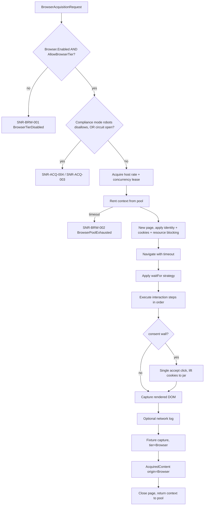

# Browser Tier

> Feature spec for code-forge implementation planning.
> Source: extracted from docs/sanare/tech-design.md §8
> Created: 2026-09-06

| Field | Value |
|-------|-------|
| Component | browser-tier |
| Priority | P0 |
| SRS Refs | — (no SRS; traces to tech-design §3.6 AC-006, AC-007, AC-010, AC-026, AC-033) |
| Tech Design | §8.1 — row 8 "Browser Tier"; §7.5 (tier selection); §7.4 (limits); §17 DR-004, DR-014 |
| Depends On | acquisition-pipeline, browsing-identity |
| Blocks | plan-runtime (Tier 3 execution), pagination-engine (LoadMoreButton / InfiniteScroll) |

## Purpose

Playwright is the last resort for rendering or bounded interaction, not a reason to increase target load. It uses the same per-host budgets as HTTP, captures the resulting DOM as a fixture, and follows the source's explicit acquisition mode. In `Compliance`, challenge detection ends automated execution. In `Stealth`, a preconfigured compatible browser identity/fingerprint profile may be used where the optional capability is implemented; CAPTCHA solving remains future work and no mode permits access-control bypass.

## Scope

**Included:**

- `IBrowserSession` / `IBrowserPool` over Playwright for .NET (Chromium).
- Browser and context lifecycle: launch once, pool contexts, bounded concurrency (default 2), idle eviction.
- Execution of the closed browser step allow-list: `click`, `waitForSelector`, `waitForNetworkIdle`,
  `scroll`, `selectOption`, `type`.
- Wait strategies and their timeouts, including a deterministic `waitFor` contract.
- Context realism: viewport, locale, timezone, and UA taken from the `DesktopChrome` identity profile.
- Cookie hand-off in both directions with the per-host jar (consent cookies obtained in the browser become
  usable by the HTTP tier).
- Resource blocking (images, media, fonts, analytics) to cut cost and load on the target.
- Rendered-DOM capture and fixture write, tagged `tier: Browser`.
- Optional network-log capture (HAR-style) so authoring can discover a JSON endpoint and **downgrade** the
  source to Tier 0 on the next authoring pass.
- Enforcement of the global and per-source opt-in flags.
- The `IChallengeHandoff` implementation used for the operator-invoked manual challenge hand-off
  (`ChallengePaused` recovery, DR-014) — an interactive-mode-only, non-automated escape hatch owned in
  contract by `acquisition-pipeline` (§`SNR-ACQ-011`).

**Excluded:**

- Deciding that Tier 3 is required — that is authoring-time tier selection (`authoring-workflow`).
- Interpreting the DOM into typed values — `plan-runtime` (identical code path for HTML and rendered HTML).
- Rate limiting and robots policy — reused from `acquisition-pipeline`; the browser tier is not a separate
  policy path and applies the source's `AcquisitionMode` decision.
- Unconfigured or reactive fingerprint mutation, stealth tooling, or automation-flag patching. Only a
  preconfigured, validated Stealth capability/profile selected before the run may be used (DR-006).

## Core Responsibilities

1. **Gate** — refuse to run unless both the global `Browser.Enabled` and the per-source `AllowBrowserTier`
   are true.
2. **Pool** — reuse one browser process and a small number of contexts; never leak a page or a context.
3. **Execute** the declared interaction steps deterministically, with per-step timeouts.
4. **Capture** the rendered DOM (and optionally the network log) as a fixture.
5. **Share** identity, cookies, robots policy state, and pacing with the HTTP tier.
6. **Fail honestly** — a block in the browser is still `Blocked`.

## Interfaces

### Inputs

- **`BrowserAcquisitionRequest`** — URL, source id, culture, plan `acquisition.waitFor`, plan
  `acquisition.interactions[]`, page role, capture-network flag.
- **`BrowsingIdentity`** (`DesktopChrome` profile) from `browsing-identity`.
- **`BrowserOptions`** (from `hosting-configuration`) — enabled flag, max contexts, wait timeout, pool wait
  timeout, resource-blocking rules, headless flag, executable path.

### Outputs

- **`AcquiredContent`** with `Origin = Browser` and the rendered HTML body.
- **`BrowserNetworkLog`** (optional) for endpoint discovery.
- **`CaptureRequest`** to `fixture-corpus`.
- Browser metrics and diagnostics to `observability`.

### Dependencies

- **`Microsoft.Playwright`** — browser automation.
- **`acquisition-pipeline`** — host limiter, robots policy, circuit breaker.
- **`browsing-identity`** — profile, cookie jar, consent policy.
- **`fixture-corpus`** — capture.

## Data Flow


```mermaid
flowchart TD
    A[BrowserAcquisitionRequest] --> B{Browser.Enabled AND AllowBrowserTier?}
    B -- no --> C[SNR-BRW-001 BrowserTierDisabled]
    B -- yes --> D{Compliance mode robots disallows, OR circuit open?}
    D -- yes --> E[SNR-ACQ-004 / SNR-ACQ-003]
    D -- no --> F[Acquire host rate + concurrency lease]
    F --> G[Rent context from pool]
    G -->|timeout| H[SNR-BRW-002 BrowserPoolExhausted]
    G --> I[New page, apply identity + cookies + resource blocking]
    I --> J[Navigate with timeout]
    J --> K[Apply waitFor strategy]
    K --> L[Execute interaction steps in order]
    L --> M{consent wall?}
    M -- yes --> N[Single accept click, lift cookies to jar]
    M -- no --> O[Capture rendered DOM]
    N --> O
    O --> P[Optional network log]
    P --> Q[Fixture capture, tier=Browser]
    Q --> R[AcquiredContent origin=Browser]
    R --> S[Close page, return context to pool]
```

## Key Behaviors

### Interface

```csharp
public interface IBrowserContentAcquirer
{
    ValueTask<AcquiredContent> AcquireAsync(
        BrowserAcquisitionRequest request, CancellationToken ct = default);
}

public interface IBrowserPool : IAsyncDisposable
{
    ValueTask<IBrowserLease> RentAsync(string sourceId, CancellationToken ct = default);
    BrowserPoolStatistics GetStatistics();
}

public interface IBrowserLease : IAsyncDisposable
{
    IBrowserContext Context { get; }
}
```

### Gating (DR-004)

1. `Browser.Enabled` is `false` by default, globally.
2. `AllowBrowserTier` is `false` by default, per source.
3. Both must be true. A Tier 3 plan executed with the tier disabled fails immediately with
   `SNR-BRW-001` and status `BrowserFailed` — it does **not** silently fall back to Tier 2, because a
   silent downgrade would return wrong data rather than an honest failure.
4. Conversely, a Tier 0–2 plan that fails at run time does **not** escalate to the browser; it records the
   failure and lets the evaluator dispatch a heal (DR-004). This is asserted explicitly, because
   auto-escalation is the single most tempting way to hide decay.

### Pooling and lifecycle

- One `IBrowser` per process, launched lazily on first use and disposed on host shutdown.
- Contexts are pooled, default maximum 2 concurrent (§7.4); `RentAsync` waits up to `BrowserWaitTimeout`
  (default 30 s) then fails `SNR-BRW-002`.
- One page per operation, always closed in a `finally`; a lease returned to the pool has zero open pages.
- Contexts are recycled after `MaxOperationsPerContext` (default 50) or `MaxContextAge` (default 15 min) to
  bound memory growth.
- Idle contexts are evicted after `ContextIdleTimeout` (default 2 min); an idle pool ends with zero
  processes so a long-lived host does not carry a browser it is not using.
- Every lease path is exception-safe: an exception during navigation still returns or disposes the context.

### Context realism

| Setting | Value |
|---------|-------|
| `UserAgent` | `DesktopChrome` profile UA (matching the actual bundled Chromium major version) |
| `Locale` | the request culture, e.g. `nl-NL` |
| `TimezoneId` | the source's configured timezone, e.g. `Europe/Amsterdam` |
| `ViewportSize` | 1280 × 800 |
| `DeviceScaleFactor` | 1 |
| `ExtraHTTPHeaders` | `Accept-Language` from the identity profile |
| `JavaScriptEnabled` | true |

In Compliance, realism means a coherent ordinary headless Chromium deployment without disguise. In Stealth, only a preconfigured, validated UA/fingerprint profile is permitted; no runtime patching or fingerprint randomisation is allowed.

### Wait strategies

`acquisition.waitFor` is a closed union:

| Strategy | Semantics | Default timeout |
|----------|-----------|-----------------|
| `Load` | `LoadState.Load` | 30 s |
| `DomContentLoaded` | `LoadState.DOMContentLoaded` | 30 s |
| `NetworkIdle` | `LoadState.NetworkIdle` | 30 s |
| `Selector` | `WaitForSelectorAsync(selector, Visible)` | 15 s |
| `Function` | a **predicate from the allow-list only** (e.g. "item count ≥ n"), never arbitrary JS | 15 s |

A wait timeout is `SNR-BRW-003`, and the partially-rendered DOM is still captured as a fixture so the heal
workflow can see what the page actually looked like when it failed. This is deliberate: the failure case is
where fixtures are most valuable.

### Interaction steps

Only the six allow-listed browser steps may appear in a plan. Each carries its own timeout and each is
validated before execution:

The argument shapes below are the ones `PlanOperationCatalog` already ships and `IPlanValidator` already
enforces; this component executes that vocabulary rather than widening it, because widening an operation's
arity is a plan-version change (`PlanOperation`'s own remark) and no acceptance criterion here needs one.

- `Click(selector)` — one `Selector` argument; fails `SNR-BRW-004` if the selector matches nothing.
- `WaitForSelector(selector)` — one `Selector` argument; the wait state is always `Visible`.
- `WaitForNetworkIdle(quietMillis?)` — zero or one `Int` argument; omitted means the default quiet period.
- `Scroll(times?)` — zero or one `Int` argument, bounded by `MaxScrolls` (default 50); the target is always
  the bottom of the document, and a per-step delay is a `BrowserOptions` value rather than a plan argument.
- `SelectOption(selector, value)` — a `Selector` and a `Literal`.
- `Type(selector, text)` — a `Selector` and a `Literal`. `text` may not be sourced from run input; it is a
  constant in the plan, so the step cannot become an injection vector.

Arbitrary `page.EvaluateAsync` of model-authored JavaScript is not supported; that is the same security
boundary the extraction allow-list draws, applied to the browser.

### Resource blocking

By default, requests whose resource type is `image`, `media`, `font`, or whose host matches a configured
analytics/ads block-list are aborted. This cuts bandwidth (typically 60–80 % on a retail product page),
speeds the run, and reduces load on the target — politeness and cost aligned. Blocking is disabled
automatically when a plan's wait strategy depends on `NetworkIdle` **and** the source is flagged
`RequiresImages`, so lazy-loading listers still work.

### Endpoint discovery

When `CaptureNetwork = true` (used during authoring, not during normal runs), responses with a JSON
content type are recorded as `{method, url, status, bytes, sampleOfBody}`. The authoring workflow uses this
to find an internal JSON API and re-author the source at Tier 0 — the browser thereby earns its own
retirement for that source.

### Manual challenge hand-off (DR-014)

`acquisition-pipeline` owns the `ChallengePaused` circuit-breaker state (`SNR-ACQ-011`) and the
`IChallengeHandoff` contract; `browser-tier` supplies the one implementation, because it already owns the
only real, visible browser surface in the library. This is an **additive, operator-only escape hatch**, not
a new autonomous capability, and it must not be read as loosening DR-004 (double opt-in) or the "no stealth
tooling" constraint below:

1. `PlaywrightChallengeHandoff : IChallengeHandoff` launches a **non-headless**, ordinary Playwright browser
   context — the same Chromium binary and the same absence of stealth/evasion packages as every other
   browser-tier session — navigated to the paused source's URL, and leaves it open for the operator.
2. It never runs any interaction step from a plan's allow-list, solves a challenge programmatically, injects
   automation-flag patches, or rotates identity/fingerprint. The only actor doing anything to the page is the
   human operator, through the real browser window they are looking at.
3. It reuses the ordinary context-realism defaults (`DesktopChrome` identity, standard viewport/locale/UA) so
   the operator sees exactly what the automated pipeline would have presented — no special "unblock" identity
   is fabricated.
4. It is available **only** when both `Browser.Enabled` is true and the process is running in the interactive
   execution mode (`ExecutionMode.Live`, the one mode that asserts an operator is present); it throws
   immediately in `ExecutionMode.OfflineFixture` and `ExecutionMode.Unattended` — the CI and daemon
   profiles — and it is unreachable unless an operator explicitly invokes
   it (§11.2 authorization matrix) — there is no automated caller anywhere in `plan-runtime` or the evaluator.
5. On operator confirmation ("done"), it closes the hand-off context and hands control back to
   `acquisition-pipeline`, which performs one supervised probe request through the normal HTTP path; the
   hand-off itself never reports the source as unblocked — only a clean probe does.

## Constraints

- **Shared politeness** — browser work acquires the same per-host rate and concurrency leases as HTTP and cannot exceed the source budget.
- **Configured, never reactive stealth** — browser identity/fingerprint selection happens before a run; challenge signals cannot trigger profile mutation, proxy rotation, or a solver.
- **Bounded resources** — contexts, pages, scrolls, operations per context, and context age are capped.
- **No leaks** — an integration test asserts zero orphaned Chromium processes after a fault-injected run.
- Playwright browsers must be installed; a missing installation fails at startup with actionable guidance.

### Scope boundaries

CAPTCHA/challenge detection is supported. CAPTCHA solving through a provider, human-in-the-loop completion, or an agent controlling a browser is future work. Login, paywall, authentication, authorization, and access-control bypass are out of scope in both modes. Browser execution never escapes the acquisition pipeline's host limiter, cache policy, `Retry-After`, circuit breaker, or source-level mode audit.

## Acceptance Criteria

| AC-ID | Priority | Criterion | Expected Result | Verification Method |
|-------|----------|-----------|-----------------|---------------------|
| AC-006 | P0 | Given a source whose fields exist only after JS rendering and the tier is enabled | The browser tier extracts them and the fixture records `tier: Browser` | Integration — local JS-rendered test page |
| AC-007 | P0 | Given a Tier 3 plan and `Browser.Enabled = false` | Fails with `SNR-BRW-001` / `BrowserFailed`; no Chromium process starts | Unit + integration — process count before/after |
| AC-007b | P0 | Given `Browser.Enabled = true` but `AllowBrowserTier = false` for the source | Same failure; the global flag alone is insufficient | Unit — gating boundary |
| AC-010 | P0 | Given the browser tier encounters a block | It reports `Blocked` and does not retry with altered fingerprints | Integration — assert one attempt, unchanged UA |
| AC-026 | P0 | Given a Tier 2 plan that fails validation at run time | No browser escalation occurs; the result is degraded and a heal is dispatched | Integration — assert zero browser launches |
| AC-BRW-001 | P0 | Given 4 concurrent browser requests with `MaxContexts = 2` | Two run, two queue; none fail while within `BrowserWaitTimeout` | Integration — concurrency |
| AC-BRW-002 | P0 | Given 4 concurrent requests where the pool wait exceeds the timeout | The excess fails with `SNR-BRW-002`; the successful ones are unaffected | Integration — pool exhaustion boundary |
| AC-BRW-003 | P0 | Given a navigation that throws mid-flight | The page is closed, the context is returned or disposed, and pool statistics show zero leaked pages | Integration — fault injection |
| AC-BRW-004 | P0 | Given 20 sequential browser runs | Exactly one Chromium process exists throughout; zero remain after disposal | Integration — process inspection |
| AC-BRW-005 | P0 | Given `waitFor: Selector` whose selector never appears | Fails with `SNR-BRW-003` after the timeout, **and** the partial DOM is captured as a fixture | Integration — timeout path |
| AC-BRW-006 | P0 | Given an interaction step whose selector matches nothing | Fails with `SNR-BRW-004` naming the step index and selector | Unit — step validation |
| AC-BRW-007 | P0 | Given a plan containing a browser step outside the six-item allow-list | Plan validation rejects it before execution with `SNR-PLAN-002` | Unit — allow-list negative |
| AC-BRW-008 | P0 | Given a `scroll` step requesting 500 iterations | It is clamped to `MaxScrolls = 50` with a warning diagnostic | Unit — bound |
| AC-BRW-009 | P0 | Given a browser run for a host at its rate limit | The run waits for the same per-host lease as HTTP; the combined rate stays within budget | Integration — shared limiter |
| AC-BRW-010 | P0 | Given a consent wall in the browser | One accept click is performed, the cookies are lifted into the per-host jar, and a subsequent HTTP-tier request carries them | Integration — cookie hand-off |
| AC-BRW-011 | P0 | Given Playwright browsers are not installed | Startup validation fails with `SNR-BRW-005` and a message naming the install command | Unit — environment validation |
| AC-BRW-012 | P0 | Given a configured Stealth browser profile | Only an implemented, validated capability/provider is used; unsupported configuration fails before launch | Unit — capability validation |
| AC-BRW-013 | P1 | Given resource blocking enabled on a product page | Image/media/font requests are aborted and total bytes drop by ≥ 50 % versus unblocked | Integration — byte accounting on a recorded page |
| AC-BRW-014 | P1 | Given a source flagged `RequiresImages` with `NetworkIdle` | Resource blocking is automatically disabled | Unit — interaction rule |
| AC-BRW-015 | P1 | Given `CaptureNetwork = true` on a page that fetches a JSON API | The network log contains that endpoint with method, URL, and status | Integration — endpoint discovery |
| AC-BRW-016 | P1 | Given a context that has served 50 operations | It is recycled before the 51st | Unit — recycling boundary with a fake clock |
| AC-BRW-017 | P1 | Given an idle pool for longer than `ContextIdleTimeout` | Contexts are evicted and the browser process is shut down | Integration — idle eviction |
| AC-BRW-018 | P1 | Given a source in `ChallengePaused` and an operator invokes the manual hand-off in `ExecutionMode.Live` | A non-headless, plain Chromium context opens at the source URL with standard `DesktopChrome` realism and no interaction steps are executed | Integration — assert visible context, zero step invocations |
| AC-BRW-019 | P0 | Given `ExecutionMode.OfflineFixture` or `ExecutionMode.Unattended` | Invoking the manual hand-off throws immediately without launching a browser | Unit — mode gate |
| AC-BRW-020 | P1 | Given CAPTCHA detection during browser acquisition | The result is recorded as a challenge; no CAPTCHA solver is invoked | Integration — detector and absence-of-solver assertion |

## Error Handling

| Code | Raised when | Severity | Status | Retryable |
|------|-------------|----------|--------|-----------|
| `SNR-BRW-001` | Browser tier required but disabled globally or per source | Error | `BrowserFailed` | No |
| `SNR-BRW-002` | Pool exhausted beyond `BrowserWaitTimeout` | Error | `BrowserFailed` | Yes |
| `SNR-BRW-003` | Wait strategy timed out | Error | `BrowserFailed` | Yes (once) |
| `SNR-BRW-004` | Interaction step failed (selector missing, not actionable) | Error | `BrowserFailed` | No — heal trigger |
| `SNR-BRW-005` | Playwright browsers not installed / launch failed | Fatal | — | No |

Every browser failure captures the DOM at failure time when a page exists, because the fixture is what makes
the subsequent heal possible. The manual challenge hand-off raises `SNR-ACQ-011`'s owning circuit-breaker
state changes (owned by `acquisition-pipeline`, §"Manual challenge hand-off (DR-014)" above) rather than a
new `SNR-BRW-*` code, since `browser-tier` is only the delivery mechanism for that state's resolution.

## File Structure

`Sanare.Browser` is a new project. It references `Sanare.Http` (for the shared limiter registry, the
identity profiles, the per-host cookie jar, and the circuit breaker) and never the other way round, so the
dependency direction stays `Sanare.Browser → Sanare.Http → Sanare.Core → Sanare.Abstractions`.

```
src/
└── Sanare.Browser/
    ├── Sanare.Browser.csproj
    ├── IBrowserContentAcquirer.cs
    ├── BrowserContentAcquirer.cs
    ├── BrowserAcquisitionRequest.cs
    ├── BrowserOptions.cs
    ├── Pooling/
    │   ├── IBrowserPool.cs
    │   ├── BrowserPool.cs
    │   ├── IBrowserLease.cs
    │   ├── BrowserLease.cs
    │   └── BrowserPoolStatistics.cs
    ├── Context/
    │   ├── BrowserContextFactory.cs
    │   ├── ResourceBlocker.cs
    │   └── CookieBridge.cs
    ├── Interactions/
    │   ├── IBrowserStepExecutor.cs
    │   ├── BrowserStepExecutor.cs
    │   ├── BrowserStep.cs
    │   └── WaitStrategy.cs
    ├── Discovery/
    │   ├── BrowserNetworkLog.cs
    │   └── NetworkLogRecorder.cs
    ├── ChallengeHandoff/
    │   └── PlaywrightChallengeHandoff.cs
    └── PlaywrightInstallationValidator.cs
```

## Test Module

**Test file**: `tests/Sanare.Browser.Tests/BrowserContentAcquirerTests.cs`

**Test scope**:

- **Unit**: gating matrix (global × per-source); step validation against the allow-list; scroll clamping;
  wait-strategy timeout mapping; `ResourceBlocker` rule matching; `BrowserContextFactory` option mapping
  (locale, timezone, viewport, UA) verified without launching a browser; `PlaywrightInstallationValidator`.
- **Integration** (tagged `[Trait("Category","Browser")]`, excluded from the default fast suite): real
  Chromium against a locally hosted static site containing a JS-rendered lister, a lazy-loading grid, a
  consent wall, and a JSON-backed page; pool concurrency and exhaustion; leak checks by process count;
  cookie hand-off to the HTTP tier; byte-reduction measurement with and without resource blocking; the
  no-escalation assertion (a failing Tier 2 run launches zero browsers); manual challenge hand-off launches a
  non-headless context with zero interaction-step invocations and is unreachable in
  `ExecutionMode.OfflineFixture` and `ExecutionMode.Unattended`.
- **Fixtures / Mocks**: a static test site under
  `tests/Sanare.Browser.Tests/TestSite/` (`lister-js.html`, `lister-infinite.html`,
  `product-js.html`, `consent-wall.html`, `app.js`) served by a minimal Kestrel host started per test
  class; a fake `IFixtureCorpus`; a fake `TimeProvider` for recycling and idle-eviction boundaries.

Companion test files: `tests/Sanare.Browser.Tests/BrowserPoolTests.cs`,
`tests/Sanare.Browser.Tests/BrowserStepExecutorTests.cs`,
`tests/Sanare.Browser.Tests/TierGatingTests.cs`,
`tests/Sanare.Browser.Tests/ResourceBlockerTests.cs`,
`tests/Sanare.Browser.Tests/ChallengeHandoffTests.cs`.

## Implementation Plan

> Planned: 2026-09-14. Milestone M3 (with `pagination-engine`). This section is the build order for this
> component; it does not restate the behaviour above, only how to land it.

### Preconditions

The tier-3 half of the system is genuinely empty: `AcquisitionTier.Browser`, `ContentOrigin.Browser`,
`ScrapeStatus.BrowserFailed`, the six browser `PlanOperation` members and `AcquisitionSpec.WaitFor` all
exist as vocabulary, but nothing reads them. These are the gaps that must be closed inside this landing
rather than discovered mid-build:

1. **There is no `Sanare.Browser` project.** `Sanare.slnx` lists exactly three source projects
   (`Sanare.Abstractions`, `Sanare.Core`, `Sanare.Http`) and three matching test projects. Both the new
   source project and `tests/Sanare.Browser.Tests` need `slnx` entries. There is no Central Package
   Management (`Directory.Packages.props` does not exist), so the `Microsoft.Playwright` reference carries
   its version inline in the new csproj.
2. **CI would run the browser integration suite.** `.github/workflows/ci.yml` runs a bare
   `dotnet test --no-build --no-restore -c Release` with no `--filter`, so the moment
   `[Trait("Category","Browser")]` tests exist they run on a runner that has no Chromium and no
   `playwright install` step. The workflow must gain the exclusion filter before the first traited test
   lands, not after.
3. **`SNR-BRW-001` and `SNR-BRW-002` are not mapped.** `ScrapeStatusCodes.For` maps
   `ScrapeStatus.BrowserFailed` to `["SNR-BRW-003", "SNR-BRW-004", "SNR-BRW-005"]` only, while this spec's
   error table and `tech-design.md` §"Error catalogue" both put `-001` and `-002` on `BrowserFailed`. The
   fix is confined to the switch body: the PublicApiGenerator approval file records only
   `For(ScrapeStatus)`'s signature, and `ScrapeStatusCodesTests` asserts shape (distinct, `SNR-XXX-000`
   pattern) rather than membership, so neither needs regenerating — but neither would have caught the
   omission either, which is why T1 adds the membership assertion.
4. **There is no configuration surface for the gate.** `AcquisitionOptions` has `RateLimit`, `Robots`,
   `Retry`, `Breaker` and `Cache` but no `Browser`; `AcquisitionPolicyOverride` has no per-source browser
   member; and neither `AllowBrowserTier` nor `RequiresImages` exists anywhere. DR-004's double opt-in
   cannot be expressed, let alone defaulted to false, until both halves exist.
5. **`ExecutionMode` does not have the members this spec named.** The shipped enum in
   `src/Sanare.Http/Resilience/IChallengeHandoff.cs` is `Live` / `OfflineFixture` / `Unattended`; the
   DR-014 prose said `Development`/`Investigation`. The prose has been corrected in place above — `Live` is
   the interactive mode and the other two throw — so no enum change is needed.
6. **Two architecture tests currently assert this component into non-existence.**
   `AcquisitionArchitectureTests.No_production_type_implements_the_challenge_handoff` and
   `No_production_type_consumes_the_challenge_handoff` scan the `Sanare.Http` and `Sanare.Core` assemblies
   and assert that nothing implements or injects `IChallengeHandoff`. `PlaywrightChallengeHandoff` lives in
   a third assembly, so the tests do not fail — but they also stop guarding anything once the implementation
   exists elsewhere. T12 extends `ProductionTypes()` to include `Sanare.Browser` and narrows the assertion
   to "exactly one implementation, still zero automated consumers", which is the invariant that actually
   matters. The sibling `Only_the_acquisition_boundary_holds_an_http_client` test already exempts any type
   whose full name contains `Browser`, so the new assembly slots in without weakening it.
7. **There is no tier-dispatch seam.** `AcquisitionScrapeRunner` takes a single `IContentAcquirer` and never
   inspects `plan.Tier`. Nothing today can route a Tier 3 plan anywhere, and nothing can assert that a
   failing Tier 0–2 plan did *not* reach the browser (AC-026), because there is no branch to observe.
8. **`AcquisitionSpec.WaitFor` is an unvalidated `string?`.** The closed
   `Load | DomContentLoaded | NetworkIdle | Selector | Function` union in "Wait strategies" above exists only
   as prose. Parsing, defaulting, and rejecting an unknown value are new work, and `IPlanValidator` must
   reject an unparsable value rather than let the browser discover it at navigation time.
9. **Nothing is instrumented.** `ScraperMetrics.RecordBrowserContexts` and `SpanNames.BrowserNavigate` exist
   and have no production caller — only `SpanHierarchyTests` references them. The pool and the acquirer are
   their first callers.
10. **`GovernedContentAcquirer`'s governance is not reusable as-is.** It is a decorator over
    `IContentAcquirer` with fourteen injected collaborators and a fixed ordering (breaker → robots → limiter
    lease + politeness gap → cache → retries inside the lease → breaker accounting → adaptive feedback).
    AC-BRW-009 requires the browser to take *the same* per-host lease, not an equivalent one, so the plan
    must reuse `IHostLimiterRegistry`, `IRobotsPolicy` and `BlockCircuitBreaker` instances rather than
    construct parallel ones — which in turn means the browser acquirer is composed by
    `AcquisitionPipelineFactory`, sharing its single `TimeProvider`.

### Delivery decisions

| Decision | Choice | Rationale |
|---|---|---|
| Project placement | New `src/Sanare.Browser/` referencing `Sanare.Http`; never the reverse | The tier needs `DesktopChromeProfile`, `IHostLimiterRegistry`, `BlockCircuitBreaker` and `HostCookieJar`, all of which live in `Sanare.Http`. Putting the browser inside `Sanare.Http` would drag a ~100 MB Playwright dependency into the package every HTTP-only consumer already references. The one-directional rule is the same one that put `RequestIdentity` in `Sanare.Core` rather than `Sanare.Http`. |
| Governance | Reuse the `Sanare.Http` policy components by injection; do **not** re-implement the ordering | A parallel policy path is how the browser silently exceeds a host budget. `BrowserContentAcquirer` takes the registry, the robots policy and the breaker as constructor parameters and `AcquisitionPipelineFactory` hands it the same instances the HTTP acquirer got, which is what makes AC-BRW-009 assertable at all. |
| Where `BrowserOptions` lives | `AcquisitionOptions.Browser`, following the existing `Effective*` validating-constructor pattern; `AllowBrowserTier` and `RequiresImages` go on `AcquisitionPolicyOverride` | Keeps one options root for the whole acquisition boundary and gets per-host/per-source layering for free from `ResolvePolicy`. `hosting-configuration` (#17) is still draft, so `IOptions`/`IConfiguration` binding is explicitly not in scope here — the options are constructed in code exactly as `acquisition-pipeline` left them. |
| Gate placement | The double opt-in is evaluated in `BrowserContentAcquirer` *before* the pool is touched, and independently in the runner's tier dispatch | AC-007 requires zero Chromium processes, which only holds if the gate precedes lazy launch. Checking it in the dispatcher alone would let a directly-constructed acquirer bypass it. |
| Rendered DOM → `AcquiredContent` | `StatusCode` = the main-frame navigation response status (0 if the navigation produced no response), `Headers` = the main-frame response headers, `Body` = UTF-8 bytes of `page.ContentAsync()`, `Charset` = `utf-8`, `ContentType` = `text/html`, `Origin = ContentOrigin.Browser`, `FinalUrl` = `page.Url` after all waits and interactions | Consumers downstream of the acquirer already branch on these members; synthesising a plausible `200` would make a challenge page indistinguishable from a good one. Taking the real main-frame status keeps `ChallengeDetector.Classify(AcquiredContent)` meaningful on the browser path. |
| Fixture capture | Through the same `IFixtureCorpus.CaptureAsync` with `Tier = AcquisitionTier.Browser`; capture happens in a `finally`-adjacent path so failures capture too | `CaptureRequest` already carries `Tier`, so "the fixture records `tier: Browser`" (AC-006) needs no new plumbing. The failure-path capture is what AC-BRW-005 asserts and what makes heals possible. |
| Installation validation | `PlaywrightInstallationValidator` runs from `AcquisitionPipelineFactory` when browser support is enabled, not on first navigation | AC-BRW-011 says "startup validation". Discovering a missing browser on the first real run turns an environment problem into a run failure hours later. When `Browser.Enabled` is false the validator is not run at all, so an HTTP-only host never needs Playwright installed. |
| Stealth scope | Validate the configured profile against a hard-coded list of implemented capabilities and fail before launch on anything else | AC-BRW-012 is a negative test. There is no provider (DR-006), so the implemented set is currently "the `DesktopChrome` realism defaults" and everything else is an unsupported-configuration failure. That is a truthful implementation of the AC, not a stub. |
| Interaction vocabulary | Execute the arity `PlanOperationCatalog` already ships; correct the prose instead of widening the catalog | Widening an operation's arity is a plan-version change, and no AC here needs `click`'s `nth` or `scroll`'s three-argument form. The prose above has been corrected. |
| Test-site host | One Kestrel host per test class over `tests/Sanare.Browser.Tests/TestSite/`, bound to `127.0.0.1:0` | A real HTTP origin is required for cookie scoping, resource-type classification and `NetworkIdle` to behave like production. `file://` breaks all three. Port 0 avoids collisions when classes run in parallel. |

### Task order

**T1 — Status-code and options surface.** Append `"SNR-BRW-001"` and `"SNR-BRW-002"` to
`ScrapeStatusCodes.For(ScrapeStatus.BrowserFailed)` and add a membership assertion to
`ScrapeStatusCodesTests` pinning the five `SNR-BRW-*` codes, since the existing theory only checks shape.
Add `BrowserOptions`
(`Enabled = false`, `MaxContexts = 2`, `BrowserWaitTimeout = 30 s`, `MaxOperationsPerContext = 50`,
`MaxContextAge = 15 min`, `ContextIdleTimeout = 2 min`, `MaxScrolls = 50`, `ScrollDelay`, `BlockResources`,
`CaptureNetwork = false`, `BlockedHosts`) next to the other option records in
`src/Sanare.Core/Acquisition/AcquisitionPolicyOptions.cs`, wire `AcquisitionOptions.Browser` +
`EffectiveBrowser`, and add `AllowBrowserTier` (default `false`) and `RequiresImages` (default `false`) to
`AcquisitionPolicyOverride` so `ResolvePolicy` layers them. No browser code yet — this is the vocabulary the
gate needs. Depends on: —

**T2 — Project scaffold.** Create `src/Sanare.Browser/Sanare.Browser.csproj` (referencing `Sanare.Http` and
`Microsoft.Playwright`) and `tests/Sanare.Browser.Tests/Sanare.Browser.Tests.csproj`, register both in
`Sanare.slnx`, and add `--filter "Category!=Browser"` to the `dotnet test` step in
`.github/workflows/ci.yml` with a comment naming why. Add `PlaywrightInstallationValidator` with a single
`Validate()` that resolves the browser executable path and throws a `SNR-BRW-005` fatal naming
`pwsh bin/Debug/net10.0/playwright.ps1 install chromium`, plus its unit test. Landing the CI filter and the
validator together means the suite is green on a runner with no Chromium from the first commit.
Depends on: T1

**T3 — Gating.** `BrowserAcquisitionRequest` (target `Uri`, `SourceId`, `AcquisitionSpec`, culture,
`NavigationContext`, `CaptureNetwork`) and `IBrowserContentAcquirer`. Implement the DR-004 double opt-in as
a standalone `BrowserTierGate` consulted by `BrowserContentAcquirer` before anything else: global
`Browser.Enabled` **and** the resolved per-source `AllowBrowserTier`, either false → `SNR-BRW-001` /
`BrowserFailed`, never a Tier-2 fallback. Unit-test the full 2×2 matrix. Depends on: T2

**T4 — Pool and lifecycle.** `IBrowserPool` / `BrowserPool` / `IBrowserLease` / `BrowserLease` /
`BrowserPoolStatistics`. One `IBrowser` per instance, launched lazily under a lock on first `RentAsync`;
a `SemaphoreSlim(MaxContexts)` gate whose wait is bounded by `BrowserWaitTimeout` → `SNR-BRW-002`;
per-context operation counters and creation timestamps read from the injected `TimeProvider` for recycling;
an idle sweep that disposes contexts past `ContextIdleTimeout` and shuts the browser down when the last one
goes. `DisposeAsync` is idempotent and disposes contexts before the browser. Statistics expose rented,
available, total-created and open-page counts so the leak assertions have something to read. Depends on: T2

**T5 — Page-scoped execution and leak safety.** A `PageScope` helper that opens a page from a leased
context, runs a delegate, and closes the page in a `finally` regardless of outcome, decrementing the
statistics counter. Every path in `BrowserContentAcquirer` goes through it; the lease is returned in an
outer `finally` and disposed rather than returned if the context faulted. This is the single place the
"zero leaked pages" and "zero orphaned processes" properties are established. Depends on: T4

**T6 — Context realism.** `BrowserContextFactory` maps an `IdentityRequest` to
`BrowserNewContextOptions`: UA from the resolved `DesktopChromeProfile` asserted against
`DesktopChromeProfile.ChromeMajorVersion`, `Locale` from the request culture, `TimezoneId` from the source,
1280×800 viewport, device scale factor 1, `Accept-Language` as an extra HTTP header, JavaScript enabled.
Also implement the Stealth capability check here: the configured profile is validated against the
implemented-capability set and an unsupported one throws before `NewContextAsync`. Testable without
launching a browser by asserting on the produced options object. Depends on: T4

**T7 — Wait strategies.** A `WaitStrategy` parser over `AcquisitionSpec.WaitFor` producing the closed union
with its per-strategy timeout (30 s for the three load states, 15 s for `Selector` and `Function`), a
`Function` implementation restricted to an allow-listed predicate table — never arbitrary JS — and a
`SNR-BRW-003` on timeout. Extend `IPlanValidator` to reject an unparsable `waitFor` so the failure surfaces
at plan-validation time. The timeout path must still capture the partial DOM, which is why it is sequenced
after T5. Depends on: T5

**T8 — Interaction executor.** `IBrowserStepExecutor` / `BrowserStepExecutor` over
`AcquisitionSpec.Interactions`, dispatching the six catalog operations with their shipped arity, rejecting
anything else before execution, clamping `Scroll` to `MaxScrolls` with a warning diagnostic, and raising
`SNR-BRW-004` naming the zero-based step index and the selector when a step cannot act. Steps run after the
wait strategy and before DOM capture. Depends on: T7

**T9 — Resource blocking and network log.** `ResourceBlocker` routes on `**/*`, aborting `image`, `media`
and `font` resource types plus hosts matching the configured block-list, and is skipped entirely when the
wait strategy is `NetworkIdle` **and** the resolved source is `RequiresImages`. `NetworkLogRecorder` /
`BrowserNetworkLog` record `{method, url, status, bytes, sampleOfBody}` for JSON responses only when
`CaptureNetwork` is true, with the body sample bounded and passed through the existing redaction path before
it is written. Depends on: T6

**T10 — Cookie bridge.** `CookieBridge` lifts cookies out of the context into the shared `HostCookieJar`
after acquisition and seeds the context from the jar before navigation, so a consent cookie obtained in the
browser is carried by the next HTTP request and vice versa. Consent detection reuses the existing
`IConsentPolicy` / `WallClassifier`; a single accept click is performed through the T8 executor, not a
bespoke path. Depends on: T8

**T11 — Composition and shared governance.** `BrowserContentAcquirer` assembles T3–T10: gate → breaker
`ThrowIfOpen` → robots check → `IHostLimiterRegistry.AcquireAsync` + `WaitForPolitenessAsync` → lease → page
scope → navigate + wait → interactions → DOM capture → fixture write → breaker accounting. It takes the same
registry/robots/breaker/`TimeProvider`/`ScraperMetrics` instances the HTTP acquirer got, handed to it by a
new `AcquisitionPipelineFactory.CreateBrowser(...)` overload. Instrument `SpanNames.BrowserNavigate` and
`ScraperMetrics.RecordBrowserContexts` here — the pool reports context deltas, the acquirer opens the span.
Depends on: T5, T6, T9, T10

**T12 — Tier dispatch and the no-escalation assertion.** Introduce a `TieredContentAcquirer` that inspects
`plan.Tier` and routes `AcquisitionTier.Browser` to the browser acquirer and everything else to the governed
HTTP acquirer, with no fallback edge in either direction: a failing Tier 0–2 acquisition returns its failure
untouched. Wire it into `AcquisitionScrapeRunner`. Extend `AcquisitionArchitectureTests.ProductionTypes()`
to include the `Sanare.Browser` assembly and change the hand-off assertions from "zero implementations" to
"exactly one implementation (`PlaywrightChallengeHandoff`) and still zero constructor consumers".
Depends on: T11

**T13 — Manual challenge hand-off (DR-014).** `PlaywrightChallengeHandoff : IChallengeHandoff` launching a
non-headless ordinary Chromium context through `BrowserContextFactory` at the paused source's URL, gated on
`Browser.Enabled` **and** `ExecutionMode.Live`, throwing immediately under `OfflineFixture` and `Unattended`.
It never touches `IBrowserStepExecutor`, never rotates identity, and holds no reference to a plan; on
operator confirmation it closes the context and returns, leaving the supervised probe to
`acquisition-pipeline`. It stays outside the pool: an operator session is not a bounded automated operation
and must not consume a `MaxContexts` slot. Depends on: T6, T12

**T14 — Test site and integration suite.** The static site under `tests/Sanare.Browser.Tests/TestSite/`
(`lister-js.html`, `lister-infinite.html`, `product-js.html`, `consent-wall.html`, `app.js`) plus the
per-class Kestrel fixture on `127.0.0.1:0`, a fake `IFixtureCorpus`, and a `FakeTimeProvider` for the
recycling and idle boundaries. Then the five test files from the Test Module section, with every integration
test tagged `[Trait("Category","Browser")]`. Process-count assertions read the Chromium child processes of
the current process rather than all system Chromium, so a developer's own browser does not fail the suite.
Depends on: T13

**T15 — Doc reconciliation.** Flip this component's row in `docs/features/overview.md` from `draft` to the
status the landing actually reaches, drop the "browser-tier escalation (row 8) is still out" clause from the
row 6 note, update `README.md`'s "What's intentionally unimplemented" prose, and replace the `DEVELOPMENT.md`
browser-tier todo with a link to this plan. Depends on: T14

### Verification matrix

| AC-ID | Covered by | Test kind |
|---|---|---|
| AC-006 | T14 `product-js.html` run whose fields exist only post-render, asserting the captured `FixtureRecord.Tier` is `Browser` | Integration |
| AC-007 | T3 gate matrix for `Enabled = false`, plus a T14 assertion that the Chromium child-process count is unchanged across the call | Unit + Integration |
| AC-007b | T3 gate matrix row where the global flag is true and the resolved `AllowBrowserTier` is false | Unit |
| AC-010 | T11 block-response test asserting one navigation attempt, unchanged context UA, and a `Blocked` outcome with no second launch | Integration |
| AC-026 | T12 failing-Tier-2 dispatch test asserting the browser acquirer was never invoked and the Chromium count stayed zero | Integration |
| AC-BRW-001 | T4 four-concurrent-rents test with `MaxContexts = 2` asserting two leases held and two pending, none faulted inside the timeout | Integration |
| AC-BRW-002 | T4 exhaustion test whose excess rent exceeds `BrowserWaitTimeout` → `SNR-BRW-002`, with the two successful leases asserted intact | Integration |
| AC-BRW-003 | T5 fault-injected navigation asserting the page closed, the lease disposed, and `BrowserPoolStatistics` open-page count back to zero | Integration |
| AC-BRW-004 | T4/T14 twenty-sequential-run test asserting exactly one Chromium child throughout and zero after `DisposeAsync` | Integration |
| AC-BRW-005 | T7 `Selector` wait against a selector the page never renders → `SNR-BRW-003` plus an asserted fixture write containing the partial DOM | Integration |
| AC-BRW-006 | T8 step whose selector matches nothing → `SNR-BRW-004` whose message contains the step index and the selector | Unit |
| AC-BRW-007 | T8 plan-validation negative for a non-interaction operation in `acquisition.interactions` → `SNR-PLAN-002` before any execution | Unit |
| AC-BRW-008 | T8 `Scroll` with 500 requested iterations asserting 50 performed and a warning diagnostic emitted | Unit |
| AC-BRW-009 | T11 test giving the browser and HTTP acquirers the same `IHostLimiterRegistry`, asserting the browser run waits on the held lease and the combined request rate stays within the host budget | Integration |
| AC-BRW-010 | T10 `consent-wall.html` run asserting one accept click, the cookie present in the `HostCookieJar`, and a following HTTP request carrying it | Integration |
| AC-BRW-011 | T2 validator test with the browser path unresolvable → `SNR-BRW-005` whose message names the install command | Unit |
| AC-BRW-012 | T6 unsupported-Stealth-capability configuration asserting the failure occurs before `NewContextAsync` | Unit |
| AC-BRW-013 | T9 byte-accounting comparison of `product-js.html` with and without blocking, asserting ≥ 50 % reduction | Integration |
| AC-BRW-014 | T9 rule test pairing `RequiresImages` with a `NetworkIdle` wait, asserting no route handler is registered | Unit |
| AC-BRW-015 | T9 `CaptureNetwork = true` run against the JSON-fetching page asserting the endpoint's method, URL and status in the log | Integration |
| AC-BRW-016 | T4 recycling test driving a context to 50 operations on a `FakeTimeProvider` and asserting a new context serves the 51st | Unit |
| AC-BRW-017 | T4 idle-eviction test advancing past `ContextIdleTimeout` and asserting zero contexts and a shut-down browser | Integration |
| AC-BRW-018 | T13 hand-off in `ExecutionMode.Live` asserting a non-headless context at the source URL, `DesktopChrome` realism, and zero `IBrowserStepExecutor` invocations | Integration |
| AC-BRW-019 | T13 mode gate for `OfflineFixture` and `Unattended`, asserting the throw precedes any launch | Unit |
| AC-BRW-020 | T11 CAPTCHA page routed through the existing `ChallengeDetector`, asserting a challenge outcome and no solver type in the call path | Integration |

### Deferred scope

These are deliberately out of this component's landing and belong in the `overview.md` status note:

- **CAPTCHA solving.** Detection lands here; provider-backed solving, human-in-the-loop completion, and an
  agent driving a browser are future work. The manual hand-off is an operator escape hatch, not a solver.
- **Login, paywall, authentication, and access-control bypass.** Out of scope in both `Compliance` and
  `Stealth`, permanently — no AC here or in `browsing-identity` asks for it.
- **Runtime fingerprint randomisation and automation-flag patching.** DR-006 makes these provider-backed
  capabilities and there is no provider; the Stealth path validates a preconfigured profile and fails on
  anything it cannot honestly implement.
- **Non-Chromium engines.** Firefox and WebKit contexts change the realism defaults, the resource-type
  vocabulary and the install story; nothing requires them.
- **Browser-driven pagination execution.** `LoadMoreButtonStrategy` and `InfiniteScrollStrategy` are declared
  by `pagination-engine` (#10) and throw `SNR-PAG-003` today. Driving them through this tier is that
  component's second half, sequenced after both land.
- **Bindable configuration.** `BrowserOptions` is constructed in code alongside the rest of
  `AcquisitionOptions`. `IOptions`/`IConfiguration` binding and the DI extension methods belong to
  `hosting-configuration` (#17), exactly as `acquisition-pipeline` deferred them.
- **Browser telemetry export.** The span and the context gauge are emitted through the existing
  `ScraperActivitySource` / `ScraperMetrics` catalog; exporters, dashboards and alert rules belong to
  `observability` (#16).
- **Running the browser suite in CI.** T2 excludes `Category=Browser` from the default workflow. A
  Chromium-provisioned job that runs the integration suite on a schedule is worth having and is not required
  by any AC here.
