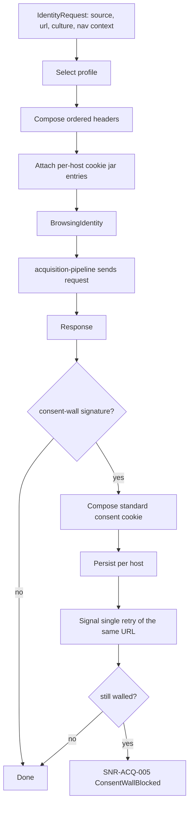

# Browsing Identity

> Feature spec for code-forge implementation planning.
> Source: extracted from docs/sanare/tech-design.md §8
> Created: 2026-09-06

| Field | Value |
|-------|-------|
| Component | browsing-identity |
| Priority | P0 |
| SRS Refs | — (no SRS; traces to tech-design §3.6 AC-010, AC-011, AC-028) |
| Tech Design | §8.1 — row 7 "Browsing Identity"; §11.1 (identity posture); §11.4 (compliance); §17 DR-006 |
| Depends On | acquisition-pipeline |
| Blocks | browser-tier |

## Purpose

This component makes the source's explicit acquisition mode mechanically visible in every request. In default `Compliance` mode it supplies a stable, coherent `AssistantBrowser` identity that identifies Sanare as an automated client and supports robots enforcement. In audited `Stealth` mode it selects only explicitly enabled, internally compatible proxy and TLS/JA3 or UA/fingerprint profiles for public data. CAPTCHA/challenge detection is represented here; solving remains future work.

## Scope

**Included:**

- `IBrowsingIdentityProvider` and the built-in `AssistantBrowser` and `DesktopChrome` profiles.
- Coherent header composition: `User-Agent`, `Accept`, `Accept-Language`, `Accept-Encoding`,
  `Sec-Fetch-Site/Mode/Dest/User`, `Upgrade-Insecure-Requests`, `Sec-CH-UA*` where the profile declares
  Chromium lineage.
- Header **order** stability, since inconsistent ordering is itself a naive-heuristic signal.
- Culture-driven `Accept-Language` derived from the request's culture (e.g. `nl-NL,nl;q=0.9,en;q=0.8`).
- Referer synthesis for detail pages reached from a lister within the same run.
- Consent-wall detection (signatures) and the standard consent-cookie response, persisted per host.
- Per-host cookie jar with a bounded, inspectable, non-persisted-to-fixture lifetime.
- `ComplianceReport` per source: acquisition mode, robots decision/status, request volume, identity profile,
  and enabled capability identifiers (never credentials).
- Compile-time/API-time refusal of excluded bypasses, CAPTCHA solvers, and unconfigured or incompatible
  Stealth capabilities.

**Excluded:**

- Sending the request — `acquisition-pipeline`.
- Browser launch arguments and viewport realism — `browser-tier` consumes this component's profile but owns
  its own Playwright context configuration.
- Rate limiting and pacing — `acquisition-pipeline` (pacing is part of blending in, but it lives with the
  transport).
- Any form of authentication or paywall bypass — out of scope permanently.

## Core Responsibilities

1. **Compose** a coherent header set for a request given a profile, a culture, and a navigation context.
2. **Stay stable** — the same source gets the same identity across runs, so the site sees one consistent
   visitor rather than a shape-shifter.
3. **Detect and clear** consent walls with a single, standard, persisted consent cookie.
4. **Report** compliance posture per source.
5. **Refuse** the out-of-bounds techniques by not offering them.

## Interfaces

### Inputs

- **`IdentityRequest`** — source id, target URI, culture, navigation context (`TopLevel`, `SameOriginSubResource`,
  `DetailFromLister`), tier.
- **`IdentityOptions`** (from `hosting-configuration`) — profile name, optional per-source overrides for
  `Accept-Language`, consent-cookie policy.
- **Response signals** (from `acquisition-pipeline`) — bodies and headers for consent-wall detection.

### Outputs

- **`BrowsingIdentity`** — ordered header list, cookie contributions, and a profile id recorded in run
  provenance.
- **`ConsentDecision`** — detected / not detected, plus the cookie to set.
- **`ComplianceReport`** (to `IScraperAdministration`).

### Dependencies

- **`acquisition-pipeline`** — consumes identity; supplies responses for detection.
- **`scrape-api-contracts`** — diagnostics, error codes, culture handling.

## Data Flow



## Key Behaviors

### Interface

```csharp
public interface IBrowsingIdentityProvider
{
    BrowsingIdentity GetIdentity(IdentityRequest request);

    ConsentDecision EvaluateConsent(AcquiredContent content, string sourceId);

    ComplianceReport GetComplianceReport(string sourceId);
}

public sealed record BrowsingIdentity(
    string ProfileId,
    IReadOnlyList<KeyValuePair<string, string>> Headers,   // order-significant
    IReadOnlyList<Cookie> Cookies);
```

### The `AssistantBrowser` profile

| Header | Value |
|--------|-------|
| `User-Agent` | `Mozilla/5.0 (compatible; Sanare/1.0; +https://github.com/{org}/dotnet-sanare) AssistantBrowser/1.0` |
| `Accept` | `text/html,application/xhtml+xml,application/xml;q=0.9,application/json;q=0.9,*/*;q=0.8` |
| `Accept-Language` | derived from the request culture, e.g. `nl-NL,nl;q=0.9,en;q=0.8` |
| `Accept-Encoding` | `gzip, deflate, br` |
| `Sec-Fetch-Site` | `none` for a top-level entry, `same-origin` for a detail page reached from a lister |
| `Sec-Fetch-Mode` | `navigate` |
| `Sec-Fetch-Dest` | `document` |
| `Sec-Fetch-User` | `?1` for top-level navigations only |
| `Upgrade-Insecure-Requests` | `1` |

The User-Agent is **honest**: it names this library and links to it. It does not claim to be, and must not
be configurable to claim to be, any specific third party's crawler (DR-006). The `DesktopChrome` profile
exists for the browser tier, where Playwright's real Chromium UA is used because a mismatch between the UA
string and the actual engine's TLS/HTTP behaviour is itself incoherent — but even there the UA is not
randomised or rotated.

### Coherence rules (validated, not merely documented)

1. `Accept-Encoding` must list only encodings the transport can actually decode.
2. `Accept-Language` must contain the source culture's language as the highest-weighted entry.
3. `Sec-Fetch-User: ?1` may appear only with `Sec-Fetch-Mode: navigate` and `Sec-Fetch-Dest: document`.
4. `Sec-CH-UA*` headers may appear only for profiles declaring Chromium lineage, and must agree with the
   UA string's major version.
5. `Referer` is emitted only for a `DetailFromLister` context, only same-origin, and only with the URL the
   run actually visited — never fabricated.
6. Header order is fixed per profile and asserted, because a shuffled order is a cheap bot tell.

A profile failing any coherence rule fails fast at startup with `SNR-ID-001` rather than producing subtly
suspicious traffic in production.

### Stability

- Identity is a pure function of `(profile, culture, navigation context)`; there is no randomisation, no
  per-request rotation, and no per-run seed.
- The same `sourceId` therefore presents the same identity across runs, days, and processes, which is what
  makes the traffic look like one well-behaved visitor.
- The profile id is written into `RunProvenance` and into the compliance report so a site operator's
  question ("what was this?") has a precise answer.

### Consent walls

- Detection is signature-based: a small body containing known CMP markers (TCF `__tcfapi`, OneTrust
  `#onetrust-banner-sdk`, Cookiebot `#CybotCookiebotDialog`, or a configured per-source selector) together
  with an absence of the expected content root.
- Response: set the standard consent cookie the CMP itself would set on "accept necessary" where that is a
  documented, static value (e.g. OneTrust's `OptanonAlertBoxClosed`), persist it in the per-host jar, and
  retry the same URL **exactly once**.
- If the wall persists, fail with `SNR-ACQ-005 ConsentWallBlocked` and record a diagnostic that names the
  detected CMP — this is a heal trigger, because "the site added a cookie wall" is precisely one of the
  self-healing scenarios the project set out to handle.
- In the browser tier the equivalent action is a single scripted click on the CMP's accept control, after
  which the resulting cookies are lifted into the per-host jar so the HTTP tier can continue unaided.
- Cookies are **never** written into fixtures (redaction strips them) and are never logged.

### Scope boundaries

- CAPTCHA solving through a service, human-in-the-loop completion, and browser-agent solving are future work.
- Authentication, login, paywall, authorization, and access-control bypass are out of scope in every mode.
- Sending requests, rate limiting, robots enforcement, and circuit breaking belong to `acquisition-pipeline`.

## Constraints

- **Compliance by default** — absent an explicit source setting, use `AcquisitionMode.Compliance`, enforce robots, and identify Sanare in the User-Agent.
- **Honest identity, always** — the UA identifies this library and is never configurable to impersonate a named third-party crawler (DR-006).
- **No randomisation** — determinism is a feature here; no per-request rotation and no per-run seed.
- **No automatic escalation** — a block may record detection and reduce traffic, but cannot rotate a proxy, mutate a fingerprint, or invoke a solver. The blocked path terminates: identity never escalates to evasion when a site says no.
- **Coherent and auditable stealth** — optional proxy rotation and TLS/JA3 or UA/fingerprint profiles are selected before a run, validated against the actual transport/browser context, and recorded without secrets.
- **Public data only** — identity capabilities never authorize access-control bypass.
- **Consent retry is capped at one** — no loops against a CMP.
- **Cookies stay in memory and in the per-host jar**, never in fixtures, logs, or telemetry.
- Profiles are validated at startup; an incoherent profile prevents the host from starting.

## Acceptance Criteria

| AC-ID | Priority | Criterion | Expected Result | Verification Method |
|-------|----------|-----------|-----------------|---------------------|
| AC-028 | P0 | Given default source configuration | The resolved mode is `Compliance`, the UA identifies Sanare, and an applicable robots `Disallow` is enforceable by acquisition | Unit — policy/profile resolution and acquisition integration |
| AC-010 | P0 | Given a block or challenge in either mode | The report records the outcome and traffic only slows or stops; identity and proxy selection do not change automatically | Integration — fixed profile and host-budget assertions |
| AC-011 | P0 | Given stealth is requested with unavailable or incoherent capabilities | Configuration fails with an actionable diagnostic; it does not silently fall back or create a mismatched profile | Unit — capability/profile validation |
| AC-ID-015 | P1 | Given a configured stealth source | The compliance report includes mode, enabled capability IDs, proxy-provider identifier, and robots decision without credentials | Unit — provenance report content |
| AC-ID-016 | P1 | Given CAPTCHA signatures | The result is classified as a challenge and no solver is invoked | Unit — detector and absence-of-solver assertion |
| AC-ID-017 | P1 | Given a login or paywall wall | The result reports unavailable public content; no identity capability attempts bypass | Integration — terminal classification |

## Error Handling

| Code | Raised when | Severity | Effect |
|------|-------------|----------|--------|
| `SNR-ID-001` | A profile fails a coherence rule at startup | Fatal | Host fails to start; the message names the rule and the offending header |
| `SNR-ID-002` | A per-source identity override references an unknown profile | Fatal | Host fails to start |
| `SNR-ACQ-005` | Consent wall persists after one consent attempt | Error | Status `ConsentWallBlocked`; heal trigger recorded |

## File Structure

```
src/
└── Sanare.Http/
    └── Identity/
        ├── IBrowsingIdentityProvider.cs
        ├── BrowsingIdentityProvider.cs
        ├── BrowsingIdentity.cs
        ├── IdentityRequest.cs
        ├── NavigationContext.cs
        ├── IdentityOptions.cs
        ├── Profiles/
        │   ├── IdentityProfile.cs
        │   ├── AssistantBrowserProfile.cs
        │   ├── DesktopChromeProfile.cs
        │   └── ProfileCoherenceValidator.cs
        ├── Consent/
        │   ├── IConsentPolicy.cs
        │   ├── ConsentPolicy.cs
        │   ├── ConsentSignatures.cs
        │   ├── ConsentDecision.cs
        │   └── HostCookieJar.cs
        └── Compliance/
            ├── ComplianceReport.cs
            └── ComplianceReporter.cs
```

## Test Module

**Test file**: `tests/Sanare.Http.Tests/Identity/BrowsingIdentityProviderTests.cs`

**Test scope**:

- **Unit**: header composition per profile and culture; header-order assertions via a golden list;
  `ProfileCoherenceValidator` for each rule with a passing and a failing case; navigation-context referer
  and `Sec-Fetch-*` matrices; determinism over 1 000 iterations; `HostCookieJar` scoping and expiry;
  `ConsentSignatures` true-positive and false-positive sets.
- **Integration**: consent-wall clearing end to end against a WireMock host that serves the wall until the
  cookie arrives; persistence of the cookie across two runs in the same process; browser-tier locale/UA
  coherence with a real Playwright context.
- **Fixtures / Mocks**: `tests/Sanare.Http.Tests/Data/consent-wall-onetrust.html`,
  `consent-wall-cookiebot.html`, `lenovo-tablet-product.html` (false-positive guard),
  `bol-consent-wall.html`. A `PublicApiGenerator` approval file
  `tests/Sanare.Http.Tests/ApprovedApi/Sanare.Http.approved.txt` is the mechanism
  behind AC-028 — any accidental addition of a proxy or fingerprint knob breaks the build.

Companion test files: `tests/Sanare.Http.Tests/Identity/ConsentPolicyTests.cs`,
`tests/Sanare.Http.Tests/Identity/ProfileCoherenceValidatorTests.cs`,
`tests/Sanare.Http.Tests/Identity/ComplianceReportTests.cs`,
`tests/Sanare.Http.Tests/ApiSurfaceTests.cs`.

## Implementation Plan

> Planned: 2026-09-10. Milestone M2 (with `acquisition-pipeline`). This section is the build
> order for this component; it does not restate the behaviour above, only how to land it.

### Delivery decisions

| Decision | Choice | Rationale |
|---|---|---|
| Package | Create `src/Sanare.Http` + `tests/Sanare.Http.Tests`, register both in `Sanare.slnx` | Matches tech-design §6.3 package layout and this spec's File Structure. `Sanare.Http` references `Sanare.Core`. |
| Existing acquirer | Leave `HttpContentAcquirer` in `Sanare.Core.Acquisition` for now; `Sanare.Http` consumes its types | Moving it is a separate, mechanical relocation that would bury this feature's diff. Tracked as follow-up below. |
| Transport wiring | Identity is applied by an explicit caller-side step, not by an `HttpClient` `DelegatingHandler` | Header **order** is the contract (coherence rule 6); `HttpClient` re-orders and de-duplicates request headers, so composition must reach `HttpRequestMessage` directly. |
| Stealth capabilities | Ship the `AcquisitionMode` enum, the capability-validation path, and the compliance report fields; ship **no** proxy or fingerprint implementation | AC-011 requires stealth to fail loudly when capabilities are unavailable. "Unavailable" is the correct and honest state for v0.1, and AC-028's API-surface guard depends on no such knob existing. |
| CAPTCHA | Detection and challenge classification only; no solver seam at all | AC-ID-016 asserts absence of a solver. A solver interface would weaken that assertion. |
| New dependencies | None in `src/`. Test project takes `PublicApiGenerator` only | WireMock and Playwright are deferred with the integration tests they serve (see Deferred scope). |

### Task order

Each task is independently buildable and testable; land them in order.

**T1 — Project scaffold.** Add `src/Sanare.Http/Sanare.Http.csproj` (ProjectReference → `Sanare.Core`)
and `tests/Sanare.Http.Tests/Sanare.Http.Tests.csproj` (xunit 2.9.2, xunit.runner.visualstudio 2.8.2,
Microsoft.NET.Test.Sdk 17.12.0, `GlobalUsings.cs`, and the `<None Include="Data\**\*" CopyToOutputDirectory="PreserveNewest" />`
item used by the other test projects). Register both under the `/src/` and `/tests/` folders of
`Sanare.slnx`. Acceptance: `dotnet build Sanare.slnx` and `dotnet test Sanare.slnx` still pass.

**T2 — Identity model types.** `NavigationContext` (`TopLevel`, `SameOriginSubResource`, `DetailFromLister`),
`IdentityRequest`, `BrowsingIdentity`, `IBrowsingIdentityProvider`, and `AcquisitionMode`
(`Compliance` default, `Stealth`). Headers are `IReadOnlyList<KeyValuePair<string, string>>` — never a
dictionary — so order survives the type system. Depends on: T1.

**T3 — Profiles and header composition.** `IdentityProfile` (abstract: profile id, Chromium lineage flag,
fixed header order, UA major version), `AssistantBrowserProfile` (the header table above),
`DesktopChromeProfile` (declared but browser-tier-only; not selectable by the HTTP tier). Compose
`Accept-Language` from the request culture as `{culture},{lang};q=0.9,en;q=0.8`, collapsing the duplicate
`en` entry when the culture is already English. Depends on: T2.

**T4 — `ProfileCoherenceValidator`.** One method per rule 1–6, each returning a named failure rather than a
bool, so `SNR-ID-001` messages can name the rule and the offending header. Rule 1 checks against
`DecompressionMethods` actually enabled on the transport, so the validator takes the supported-encoding set
as an argument rather than hard-coding `gzip, deflate, br`. Depends on: T3.

**T5 — `BrowsingIdentityProvider.GetIdentity`.** Pure function of `(profile, culture, navigation context)`.
Resolves the profile by name and throws `SNR-ID-002` for an unknown name; runs T4's validator on each
configured profile once at construction and throws `SNR-ID-001` on failure, which is what makes the host
fail to start. Referer is emitted only for `DetailFromLister`, only when the referring URL is same-origin,
and only from a referrer the caller passes in — there is no synthesis path that can fabricate one.
Depends on: T4.

**T6 — `HostCookieJar`.** Per-host, in-memory, bounded, inspectable; keyed by registrable host with expiry
honoured against an injected `TimeProvider` (matching `HttpContentAcquirer`'s clock convention). Exposes
no serialization surface, which is what mechanically keeps cookies out of fixtures. Depends on: T2.

**T7 — Consent detection and decision.** `ConsentSignatures` (TCF `__tcfapi`, OneTrust
`#onetrust-banner-sdk`, Cookiebot `#CybotCookiebotDialog`, plus a per-source selector from `ConsentSpec`),
`ConsentDecision`, `IConsentPolicy`/`ConsentPolicy`. Detection requires *both* a CMP marker *and* the
absence of the expected content root — the second half is what stops the false positive on a product page
that merely ships a CMP script. The retry counter lives in the decision, so "exactly once" is a value, not
a loop invariant. Depends on: T6, T3. Uses `AngleSharp` via `Sanare.Core`.

**T8 — Challenge and terminal-wall classification.** CAPTCHA signature set → challenge classification
(AC-ID-016); login/paywall signatures → unavailable-public-content classification (AC-ID-017). Both are
pure detectors returning a classification enum; neither has a remediation path. Depends on: T7.

**T9 — `ComplianceReport` / `ComplianceReporter`.** Per source: acquisition mode, identity profile id,
robots decision/status, request volume, and enabled capability identifiers. Model capability ids and the
proxy-provider id as opaque strings with no credential-shaped fields anywhere in the record, so AC-ID-015's
"without credentials" is a property of the type rather than of a redaction pass. Depends on: T5.

**T10 — Acquisition integration.** Add an optional identity parameter to `AcquisitionRequest`
(`BrowsingIdentity? Identity = null`) and apply it in `HttpContentAcquirer` by writing headers onto the
`HttpRequestMessage` in list order, plus a `Cookie` header assembled from the jar. Record the profile id on
`AcquiredContent` so it reaches `RunProvenance`. Existing `HttpContentAcquirer` tests must pass unchanged —
the parameter is optional and the no-identity path is byte-identical to today's behaviour. Depends on: T5,
T6.

**T11 — API-surface guard.** `PublicApiGenerator` approval test over `Sanare.Http` with the baseline at
`tests/Sanare.Http.Tests/ApprovedApi/Sanare.Http.approved.txt`. This is the mechanical half of AC-028: a
future proxy or fingerprint knob cannot be added silently. Depends on: T1–T10.

**T12 — Doc reconciliation.** Flip this component's status in `docs/features/overview.md` from `draft` to
`implemented` or `partial` (partial if any deferred item below remains), update `README.md`'s project-structure
table and status prose with the new `Sanare.Http` package, and replace the browsing-identity clause in the
`DEVELOPMENT.md` acquisition todo. Depends on: T11.

### Verification matrix

| AC-ID | Covered by | Test kind |
|---|---|---|
| AC-028 | T5 default-mode resolution test + T11 approved-API baseline + T10 assertion that the composed UA reaches the wire | Unit |
| AC-010 | T8 block/challenge classification asserting the identity and the jar are unchanged after a block | Unit |
| AC-011 | T4/T5 stealth-with-unavailable-capabilities test asserting a thrown `SNR-ID-001`/`SNR-ID-002` and no fallback identity | Unit |
| AC-ID-015 | T9 report-content test plus a reflection assertion that the report type exposes no credential-shaped member | Unit |
| AC-ID-016 | T8 CAPTCHA-signature test plus an assertion that the assembly exposes no solver type | Unit |
| AC-ID-017 | T8 login/paywall fixtures → terminal classification | Unit (integration deferred) |

Determinism is verified in T5 by composing the same request 1 000 times and asserting a single distinct
ordered header list. Golden header-order lists live beside the profile tests.

Fixtures to author under `tests/Sanare.Http.Tests/Data/`: `consent-wall-onetrust.html`,
`consent-wall-cookiebot.html`, `consent-wall-tcf.html`, `lenovo-tablet-product.html` (false-positive guard),
`login-wall.html`, `captcha-challenge.html`. Keep each minimal and hand-authored — these are signature
fixtures, not corpus captures, so they do not go through `fixture-corpus`.

### Deferred scope

These are deliberately out of this component's first landing and must be listed in the `overview.md` status
note if it lands as `partial`:

- **WireMock integration tests** (consent-wall clearing end to end, cookie persistence across two runs).
  Deferred with the wider `acquisition-pipeline` integration-test harness so the dependency is added once.
- **Playwright locale/UA coherence for `DesktopChrome`.** Belongs to `browser-tier` (#8), which is the first
  component that can construct a real browser context to validate against.
- **Relocating `HttpContentAcquirer` from `Sanare.Core.Acquisition` to `Sanare.Http`.** Mechanical namespace
  move; do it as its own commit once `Sanare.Http` exists, before `browser-tier` starts.
- **Runtime and provenance integration.** `FixtureScrapeRunner` still constructs `RunProvenance` directly from
  fixtures rather than calling `HttpContentAcquirer`; wiring the acquirer into the runtime and persisting the
  selected identity there remain part of the wider `acquisition-pipeline` integration increment.
- **Stealth proxy rotation and TLS/JA3 fingerprint profiles.** Only the mode, the validation path, and the
  report fields ship now; the capabilities themselves remain unimplemented and therefore correctly report as
  unavailable.
