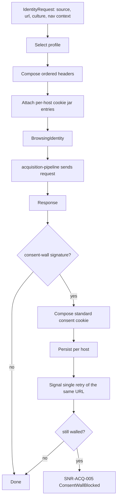

# Browsing Identity

> Feature spec for code-forge implementation planning.
> Source: extracted from docs/sanare/tech-design.md §8
> Created: 2026-09-06

| Field | Value |
|-------|-------|
| Component | browsing-identity |
| Priority | P0 |
| SRS Refs | — (no SRS; traces to tech-design §3.6 AC-010, AC-011, AC-028) |
| Tech Design | §8.1 — row 7 "Browsing Identity"; §11.1 (identity posture); §11.4 (compliance); §17 DR-006 |
| Depends On | acquisition-pipeline |
| Blocks | browser-tier |

## Purpose

The brief asked the scraper to "blend in" with bare-minimum circumvention. This component is the concrete,
bounded answer: a single **honest, coherent, stable** browsing identity — the `AssistantBrowser` profile —
whose header set, language, and encoding negotiation are internally consistent, plus consent-wall handling
so a cookie banner does not masquerade as a layout break. Coherence, not disguise, is what defeats naive
bot heuristics. Everything beyond that line (proxy rotation, CAPTCHA solving, fingerprint randomisation,
impersonating a named third party's crawler) is deliberately absent from the API surface, and this spec is
where that absence is tested.

## Scope

**Included:**

- `IBrowsingIdentityProvider` and the built-in `AssistantBrowser` and `DesktopChrome` profiles.
- Coherent header composition: `User-Agent`, `Accept`, `Accept-Language`, `Accept-Encoding`,
  `Sec-Fetch-Site/Mode/Dest/User`, `Upgrade-Insecure-Requests`, `Sec-CH-UA*` where the profile declares
  Chromium lineage.
- Header **order** stability, since inconsistent ordering is itself a naive-heuristic signal.
- Culture-driven `Accept-Language` derived from the request's culture (e.g. `nl-NL,nl;q=0.9,en;q=0.8`).
- Referer synthesis for detail pages reached from a lister within the same run.
- Consent-wall detection (signatures) and the standard consent-cookie response, persisted per host.
- Per-host cookie jar with a bounded, inspectable, non-persisted-to-fixture lifetime.
- `ComplianceReport` per source: `RespectRobots` configuration state, robots status, request volume,
  identity profile.
- Compile-time/API-time refusal of the excluded techniques.

**Excluded:**

- Sending the request — `acquisition-pipeline`.
- Browser launch arguments and viewport realism — `browser-tier` consumes this component's profile but owns
  its own Playwright context configuration.
- Rate limiting and pacing — `acquisition-pipeline` (pacing is part of blending in, but it lives with the
  transport).
- Any form of authentication or paywall bypass — out of scope permanently.

## Core Responsibilities

1. **Compose** a coherent header set for a request given a profile, a culture, and a navigation context.
2. **Stay stable** — the same source gets the same identity across runs, so the site sees one consistent
   visitor rather than a shape-shifter.
3. **Detect and clear** consent walls with a single, standard, persisted consent cookie.
4. **Report** compliance posture per source.
5. **Refuse** the out-of-bounds techniques by not offering them.

## Interfaces

### Inputs

- **`IdentityRequest`** — source id, target URI, culture, navigation context (`TopLevel`, `SameOriginSubResource`,
  `DetailFromLister`), tier.
- **`IdentityOptions`** (from `hosting-configuration`) — profile name, optional per-source overrides for
  `Accept-Language`, consent-cookie policy.
- **Response signals** (from `acquisition-pipeline`) — bodies and headers for consent-wall detection.

### Outputs

- **`BrowsingIdentity`** — ordered header list, cookie contributions, and a profile id recorded in run
  provenance.
- **`ConsentDecision`** — detected / not detected, plus the cookie to set.
- **`ComplianceReport`** (to `IScraperAdministration`).

### Dependencies

- **`acquisition-pipeline`** — consumes identity; supplies responses for detection.
- **`scrape-api-contracts`** — diagnostics, error codes, culture handling.

## Data Flow



## Key Behaviors

### Interface

```csharp
public interface IBrowsingIdentityProvider
{
    BrowsingIdentity GetIdentity(IdentityRequest request);

    ConsentDecision EvaluateConsent(AcquiredContent content, string sourceId);

    ComplianceReport GetComplianceReport(string sourceId);
}

public sealed record BrowsingIdentity(
    string ProfileId,
    IReadOnlyList<KeyValuePair<string, string>> Headers,   // order-significant
    IReadOnlyList<Cookie> Cookies);
```

### The `AssistantBrowser` profile

| Header | Value |
|--------|-------|
| `User-Agent` | `Mozilla/5.0 (compatible; Sanare/1.0; +https://github.com/{org}/dotnet-sanare) AssistantBrowser/1.0` |
| `Accept` | `text/html,application/xhtml+xml,application/xml;q=0.9,application/json;q=0.9,*/*;q=0.8` |
| `Accept-Language` | derived from the request culture, e.g. `nl-NL,nl;q=0.9,en;q=0.8` |
| `Accept-Encoding` | `gzip, deflate, br` |
| `Sec-Fetch-Site` | `none` for a top-level entry, `same-origin` for a detail page reached from a lister |
| `Sec-Fetch-Mode` | `navigate` |
| `Sec-Fetch-Dest` | `document` |
| `Sec-Fetch-User` | `?1` for top-level navigations only |
| `Upgrade-Insecure-Requests` | `1` |

The User-Agent is **honest**: it names this library and links to it. It does not claim to be, and must not
be configurable to claim to be, any specific third party's crawler (DR-006). The `DesktopChrome` profile
exists for the browser tier, where Playwright's real Chromium UA is used because a mismatch between the UA
string and the actual engine's TLS/HTTP behaviour is itself incoherent — but even there the UA is not
randomised or rotated.

### Coherence rules (validated, not merely documented)

1. `Accept-Encoding` must list only encodings the transport can actually decode.
2. `Accept-Language` must contain the source culture's language as the highest-weighted entry.
3. `Sec-Fetch-User: ?1` may appear only with `Sec-Fetch-Mode: navigate` and `Sec-Fetch-Dest: document`.
4. `Sec-CH-UA*` headers may appear only for profiles declaring Chromium lineage, and must agree with the
   UA string's major version.
5. `Referer` is emitted only for a `DetailFromLister` context, only same-origin, and only with the URL the
   run actually visited — never fabricated.
6. Header order is fixed per profile and asserted, because a shuffled order is a cheap bot tell.

A profile failing any coherence rule fails fast at startup with `SNR-ID-001` rather than producing subtly
suspicious traffic in production.

### Stability

- Identity is a pure function of `(profile, culture, navigation context)`; there is no randomisation, no
  per-request rotation, and no per-run seed.
- The same `sourceId` therefore presents the same identity across runs, days, and processes, which is what
  makes the traffic look like one well-behaved visitor.
- The profile id is written into `RunProvenance` and into the compliance report so a site operator's
  question ("what was this?") has a precise answer.

### Consent walls

- Detection is signature-based: a small body containing known CMP markers (TCF `__tcfapi`, OneTrust
  `#onetrust-banner-sdk`, Cookiebot `#CybotCookiebotDialog`, or a configured per-source selector) together
  with an absence of the expected content root.
- Response: set the standard consent cookie the CMP itself would set on "accept necessary" where that is a
  documented, static value (e.g. OneTrust's `OptanonAlertBoxClosed`), persist it in the per-host jar, and
  retry the same URL **exactly once**.
- If the wall persists, fail with `SNR-ACQ-005 ConsentWallBlocked` and record a diagnostic that names the
  detected CMP — this is a heal trigger, because "the site added a cookie wall" is precisely one of the
  self-healing scenarios the project set out to handle.
- In the browser tier the equivalent action is a single scripted click on the CMP's accept control, after
  which the resulting cookies are lifted into the per-host jar so the HTTP tier can continue unaided.
- Cookies are **never** written into fixtures (redaction strips them) and are never logged.

### What is not offered

The following have no configuration, no interface, and no extension point, and an approval test asserts
their absence from the public API surface (AC-028):

- Proxy or IP rotation.
- CAPTCHA-solving integrations.
- TLS/JA3 or browser-fingerprint spoofing or randomisation.
- Impersonating a named third-party crawler's user agent or IP ranges.

Robots.txt policy is deliberately **not** in the list above: bypassing `Disallow` rules is the library's
ordinary default (§11.4/DR-016 in `tech-design.md`), configurable per source via `RespectRobots`, and is
unrelated to the honest-identity and no-evasion guarantees this list protects.

## Constraints

- **Honest identity, always** — the UA identifies this library.
- **No randomisation** — determinism is a feature here.
- **Consent retry is capped at one** — no loops against a CMP.
- **Cookies stay in memory and in the per-host jar**, never in fixtures, logs, or telemetry.
- Profiles are validated at startup; an incoherent profile prevents the host from starting.
- The blocked path terminates: identity never escalates to evasion when a site says no.

## Acceptance Criteria

| AC-ID | Priority | Criterion | Expected Result | Verification Method |
|-------|----------|-----------|-----------------|---------------------|
| AC-028 | P0 | Given the public API of all shipped packages | No type or member exposes proxy rotation, CAPTCHA solving, fingerprint spoofing, or third-party crawler impersonation | Unit — PublicApiGenerator approval test plus a name-pattern assertion over the API surface |
| AC-010 | P0 | Given a host that blocks the identity | The identity is not changed or rotated in response; the run reports `Blocked` | Integration — assert the same UA on every attempt |
| AC-011 | P0 | Given robots.txt disallows the path | Identity itself offers no CAPTCHA-solving, fingerprint-spoofing, or impersonation escape hatch (those remain absent); `RespectRobots` enforcement/bypass is handled by `acquisition-pipeline`, not by identity | Unit — no evasion member exists |
| AC-ID-001 | P0 | Given the `AssistantBrowser` profile and culture `nl-NL` | `Accept-Language` is `nl-NL,nl;q=0.9,en;q=0.8` | Unit — culture mapping |
| AC-ID-002 | P0 | Given culture `en-US` | `Accept-Language` leads with `en-US`; the profile is otherwise byte-identical | Unit — culture variance is confined to one header |
| AC-ID-003 | P0 | Given two identity requests with identical inputs | The header lists are equal **including order** | Unit — determinism and ordering |
| AC-ID-004 | P0 | Given 1 000 identity requests for the same source | Exactly one distinct User-Agent is observed | Unit — no rotation |
| AC-ID-005 | P0 | Given a profile declaring `Sec-Fetch-User: ?1` with `Sec-Fetch-Mode: cors` | Startup validation fails with `SNR-ID-001` naming the rule | Unit — coherence negative |
| AC-ID-006 | P0 | Given a profile whose `Accept-Encoding` includes `zstd` while the transport cannot decode it | Startup validation fails with `SNR-ID-001` | Unit — coherence negative |
| AC-ID-007 | P0 | Given a `DetailFromLister` navigation | `Referer` is the actual lister URL and `Sec-Fetch-Site` is `same-origin` | Unit — navigation context |
| AC-ID-008 | P0 | Given a `TopLevel` navigation | No `Referer` is sent and `Sec-Fetch-Site` is `none` | Unit — negative for referer synthesis |
| AC-ID-009 | P0 | Given a cross-origin detail URL with a lister context | No `Referer` is emitted | Unit — same-origin restriction |
| AC-ID-010 | P0 | Given a OneTrust consent wall fixture | It is detected, the consent cookie is composed, and exactly one retry is signalled | Unit — consent detection with `consent-wall.html` |
| AC-ID-011 | P0 | Given a consent wall that persists after the retry | Fails with `SNR-ACQ-005`, the diagnostic names the CMP, and no second retry occurs | Integration — negative, assert exactly two requests |
| AC-ID-012 | P0 | Given a normal product page containing the string `cookie` in body copy | It is **not** classified as a consent wall | Unit — false-positive guard using the real Lenovo product fixture |
| AC-ID-013 | P0 | Given a consent cookie set for host A | It is not sent to host B | Unit — jar scoping |
| AC-ID-014 | P0 | Given a captured fixture from a run that had consent cookies | No cookie value appears in the fixture bytes | Integration — with the fixture corpus |
| AC-ID-015 | P1 | Given a source with `RespectRobots = true` configured explicitly | The compliance report shows `RespectRobots = true` and the source id | Unit — compliance report content |
| AC-ID-016 | P1 | Given a source with no explicit `RespectRobots` configuration | The compliance report shows `RespectRobots = false` (default bypass posture) | Unit — default posture |
| AC-ID-017 | P1 | Given the browser tier | The Playwright context's UA matches the `DesktopChrome` profile and its locale matches the source culture | Integration — browser tier coherence |

## Error Handling

| Code | Raised when | Severity | Effect |
|------|-------------|----------|--------|
| `SNR-ID-001` | A profile fails a coherence rule at startup | Fatal | Host fails to start; the message names the rule and the offending header |
| `SNR-ID-002` | A per-source identity override references an unknown profile | Fatal | Host fails to start |
| `SNR-ACQ-005` | Consent wall persists after one consent attempt | Error | Status `ConsentWallBlocked`; heal trigger recorded |

## File Structure

```
src/
└── Sanare.Http/
    └── Identity/
        ├── IBrowsingIdentityProvider.cs
        ├── BrowsingIdentityProvider.cs
        ├── BrowsingIdentity.cs
        ├── IdentityRequest.cs
        ├── NavigationContext.cs
        ├── IdentityOptions.cs
        ├── Profiles/
        │   ├── IdentityProfile.cs
        │   ├── AssistantBrowserProfile.cs
        │   ├── DesktopChromeProfile.cs
        │   └── ProfileCoherenceValidator.cs
        ├── Consent/
        │   ├── IConsentPolicy.cs
        │   ├── ConsentPolicy.cs
        │   ├── ConsentSignatures.cs
        │   ├── ConsentDecision.cs
        │   └── HostCookieJar.cs
        └── Compliance/
            ├── ComplianceReport.cs
            └── ComplianceReporter.cs
```

## Test Module

**Test file**: `tests/Sanare.Http.Tests/Identity/BrowsingIdentityProviderTests.cs`

**Test scope**:

- **Unit**: header composition per profile and culture; header-order assertions via a golden list;
  `ProfileCoherenceValidator` for each rule with a passing and a failing case; navigation-context referer
  and `Sec-Fetch-*` matrices; determinism over 1 000 iterations; `HostCookieJar` scoping and expiry;
  `ConsentSignatures` true-positive and false-positive sets.
- **Integration**: consent-wall clearing end to end against a WireMock host that serves the wall until the
  cookie arrives; persistence of the cookie across two runs in the same process; browser-tier locale/UA
  coherence with a real Playwright context.
- **Fixtures / Mocks**: `tests/Sanare.Http.Tests/Data/consent-wall-onetrust.html`,
  `consent-wall-cookiebot.html`, `lenovo-tablet-product.html` (false-positive guard),
  `bol-consent-wall.html`. A `PublicApiGenerator` approval file
  `tests/Sanare.Http.Tests/ApprovedApi/Sanare.Http.approved.txt` is the mechanism
  behind AC-028 — any accidental addition of a proxy or fingerprint knob breaks the build.

Companion test files: `tests/Sanare.Http.Tests/Identity/ConsentPolicyTests.cs`,
`tests/Sanare.Http.Tests/Identity/ProfileCoherenceValidatorTests.cs`,
`tests/Sanare.Http.Tests/Identity/ComplianceReportTests.cs`,
`tests/Sanare.Http.Tests/ApiSurfaceTests.cs`.
