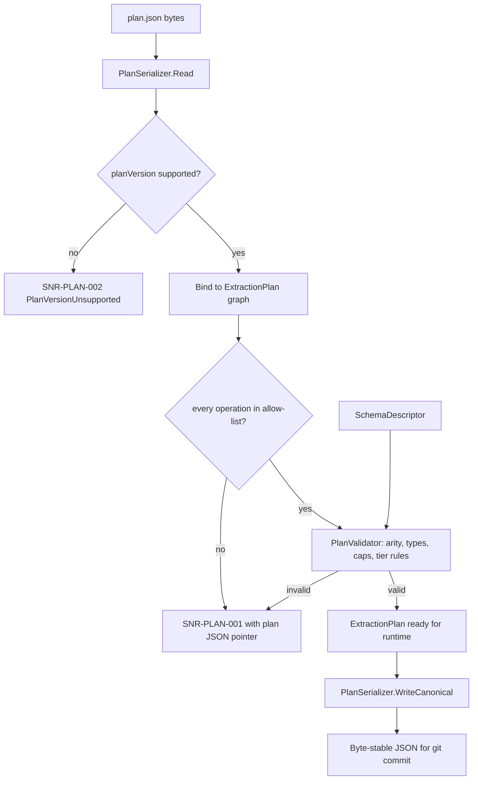

# Extraction Plan Model

> Feature spec for code-forge implementation planning.
> Source: extracted from docs/sanare/tech-design.md §8
> Created: 2026-09-06
> Implementation status: implemented — the version-2 typed plan model, version-1 read upgrade, canonical serializer, request-aware structural validator, and repository commit validation are implemented and covered by focused tests.

| Field | Value |
|-------|-------|
| Component | extraction-plan-model |
| Priority | P0 |
| SRS Refs | — (no SRS; traces to tech-design §3.6 AC-020, AC-022, AC-023) |
| Tech Design | §8.1 — row 3 "Extraction Plan Model"; §10.1.1 (plan document); §7.5 (plan lifecycle); §17 DR-001, DR-002 |
| Depends On | scrape-api-contracts |
| Blocks | script-repository, plan-runtime, pagination-engine, plan-resolver, authoring-workflow, healing-workflow |

## Purpose

The extraction plan is the artefact the LLM produces and the deterministic runtime consumes. This
component defines the plan document: its JSON shape, its typed C# object model, its closed operation
vocabulary, its serializer, and its structural validator. It is the security boundary of the whole
system — because a plan can only ever name operations from a fixed allow-list, an LLM cannot cause
arbitrary code to run, and no sandbox is needed (DR-001). Getting this model right is what makes
"LLM-authored scraping" safe enough to run unattended.

## Scope

**Included:**

- The `ExtractionPlan` object graph and every nested record (acquisition, consent, pagination, field,
  locator, transform, interaction, provenance).
- The closed `PlanOperation` vocabulary and its argument contracts.
- Plan vocabulary versioning (`planVersion`) and the `N-1` read-compatibility window (DR-002).
- Canonical JSON serialization/deserialization with `System.Text.Json` source generation.
- Structural validation: unknown operations, argument arity/type, pointer/schema agreement, cap bounds,
  tier/operation compatibility.
- Deterministic canonical formatting so that a semantically unchanged plan produces a byte-identical file
  (essential for meaningful git diffs).
- The plan's own content hash and its contribution to cache keys.

**Excluded:**

- Executing a plan — `plan-runtime`.
- Storing or versioning a plan — `script-repository`.
- Producing a plan — `authoring-workflow` / `healing-workflow`.
- Choosing which plan to use — `plan-resolver`.

## Core Responsibilities

1. **Define** an immutable, fully-typed representation of an extraction plan.
2. **Constrain** every operation an LLM may name to a fixed allow-list, rejecting anything else at parse
   time before execution is even attempted.
3. **Round-trip** plans between JSON on disk and the object model without semantic loss.
4. **Canonicalise** plan output so diffs in git reflect real changes only.
5. **Validate** a plan structurally and report every defect with a JSON pointer into the plan document.
6. **Version** the vocabulary and refuse plans it cannot faithfully interpret.

## Interfaces

### Inputs

- **Plan JSON text** (from `script-repository`, `agent-toolset` dry-run, LLM tool output).
- **`SchemaDescriptor`** (from `schema-engine`) — used to check that every plan field pointer exists in the
  schema and that every required schema pointer is covered.

### Outputs

- **`ExtractionPlan`** (to `plan-runtime`, `pagination-engine`, `plan-resolver`).
- **`PlanValidationResult`** (to `authoring-workflow`, `healing-workflow`, `script-repository`).
- **Canonical plan JSON** (to `script-repository` for commit).
- **`PlanContentHash`** (to the result cache key alongside the plan commit id).

### Dependencies

- **`scrape-api-contracts`** — `AcquisitionTier`, `ScrapeDiagnostic`, error codes.
- **`System.Text.Json`** — source-generated contexts, `JsonNode` for tolerant reading.

## Data Flow



## Key Behaviors

### Object model

```csharp
public sealed record ExtractionPlan
{
    public required int PlanVersion { get; init; }
    public required string SourceId { get; init; }
    public required string SchemaName { get; init; }
    public required int SchemaVersion { get; init; }
    public required string SchemaHash { get; init; }
    public required string Culture { get; init; }
    public required AcquisitionTier Tier { get; init; }
    public required AcquisitionSpec Acquisition { get; init; }
    public NotFoundSpec? NotFound { get; init; }
    public ConsentSpec? Consent { get; init; }
    public PaginationSpec Pagination { get; init; } = PaginationSpec.None;
    public string? Root { get; init; }
    public required IReadOnlyList<FieldPlan> Fields { get; init; }
    public required PlanProvenance Provenance { get; init; }
}

public sealed record AcquisitionSpec(
    AcquisitionMethod Method, string UrlTemplate,
    IReadOnlyDictionary<string, string> Headers,
    string? WaitFor, IReadOnlyList<InteractionStep> Interactions);

public sealed record FieldPlan(
    string Pointer, bool Required, string Type,
    LocatorStep PrimaryLocator,
    LocatorStep FallbackLocator,
    IReadOnlyList<TransformStep> Transforms);

public sealed record LocatorStep(PlanOperation Operation, IReadOnlyList<string> Arguments);
public sealed record TransformStep(PlanOperation Operation, IReadOnlyList<string> Arguments);

public sealed record PlanProvenance(
    string AuthoredBy, string Model, int Attempts,
    IReadOnlyList<string> FixtureIds, double Score, DateTimeOffset AuthoredAt);
```

Every collection property is exposed as `IReadOnlyList`/`IReadOnlyDictionary` and populated from an
immutable array; a plan object graph is never mutated after construction.

### The closed operation vocabulary

```csharp
public enum PlanOperation
{
    // Locators
    SelectFirst, SelectAll, XPath, JsonPath, RegexCapture, Attribute, Text, Html,
    // Text transforms
    Trim, CollapseWhitespace, StripCurrency, StripUnit,
    // Parsers
    ParseInt, ParseDecimal, ParseBool, ParseDate,
    // Semantic transforms
    ResolveUrl, MapEnum, ConvertUnit,
    // Structural
    KeyValueTable, DefinitionList, Concat, Split, Index, Coalesce, Exists, NotFoundPredicate,
    // Browser-tier interactions
    Click, WaitForSelector, WaitForNetworkIdle, Scroll, SelectOption, Type,
}
```

Rules:

1. The enum is the **complete** vocabulary. Deserialization of an unrecognised operation name is a hard
   failure (`SNR-PLAN-001`) — never a skipped step, never a no-op, never a fallback.
2. Each operation has a declared descriptor: minimum/maximum argument count, argument kinds
   (`selector`, `literal`, `pattern`, `unit`, `culture`, `pointer`, `int`), whether it is a locator or a
   transform, and which tiers may use it.
3. The six interaction operations are **browser-tier only**; naming one in a `JsonApi`, `StructuredData`,
   or `Html` plan is `SNR-PLAN-001`.
4. `JsonPath` requires the acquisition method to yield JSON; `XPath`/`SelectFirst`/`SelectAll` require
   markup. Mismatch is `SNR-PLAN-001`.
5. `RegexCapture` patterns are compiled with `RegexOptions.NonBacktracking` and a 1-second timeout at
   validation time; a pattern that cannot compile under those options is rejected at plan-validation time,
   not at run time.
6. Adding an operation is a `planVersion` bump plus a design-doc change; it is deliberately a friction
   point.

### Versioning

`PlanVersion` is an integer. The current vocabulary is **version 2**: `CurrentPlanVersion = 2` and
`MinimumReadablePlanVersion = 1` (DR-002). Version 1 used `locators[]`; version 2 uses the named
`PrimaryLocator` and `FallbackLocator` pair. A plan below the minimum fails with `SNR-PLAN-002` and a
message naming both versions; a plan above the current version fails with the same code. Reading a version-1
plan applies the registered upgrade that produces an in-memory version-2 plan without rewriting the file on
disk; rewriting only happens when a heal or re-author commits.

### Canonical serialization

`WriteCanonical` guarantees:

- 2-space indentation, `\n` line endings, no trailing whitespace, trailing newline at EOF.
- Object keys emitted in a fixed declaration order (not alphabetical) so diffs stay readable.
- `Fields` ordered by JSON pointer, ordinal.
- Numbers written in round-trip (`"R"`) invariant form; `Score` fixed at 4 decimal places.
- Timestamps as ISO-8601 with `Z`.
- Unicode escaped only where JSON requires it, so selectors stay legible in a diff.
- Each field emits `primaryLocator` before `fallbackLocator`; these are the only serialized locator
  candidates, so arbitrary `locators[]` chains cannot enter an approved plan.

`PrimaryLocator` and `FallbackLocator` replace the prior `locators[]` representation in the current plan
version. The registered in-memory upgrade maps a legacy two-entry chain in priority order (index 0 →
`PrimaryLocator`, index 1 → `FallbackLocator`). A legacy chain with any other cardinality — most notably a
single-locator chain, which was the norm for `locators[]` plans authored before the fallback-selector
requirement existed — cannot be upgraded in memory, because there is no second candidate to promote and one
must not be fabricated. Such a plan is treated exactly like a plan below `MinimumReadablePlanVersion`: it is
marked `PlanVersionUnsupported` and re-authored automatically on next run, rather than silently truncated,
padded, or hard-rejected without a remediation path.

Round-trip property: `Read(WriteCanonical(p)) == p` and `WriteCanonical(Read(json)) == WriteCanonical(Read(WriteCanonical(Read(json))))`.

### Validation

```csharp
public interface IPlanValidator
{
    PlanValidationResult Validate(ExtractionPlan plan, SchemaDescriptor? schema = null);
}

public sealed record PlanValidationResult(
    bool IsValid, IReadOnlyList<PlanDefect> Defects);

public sealed record PlanDefect(string PlanPointer, string Code, string Message);
```

Checks, all reported together:

1. Operation names known; arity and argument kinds correct.
2. Every `FieldPlan.Pointer` is a valid JSON pointer and, when a schema is supplied, exists in it.
3. Every required schema pointer is covered by some `FieldPlan` — an uncovered required field is a defect,
   because it guarantees a run-time `SNR-SCH-004`.
4. `Pointer` values are unique.
5. Every field has exactly two non-null locator candidates: `PrimaryLocator` and `FallbackLocator`.
   The candidates must each be valid for the plan's acquisition tier and must not be structurally identical.
   They may use different strategies against the same content or target an equivalent alternate location, but
   the fallback is not permitted to select a different semantic field.
6. The implemented model's pagination cap, `MaxPages`, is present and within 1–10 000; `LoadMoreButton`
   and `InfiniteScroll` require `Tier == Browser`. `MaxItems` is a target-state cap and cannot yet be
   validated because `PaginationSpec` has no corresponding property.
7. `Consent.Strategy` is one of the known strategies and carries its required arguments.
8. `Acquisition.UrlTemplate` is an absolute `http`/`https` template. Placeholder-to-request-parameter
   binding is deferred to a layer that receives both the plan and `ScrapeRequest.Parameters`.
9. `Headers` contains no `Cookie`, `Authorization`, or `Set-Cookie` key (credentials never live in a plan
   and therefore never reach git).
10. `SchemaHash` non-empty and, when a schema is supplied, equal to the schema's hash.

## Constraints

- **Closed vocabulary is non-negotiable** — no `custom`, no `eval`, no `script`, no escape hatch inside the
  plan model. The Roslyn escape hatch lives outside this model, per-source and off by default.
- **No behaviour in the model** — records are inert data; execution semantics live entirely in
  `plan-runtime`. This keeps the plan testable without a document.
- **Byte-stable output** — canonical writing is asserted, because git history quality depends on it.
- **No secrets** — enforced by validation rule 9 and asserted by test.
- **Depends only on `scrape-api-contracts`** and the BCL; the plan model must be usable from any package.

## Acceptance Criteria

| AC-ID | Priority | Criterion | Expected Result | Verification Method |
|-------|----------|-----------|-----------------|---------------------|
| AC-020 | P0 | Given plan JSON naming an operation not in the enum (e.g. `"execScript"`) | Deserialization fails with `SNR-PLAN-001`, message names the operation and its plan pointer; **no** execution is attempted | Unit — negative deserialization test |
| AC-020b | P0 | Given plan JSON whose operation name differs only by case (`"selectfirst"`) | Accepted (case-insensitive) and bound to `SelectFirst` | Unit — casing tolerance |
| AC-022 | P1 | Given two plans differing only in one selector | Their `PlanContentHash` values differ | Unit — hash sensitivity |
| AC-023 | P0 | Given a plan with a `consent` block naming an unknown strategy | Validation fails with `SNR-PLAN-001` at pointer `/consent/strategy` | Unit — negative |
| AC-PLAN-001 | P0 | Given a valid plan document read then canonically written | Output is byte-identical to a stored golden file | Unit — Verify snapshot |
| AC-PLAN-002 | P0 | Given canonical output re-read and re-written | Second output equals the first byte-for-byte | Unit — idempotence property test |
| AC-PLAN-003 | P0 | Given a plan whose `planVersion` is `CurrentPlanVersion + 1` | Fails with `SNR-PLAN-002` naming both versions | Unit — forward-incompatibility |
| AC-PLAN-004 | P0 | Given a plan whose `planVersion` is `CurrentPlanVersion - 1` and every field's legacy `locators[]` has exactly two entries | Reads successfully via the registered upgrade; the on-disk file is unchanged | Unit — `N-1` window |
| AC-PLAN-004a | P0 | Given a plan whose `planVersion` is `CurrentPlanVersion - 1` but at least one field's legacy `locators[]` does not have exactly two entries (e.g. a single-locator field) | Fails as `PlanVersionUnsupported`, the same remediation as a plan below the `N-1` window, rather than fabricating a fallback or truncating extra candidates | Unit — legacy arity mismatch |
| AC-PLAN-005 | P0 | Given a plan whose `planVersion` is `CurrentPlanVersion - 2` | Fails with `SNR-PLAN-002` | Unit — the exact lower boundary |
| AC-PLAN-006 | P0 | Given an `Html`-tier plan containing a `Click` interaction | Validation fails with `SNR-PLAN-001` naming the tier/operation conflict | Unit — tier gating |
| AC-PLAN-007 | P0 | Given a `Browser`-tier plan containing a `Click` interaction | Validation succeeds | Unit — positive counterpart |
| AC-PLAN-008 | P0 | Given a plan with a `SelectFirst` step carrying 0 arguments | Validation fails with an arity defect at the step's plan pointer | Unit — arity boundary |
| AC-PLAN-009 | P0 | Given a schema with a required pointer no field plan covers | Validation fails naming the uncovered pointer | Unit — coverage rule |
| AC-PLAN-010 | P0 | Given two field plans with the same `Pointer` | Validation fails naming the duplicate | Unit — uniqueness |
| AC-PLAN-011 | P0 | Given `Acquisition.Headers` containing a `Cookie` key | Validation fails with `SNR-PLAN-001`; the plan is never written to disk | Unit — secrets barrier |
| AC-PLAN-012 | P0 | Given `Pagination.MaxPages = 10 001` | Validation fails; `10 000` succeeds | Unit — both cap boundaries |
| AC-PLAN-013 | P0 | Given a `RegexCapture` pattern that cannot compile as non-backtracking | Validation fails at authoring time with the pattern's plan pointer | Unit — catastrophic-backtracking barrier |
| AC-PLAN-014 | P0 | Given a plan with 4 distinct defects | `PlanValidationResult.Defects` contains 4 entries | Unit — all-defects-reported |
| AC-PLAN-015 | P0 | Given a `JsonApi`-tier plan using `XPath` | Validation fails with an operation/format mismatch defect | Unit — negative |
| AC-PLAN-016 | P1 | Given a plan whose `UrlTemplate` has a placeholder no parameter binds | Validation fails naming the placeholder | Unit — template binding |
| AC-PLAN-017 | P1 | Given a candidate plan whose embedded `SchemaHash` disagrees with its embedded canonical schema | Validation fails with `SNR-PLAN-001` | Unit — internally inconsistent plan |

## Error Handling

| Code | Raised when | Severity | Effect |
|------|-------------|----------|--------|
| `SNR-PLAN-001` | Any structural defect: unknown operation, bad arity/kind, tier conflict, pointer problem, cap out of range, forbidden header, or an internally inconsistent embedded schema/hash pair | Error | `PlanInvalid`; authoring/healing treats it as an attempt failure and re-prompts with the defect list |
| `SNR-PLAN-002` | `planVersion` outside `[Current-1, Current]`, or a plan operation unavailable in the executing runtime | Error | `PlanInvalid`; never silently downgraded |
| `SNR-PLAN-003` | An otherwise valid approved plan's schema hash differs from the request's derived schema hash | Info | Resolver miss; the approved plan is not executed and authoring may create a matching version |

Defect messages are designed to be fed straight back to the authoring agent, so they name the plan pointer,
what was found, and what was expected — the same text serves the human reading a failed CI run.

## File Structure

```
src/
└── Sanare.Abstractions/
    └── Plans/
        ├── ExtractionPlan.cs
        ├── AcquisitionSpec.cs
        ├── AcquisitionMethod.cs
        ├── NotFoundSpec.cs
        ├── ConsentSpec.cs
        ├── PaginationSpec.cs
        ├── PaginationStrategy.cs
        ├── FieldPlan.cs
        ├── LocatorStep.cs
        ├── TransformStep.cs
        ├── InteractionStep.cs
        ├── PlanOperation.cs
        ├── PlanOperationDescriptor.cs
        ├── PlanOperationCatalog.cs
        └── PlanProvenance.cs
src/
└── Sanare.Core/
    └── Plans/
        ├── IPlanSerializer.cs
        ├── PlanSerializer.cs
        ├── PlanSerializationException.cs
        ├── IPlanValidator.cs
        ├── PlanValidator.cs
        ├── PlanValidationResult.cs
        └── PlanDefect.cs
```

`PlanJsonContext.cs`, `PlanCanonicalWriter.cs`, `PlanContentHasher.cs`, and the `Versioning/` upgrade
support are target-state structure; they are not separate production files in the current slice.

## Test Module

**Test file**: `tests/Sanare.Core.Tests/Plans/PlanValidatorTests.cs`

**Implemented test scope**:

- **`PlanValidatorTests.cs`**: positive and negative coverage for the implemented structural checks,
  including operation metadata, JSON pointers and schema coverage, locators, pagination/tier compatibility,
  consent, URLs, forbidden headers, and schema hashes.
- **`PlanSerializerTests.cs`**: canonical serialization, round trips, and malformed-document handling.
- No mocks or plan-fixture directory are needed for this model-only slice.

**Deferred target-state test scope**: fixture-corpus validation, canonical-writer and version-upgrade suites,
request-aware placeholder binding, `MaxItems`, and a non-backtracking-regex policy once their supporting
models and runtime inputs exist.

## Implementation Plan

> Planned: 2026-09-12. Milestone M1 (`extraction-plan-model` remainder, before M3's `script-repository`
> wiring and M2's `pagination-engine` depend on it). This section is the build order for the deferred
> slice; it does not restate the behaviour above, only how to land it.

### Delivery decisions

| Decision | Choice | Rationale |
|---|---|---|
| Version constants | Add `ExtractionPlan.CurrentPlanVersion = 2` and `ExtractionPlan.MinimumReadablePlanVersion = 1` as `public const int` on `ExtractionPlan` itself | The type's own XML doc already promises these names; keeping them on the model (not a separate `Versioning` type) means `PlanSerializer` and `PlanValidator` share one source of truth without a new cross-project dependency. |
| Upgrade mechanism | A single internal `PlanVersionUpgrader.TryUpgrade(JsonElement root, out ExtractionPlan? upgraded, out string? failureReason)` called from `PlanSerializer.Read` before binding, rather than a registered-function table | Only one upgrade edge exists (`1 → 2`); a registry is speculative generality for a single case. If a third version is ever added, this method is the seam to promote into a table. |
| Legacy field shape | Read version-1 `fields[].locators[]` (already the JSON shape `PlanSerializer` reads today) and require exactly two entries to synthesize `primaryLocator`/`fallbackLocator` | Matches tech-design §16's upgrade rule verbatim: index 0 → primary, index 1 → fallback, any other arity is unsupported rather than guessed. |
| Placeholder binding validator | New `IPlanValidator.Validate(ExtractionPlan, SchemaDescriptor?, IReadOnlyDictionary<string, string>? requestParameters = null)` overload/optional parameter, not a second interface | `PlanValidator` already receives a plan-only call site (`GitScriptRepository`, tests) that must keep compiling; an optional parameter defaulting to `null` preserves both the existing no-request validation and the richer AC-PLAN-016 check without splitting validators. |
| `MaxItems` | Add `PaginationSpec.MaxItems` (`int?`, default `null` = unbounded within `MaxPages`) validated to 1–1,000,000 when set | Optional and additive: existing plans/tests with no `maxItems` in JSON keep working; `PlanSerializer` treats a missing/null value as "not present" rather than defaulting it to a magic number. |
| Regex barrier | Compile every `RegexCapture` pattern with `RegexOptions.NonBacktracking` and a 1-second `matchTimeout` inside `PlanValidator`, catching `NotSupportedException` (construct unsupported by the non-backtracking engine) and `RegexParseException` (malformed pattern) as the same defect | `RegexOptions.NonBacktracking` is the runtime's actual catastrophic-backtracking guard (.NET 7+); compiling it once at validation time is the cheapest way to guarantee every pattern that reaches `plan-runtime` is provably linear-time, with no separate regex-safety library. |
| Pipeline wiring | `GitScriptRepository.CommitPlanAsync` calls `IPlanValidator.Validate` and throws `ScriptRepositoryException("SNR-PLAN-001", ...)` on any defect, before the existing size-limit check | Keeps the "plans can only ever reach git valid" invariant enforced at the one place all external plan writes funnel through; `GitScriptRepository` receives `IPlanValidator` by constructor injection. Schema-aware validation remains the responsibility of the caller that owns schema resolution. |
| New dependencies | None. `RegexOptions.NonBacktracking` and `Regex.TryMatch` timeouts are part of the BCL already referenced (`System.Text.RegularExpressions`) | No new package needed for either the version upgrade or the regex barrier. |

### Task order

Each task is independently buildable and testable; land them in order.

**T1 — Version constants and read-time gate.** Add `CurrentPlanVersion`/`MinimumReadablePlanVersion` consts
to `ExtractionPlan`. In `PlanSerializer.Read`, after parsing `planVersion` but before binding the rest of
the graph, reject any version `> CurrentPlanVersion` or `< MinimumReadablePlanVersion` with
`PlanSerializationException` carrying `SNR-PLAN-002` and both versions in the message (AC-PLAN-003,
AC-PLAN-005). A version equal to `CurrentPlanVersion` binds exactly as today. Depends on: none (pure
addition to the existing type/serializer).

**T2 — `PrimaryLocator`/`FallbackLocator` on `FieldPlan`.** Add `PrimaryLocator`/`FallbackLocator` (both
`LocatorStep`, non-nullable) alongside the existing `Locators` list on `FieldPlan`, matching the
`## Key Behaviors` object-model snippet above. `PlanSerializer.WriteCanonical` always writes the current
(`v2`) `primaryLocator`/`fallbackLocator` object shape; `ReadField` binds those two properties directly for
`planVersion == CurrentPlanVersion`. Update `PlanValidatorTests`' `SamplePlan()` and any other in-repo plan
fixture to the new shape. This is a breaking change to the two-property surface but is scoped to this slice
because nothing outside `Sanare.Core`/`Sanare.Core.Tests` constructs a `FieldPlan` literal yet (confirmed via
a repo-wide reference search before starting). Depends on: T1.

**T3 — `PlanVersionUpgrader` (the `N-1` path).** New internal `Sanare.Core.Plans.PlanVersionUpgrader` with
`TryUpgrade(JsonElement root, out ExtractionPlan? plan, out PlanDefect? failure)`. Reads a `planVersion ==
MinimumReadablePlanVersion` (`1`) document's legacy `fields[].locators[]` array; when every field has
exactly two entries, binds index 0 to `PrimaryLocator` and index 1 to `FallbackLocator` and returns the
upgraded in-memory `ExtractionPlan` at `CurrentPlanVersion` (AC-PLAN-004) — the on-disk bytes are untouched,
only the in-memory graph is upgraded. When any field's `locators[]` has an arity other than two, returns a
failure defect coded `SNR-PLAN-002` (AC-PLAN-004a) rather than truncating or fabricating a candidate. Wire
this into `PlanSerializer.Read` as the branch taken when `planVersion == MinimumReadablePlanVersion`.
Depends on: T2.

**T4 — `PaginationSpec.MaxItems`.** Add `int? MaxItems` (default `null`) to `PaginationSpec`. In
`PlanSerializer`, read/write `maxItems` as an optional JSON number (present in canonical output only when
non-null, matching the existing `null`-field convention used for `Root`/`NotFound`/`Consent`). In
`PlanValidator`, extend rule 6 to also check `MaxItems`, when set, is within 1–1,000,000 (AC-PLAN-012's
sibling boundary), while continuing to enforce the existing `MaxPages` 1–10,000 bound unconditionally. Update
the class-level `<remarks>` on `PlanValidator` to drop the `MaxItems` narrowing note. Depends on: T1 (shares
the serializer read/write pass but is otherwise independent of T2/T3).

**T5 — Non-backtracking regex barrier for `RegexCapture`.** In `PlanValidator`'s existing per-step operation
validation, when `step.Operation == PlanOperation.RegexCapture`, attempt
`new Regex(pattern, RegexOptions.NonBacktracking, TimeSpan.FromSeconds(1))` (pattern is the step's first
argument, matching its existing arity contract). Catch `NotSupportedException` (the construct the
non-backtracking engine rejects, e.g. backreferences or lookaround) and `RegexParseException` (malformed
pattern) and report both as a single structural defect at the step's plan pointer naming the pattern
(AC-PLAN-013). A pattern that compiles is discarded immediately — this call exists only to prove
constructibility, not to run it. Depends on: none (independent validator-only addition; can land in
parallel with T1–T4).

**T6 — Request-aware placeholder binding.** Add an optional `IReadOnlyDictionary<string, string>?
requestParameters = null` parameter to `IPlanValidator.Validate` (and `PlanValidator`'s implementation).
When non-null, extract every `{placeholder}` token from `Acquisition.UrlTemplate` and fail with a rule-8
defect at `/acquisition/urlTemplate` for any token absent from `requestParameters` (AC-PLAN-016); when
`null` (the default), behaviour is unchanged from today — only the absolute-URL check runs. Update the
class-level `<remarks>` on `PlanValidator` to drop the placeholder-binding narrowing note once this lands.
Depends on: none (independent of T1–T5; touches only the validator's URL-rule method and its public
signature).

**T7 — Wire `IPlanValidator` into `GitScriptRepository`.** Add `IPlanValidator validator` as a constructor
parameter on `GitScriptRepository` (alongside the existing `serializer`/`coordinator`). At the top of
`CommitPlanAsync`, before the existing `MaxPlanSizeBytes` check, call
`validator.Validate(request.Plan, schema: null)` (no schema is available at this call site yet — schema
cross-checks remain a caller-side concern until `plan-resolver` passes one through) and throw
`ScriptRepositoryException("SNR-PLAN-001", ...)` naming every defect when `!result.IsValid`, so a
structurally invalid plan can never reach a commit. Update `GitScriptRepositoryTests`' constructor calls
and add a negative test asserting a plan with a known defect (e.g. a forbidden header) is rejected before
any git write. Depends on: T1–T6 (exercises the full validator surface, including the new rules).

**T8 — Doc reconciliation.** Flip this component's status in `docs/features/overview.md` from `partial`
to `implemented` (or leave `partial` and narrow the note if any item above is descoped during review),
update this file's front-matter status line and the `## Validation` section's rule 6/8 prose to drop the
"cannot yet be validated"/"deferred" language, remove the two satisfied bullets from `PlanValidator`'s
class-level `<remarks>` (keep the regex-barrier note only if T5 is not landed), and check off the
corresponding `DEVELOPMENT.md` item ("Implement plan version upgrades ... and wire `IPlanValidator` into
the plan-authoring/repository pipeline"). Depends on: T1–T7.

### Deferred scope

These remain out of this slice and must stay noted in `overview.md`/this file's status line if anything
above lands as partial:

- **A registered multi-version upgrade table.** T1's single-edge `PlanVersionUpgrader` only handles
  `1 → 2`. If a third plan version is ever introduced, promote it to a table keyed by source version —
  not needed while only one upgrade edge exists.
- **Schema cross-checks at the `GitScriptRepository` commit boundary (T7).** `CommitPlanAsync` validates
  structurally but passes `schema: null`; wiring a real `SchemaDescriptor` lookup into that call site
  belongs to `plan-resolver`/`script-repository`, which already own schema resolution by name/version.
- **A configurable regex timeout or engine choice.** T5's 1-second `RegexOptions.NonBacktracking` timeout
  is a fixed constant; making it configurable per-source is speculative until a real pattern is observed
  timing out in practice.
- **Non-`http`/`https`-template placeholder sources (query strings, headers).** T6 only extracts
  placeholders from `Acquisition.UrlTemplate`; extending placeholder binding to `Acquisition.Headers`
  values is `acquisition-pipeline` scope once headers are shown to need templating.

### Verification matrix

| AC-ID | Covered by | Test kind |
|---|---|---|
| AC-PLAN-003 | T1 forward-incompatibility test (`planVersion == CurrentPlanVersion + 1`) | Unit |
| AC-PLAN-004 | T3 `N-1` upgrade test with well-formed legacy `locators[]` pairs | Unit |
| AC-PLAN-004a | T3 legacy-arity-mismatch test (a single-locator field) asserting `SNR-PLAN-002`, not fabrication/truncation | Unit |
| AC-PLAN-005 | T1 lower-boundary test (`planVersion == CurrentPlanVersion - 2`) | Unit |
| AC-PLAN-012 | T4 `MaxItems` boundary test (1–1,000,000) alongside the existing `MaxPages` boundary test | Unit |
| AC-PLAN-013 | T5 catastrophic-backtracking-pattern test (a construct `RegexOptions.NonBacktracking` rejects) plus a positive compiling-pattern test | Unit |
| AC-PLAN-016 | T6 placeholder-binding test with an unbound `{token}` and a positive fully-bound counterpart | Unit |
| (repository invariant) | T7 `GitScriptRepositoryTests` negative test: a plan with a known structural defect is rejected by `CommitPlanAsync` before any git write | Unit |

`PlanSerializerTests` gains round-trip coverage for the new `primaryLocator`/`fallbackLocator` canonical
shape (T2) and the optional `maxItems` field (T4), keeping the existing byte-stability/idempotence
assertions (AC-PLAN-001, AC-PLAN-002) intact for the new shape.
