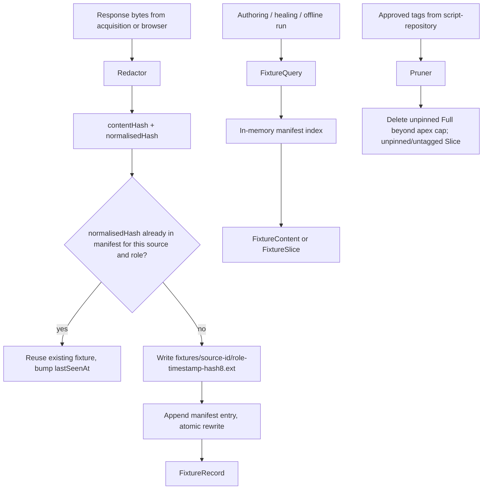

# Fixture Corpus

> Feature spec for code-forge implementation planning.
> Source: extracted from docs/sanare/tech-design.md §8
> Created: 2026-09-06
> Implementation status: implemented — the on-disk corpus, redaction, normalized deduplication, atomic capture, DR-011 retention, bounded slicing, and offline replay are covered by focused tests.

| Field | Value |
|-------|-------|
| Component | fixture-corpus |
| Priority | P0 |
| SRS Refs | — (no SRS; traces to tech-design §3.6 AC-012, AC-013, AC-025) |
| Tech Design | §8.1 — row 5 "Fixture Corpus"; §10.1.2 (manifest); §6.4 (layout); §17 DR-005, DR-007, DR-011 |
| Depends On | scrape-api-contracts |
| Blocks | acquisition-pipeline, authoring-workflow, agent-toolset, healing-workflow |

## Purpose

Fixtures are captured real responses stored on disk — `tablet-data.html`, `product-lister.html`, a JSON
API payload — and they are the system's entire test corpus (DR-007). Authoring works against them, CI
replays them, and every heal must still satisfy every retained historical fixture before it may be
promoted (DR-005). This component captures, redacts, hashes, indexes, serves, and prunes them, and
provides the offline replay mode that lets the whole pipeline run with no network at all.

## Scope

**Included:**

- Capturing a response (bytes + content type + URL + tier + timestamp) into the corpus.
- Redaction of credentials and PII patterns before anything touches disk.
- Content hashing (`contentHash`) and normalised hashing (`normalisedHash`) for dedupe and change
  detection.
- The `manifest.json` index: read, append, atomic rewrite, in-memory lookup.
- Serving fixtures by id, by source, or by "latest for this source and page role".
- Retention and pruning: a **pyramid** (DR-011) — a bounded count of "full" reference captures per source
  plus an open-ended set of small, redacted, bug-pinned slice fixtures, plus every capture referenced by an
  approved tag.
- Offline replay mode, in which acquisition resolves from the corpus and network access is refused.
- Fixture slicing for prompts (returning a bounded excerpt around a candidate node rather than a 480 KB
  document).
- Tagging fixtures with a page role (`lister-page1`, `product-detail`, `consent-wall`, `empty-result`,
  `discovery-llms` for a captured `llms.txt` discovery document). `PageRole` is an open string, not a
  closed enum, so `acquisition-pipeline` can introduce new roles without a change here.

**Excluded:**

- Making the HTTP request that produces a response — `acquisition-pipeline`.
- Deciding when a heal needs a fresh capture — `healing-workflow` / `quality-evaluator`.
- The result cache (`cache/results/`) — a different store with different semantics; fixtures are for
  correctness, the cache is for cost.
- Git storage — fixtures deliberately live outside the git repository because they are large and binary-ish.

## Core Responsibilities

1. **Capture** responses faithfully, after redaction, with enough metadata to replay them exactly.
2. **Index** the corpus in a manifest that is the single source of truth for what exists.
3. **Serve** fixtures to authoring, healing, the agent toolset, and offline runs.
4. **Detect** unchanged captures via hashing so the corpus does not fill with duplicates.
5. **Retain** what matters — anything an approved plan was validated against is never pruned.
6. **Redact** so no secret or personal datum is ever written into the corpus.

## Interfaces

### Inputs

- **`CaptureRequest`** (from `acquisition-pipeline`, `browser-tier`) — URL, source id, tier, content type,
  body stream, response headers, page role, notes, optional `RetentionTier`/`PinnedIssue` (DR-011).
- **`FixtureQuery`** (from `authoring-workflow`, `healing-workflow`, `agent-toolset`, offline runs).
- **Approved-tag list** (from `script-repository`) — drives retention.
- **`FixtureOptions`** (from `hosting-configuration`) — state root, `FullRetentionCount` (pyramid apex,
  default 3), redaction rules, offline mode flag.

### Outputs

- **`FixtureRecord`** (metadata) and **`FixtureContent`** (bytes + content type).
- **`FixtureSlice`** — a bounded excerpt for prompt construction.
- **Prune report** (to `IFixtureAdministration`).

### Dependencies

- **`scrape-api-contracts`** — diagnostics and error codes.
- **`System.Security.Cryptography`** — SHA-256.
- **`System.Text.Json`** — manifest serialization.

## Data Flow



## Key Behaviors

### Interface

```csharp
public interface IFixtureCorpus
{
    ValueTask<FixtureRecord> CaptureAsync(CaptureRequest request, CancellationToken ct = default);

    ValueTask<FixtureContent?> GetContentAsync(string fixtureId, CancellationToken ct = default);

    ValueTask<IReadOnlyList<FixtureRecord>> QueryAsync(FixtureQuery query, CancellationToken ct = default);

    ValueTask<FixtureSlice> SliceAsync(
        string fixtureId, FixtureSliceRequest request, CancellationToken ct = default);

    ValueTask<PruneReport> PruneAsync(
        IReadOnlyCollection<string> protectedFixtureIds, CancellationToken ct = default);
}

public sealed record FixtureRecord(
    string Id, string SourceId, string Url, DateTimeOffset CapturedAt,
    AcquisitionTier Tier, string ContentType, string File, long Bytes,
    string ContentHash, string NormalisedHash,
    IReadOnlyList<string> Redactions, IReadOnlyList<string> ReferencedByTags,
    string? PageRole, string? Notes,
    RetentionTier RetentionTier, string? PinnedIssue);

public enum RetentionTier
{
    Full,       // unredacted-shape reference capture; bounded count per source (DR-011)
    Slice,      // small, redacted, targeted excerpt pinned to a bug/regression/layout variant
}
```

`RetentionTier` and `PinnedIssue` are new in this revision (DR-011): every fixture is now explicitly tagged
as part of the small, bounded `Full` pyramid apex or the open-ended `Slice` base, and a `Slice` fixture may
carry a free-text `PinnedIssue` (e.g. an issue id or short description of the bug/regression it exists to
reproduce) so the corpus stays self-documenting instead of accumulating anonymous captures.

### Identity and paths

- Fixture id: `{sourceId}/{pageRole}-{yyyyMMdd'T'HHmmss'Z'}-{contentHash[0..8]}`.
- File path: `fixtures/{sourceId}/{pageRole}-{timestamp}-{hash8}.{html|json|har|txt}` — the extension is
  derived from the content type, so a human browsing the folder sees exactly the
  `tablet-data.html` / `product-lister.html` layout the project set out to produce.
- Manifest: `fixtures/manifest.json`, schema per §10.1.2, `version: 1`.

### Hashing

- `contentHash` = SHA-256 over the redacted bytes exactly as stored.
- `normalisedHash` = SHA-256 over a normalised projection: for HTML, strip comments, `<script>` bodies
  whose type is not `application/ld+json`, `nonce`/`csrf`/`data-timestamp` attribute values, and collapse
  whitespace between tags; for JSON, re-serialise with sorted keys and drop keys matching a configured
  volatile-key list (`requestId`, `timestamp`, `sessionId`, `nonce`).
- Capture dedupe compares `normalisedHash` within `(sourceId, pageRole)`. A match reuses the existing
  fixture and updates its `lastSeenAt` instead of writing a near-identical 480 KB file — this is what
  keeps the corpus useful rather than noisy.

### Redaction

Applied to the byte stream before hashing or writing, in this order:

1. Drop `Set-Cookie`, `Authorization`, `Proxy-Authorization` headers from any stored header block.
2. Replace values of form fields and JSON keys matching `password|token|apikey|api_key|secret|sessionid`
   with `[REDACTED]`.
3. Replace email addresses with `redacted@example.invalid`.
4. Replace strings matching configured PII patterns (IBAN, Dutch postcode + house number pairs, phone
   numbers) with `[REDACTED]`.
5. Record which rule classes fired in `Redactions[]`.

Redaction is byte-length-preserving where practical but correctness beats layout: if a replacement changes
length, the fixture is still valid because it is re-parsed, not byte-diffed.

### Retention and pruning

Retention is a **pyramid** (DR-011), not a flat count: a small, bounded apex of full reference captures per
source, plus an open-ended, self-limiting base of small redacted slices, each earning its place by being
pinned to something specific. Keep, per `sourceId`:

- Every fixture whose `ReferencedByTags` intersects the current approved-tag set (never prunable — this is
  the mechanical guarantee behind DR-005/AC-013), **plus**
- the newest `FullRetentionCount` (default 3) `RetentionTier.Full` captures — the pyramid apex; a "full"
  capture exercises the complete page shape and is what authoring/healing prompts default to when no
  narrower slice is a better fit, **plus**
- every `RetentionTier.Slice` fixture with a non-null `PinnedIssue` (never auto-pruned — the pyramid base;
  these are deliberately small and redacted, which is exactly what makes an unbounded count acceptable and
  what makes them the tier a consumer would choose to commit to their own repo for CI), **plus**
- every fixture explicitly pinned via `PageRole` in a configured protected-role list (default:
  `consent-wall`, `empty-result`, `not-found` — the rare negatives that are hard to re-capture).

A `RetentionTier.Full` capture beyond the `FullRetentionCount` cap that is not tag-protected is prunable —
oldest first. A `RetentionTier.Slice` fixture is only prunable if it has neither a `PinnedIssue` nor a
protected tag/role; an unpinned slice is treated as scratch output from a run and is not something the
pyramid model intends to keep indefinitely. `CaptureAsync` defaults new captures to `RetentionTier.Full`;
callers (typically the healing workflow, pinning a specific reproduction) opt a capture into
`RetentionTier.Slice` with a `PinnedIssue` when they want the small/redacted, bug-pinned shape instead.

Pruning deletes the file, removes the manifest entry, and reports what it removed, tagged with the
`RetentionTier` of each removed fixture. Pruning never runs implicitly during a scrape; it runs on the
maintenance hosted service and on explicit admin request.

### Offline mode

When `Offline = true`:

- `acquisition-pipeline` resolves every request through `IFixtureCorpus` by `(sourceId, url, pageRole)`.
- A miss is `SNR-FIX-001 FixtureNotFound`, never a network call. The socket is never opened — this is
  asserted with a handler that throws on any outbound connection (AC-012).
- Captures are refused (`SNR-FIX-003`) because there is nothing to capture.

### Slicing

`SliceAsync` returns a bounded excerpt: given a selector or a byte offset, it returns the enclosing element
plus configurable context (default 4 000 characters, hard cap 32 000), with an indication of how much was
elided. This is what keeps authoring prompts affordable on a half-megabyte Lenovo page.

## Constraints

- **Manifest writes are atomic** — temp file plus `File.Move(overwrite: true)`; a crash mid-write must
  never leave an unparseable manifest.
- **Manifest is loaded once into memory**; asynchronous mutations are serialized and queries scan the small in-memory index.
- **No secrets on disk, ever** — redaction is not optional and cannot be disabled by configuration.
- **Operational captures are not in git** — their bodies live under the Sanare state root or in a CI
  artifact store. Small, redacted, size-capped fixtures may be committed as deterministic CI test data.
- **Corrupt fixture ⇒ loud failure** (`SNR-FIX-002`), never a silent skip, because a silently skipped
  fixture would weaken the heal regression gate.
- Maximum stored fixture size 8 MB; larger responses are truncated with a recorded flag and are ineligible
  as authoring inputs.

## Acceptance Criteria

| AC-ID | Priority | Criterion | Expected Result | Verification Method |
|-------|----------|-----------|-----------------|---------------------|
| AC-012 | P0 | Given offline mode and a fixture for the requested source | The run completes from disk and **no** socket is opened | Integration — `SocketsHttpHandler` replaced with one that throws on connect; assert it never fires |
| AC-012b | P0 | Given offline mode and **no** matching fixture | Fails with `SNR-FIX-001`; still no socket opened | Integration — negative |
| AC-013 | P0 | Given fixtures referenced by an approved tag | `PruneAsync` never deletes them, even when far beyond the `Full` apex cap | Unit — 25 `Full` fixtures, 12 tag-referenced, `FullRetentionCount` 3 ⇒ 12 referenced + 3 newest unreferenced `Full` survive |
| AC-025 | P0 | Given the sample app run with `--offline` | It produces the same typed output as the recorded online run | Integration — sample app snapshot comparison |
| AC-FIX-001 | P0 | Given a response captured twice with only a nonce attribute differing | The second capture is deduped: no new file, manifest count unchanged | Unit — `normalisedHash` equality |
| AC-FIX-002 | P0 | Given a response captured twice with a real price change | A new fixture is written; both are retained | Unit — `normalisedHash` inequality |
| AC-FIX-003 | P0 | Given a response containing `Set-Cookie` and an email address | Neither appears in the stored bytes; `Redactions` lists `cookie` and `email` | Unit — scan stored bytes for the literals |
| AC-FIX-004 | P0 | Given redaction is attempted to be disabled via configuration | No such option exists; the API surface has no toggle | Unit — PublicApiGenerator approval test asserts absence |
| AC-FIX-005 | P0 | Given a manifest write interrupted between temp-write and move | The original manifest remains valid and parseable | Integration — simulated crash via injected failure |
| AC-FIX-006 | P0 | Given a manifest file with invalid JSON at startup | Initialisation fails with `SNR-FIX-002` naming the file; the corpus does not silently start empty | Unit — corrupt manifest |
| AC-FIX-007 | P0 | Given a fixture file listed in the manifest but missing on disk | `GetContentAsync` fails with `SNR-FIX-002`, not `null` | Unit — orphaned entry |
| AC-FIX-008 | P0 | Given 25 unreferenced `RetentionTier.Full` fixtures for a source and `FullRetentionCount` 3 | Pruning leaves exactly the 3 newest by `CapturedAt`; the pyramid apex is bounded regardless of how many full captures a run produces | Unit — retention boundary |
| AC-FIX-009 | P0 | Given a fixture with `PageRole = "consent-wall"` and 30 newer fixtures | It survives pruning | Unit — protected-role retention |
| AC-FIX-010 | P0 | Given a 9 MB response | It is truncated to 8 MB, flagged, and rejected as an authoring input | Unit — size boundary; 8 MB exactly is accepted intact |
| AC-FIX-011 | P0 | Given a capture attempt while offline mode is on | Fails with `SNR-FIX-003` | Unit — negative |
| AC-FIX-012 | P0 | Given 200 concurrent captures across 4 sources | The manifest is internally consistent; entry count equals distinct captures; no torn JSON | Integration — concurrency stress |
| AC-FIX-013 | P1 | Given a slice request with 4 000 characters of context on a 480 KB page | The returned slice is ≤ 4 000 chars plus the element, and reports the elided byte count | Unit — slice bounds |
| AC-FIX-014 | P1 | Given a slice request asking for 40 000 characters | It is clamped to the 32 000 hard cap with a warning diagnostic | Unit — cap boundary |
| AC-FIX-015 | P1 | Given a JSON fixture whose only difference is a `requestId` value | It is deduped via the volatile-key list | Unit — JSON normalisation |
| AC-FIX-016 | P1 | Given a fixture id | The on-disk file name contains the page role and a readable timestamp | Unit — naming convention assertion |
| AC-FIX-017 | P0 | Given a `RetentionTier.Slice` fixture with a non-null `PinnedIssue` and 50 newer `Full` captures | It survives pruning indefinitely — the pyramid base is not subject to the apex cap (DR-011) | Unit — pinned-slice retention |
| AC-FIX-018 | P0 | Given a `RetentionTier.Slice` fixture with `PinnedIssue = null` and no protecting tag/role | It is prunable like any other unprotected fixture — an unpinned slice is scratch output, not a retained bug reproduction | Unit — unpinned-slice pruning |

## Error Handling

| Code | Raised when | Severity | Effect |
|------|-------------|----------|--------|
| `SNR-FIX-001` | Requested fixture does not exist (notably in offline mode) | Error | Status `FixtureNotFound`; no network fallback |
| `SNR-FIX-002` | Manifest unparseable, entry orphaned, or file corrupt | Error | Startup or read fails loudly; corpus never silently degrades |
| `SNR-FIX-003` | Capture requested while offline | Error | Capture refused |
| `SNR-FIX-004` | Requested slice context exceeds 32 000 characters | Warning | Context is clamped to the hard cap and the bounded slice is returned |

## File Structure

```
src/
└── Sanare.Core/
    └── Fixtures/
        ├── IFixtureCorpus.cs
        ├── FixtureCorpus.cs
        ├── FixtureRecord.cs
        ├── FixtureContent.cs
        ├── FixtureQuery.cs
        ├── CaptureRequest.cs
        ├── FixtureSlice.cs
        ├── FixtureSliceRequest.cs
        ├── PruneReport.cs
        ├── FixtureOptions.cs
        ├── FixtureManifest.cs
        ├── FixtureManifestStore.cs
        ├── FixturePathBuilder.cs
        ├── Hashing/
        │   ├── ContentHasher.cs
        │   ├── HtmlNormalizer.cs
        │   └── JsonNormalizer.cs
        ├── Redaction/
        │   ├── IRedactor.cs
        │   ├── Redactor.cs
        │   └── RedactionRules.cs
        └── Retention/
            └── FixturePruner.cs
```

## Test Module

**Test file**: `tests/Sanare.Core.Tests/Fixtures/FixtureCorpusTests.cs`

**Test scope**:

- **Unit**: capture/dedupe via both hashes; `HtmlNormalizer` and `JsonNormalizer` volatility handling;
  `Redactor` against a document containing cookies, emails, IBANs, and a password field; `FixturePruner`
  pyramid retention arithmetic (DR-011) including the `Full` apex cap, pinned vs. unpinned `Slice`
  fixtures, referenced-tag, and protected-role cases; `FixturePathBuilder` naming; slice bounds and
  clamping; size boundary at exactly 8 MB.
- **Integration**: manifest atomicity under simulated crash; 200-way concurrent capture stress; offline
  mode with a connect-throwing HTTP handler proving zero sockets; end-to-end replay of the Lenovo lister
  and product fixtures.
- **Fixtures / Mocks**: small, clearly labelled synthetic stand-ins for real captures under
  `tests/Sanare.Core.Tests/Fixtures/Data/lenovo-com/` — `tablet-lister-page1.html`,
  `tablet-lister-page2.html`, `tablet-product-yoga-tab-gen2.html`, `consent-wall.html`,
  `empty-result.html` — and `tests/Sanare.Core.Tests/Fixtures/Data/bol-com/product-lister.json`; plus
  `pii-sample.html` for redaction tests. No network fetch is required. A fake clock supplies deterministic
  timestamps so fixture ids are stable in assertions.

Companion test files: `tests/Sanare.Core.Tests/Fixtures/RedactorTests.cs`,
`tests/Sanare.Core.Tests/Fixtures/FixturePrunerTests.cs`,
`tests/Sanare.Core.Tests/Fixtures/NormalizerTests.cs`,
`tests/Sanare.Core.Tests/Fixtures/OfflineReplayTests.cs`.
