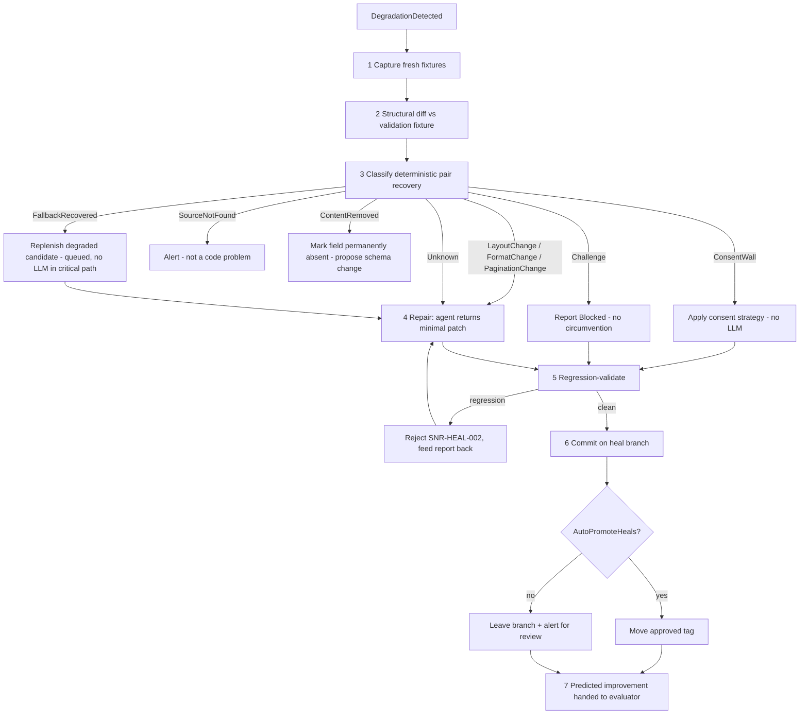

# Healing Workflow

> Feature spec for code-forge implementation planning.
> Source: extracted from docs/sanare/tech-design.md §8
> Created: 2026-09-06

| Field | Value |
|-------|-------|
| Component | healing-workflow |
| Priority | P0 |
| SRS Refs | — (no SRS; traces to tech-design §3.6 AC-013, AC-016, AC-017, AC-018, AC-025) |
| Tech Design | §8.1 — row 15 "Healing Workflow"; §8.3.3 (workflow steps); §17 DR-005, DR-008; §7.4 (attempt budget, one heal per source); §6.4 (branch naming) |
| Depends On | script-repository, fixture-corpus, plan-runtime, authoring-workflow, agent-toolset, quality-evaluator |
| Blocks | sample-app-lenovo |

## Purpose

This is the "self-healing" in the product name. When the evaluator says a plan has stopped working, this
workflow finds out *why*, fixes it if the fix is knowable, and — crucially — proves the fix does not break
anything that used to work before letting it near production.

Its defining discipline is regression validation: a patched plan must pass the **new** fixture *and every
retained historical fixture the superseded plan passed*. That is what stops the classic self-healing
failure mode, where an agent "fixes" today's page by writing a selector that only works on today's page,
and the scraper silently rots one heal at a time.

## Scope

**Included:**

- `IHealingWorkflow` — heal `(sourceId, schemaHash)` in response to `DegradationDetected`.
- The Agent Framework workflow: Trigger → Capture → Classify → Repair → Regression-validate → Commit →
  Verify.
- The deterministic classifier and its no-LLM remediations.
- Structural diffing between the current fixture and the plan's validation fixture.
- Minimal-patch repair (changed operations only, not a rewritten plan).
- Regression validation across the full retained fixture set.
- Heal branch creation, commit message content, and optional auto-promotion.
- Attempt budget (3) and human alerting on exhaustion.

**Excluded:**

- Deciding *that* a heal is needed — `quality-evaluator`.
- First-time plan authoring — `authoring-workflow` (this workflow reuses its Validate, Dry-run, and
  Commit executors).
- Post-promotion production verification and rollback — `quality-evaluator` owns that loop; this workflow
  supplies the predicted improvement it verifies against.
- Tool definitions — `agent-toolset`.

## Core Responsibilities

1. **Capture** fresh evidence and diff it against what the plan was built on.
2. **Classify** the failure deterministically before spending a model call.
3. **Repair** with a minimal patch when the failure is a layout/format/pagination change.
4. **Prove** no regression across all retained fixtures.
5. **Commit** to a heal branch with a legible diagnosis.
6. **Promote** or **escalate**, per source configuration.

## Interfaces

### Inputs

- **`DegradationDetected`** — `SourceId`, `SchemaHash`, `PlanCommitId`, `FailingFields[]`,
  `EvidenceRunIds[]`, `TriggeredBy`.

### Outputs

- **`HealOutcome`** — `Classification`, `Resolution` (`DeterministicFix` | `PatchApplied` |
  `NoChangeNeeded` | `Failed`), `HealBranch`, `HealCommitId`, `Promoted`, `Attempts`,
  `PredictedFieldHealth[]`, `Diagnosis`, `RegressionReport`.

### Dependencies

- **`Microsoft.Agents.AI.Workflows`** 1.20.0 — executors, `WorkflowBuilder`, `CheckpointManager`.
- **`acquisition-pipeline`** / **`browser-tier`** — fresh capture.
- **`fixture-corpus`** — new fixture write, retained fixture enumeration.
- **`plan-runtime`** — regression execution.
- **`script-repository`** — branch, commit, tag.
- **`agent-toolset`** — `DiffFixtures`, `TestSelector`, `DryRunField`, `DryRunPlan`.

## Data Flow



## Key Behaviors

### Interface

```csharp
public interface IHealingWorkflow
{
    ValueTask<HealOutcome> HealAsync(DegradationDetected trigger, CancellationToken ct = default);
}
```

Workflow node types mirror the authoring workflow (§8.3.2): deterministic `Executor<TIn, TOut>` nodes with
`[MessageHandler]` methods for Capture, Diff, Classify, Regression-validate and Commit; a single `AIAgent`
node for Repair, invoked with `RunAsync<PlanPatch>(...)` on a session created by `CreateSessionAsync` so
regression feedback accumulates across attempts. Checkpointing uses `FileSystemJsonCheckpointStore` under
`{StateRoot}/checkpoints/healing/`.

### Step 2 — Structural diff

Computed between the newly captured fixture and the fixture the current plan was validated on:

- classes and ids added / removed / renamed,
- node-depth change around each failing locator,
- the failing locator's match count then vs now,
- presence of new consent or challenge markers,
- content-type or top-level JSON shape change for Tier 0/1 sources.

The diff is deterministic and computed before any model call, because it is both the classifier's input
and the most useful thing to put in the repair prompt: "`.price-value` matched 1 node, now matches 0; a
sibling `.pdp-price__amount` appeared at the same depth" is a far better prompt than a fresh page dump.

### Step 3 — Deterministic classification

| Classification | Signal | Remediation | LLM? |
|----------------|--------|-------------|------|
| `ConsentWall` | consent-platform markers present, content absent | apply/refresh the source's consent strategy | no |
| `Challenge` | interstitial/challenge markers, 403 pattern | report `Blocked`; do not escalate tiers or attempt circumvention | no |
| `SourceNotFound` | 404 / not-found predicate matched | alert; the URL is gone, this is not a plan defect | no |
| `FallbackRecovered` | primary candidate misses, fails coercion, or fails a field constraint; fallback yields a valid value | use the run result immediately; queue a minimal patch to replenish the degraded candidate | no for recovery; yes only for the queued patch if deterministic replacement cannot be derived |
| `LayoutChange` | selectors miss, DOM structure changed | minimal patch | yes |
| `FormatChange` | selectors hit, coercion fails (e.g. `€ 1.299,00` → `1 299,00 EUR`) | minimal patch | yes |
| `PaginationChange` | pagination terminates early or loops | minimal patch | yes |
| `ContentRemoved` | field's region absent and no equivalent found anywhere | mark permanently absent, propose a schema change | no (advisory) |
| `Unknown` | none of the above | minimal patch attempt | yes |

A `FallbackRecovered` run is successful for the immediate caller and must not trigger an LLM repair in the
critical path. Repeated primary failure or fallback selection remains a measurable drift signal; healing
replenishes or repairs the degraded candidate while preserving the valid candidate. Both candidates failing,
or fallback output that remains invalid, follows the normal failure classifications and may reach LLM repair.

Classifying before prompting is a cost and a correctness decision: roughly half of real-world "the scraper
broke" incidents are consent walls or challenges, and paying for a model call to rediscover a cookie
banner is waste.

`ContentRemoved` deliberately does **not** invent a locator. If a manufacturer stopped publishing a spec,
the honest outcome is a report that the field is gone — not a plausible selector pointed at the wrong
value.

### Step 4 — Minimal patch

The repair agent receives the current plan, the failing fields, the structural diff, and the reduced new
DOM, and returns a **`PlanPatch`**: changed operations only, addressed by field pointer and locator index.

```csharp
public sealed record PlanPatch(
    IReadOnlyList<FieldPatch> Fields,
    PaginationPatch? Pagination,
    ConsentPatch? Consent,
    string Rationale);
```

Patch application rules:

1. A patch may modify locators, transforms, and pagination settings for the **named** fields only.
2. A patch may **not** change the schema, the tier, the source id, or fields it did not name.
3. Patches that would rewrite more than `MaxPatchFieldRatio` (default 0.5) of the plan's fields are
   rejected as "not a patch" and re-requested — a whole-plan rewrite is an authoring job, not a heal, and
   should go through the authoring gate with its full scoring.
4. The patched plan is re-validated statically before any execution.

### Step 5 — Regression validation (DR-005 / AC-013)

The patched plan must pass:

- the **new** fixture, and
- **every retained historical fixture that the superseded plan passed**.

For a selector-pair patch, dry-run both primary and fallback candidates on every applicable fixture. The
patched pair must preserve field correctness; a non-empty match or semantically wrong value is not a valid
replacement for either candidate.

Any regression rejects the patch with `SNR-HEAL-002`, returns the regression report (which fixture, which
field, what it produced before and after) to the agent, and consumes one attempt.

Fixtures the superseded plan did *not* pass are excluded — holding a heal to a standard the plan it
replaces never met would block every heal on a source with one bad old capture.

This step is why fixtures are retained rather than overwritten, and why tag-referenced fixtures are
unprunable.

### Step 6 — Commit

- Branch `heal/{source-id}/{yyyyMMdd}-{shortReason}` (e.g. `heal/lenovo-com/20260906-layoutchange`).
- Commit message: classification, diff summary, per-field score before/after, attempt count, model
  identity, evidence run ids.
- A diagnosis note at `notes/{source-id}/{timestamp}-heal.md`.
- `AutoPromoteHeals = true` (per source, default **false**) moves the approval tag to the heal commit;
  otherwise the branch stays for review and an alert is raised.

Default-off auto-promotion is the conservative choice: an unattended patch that passes regression is
*probably* right, and "probably" is fine for a dev source and not fine for the one feeding a production
price comparison.

### Attempt budget and coalescing

- 3 attempts (§7.4). On exhaustion: `SNR-HEAL-001 HealingFailed`, the best attempt retained on the branch,
  and a **human alert** with the diagnosis and regression report.
- One concurrent heal per source, enforced upstream by the evaluator's coalescer (§7.4, not configurable).
- Heals never run against a source whose circuit breaker is open — capturing fresh evidence from a host
  that is actively blocking us makes the block worse. The heal waits for the breaker to close.

## Constraints

- **Regression validation is mandatory and cannot be skipped or configured off.**
- **Patches are minimal**; whole-plan rewrites are rejected and routed to authoring.
- **No LLM call for deterministically classifiable failures.**
- **3 attempts, one heal per source**, both hard limits.
- Fresh capture obeys the same rate limiter, source `AcquisitionMode` (default Compliance enforcement; audited Stealth only when explicitly configured), and identity as production runs — a heal is not an excuse to hammer the host.
- The workflow is checkpointed; an interrupted heal resumes rather than re-capturing.
- Heal commits never touch the default branch directly; promotion is a tag move.
- The workflow reports a **predicted** per-field improvement so the evaluator can verify it later; a heal
  that cannot state a prediction cannot be auto-promoted.

## Acceptance Criteria

| AC-ID | Priority | Criterion | Expected Result | Verification Method |
|-------|----------|-----------|-----------------|---------------------|
| AC-013 | P0 | Given a patch that fixes the new fixture but breaks an older retained fixture | The patch is rejected with `SNR-HEAL-002` and the regression report is fed back | Integration — regression gate |
| AC-016 | P0 | Given a second degradation while a heal runs | No second heal starts | Unit — coalescing (with evaluator) |
| AC-017 | P0 | Given a promoted heal | A predicted per-field improvement is recorded for the evaluator to verify | Unit — prediction output |
| AC-018 | P0 | Given a page that now shows a consent wall | Classification is `ConsentWall`, remediation is deterministic, and **zero model calls** occur | Integration — no-LLM path |
| AC-025 | P0 | Given a completed heal | The commit is on `heal/{source-id}/{date}-{reason}` with diagnosis, diff summary, and before/after scores | Integration — repository inspection |
| AC-HL-001 | P0 | Given 3 failed repair attempts | `SNR-HEAL-001`; best attempt retained on the branch; human alert raised | Integration — budget boundary |
| AC-HL-002 | P0 | Given 2 failures and a 3rd success | The heal commits; exactly 3 model calls | Integration — boundary |
| AC-HL-003 | P0 | Given a patch touching more than 50 % of the plan's fields | Rejected as a rewrite; the agent is asked for a minimal patch | Unit — patch-scope boundary |
| AC-HL-004 | P0 | Given a patch that names a field it was not asked to fix | Rejected; only failing fields may be patched | Unit — patch scope |
| AC-HL-005 | P0 | Given a patch attempting to change the plan's tier | Rejected | Unit — patch scope |
| AC-HL-006 | P0 | Given `AutoPromoteHeals = false` | The approval tag is unchanged and the branch remains with an alert | Integration — promotion gating |
| AC-HL-007 | P0 | Given `AutoPromoteHeals = true` and a clean regression | The approval tag moves to the heal commit | Integration — promotion |
| AC-HL-008 | P0 | Given a 404 at the source URL | Classification is `SourceNotFound`; no repair attempt and no model call | Unit — classifier |
| AC-HL-009 | P0 | Given a field whose content is genuinely gone from the page | Classification is `ContentRemoved`; no invented locator is committed | Integration — honesty |
| AC-HL-010 | P0 | Given an open circuit breaker for the host | The heal defers instead of capturing | Unit — breaker interaction |
| AC-HL-011 | P0 | Given retained fixtures the superseded plan also failed | Those fixtures are excluded from the regression set | Unit — regression set selection |
| AC-HL-012 | P0 | Given a repair attempt after a regression rejection | The second attempt reuses the same `AgentSession` and receives the regression report | Integration — session reuse |
| AC-HL-013 | P0 | Given a host restart after Classify | Resume continues from Repair; the site is not re-captured | Integration — checkpoint resume |
| AC-HL-014 | P0 | Given a coercion-only failure (`€ 1.299,00` → `1 299,00 EUR`) | Classification is `FormatChange`; the patch changes transforms, not locators | Integration — classifier precision |
| AC-HL-015 | P0 | Given a successful heal | Fresh fixtures are retained and referenced by the heal commit | Integration — fixture linkage |
| AC-HL-016 | P1 | Given a pagination that now loops | Classification is `PaginationChange` and the patch adjusts the pagination block | Integration — pagination heal |
| AC-HL-017 | P1 | Given a challenge interstitial with the browser tier disabled | Classification is `Challenge`; outcome reports `Blocked` rather than attempting circumvention | Unit — DR-006 boundary |
| AC-HL-018 | P1 | Given a heal outcome | Telemetry records classification, attempts, tokens, duration, and regression fixture count | Unit — telemetry |

## Error Handling

| Code | Raised when | Severity | Status | Behavior |
|------|-------------|----------|--------|----------|
| `SNR-HEAL-001` | Attempt budget exhausted | Error | plan stays `Degraded` | Retain best attempt on branch; human alert |
| `SNR-HEAL-002` | Patched plan regressed against a retained fixture | Error (in-loop) | — | Feed the regression report back; consume one attempt |
| `SNR-HEAL-003` | Patch exceeded its permitted scope | Warning (in-loop) | — | Re-request a minimal patch; does not consume an attempt on the first occurrence |
| `SNR-HEAL-004` | Fresh capture failed (host blocked, breaker open, network) | Error | plan stays `Degraded` | Defer and retry on the next trigger; alert after 3 deferrals |
| `SNR-HEAL-005` | Classification is `SourceNotFound` | Info | plan stays `Degraded` | Alert; no repair attempted |
| `SNR-HEAL-006` | Classification is `ContentRemoved` | Info | plan stays `Degraded` | Propose a schema change; no invented locator |

## File Structure

```
src/
└── Sanare.Agents/
    └── Healing/
        ├── IHealingWorkflow.cs
        ├── HealingWorkflow.cs
        ├── HealOutcome.cs
        ├── HealingOptions.cs
        ├── Executors/
        │   ├── CaptureEvidenceExecutor.cs
        │   ├── StructuralDiffExecutor.cs
        │   ├── ClassifyExecutor.cs
        │   ├── RegressionValidateExecutor.cs
        │   └── HealCommitExecutor.cs
        ├── Agents/
        │   ├── RepairAgentFactory.cs
        │   └── RepairInstructions.cs
        ├── Classification/
        │   ├── FailureClassification.cs
        │   ├── FailureClassifier.cs
        │   ├── ConsentWallDetector.cs
        │   ├── ChallengeDetector.cs
        │   └── DeterministicRemediation.cs
        ├── Diffing/
        │   ├── StructuralDiff.cs
        │   ├── StructuralDiffer.cs
        │   └── LocatorNeighbourhood.cs
        ├── Patching/
        │   ├── PlanPatch.cs
        │   ├── FieldPatch.cs
        │   ├── PaginationPatch.cs
        │   ├── ConsentPatch.cs
        │   ├── PatchScopeValidator.cs
        │   └── PatchApplier.cs
        └── Regression/
            ├── RegressionValidator.cs
            ├── RegressionReport.cs
            └── RegressionFixtureSelector.cs
```

## Test Module

**Test file**: `tests/Sanare.Agents.Tests/Healing/HealingWorkflowTests.cs`

**Test scope**:

- **Unit**: `FailureClassifier` across all eight classifications, each with a positive and a negative
  case; `StructuralDiffer` on a class-rename, a depth change, and a JSON-shape change;
  `PatchScopeValidator` at the 50 % boundary (49 % accepted, 51 % rejected) and for unnamed-field,
  tier-change, and schema-change attempts; `RegressionFixtureSelector` excluding fixtures the superseded
  plan failed; circuit-breaker deferral.
- **Integration**: with a scripted `IChatClient` replaying recorded responses — a layout-change heal that
  succeeds on the first attempt; one that regresses an old fixture, is rejected, and succeeds on the
  second attempt in the same `AgentSession`; three-attempt exhaustion with alert; a consent-wall heal
  asserting **zero** model calls; a format-change heal that patches transforms only; a pagination-loop
  heal; `AutoPromoteHeals` true/false; checkpoint resume after Classify; repository inspection of the
  heal branch name, commit message, and diagnosis note.
- **Fixtures / Mocks**: paired before/after Lenovo captures —
  `lenovo-tablets-page1.html` / `lenovo-tablets-page1-relayout.html`,
  `tablet-product-yoga-tab-gen2.html` / `tablet-product-yoga-tab-gen2-priceformat.html`,
  `consent-wall-onetrust.html`, `challenge-interstitial.html`, `product-404.html`; a retained historical
  fixture set of 4 captures for regression tests; a scripted `IChatClient` with recorded responses under
  `Fixtures/ModelResponses/healing-*.json`; a temp git repository; a fake `TimeProvider` — no test sleeps
  and no test reaches the network.

Companion test files: `tests/Sanare.Agents.Tests/Healing/FailureClassifierTests.cs`,
`tests/Sanare.Agents.Tests/Healing/StructuralDifferTests.cs`,
`tests/Sanare.Agents.Tests/Healing/PatchScopeValidatorTests.cs`,
`tests/Sanare.Agents.Tests/Healing/RegressionValidatorTests.cs`,
`tests/Sanare.Agents.Tests/Healing/HealPromotionTests.cs`.
