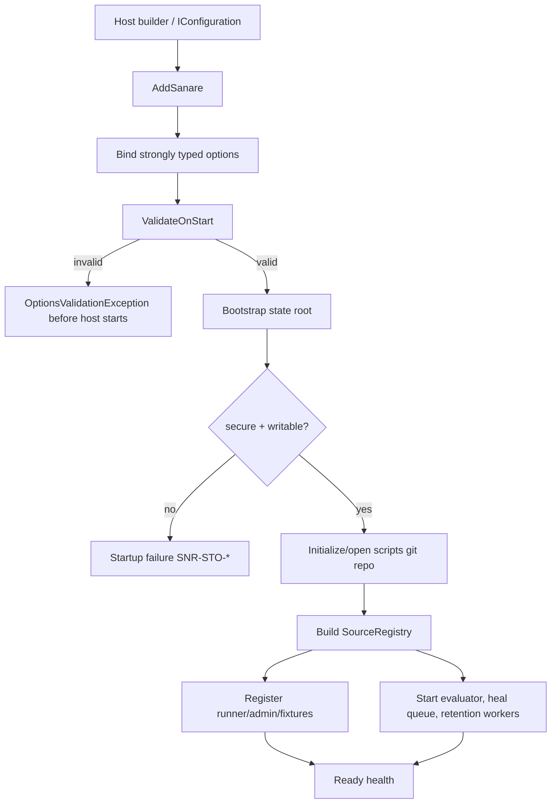

# Hosting & Configuration

> Feature spec for code-forge implementation planning.
> Source: extracted from docs/sanare/tech-design.md §8
> Created: 2026-09-06

| Field | Value |
|-------|-------|
| Component | hosting-configuration |
| Priority | P0 |
| SRS Refs | — (no SRS; traces to tech-design §3.6 AC-002, AC-012, AC-021, AC-026, AC-028) |
| Tech Design | §8.1 — row 17 "Hosting & Configuration"; §9.2.4 (registration); §11.2 (authorization matrix); §11.3 (state-root security); §14.1 (environment profiles); DR-010/DR-012/DR-013 |
| Depends On | all library components |
| Blocks | sample-app-lenovo |

## Purpose

The system is a library, not a service. This component is the composition root that lets an ordinary
.NET host add it without inheriting a second hosting model: plain `Microsoft.Extensions.DependencyInjection`,
strongly typed options, startup validation, named sources, and hosted background loops only where a
background loop is actually required.

It is also the last line of defence against unsafe combinations. A browser tier must be enabled twice;
compiled plans need a per-source flag **and** a signed marker; an insecure state root prevents startup;
CI offline mode prevents network access even if a test accidentally asks for it. Those are validated
invariants, not documentation suggestions.

## Scope

**Included:**

- `AddSanare`, `AddChatClient` (named model profiles), `AddSource`, `AddQualityEvaluator` DI extensions.
- Root, authoring, browser, identity, caching, quality, repository, retention, budget and per-source options.
- Model-profile registration for OmniRoute-compatible and other `IChatClient` proxies (DR-010), with a
  configurable authoring→healing fallback order.
- `IRepositoryCoordinator` extension point for swapping the default file-lock coordinator for a distributed
  lease/semaphore implementation (DR-013).
- `IValidateOptions<T>` validators and `ValidateOnStart`.
- State-root bootstrap: directory tree, scripts git repository, permissions checks, atomic-write probe.
- Source registry and duplicate detection.
- Background hosted services: quality evaluation scheduler, queued heal dispatcher, retention worker.
- Environment profiles for local, CI, staging, production.
- Authorization/configuration gates for authoring, approval, browser, compiled plans, pruning and robots.
- Health checks for state root, script repository, browser availability, and chat client readiness.

**Excluded:**

- An HTTP API or web dashboard (NG-4).
- Any dependency on `Microsoft.Agents.AI.Hosting` (preview-only and unnecessary).
- Exporter-specific OTel configuration — the consumer configures exporters; this registers source names.
- Provider-specific chat-client setup — consumers register an `IChatClient`.

## Core Responsibilities

1. **Compose** all packages through standard DI.
2. **Bind and validate** configuration before the first request.
3. **Bootstrap** a secure, writable state root and local git repository.
4. **Enforce** double opt-ins and environment safety rules.
5. **Schedule** evaluator/healing/retention work without blocking consumer requests.
6. **Expose** operational health checks.

## Interfaces

### Inputs

- Code-based configuration (`Action<SanareOptions>`, source builders).
- `IConfiguration` sections bound to the same option types.
- A consumer-supplied `IChatClient` factory.
- Host services: logging, `TimeProvider`, OTel builders, health checks.

### Outputs

- Registered `IScrapeRunner`, `IScraperAdministration`, `IFixtureAdministration` and internal services.
- A validated `SourceRegistry`.
- Bootstrapped `{StateRoot}`.
- Hosted background services and health-check registrations.

### Dependencies

- `Microsoft.Extensions.DependencyInjection`, `.Options`, `.Hosting.Abstractions`, `.Diagnostics.HealthChecks`.
- Every sanare package.
- `Microsoft.Extensions.AI.IChatClient` supplied by the consumer.

## Data Flow



## Key Behaviors

### Registration API

```csharp
services.AddSanare(options =>
    {
        options.StateRoot = @"C:\data\sanare";
        options.Authoring.Mode = AuthoringMode.Automatic;
        options.Authoring.RequireApproval = true;
        options.Browser.Enabled = true;
        options.Identity.Profile = BrowsingIdentityProfile.AssistantBrowser;
    })
    .AddChatClient("Authoring", sp => sp.GetRequiredKeyedService<IChatClient>("omniroute-gpt5"))
    .AddChatClient("Healing", sp => sp.GetRequiredKeyedService<IChatClient>("omniroute-gpt5-mini"))
    .AddSource("lenovo-com/tablet-lister", source =>
    {
        source.Culture = "nl-NL";
        source.RequestsPerMinute = 15;
        source.MinDelay = TimeSpan.FromSeconds(2);
        source.AllowBrowserTier = true;
        source.Pagination = PaginationPolicy.NextLink(maxPages: 50);
        source.MonthlyLlmBudget = 25.00m; // USD; gates authoring/healing, not replay
        source.RateLimit.Mode = RateLimitMode.Adaptive; // AIMD; see acquisition-pipeline
    })
    .AddQualityEvaluator(evaluator =>
    {
        evaluator.Interval = TimeSpan.FromHours(6);
        evaluator.NullRateDelta = 0.25;
        evaluator.AutoPromoteHeals = false;
    });
```

Registration uses plain DI and does **not** reference `Microsoft.Agents.AI.Hosting`. Agent instances are
constructed inside `Sanare.Agents` from the registered `IChatClient` via `AsAIAgent(...)`.

`AddChatClient(role, factory)` registers a **named model profile** (DR-010) rather than a single flat
client. `"Authoring"` and `"Healing"` are the two built-in roles; any `IChatClient` — including one backed
by an OmniRoute proxy exposing multiple model/deployment combinations as distinct keyed services — can be
supplied per role. If a role has no explicit registration, it falls back to `"Authoring"`, and if neither
is registered, startup fails `SNR-CFG-005`. This keeps cost/latency/quality tuning a host-side configuration
concern instead of a library-side hard-coded default.

### Option model

```csharp
public sealed class SanareOptions
{
    public required string StateRoot { get; set; }
    public ExecutionMode ExecutionMode { get; set; } = ExecutionMode.Live;
    public AuthoringOptions Authoring { get; } = new();
    public BrowserOptions Browser { get; } = new();
    public BrowsingIdentityOptions Identity { get; } = new();
    public CacheOptions Cache { get; } = new();
    public RepositoryOptions Repository { get; } = new();
    public RetentionOptions Retention { get; } = new();
    public ObservabilityOptions Observability { get; } = new();
}
```

Per-source options include culture, rate limit (including `RateLimitMode.Adaptive` AIMD tuning), concurrency,
min delay, browser permission, compiled-plan permission, pagination policy, robots policy, consent strategy,
schema hints, quality thresholds, `AutoPromoteHeals`, result-cache TTL, PII allow-list and
`MonthlyLlmBudget` (DR-012; nullable — unset means unbounded, with a startup warning recommending a value).

`RepositoryOptions` carries an `ICoordinatorFactory` (default: `FileLockRepositoryCoordinator`) so a host
can substitute a distributed lease/semaphore-backed `IRepositoryCoordinator` (DR-013) for multi-process or
multi-machine deployments without changing any call site in `script-repository`. `IRepositoryCoordinator` and
the default `FileLockRepositoryCoordinator` implementation are defined in `Sanare.Core`
(see `script-repository.md`) so the abstraction is usable without the hosting package; `ICoordinatorFactory`
itself — the DI-facing factory this layer registers and lets a host override — lives here in
`Sanare.Extensions.Hosting`.

### Startup validation

Validation runs with `ValidateOnStart` and rejects, at minimum:

| Invariant | Result on failure |
|-----------|-------------------|
| `StateRoot` absolute, exists/creatable, writable, not world-writable | startup failure `SNR-STO-001/002` |
| source id matches `^[a-z0-9-]+(/[a-z0-9-]+)*$`, ≤128 | `SNR-API-002` |
| source ids unique | `SNR-CFG-001` |
| culture resolves to a real `CultureInfo` | `SNR-API-005` |
| limits within §7.3/§7.4 bounds | corresponding `SNR-API/PLAN-*` code |
| per-source `AllowBrowserTier = true` while global browser off | valid but warning (source cannot escalate) |
| compiled plans enabled without a valid signed marker | startup failure `SNR-CFG-002` |
| `ExecutionMode.OfflineFixture` with authoring/healing/live acquisition enabled | startup failure `SNR-CFG-003` |
| `EnableSensitiveData` on an unencrypted volume | refused, remains off, warning |
| GenAI OTel attached at agent and chat client layers | startup failure `SNR-OBS-002` |
| No `"Authoring"` and no `"Healing"` model profile registered | startup failure `SNR-CFG-005` |
| `MonthlyLlmBudget` negative or zero | startup failure `SNR-CFG-006` |
| `MonthlyLlmBudget` unset | valid but warning (unbounded spend for that source) |

`SNR-CFG-005` and the OmniRoute profile examples above trace to DR-010; the budget rows trace to DR-012.

A warning is appropriate for a browser mismatch because operators may ship a source config to an
environment where browsers are intentionally unavailable. Compiled-plan and offline-mode mismatches are
hard errors because accepting them would violate a security boundary.

### State-root bootstrap

Creates the layout atomically:

```
{StateRoot}/
├── scripts/                 # git repository
├── fixtures/manifest.json
├── cache/http/
├── cache/results/
├── telemetry/runs/
├── telemetry/health/
├── checkpoints/authoring/
├── checkpoints/healing/
└── audit/
```

Rules:

1. Resolve symlinks/reparse points and validate the **final** path, preventing a secure-looking path from
   redirecting into a world-writable directory.
2. Refuse startup when the directory is world-writable / grants write to `Everyone` on Windows.
3. Probe atomic replace semantics with a temporary file; clean it up.
4. Initialize `scripts/` with LibGit2Sharp when no repository exists; otherwise validate it is a repository
   with an expected root and no unsafe ownership mismatch.
5. Create `fixtures/manifest.json` version 1 if absent; never overwrite an existing manifest.
6. Concurrent hosts use a bootstrap lock; the loser waits and then validates the result.

### Authorization and safety matrix (§11.2)

| Capability | Gate | Default |
|------------|------|---------|
| execute approved plan | any caller with library access | on |
| create candidate | `Authoring.Mode` (`Automatic` dev / `Manual` prod) | environment-specific |
| promote candidate | `IScraperAdministration.ApproveAsync` + `approvedBy` | `RequireApproval = true` |
| auto-promote heals | per source `AutoPromoteHeals` | false |
| browser tier | global `Browser.Enabled` **and** source `AllowBrowserTier` | global false |
| compiled C# plan | source `Runtime.AllowCompiledPlans` **and** valid signed marker file | false |
| prune/history rewrite | administration API only; tag-referenced fixtures still protected | restricted |
| robots enforcement | ordinary per-source configuration value (not an audited override) | `RespectRobots = false` (bypasses `Disallow` by default); set `true` per source to opt into enforcement |

### Environment profiles

| Environment | Enforced defaults |
|-------------|-------------------|
| Local development | state root under repo (git-ignored); authoring automatic; approval off; browser on; liberal fixture capture |
| CI | `ExecutionMode.OfflineFixture`; authoring/healing disabled; network forbidden; validate plans against committed fixtures |
| Staging | live network with low rate; authoring automatic + approval; heals proposed, not auto-promoted |
| Production | authoring manual or automatic + approval; browser global default off; auto-promote per source only; full observability |

Explicit code/config can override a profile except for CI's network prohibition once `OfflineFixture` is
selected. The resolved configuration is logged at Information with secrets removed.

### Hosted services

- `QualityEvaluationService` runs at the configured interval (default 6 h), with immediate triggers queued
  directly by run completion.
- `HealDispatchService` drains the heal queue; per-source coalescing remains in the evaluator.
- `RetentionService` prunes expired cache and unreferenced fixtures daily, never tag-referenced fixtures.
- All use `PeriodicTimer` created from `TimeProvider`; shutdown observes cancellation and has a 30 s drain
  timeout. No background worker starts in CI offline mode except fixture validation explicitly invoked by
  tests/CI.

## Constraints

- **Library only** — no web host, daemon, API controller, or dashboard.
- **No preview hosting dependency.** Plain Microsoft DI/Options/HostedService only.
- **All options validated on start**, not on first request.
- **State root security is mandatory.** World-writable means no startup.
- **Double gates are AND, never OR** for browser and compiled plans.
- **Offline fixture mode is a hard network ban.**
- Source registration is immutable after the service provider is built.
- Configuration logs contain resolved non-secret values only.
- Hosted loops use `TimeProvider`; tests never sleep.
- Model-profile registration is a hosting-layer concern; no library component hard-codes a model name or
  proxy endpoint (DR-010).
- The default `IRepositoryCoordinator` is single-machine file locking; swapping it must not require changes
  outside DI registration (DR-013).

## Acceptance Criteria

| AC-ID | Priority | Criterion | Expected Result | Verification Method |
|-------|----------|-----------|-----------------|---------------------|
| AC-002 | P0 | Given standard DI registration | `IScrapeRunner`, admin APIs, and all required internals resolve without preview hosting packages | Integration — service-provider build |
| AC-012 | P0 | Given `RequireApproval = true` | Candidate plans cannot serve until approved through the admin API | Integration — authorization |
| AC-021 | P0 | Given OTel registration | `Sanare`, `Experimental.Microsoft.Agents.AI`, and `Experimental.Microsoft.Extensions.AI` sources are registered | Unit — builder inspection |
| AC-026 | P0 | Given resolved configuration logging | No secret/header/cookie value is logged | Unit — capturing logger |
| AC-028 | P0 | Given a source with no available API but viable HTML | Startup accepts it; API absence does not require an override or approval | Unit — policy boundary |
| AC-HC-001 | P0 | Given a world-writable state root | Host startup fails before any service runs | Integration — permissions |
| AC-HC-002 | P0 | Given a relative state-root path | Startup fails with an actionable validation error | Unit — options validation |
| AC-HC-003 | P0 | Given two sources with the same id | Startup fails `SNR-CFG-001` | Unit — duplicate source |
| AC-HC-004 | P0 | Given an unknown culture | Startup fails `SNR-API-005` | Unit — culture validation |
| AC-HC-005 | P0 | Given global browser on and per-source browser off | Browser tier is unavailable for that source | Integration — AND gate |
| AC-HC-006 | P0 | Given global browser off and per-source browser on | Browser tier is unavailable; startup logs one warning | Integration — AND gate |
| AC-HC-007 | P0 | Given compiled plans enabled per source but no signed marker | Startup fails `SNR-CFG-002` | Integration — double gate |
| AC-HC-008 | P0 | Given a valid signed marker but compiled plans disabled | Compiled plans remain unavailable | Integration — double gate |
| AC-HC-009 | P0 | Given `OfflineFixture` plus live acquisition enabled | Startup fails `SNR-CFG-003` | Unit — hard network ban |
| AC-HC-010 | P0 | Given first startup in an empty secure directory | The full state layout and a valid scripts git repository are created | Integration — bootstrap |
| AC-HC-011 | P0 | Given an existing manifest | Bootstrap does not overwrite it | Integration — idempotency |
| AC-HC-012 | P0 | Given two hosts bootstrapping the same new state root | One initializes; both end with a valid repository and manifest | Integration — concurrency |
| AC-HC-013 | P0 | Given a state-root symlink to a world-writable target | Startup rejects the resolved target | Integration — symlink safety |
| AC-HC-014 | P0 | Given CI profile | No evaluator/heal/retention worker makes a network call | Integration — offline profile |
| AC-HC-015 | P0 | Given a tag-referenced fixture older than retention | Retention leaves it untouched | Integration — protection |
| AC-HC-016 | P1 | Given host cancellation | Workers stop within 30 seconds and preserve queued state | Integration — shutdown |
| AC-HC-017 | P1 | Given health checks | State root, repository, chat client, and browser report separately with actionable data | Integration — health report |
| AC-HC-018 | P1 | Given production profile without explicit browser enablement | Browser is off | Unit — secure default |
| AC-HC-019 | P1 | Given `RespectRobots = true` configured for a source | Enforcement is effective only for that source (default remains bypass elsewhere); the configuration is logged like any other option, with no audit-event escalation | Integration — scope check |
| AC-HC-020 | P0 | Given neither `"Authoring"` nor `"Healing"` model profile is registered | Startup fails `SNR-CFG-005` | Unit — options validation |
| AC-HC-021 | P0 | Given only `"Authoring"` is registered | `"Healing"` requests resolve the `"Authoring"` client (fallback), with a startup information log noting the fallback | Integration — DI resolution |
| AC-HC-022 | P0 | Given a source with `MonthlyLlmBudget` set to a negative or zero value | Startup fails `SNR-CFG-006` | Unit — options validation |
| AC-HC-023 | P1 | Given a source with no `MonthlyLlmBudget` configured | Startup succeeds with a single warning that spend is unbounded for that source | Unit — options validation |
| AC-HC-024 | P1 | Given a host registers a custom `IRepositoryCoordinator` | `script-repository` acquires/releases leases through that implementation instead of the default file lock | Integration — coordinator substitution |

## Error Handling

| Code | Raised when | Severity | Behavior |
|------|-------------|----------|----------|
| `SNR-STO-001` | State root is not secure (world-writable/unsafe ownership) | Fatal | Refuse startup |
| `SNR-STO-002` | State root cannot be created or atomically written | Fatal | Refuse startup; clean temporary probe |
| `SNR-CFG-001` | Duplicate source id | Fatal | Refuse startup; name both registrations |
| `SNR-CFG-002` | Compiled plans enabled without a valid signed marker | Fatal | Refuse startup |
| `SNR-CFG-003` | Offline mode conflicts with a network-capable option | Fatal | Refuse startup |
| `SNR-CFG-004` | Existing scripts directory is not a valid repository | Fatal | Refuse startup; never initialize over it |
| `SNR-CFG-005` | Neither `"Authoring"` nor `"Healing"` model profile registered | Fatal | Refuse startup |
| `SNR-CFG-006` | `MonthlyLlmBudget` is negative or zero | Fatal | Refuse startup for that source registration |
| `SNR-API-005` | Culture cannot be resolved | Fatal | Refuse source registration |
| `SNR-OBS-002` | Duplicate agent/chat OTel instrumentation | Fatal | Refuse startup |

## File Structure

```
src/
└── Sanare.Extensions.Hosting/
    ├── DependencyInjection/
    │   ├── SanareServiceCollectionExtensions.cs
    │   ├── SanareBuilder.cs
    │   ├── SourceBuilder.cs
    │   ├── QualityEvaluatorBuilder.cs
    │   └── OpenTelemetryBuilderExtensions.cs
    ├── Options/
    │   ├── SanareOptions.cs
    │   ├── SourceOptions.cs
    │   ├── AuthoringOptions.cs
    │   ├── BrowserOptions.cs
    │   ├── CacheOptions.cs
    │   ├── RepositoryOptions.cs
    │   ├── RetentionOptions.cs
    │   ├── BudgetOptions.cs
    │   ├── ObservabilityOptions.cs
    │   ├── ModelProfileOptions.cs
    │   ├── SourceOptionsValidator.cs
    │   └── SanareOptionsValidator.cs
    ├── Coordination/
    │   └── ICoordinatorFactory.cs
    ├── Bootstrap/
    │   ├── StateRootBootstrapper.cs
    │   ├── StateRootSecurityValidator.cs
    │   ├── StateRootLayout.cs
    │   └── BootstrapLock.cs
    ├── Sources/
    │   ├── SourceDefinition.cs
    │   └── SourceRegistry.cs
    ├── HostedServices/
    │   ├── QualityEvaluationService.cs
    │   ├── HealDispatchService.cs
    │   └── RetentionService.cs
    ├── Health/
    │   ├── StateRootHealthCheck.cs
    │   ├── ScriptRepositoryHealthCheck.cs
    │   ├── ChatClientHealthCheck.cs
    │   └── BrowserHealthCheck.cs
    └── Profiles/
        ├── EnvironmentProfile.cs
        └── EnvironmentProfileDefaults.cs
```

## Test Module

**Test file**: `tests/Sanare.Extensions.Hosting.Tests/HostingRegistrationTests.cs`

**Test scope**:

- **Unit**: every options invariant and exact boundary; duplicate source ids; invalid culture; browser
  AND-gate truth table; compiled-plan AND-gate truth table; environment-profile default resolution;
  `OfflineFixture` rejecting each network-capable option; source registry immutability; non-secret resolved
  configuration logging.
- **Integration**: build a real `ServiceProvider` and resolve all public services; bootstrap an empty temp
  state root, re-bootstrap idempotently, and race two bootstrappers; initialize/open the scripts git repo;
  reject writable-by-Everyone state root and a symlink/reparse point to one (platform-conditional);
  `OfflineFixture` with connect-throwing handlers proving zero network; retention preserving a
  tag-referenced fixture; worker shutdown under a fake clock; health-check report for independently failed
  dependencies.
- **Fixtures / Mocks**: temp state roots with controlled ACLs, a fake signed-marker verifier, a no-op and a
  throwing `IChatClient`, a fake browser availability probe, a capturing logger, fake `TimeProvider`, and
  a connect-throwing `HttpMessageHandler`. No test sleeps.

Companion test files: `tests/Sanare.Extensions.Hosting.Tests/OptionsValidationTests.cs`,
`tests/Sanare.Extensions.Hosting.Tests/StateRootBootstrapperTests.cs`,
`tests/Sanare.Extensions.Hosting.Tests/StateRootSecurityTests.cs`,
`tests/Sanare.Extensions.Hosting.Tests/EnvironmentProfileTests.cs`,
`tests/Sanare.Extensions.Hosting.Tests/HostedServiceTests.cs`,
`tests/Sanare.Extensions.Hosting.Tests/HealthCheckTests.cs`.
