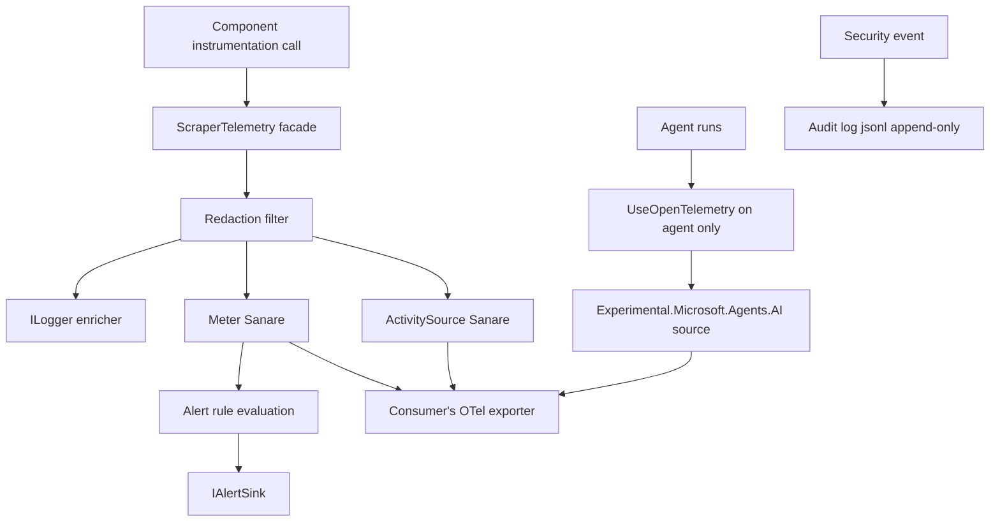

# Observability

> Feature spec for code-forge implementation planning.
> Source: extracted from docs/sanare/tech-design.md §8
> Created: 2026-09-06
> Implementation status: partial — the `ActivitySource`/`Meter` pair, full metric catalog, span hierarchy,
> redaction pipeline, cardinality guard, and audit log are implemented; agent/LLM instrumentation attachment
> is deferred pending `Microsoft.Agents.AI` (see Deferred target-state scope).

| Field | Value |
|-------|-------|
| Component | observability |
| Priority | P1 |
| SRS Refs | — (no SRS; traces to tech-design §3.6 AC-021, AC-026, AC-027) |
| Tech Design | §8.1 — row 16 "Observability"; §13.2 (metrics, traces, instrumentation layering); §13.3 (alerting rules); §11.3 (data protection); §11.5 (audit logging); DR-010, DR-012, DR-014, DR-015 |
| Depends On | scrape-api-contracts |
| Blocks | — (consumed by all components; the only P1 component) |

## Purpose

Everything else in this system produces evidence; this component makes that evidence visible without
leaking the page content it was derived from. It owns the single `ActivitySource`/`Meter` pair, the metric
and span taxonomy, the redacting log enricher, the audit log, and the alert rule definitions.

Two properties matter more than completeness. First, **every span carries `source.id` and `plan.commit`**,
so a production anomaly maps directly to a git commit you can read, diff, and roll back. Second,
**instrumentation is attached at exactly one layer** — enabling OpenTelemetry on both the agent and the
underlying `IChatClient` silently duplicates every GenAI attribute and makes token accounting wrong.

## Scope

### Implemented slice

- The `Sanare` `ActivitySource` and `Meter`.
- The full metric catalog (§13.2) and its tag conventions.
- The span hierarchy rooted at `sanare.run.execute`.
- The redacting `ILogger` enricher and log-scope conventions.
- The cardinality guard rejecting unbounded tag values (URLs, dynamic proxy/model-route values).
- Audit log writing for plan authored / approved / rolled back / heal dispatched / heal completed, including
  model-profile routing and budget lifecycle events (DR-010, DR-012).
- Alert rule definitions and the `IAlertSink` abstraction, including spend and manual-challenge escalation.
- Aspire-friendly visibility of the library's OTel source; no bundled administration UI (DR-015).
- `EnableSensitiveData` gating.

### Deferred target-state scope

- Agent/LLM instrumentation attachment via `agent.AsBuilder().UseOpenTelemetry(...)`, at one layer only —
  deferred until `Microsoft.Agents.AI` is added to this repository (`Sanare.Agents` does not exist yet). The
  start-up assertion this spec requires (§ Agent instrumentation — exactly one layer) is not yet wired
  because there is no agent-hosting component to assert against; consumers integrating the Agent Framework
  are responsible for this check until an owning component exists.
- Aspire-friendly visibility of the Agent Framework's and `IChatClient`'s OTel sources, which depends on the
  same deferred agent-layer instrumentation above.

**Excluded (not this component's responsibility, regardless of implementation status):**

- Exporter configuration (OTLP endpoint, sampling) — the **consuming application's** job; this component
  only exposes the source/meter names to register.
- Field-health computation and degradation decisions — `quality-evaluator` (this component publishes its
  numbers as metrics).
- Run-record persistence — `quality-evaluator`.
- Redaction of fixture *content* — `fixture-corpus` (this component redacts log and span attributes).

## Core Responsibilities

1. **Own** one `ActivitySource` and one `Meter`, both named `Sanare`.
2. **Emit** the metric catalog with stable names and bounded-cardinality tags.
3. **Correlate** every span to a source and a plan commit.
4. **Attach** GenAI instrumentation once, at the agent layer.
5. **Redact** before anything leaves the process.
6. **Record** security-relevant events to the audit log.
7. **Define** the alert conditions, and raise them through a pluggable sink.

## Interfaces

### Inputs

- Instrumentation calls from every other component (`ScraperTelemetry` static/injected façade).
- `RunObservation` and `FieldHealthSnapshot` from `quality-evaluator`.
- Audit events from `script-repository` and the administration API.

### Outputs

- OpenTelemetry `Activity` spans and `Meter` instruments.
- Structured logs with redacted attributes.
- `audit/{yyyy-MM}.jsonl` — append-only audit log under the state root.
- `AlertRaised` events through `IAlertSink`.

### Dependencies

- `System.Diagnostics.DiagnosticSource` — `ActivitySource`, `Meter`.
- `Microsoft.Extensions.Logging.Abstractions`.
- `Microsoft.Agents.AI` — `UseOpenTelemetry(sourceName, configure)` on the agent builder.
- `TimeProvider`.

## Data Flow



## Key Behaviors

### Sources and meters

```csharp
public static class ScraperTelemetry
{
    public const string ActivitySourceName = "Sanare";
    public const string MeterName = "Sanare";

    public const string AgentActivitySourceName = "Experimental.Microsoft.Agents.AI";
    public const string ChatActivitySourceName  = "Experimental.Microsoft.Extensions.AI";
}
```

The hosting extension registers all three names via `AddSource(...)` / `AddMeter(...)` so LLM token usage
correlates with `sanare.authoring.tokens`.

### Metric catalog (§13.2)

| Metric | Type | Tags |
|--------|------|------|
| `sanare.run.duration` | Histogram (ms) | source, tier, status, origin |
| `sanare.run.count` | Counter | source, status |
| `sanare.run.items` | Histogram | source |
| `sanare.quality.completeness` | Histogram (0–1) | source, schema |
| `sanare.quality.field_null_rate` | Gauge | source, field |
| `sanare.quality.coercion_failures` | Counter | source, field |
| `sanare.acquisition.requests` | Counter | host, statusClass, tier |
| `sanare.acquisition.delay` | Histogram (ms) | host, reason |
| `sanare.acquisition.blocked` | Counter | host, kind |
| `sanare.acquisition.rate_limit_effective` | Gauge (requests/minute) | host | Current adaptive limiter allowance for the host (DR-014) |
| `sanare.acquisition.challenge_paused` | Counter | host | Hard-challenge pauses awaiting a manual hand-off (DR-014) |
| `sanare.cache.hit_ratio` | Gauge | layer |
| `sanare.browser.contexts_active` | UpDownCounter | — |
| `sanare.authoring.attempts` | Histogram | source, outcome, modelProfile |
| `sanare.authoring.tokens` | Counter | source, direction, modelProfile |
| `sanare.healing.count` | Counter | source, classification, outcome, modelProfile |
| `sanare.healing.time_to_repair` | Histogram (s) | source |
| `sanare.plan.age` | Gauge (days) | source |
| `sanare.budget.spent_ratio` | Gauge (0–1) | source |

**Cardinality discipline.** Tag values are drawn from closed sets (`status`, `tier`, `origin`, `kind`,
`statusClass`, `direction`, `outcome`, `classification`, `layer`, `modelProfile`) or from bounded
configuration (`source`, `host`, `schema`, `field`). A URL is **never** a tag value. `modelProfile` is the
configured profile name (such as `Authoring` or `Healing`), never a dynamic proxy/model-route value. `field` is bounded by the schema's
200-property limit. An unbounded tag would turn a metrics backend into a bill.

### Span hierarchy

`sanare.run.execute` is the root, with children `sanare.plan.resolve`, `sanare.acquisition.fetch` (one per page),
`sanare.browser.navigate`, `sanare.extraction.execute`, `sanare.schema.validate`, plus `sanare.authoring.*` and
`sanare.healing.*` for agent workflows.

Every span carries `source.id` and `plan.commit`. Additional attributes: `run.id`, `tier`, `origin`,
`page.index`, `http.response.status_code`, `cache.hit`. A span records the **canonicalised URL path**, not
the full URL with query, unless `EnableSensitiveData` is on.

Failed spans set `ActivityStatusCode.Error` with the `SNR-*` error code as `error.type` — the code, not the
message, so it aggregates.

### Agent instrumentation — exactly one layer

```csharp
var agent = chatClient
    .AsAIAgent(instructions, name, tools: tools)
    .AsBuilder()
    .UseOpenTelemetry(sourceName: ScraperTelemetry.AgentActivitySourceName,
                      configure: o => o.EnableSensitiveData = options.EnableSensitiveData)
    .Build();
```

Instrumentation is attached at the **agent**, not also at the underlying `IChatClient`. The hosting
extension asserts this in a validation check, because the failure mode is silent: duplicated spans and
double-counted tokens that look like a cost spike.

When custom middleware is added alongside, **both** `runFunc` and `runStreamingFunc` must be supplied to
`.Use(...)`; supplying only the non-streaming delegate degrades streaming calls to buffered ones.

### Redaction (§11.3)

The enricher runs before any sink:

- Header values for `Authorization`, `Cookie`, `Set-Cookie` are replaced with `[redacted]`.
- Query-string values matching secret patterns are redacted.
- Configured PII patterns (email, phone, postal code, IBAN) are redacted, subject to the per-source
  allow-list — a schema that legitimately extracts a seller's email must be able to opt that field out.
- Log scopes carry `source.id`, `run.id`, `plan.commit` and never page content.

`EnableSensitiveData = false` by default. Turning it on records prompts and completions, which for this
library means **raw page HTML**, so it is gated behind the same redaction policy as fixtures and is
refused entirely when the state root is not on an encrypted volume.

### Audit log (§11.5)

Append-only JSONL at `{StateRoot}/audit/{yyyy-MM}.jsonl`. One line per event:

| Event | Fields |
|-------|--------|
| `PlanAuthored` | sourceId, schemaHash, commitId, tier, score, model, modelProfile, provider, attempts, estimatedSpend |
| `BudgetExhausted` | sourceId, monthlyBudget, spent, spentRatio, workflow (`authoring`/`healing`) |
| `ChallengePaused` | sourceId, host, challengeKind, effectiveRateLimit, handoffRequired |
| `PlanApproved` | sourceId, commitId, tag, approvedBy, timestamp |
| `PlanRolledBack` | sourceId, fromCommit, toCommit, reason, actor |
| `HealDispatched` | sourceId, trigger, failingFields, evidenceRunIds |
| `HealCompleted` | sourceId, classification, resolution, commitId, promoted |
| `FixturePruned` | sourceId, fixtureIds, actor |

Audit writes are flushed before the operation reports success. An audit write failure fails the operation:
an approval that was not recorded did not happen.

### Alerting

Rules are **defined** here and **raised** through `IAlertSink` (default: a logging sink at `Critical`/
`Error`). The consuming application supplies a real sink.

| Alert | Condition | Severity |
|-------|-----------|----------|
| `SourceBlocked` | `sanare.acquisition.blocked` circuit open for a source | Critical |
| `SourceEmpty` | Any run returns zero items where the trailing median > 0 | Critical |
| `FieldDecay` | `field_null_rate` > baseline + 0.25 for a required field over the window | High |
| `HealFailed` | 3 failed heal attempts for one source | High |
| `HealRegression` | `SNR-HEAL-002` raised twice for one source | High |
| `AuthoringFailing` | Authoring failure rate > 50 % over 10 attempts | Medium |
| `LlmCostSpike` | `authoring.tokens` > 2× the 7-day mean | Medium |
| `BudgetNearLimit` | `sanare.budget.spent_ratio` ≥ 0.8 for a source | Medium |
| `BudgetExhausted` | `sanare.budget.spent_ratio` ≥ 1.0 for a source | High |
| `ChallengePausedTooLong` | A `ChallengePaused` state has not received an authorized manual hand-off before its configured escalation period | High |
| `PlanStale` | `plan.age` > 180 days with no successful validation run | Low |
| `StateRootPressure` | Free space on the state-root volume < 10 % | High |
| `AwaitingApprovalBacklog` | Any candidate plan pending > 48 h | Low |

## Constraints

- **One `ActivitySource`, one `Meter`**, both named `Sanare`.
- **No exporter is configured by this library.** It is a library, not a service (NG-4); a consumer such as
  a .NET Aspire host supplies the exporter/dashboard integration (DR-015).
- **No administration UI is bundled.** OTel traces, metrics, logs, and audit events are the operational
  surface (DR-015).
- **Unbounded tag values are forbidden**; URLs and dynamic proxy/model-route values never become tags.
- **GenAI instrumentation at one layer only**, asserted at start-up.
- **Redaction happens before the sink**, not in the sink.
- Audit writes are durable and failure-fatal to their operation.
- Instrumentation must be near-free when no listener is attached — guard with
  `ActivitySource.HasListeners()` / `Instrument.Enabled` before building attribute sets.
- `TimeProvider` for every time-based rule.

## Acceptance Criteria

| AC-ID | Priority | Criterion | Expected Result | Verification Method |
|-------|----------|-----------|-----------------|---------------------|
| AC-021 | P0 | Given any completed run | The root span carries `source.id` and `plan.commit` | Integration — span assertion |
| AC-026 | P0 | Given a request with an `Authorization` header | No log, span attribute, or audit line contains the header value | Unit — redaction |
| AC-027 | P0 | Given an approval | The audit log contains a `PlanApproved` line with commit, tag, `approvedBy`, and timestamp | Integration — audit log |
| AC-OB-001 | P0 | Given OTel enabled on both the agent and the chat client | Start-up validation fails with an actionable message | Unit — double-instrumentation guard |
| AC-OB-002 | P0 | Given an audit write failure during approval | The approval operation fails; no tag is created | Integration — failure-fatal audit |
| AC-OB-003 | P0 | Given a failed run | The span status is `Error` with `error.type` set to the `SNR-*` code | Unit — span status |
| AC-OB-004 | P0 | Given metrics emission | No tag value contains a URL, query string, or unbounded identifier | Unit — cardinality guard |
| AC-OB-005 | P0 | Given `EnableSensitiveData = false` | No prompt or page HTML appears in any span or log | Integration — content leak check |
| AC-OB-006 | P0 | Given `EnableSensitiveData = true` on an unencrypted state-root volume | The library refuses to enable it and logs why | Unit — gating |
| AC-OB-007 | P0 | Given no OTel listener attached | Instrumentation allocates no attribute collections | Unit — benchmark/allocation assertion |
| AC-OB-008 | P0 | Given a PII-bearing extracted value with no allow-list entry | It is redacted in logs; the returned payload is unaffected | Unit — redaction scope |
| AC-OB-009 | P0 | Given a schema field explicitly allow-listed for PII | It is not redacted in logs | Unit — allow-list |
| AC-OB-010 | P0 | Given a source with `RespectRobots = true` configured | The resolved-configuration log (Information level) reports the value like any other option; no `ConfigurationOverride`-style audit event is written, since it is not an override | Unit — config log content |
| AC-OB-011 | P1 | Given a paginated run over 5 pages | Exactly 5 `sanare.acquisition.fetch` child spans exist under one root | Integration — span tree |
| AC-OB-012 | P1 | Given an authoring run | `sanare.authoring.tokens` correlates with the GenAI span's token attributes (same order of magnitude, not double) | Integration — no duplication |
| AC-OB-013 | P1 | Given each defined alert condition | The alert is raised exactly once per qualifying transition, not per run | Unit — alert de-duplication |
| AC-OB-014 | P1 | Given the state-root volume below 10 % free | `StateRootPressure` is raised | Unit — threshold |
| AC-OB-015 | P1 | Given custom agent middleware | Both `runFunc` and `runStreamingFunc` are supplied; a streaming call stays streaming | Unit — middleware completeness |
| AC-OB-016 | P1 | Given the audit log across a month boundary | A new `{yyyy-MM}.jsonl` file is started; the previous file is not rewritten | Unit — rollover |
| AC-033 | P1 | Given a source enters `ChallengePaused` | Telemetry records `sanare.acquisition.challenge_paused`, the effective rate-limit gauge, and a redacted hand-off audit event; no automated challenge bypass is attempted | Integration — circuit-breaker observability (mirrors tech-design AC-033) |
| AC-OB-017 | P1 | Given authoring or healing records spend against a configured monthly source budget | `sanare.budget.spent_ratio` is emitted with only the bounded `source` tag and triggers `BudgetNearLimit` at ≥ 0.8 and `BudgetExhausted` at ≥ 1.0 | Unit — threshold transitions |
| AC-OB-018 | P1 | Given `ChallengePaused` exceeds its configured escalation period | `ChallengePausedTooLong` is raised once for the paused state, without issuing an automated browser action or bypass attempt | Unit — elapsed-time alert de-duplication |
| AC-OB-019 | P1 | Given authoring or healing uses a named model profile | Authoring/healing metrics and `PlanAuthored` audit data carry the configured `modelProfile`; the profile is safe for Aspire/OTel filtering and never exposes a proxy endpoint | Integration — telemetry and audit inspection |

## Error Handling

| Code | Raised when | Severity | Behavior |
|------|-------------|----------|----------|
| `SNR-OBS-001` | Audit log write failed | Error | Fail the originating operation; approvals and overrides must be recorded |
| `SNR-OBS-002` | Double instrumentation detected at start-up | Error | Refuse to start with an actionable message |
| `SNR-OBS-003` | `EnableSensitiveData` requested on an unencrypted state root | Error | Refuse to enable; continue with it off |
| `SNR-OBS-004` | Alert sink threw | Warning | Log and continue; a broken sink must not fail a scrape |
| `SNR-OBS-005` | Metric tag value exceeded the cardinality guard | Warning | Replace with `other` and log once per tag name |

## File Structure

```
src/
└── Sanare.Abstractions/
    └── Telemetry/
        ├── ScraperTelemetry.cs
        ├── IAlertSink.cs
        ├── AlertRaised.cs
        └── AlertSeverity.cs
src/
└── Sanare.Core/
    └── Observability/
        ├── ScraperMetrics.cs
        ├── ScraperActivitySource.cs
        ├── SpanNames.cs
        ├── TagNames.cs
        ├── CardinalityGuard.cs
        ├── Redaction/
        │   ├── RedactingLogEnricher.cs
        │   ├── RedactionPolicy.cs
        │   ├── RedactionPatterns.cs
        │   └── PiiAllowList.cs
        ├── Audit/
        │   ├── IAuditLog.cs
        │   ├── JsonlAuditLog.cs
        │   ├── AuditEvent.cs
        │   └── AuditEventJsonContext.cs
        └── Alerting/
            ├── AlertRule.cs
            ├── AlertRuleSet.cs
            ├── AlertEvaluator.cs
            ├── AlertDeduplicator.cs
            └── LoggingAlertSink.cs
```

## Test Module

**Test file**: `tests/Sanare.Core.Tests/Observability/ObservabilityTests.cs`

**Test scope**:

- **Unit**: metric name and tag-set assertions for every instrument; `CardinalityGuard` collapsing an
  unbounded value to `other`; redaction of `Authorization`/`Cookie`/`Set-Cookie`/secret query params and
  each PII pattern, plus the allow-list negative case; span status and `error.type` mapping for a
  representative `SNR-*` code from each area; audit-event serialization and month rollover; alert
  de-duplication across repeated qualifying runs; `StateRootPressure` at 9 % / 10 % / 11 %; the
  no-listener allocation assertion.
- **Integration**: an in-memory OTel `TracerProvider`/`MeterProvider` capturing a full paginated run —
  asserting one root span, five fetch children, `source.id` and `plan.commit` on every span, and no page
  content anywhere; the double-instrumentation start-up guard; an audit-write failure aborting an
  approval and leaving no tag; an authoring run proving GenAI tokens are counted once, not twice.
- **Fixtures / Mocks**: an in-memory exporter pair, a capturing `ILoggerProvider`, a temp state root with
  a writable and a read-only `audit/` directory, a fixture containing an email and an IBAN for PII tests,
  a spy `IAlertSink`, and a fake `TimeProvider` for the month rollover and all windowed alerts — no test
  sleeps.

Companion test files: `tests/Sanare.Core.Tests/Observability/RedactionTests.cs`,
`tests/Sanare.Core.Tests/Observability/AuditLogTests.cs`,
`tests/Sanare.Core.Tests/Observability/AlertRuleTests.cs`,
`tests/Sanare.Core.Tests/Observability/MetricCardinalityTests.cs`,
`tests/Sanare.Core.Tests/Observability/SpanHierarchyTests.cs`.
