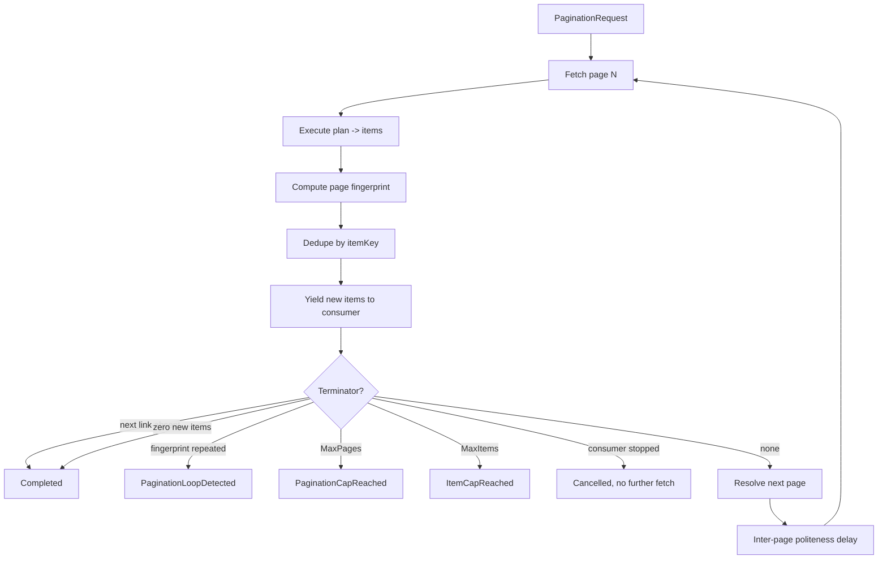

# Pagination Engine

> Feature spec for code-forge implementation planning.
> Source: extracted from docs/sanare/tech-design.md §8
> Created: 2026-09-06

| Field | Value |
|-------|-------|
| Component | pagination-engine |
| Priority | P0 |
| SRS Refs | — (no SRS; traces to tech-design §3.6 AC-016, AC-017, AC-018) |
| Tech Design | §8.1 — row 10 "Pagination Engine"; §8.3.4 (pagination flow); §7.4 (caps); §7.4 (edge cases) |
| Depends On | plan-runtime |
| Blocks | quality-evaluator (item-count health), sample-app-lenovo |

## Purpose

The brief requires paginated endpoints, and a lister like the Lenovo tablet catalogue is exactly that. This
component drives the page loop: fetch, extract, dedupe, decide whether to continue, and stream. Streaming
matters as much as looping — a caller that wants the first 20 tablets should cause 1 page fetch, not 12,
because the cheapest way to be polite to a site is not to ask it for pages nobody reads.

## Scope

**Included:**

- `IPaginationDriver` — drive a lister plan across pages and stream items.
- The seven strategies: `None`, `NextLink`, `PageNumber`, `Offset`, `Cursor`, `LoadMoreButton`,
  `InfiniteScroll`.
- Next-page resolution per strategy, including URL templating and cursor extraction.
- Item de-duplication by the plan's declared `itemKey`.
- Terminator detection: absent next link, repeated page fingerprint, zero new items, `MaxPages`,
  `MaxItems`.
- Politeness delay between pages (delegated to the acquisition limiter, plus an explicit inter-page delay).
- Streaming via `IAsyncEnumerable<T>` with correct early-stop semantics.
- Partial-pagination reporting when the loop stops on a cap or an error.
- Per-page provenance so an item can be traced to the page and locator that produced it.

**Excluded:**

- Fetching (acquisition) and extracting (plan runtime) — both are called, neither is reimplemented.
- Browser scroll/click mechanics — declared here, executed by `browser-tier`.
- Deciding the strategy — chosen at authoring time and recorded in the plan.
- Cross-run incremental crawling / change detection — out of scope for v1.

## Core Responsibilities

1. **Loop** over pages, calling acquisition + runtime once per page.
2. **Resolve** the next page for the declared strategy, or stop.
3. **Dedupe** items so a repeated or overlapping page cannot inflate results.
4. **Terminate** safely — every strategy has at least two independent stop conditions.
5. **Stream** results and stop fetching the moment the consumer stops consuming.
6. **Report** how the loop ended: complete, capped, looped, or failed.

## Interfaces

### Inputs

- **`PaginationRequest`** — plan, schema, start URL, `PaginationPolicy` (`MaxPages`, `MaxItems`,
  `InterPageDelay`), cancellation token.
- **`ExtractionPlan.pagination`** — `strategy`, `nextSelector` / `urlTemplate` / `cursorPointer`,
  `maxPages`, `itemKey`, `totalPagesLocator`.

### Outputs

- **`IAsyncEnumerable<PagedItem<T>>`** — each item with `PageNumber`, `PageUrl`, and its
  `FieldObservation` set.
- **`PaginationSummary`** — pages fetched, items yielded, items deduped, termination reason, per-page
  timings.

### Dependencies

- **`plan-runtime`** — per-page extraction.
- **`acquisition-pipeline`** / **`browser-tier`** — page acquisition (invoked through the same abstraction
  the single-page path uses).
- **`observability`** — page-loop metrics.

## Data Flow



## Key Behaviors

### Interface

```csharp
public interface IPaginationDriver
{
    IAsyncEnumerable<PagedItem<T>> StreamAsync<T>(
        PaginationRequest request, CancellationToken ct = default);

    ValueTask<PaginationSummary> GetSummaryAsync(string runId, CancellationToken ct = default);
}

public sealed record PagedItem<T>(
    T Value, int PageNumber, string PageUrl, IReadOnlyList<FieldObservation> Observations);
```

### Strategy semantics

| Strategy | Next-page resolution | Stops when | Tier |
|----------|---------------------|------------|------|
| `None` | — | after page 1 | any |
| `NextLink` | `link[rel=next]` href, else `nextSelector`'s href, resolved against the base URI | selector absent or href equals the current URL | any |
| `PageNumber` | `urlTemplate` with `{page}` incremented; upper bound from `totalPagesLocator` when present | page > total, or an empty page | any |
| `Offset` | `urlTemplate` with `{offset}` += `{limit}` | returned count < limit, or empty | any |
| `Cursor` | token at `cursorPointer` in the payload | token absent, null, empty, or identical to the previous token | any |
| `LoadMoreButton` | click the declared button, wait for item count to grow | button absent/disabled, count unchanged, or `MaxClicks` (default 50) | Browser only |
| `InfiniteScroll` | scroll to bottom, wait for stability | item count unchanged after 2 consecutive scrolls, or `MaxScrolls` (default 50) | Browser only |

`LoadMoreButton` and `InfiniteScroll` in a non-browser plan are rejected at validation with
`SNR-PAG-003` — they are physically impossible over raw HTTP, so this is a plan defect, not a run-time
surprise.

### De-duplication and loop detection

- `itemKey` is a JSON pointer into the extracted item (typically the product URL or SKU). Keys are compared
  ordinally after trimming.
- A `HashSet<string>` of seen keys spans the whole run; a repeated key is counted in
  `PaginationSummary.ItemsDeduped` and not yielded.
- The **page fingerprint** is `sha256` over the ordered item keys of the page. A fingerprint equal to any
  previous page's fingerprint terminates the loop with `SNR-PAG-002 PaginationLoopDetected`. This catches the
  common real-world failure where `?page=99` silently serves page 1 again.
- A page yielding **zero new items** terminates normally (`Completed`), not as an error — many listers pad a
  final empty page.
- If `itemKey` is absent from an item, the item is still yielded but excluded from dedupe, with a warning
  diagnostic; a run where > 20 % of items lack keys emits `SNR-PAG-004` so the evaluator can see that dedupe
  is effectively off.

### Caps and status mapping

| Condition | Summary reason | Run status |
|-----------|----------------|------------|
| Natural end | `Completed` | `Succeeded` |
| `MaxPages` (default 100, ceiling 10 000) | `PaginationCapReached` + `SNR-PAG-005` | `PaginationCapReached` |
| `MaxItems` (1…1 000 000) | `ItemCapReached` + `SNR-PAG-006` | `Succeeded` when the cap was the caller's explicit request; `PartialPagination` when it was the configured default |
| Loop detected | `LoopDetected` | `PartialPagination` |
| Page N failed after retries | `PageFailed` | `PartialPagination`, with the items from pages 1…N-1 preserved |

Partial results are always returned. Losing 11 good pages because page 12 timed out would be the wrong
trade for an aggregation pipeline.

### Streaming and early stop

- Implemented with `[EnumeratorCancellation]` and `await foreach`; the next page is fetched **lazily**, only
  when the consumer requests an item beyond the current page's buffer.
- A consumer that breaks after 20 items on a 24-item first page causes exactly **one** fetch (AC-018).
- Cancellation propagates into the in-flight acquisition and abandons the loop within one page boundary.
- A `PaginationSummary` is emitted even for an abandoned enumeration, via the run record.

### Single-page listers

A lister that fits on one page uses `strategy: None`, terminates after page 1, and emits **no** cap warning
(§7.4 edge case) — a warning there would be noise the evaluator would have to learn to ignore.

### Politeness

Between pages the driver waits `max(InterPageDelay, limiterDelay)` where `InterPageDelay` defaults to 750 ms
with ±20 % jitter. The per-host limiter is still authoritative; the inter-page delay only ever makes the
crawl slower, never faster.

## Constraints

- **Never fetch a page the consumer will not see** (lazy streaming).
- **Every strategy has ≥ 2 stop conditions** — one intended and one defensive; unbounded loops are
  structurally impossible.
- Memory is bounded: only item keys (not items) are retained across pages.
- Page order is preserved in the yielded stream.
- Browser-only strategies are validated against the plan tier.
- No test may sleep in real time; the inter-page delay uses an injected `TimeProvider`.

## Acceptance Criteria

| AC-ID | Priority | Criterion | Expected Result | Verification Method |
|-------|----------|-----------|-----------------|---------------------|
| AC-016 | P0 | Given the Lenovo tablet lister fixtures spanning 3 pages | All items across all pages are returned in page order with no duplicates | Integration — fixture replay |
| AC-017 | P0 | Given a lister whose page 4 serves page 1's content again | The loop stops with `SNR-PAG-002 PaginationLoopDetected` and pages 1–3's items are returned | Integration — loop fixture |
| AC-018 | P0 | Given a consumer that stops after 20 items of a 24-item first page | Exactly one page fetch occurs | Integration — fetch counter |
| AC-PAG-001 | P0 | Given `MaxPages = 2` over a 5-page lister | 2 pages are fetched; status is `PaginationCapReached`; items from both pages are returned | Unit — cap boundary |
| AC-PAG-002 | P0 | Given `MaxItems = 30` with 24 items per page | The loop stops mid-page 2 at exactly 30 items; no third fetch occurs | Unit — item cap boundary |
| AC-PAG-003 | P0 | Given a single-page lister with `strategy: None` | One fetch, `Completed`, no cap warning emitted | Unit — edge case |
| AC-PAG-004 | P0 | Given a final page containing only items already seen | The loop ends as `Completed`, not `LoopDetected` | Unit — zero-new-items vs fingerprint distinction |
| AC-PAG-005 | P0 | Given a `NextLink` href identical to the current page URL | The loop terminates instead of self-looping | Unit — self-reference guard |
| AC-PAG-006 | P0 | Given a `Cursor` strategy where the cursor repeats | Terminates with `LoopDetected` | Unit |
| AC-PAG-007 | P0 | Given a `LoadMoreButton` strategy in a Tier 2 (HTML) plan | Plan validation fails with `SNR-PAG-003` | Unit — negative |
| AC-PAG-008 | P0 | Given page 3 of 5 failing after retries | Pages 1–2's items are returned with status `PartialPagination` and a diagnostic naming page 3 | Integration — fault injection |
| AC-PAG-009 | P0 | Given cancellation during page 2 | Enumeration stops within one page boundary and no page 3 request is issued | Integration — cancellation |
| AC-PAG-010 | P0 | Given items whose `itemKey` pointer is absent | Items are still yielded, dedupe is skipped for them, and > 20 % triggers `SNR-PAG-004` | Unit — degraded dedupe |
| AC-PAG-011 | P0 | Given a 100-page crawl | Retained memory grows with keys only; item objects are not accumulated | Integration — memory assertion |
| AC-PAG-012 | P0 | Given `MaxPages = 20 000` requested | Clamped to the 10 000 ceiling with a warning | Unit — validation bound |
| AC-PAG-013 | P1 | Given an `Offset` lister whose last page returns fewer than `limit` items | The loop ends after that page | Unit |
| AC-PAG-014 | P1 | Given `PageNumber` with a `totalPagesLocator` reading 3 | Exactly 3 pages are fetched even if `MaxPages` is 100 | Unit |
| AC-PAG-015 | P1 | Given an `InfiniteScroll` lister whose item count stops growing | Scrolling stops after 2 stable iterations, well below `MaxScrolls` | Integration — browser |
| AC-PAG-016 | P1 | Given `InterPageDelay = 750 ms` across 3 pages | A fake `TimeProvider` observes two delays of 750 ms ± 20 %; the test completes in milliseconds | Unit — politeness without sleeping |

## Error Handling

| Code | Raised when | Severity | Status | Behavior |
|------|-------------|----------|--------|----------|
| `SNR-PAG-001` | Next-page resolution failed (template/cursor unusable) | Error | `PartialPagination` | Return items collected so far |
| `SNR-PAG-002` | Page fingerprint repeated | Warning | `PartialPagination` | Terminate loop, keep items |
| `SNR-PAG-003` | Browser-only strategy in a non-browser plan | Error | `PlanInvalid` | Rejected at validation |
| `SNR-PAG-004` | More than 20 % of items lack an `itemKey` | Warning | unchanged | Dedupe degraded; evaluator signal |
| `SNR-PAG-005` | `MaxPages` hit | Info | `PaginationCapReached` | Items returned |
| `SNR-PAG-006` | `MaxItems` hit | Info | `Succeeded` / `PartialPagination` | Items returned |

## File Structure

```
src/
└── Sanare.Core/
    └── Pagination/
        ├── IPaginationDriver.cs
        ├── PaginationDriver.cs
        ├── PaginationRequest.cs
        ├── PaginationPolicy.cs
        ├── PaginationSummary.cs
        ├── PagedItem.cs
        ├── PaginationTerminationReason.cs
        ├── Strategies/
        │   ├── IPaginationStrategy.cs
        │   ├── NoPaginationStrategy.cs
        │   ├── NextLinkStrategy.cs
        │   ├── PageNumberStrategy.cs
        │   ├── OffsetStrategy.cs
        │   ├── CursorStrategy.cs
        │   ├── LoadMoreButtonStrategy.cs
        │   └── InfiniteScrollStrategy.cs
        ├── Dedupe/
        │   ├── ItemKeyExtractor.cs
        │   └── PageFingerprint.cs
        └── PaginationValidator.cs
```

## Test Module

**Test file**: `tests/Sanare.Core.Tests/Pagination/PaginationDriverTests.cs`

**Test scope**:

- **Unit**: one class per strategy covering next-page resolution, natural termination, and the defensive
  terminator; fingerprint equality; item-key extraction including the missing-key path; cap boundaries at
  exactly the limit and one over; `MaxPages` clamping; self-referential next links; validation of
  browser-only strategies against plan tier; inter-page delay measured through a fake `TimeProvider`.
- **Integration**: full 3-page Lenovo lister replay from fixtures with a counting acquisition fake;
  early-stop fetch counting; mid-crawl failure producing `PartialPagination`; cancellation mid-page;
  memory growth over a synthetic 100-page crawl; browser-tier `InfiniteScroll` against the local test site.
- **Fixtures / Mocks**: `tests/Sanare.Core.Tests/Fixtures/Data/lenovo-com/tablet-lister-page1.html`
  … `page3.html`, `tablet-lister-loop-page4.html` (a copy of page 1), `tablet-lister-empty-page.html`,
  `bol-com/lister-cursor-page1.json` … `page2.json`; a `CountingContentAcquirer` fake that records every
  requested URL so "how many pages did we actually fetch" is directly assertable.

Companion test files: `tests/Sanare.Core.Tests/Pagination/StrategyTests.cs`,
`tests/Sanare.Core.Tests/Pagination/LoopDetectionTests.cs`,
`tests/Sanare.Core.Tests/Pagination/StreamingSemanticsTests.cs`,
`tests/Sanare.Core.Tests/Pagination/PaginationValidatorTests.cs`.

## Implementation Plan

> Planned: 2026-09-12. Milestone M3 (with `browser-tier`). This section is the build order for this
> component; it does not restate the behaviour above, only how to land it.

### Preconditions

Two things this spec assumes already exist do not exist yet, and both must be dealt with inside this
component's landing rather than discovered mid-build:

1. **Per-page item-collection extraction.** `IPlanExecutor.Execute(plan, html, schema)` extracts exactly
   one object's fields from one document and returns a single `ExtractionOutcome`. `PlanExecutor`'s own
   remark says collections are "intentionally deferred to their owning M2 features", and `ExtractionPlan.Root`
   (the item locator) is serialised but never validated or evaluated. A lister page is by definition a
   collection, so the page loop has nothing to loop over until this exists. T2 below adds it.
2. **A fetch abstraction the driver can share with the single-page path.** `FixtureScrapeRunner` reads
   through `IFixtureContentProvider.TryGet(sourceId, url, out html)`; `HttpContentAcquirer` implements
   `IContentAcquirer.AcquireAsync` and is not wired into the runner at all. The driver must not pick one.
   T3 introduces the narrow seam both can satisfy.

### Delivery decisions

| Decision | Choice | Rationale |
|---|---|---|
| Package | `src/Sanare.Core/Pagination/`; no new project | The driver composes `plan-runtime` (Core) and an acquisition seam (Core). A `Sanare.Pagination` package would reference both and be consumed only by `Sanare.Core`'s runner — a circular-feeling layer for no isolation benefit. |
| `PaginationPolicy` | Extend the existing `Sanare.Abstractions.PaginationPolicy` (add `MaxItems`, strategy factory methods, clamping); do **not** create `Core/Pagination/PaginationPolicy.cs` | The spec's file tree predates the placeholder record, which is already reachable from `ScrapeRequest.Pagination`. Two types named `PaginationPolicy` in one call path is a defect, not a layering choice. Same precedent `PaginationSpec` already set for `PaginationStrategy`. |
| `PagedItem<T>` | Public seam uses the existing `Sanare.Abstractions.ScrapeItem<T>`; `PagedItem<T>` exists only as an internal Core record if the driver needs a pre-materialisation shape | `ScrapeItem<T>` is documented as "shaped after `PagedItem<T>`" and is what `IScrapeRunner.StreamAsync` already returns. Publishing a second four-member record with the same members would force a conversion at the only boundary that matters. |
| Item-collection extraction | Add `IPlanExecutor.ExecuteMany(plan, html, schema)` returning `IReadOnlyList<ExtractionOutcome>`, scoped by `ExtractionPlan.Root` | Keeps collection semantics in the component that owns extraction (`plan-runtime`, AC-RT-009) instead of growing a second extractor inside `Pagination/`. `Execute` keeps its exact current behaviour and signature. |
| Acquisition seam | New `IPageSource` in `Sanare.Core.Pagination` with `ValueTask<PageContent> GetAsync(Uri url, CancellationToken ct)`; ship a `FixturePageSource` adapter over `IFixtureContentProvider` and a `ContentAcquirerPageSource` adapter over `IContentAcquirer` | Satisfies "invoked through the same abstraction the single-page path uses" without forcing `FixtureScrapeRunner` onto `IContentAcquirer` in this feature's diff. The counting fake AC-018/AC-PAG-009 need is then a two-method test double. |
| Politeness clock | `TimeProvider` constructor-injected into `PaginationDriver`; delay via `Task.Delay(delay, timeProvider, ct)` | Constraint: no test sleeps in real time. Matches the existing `HttpContentAcquirer` clock convention and the two `FakeTimeProvider` test doubles already in `Sanare.Core.Tests`. |
| Jitter source | Injected `Func<double>`/`Random` seeded per driver, defaulting to `Random.Shared` | ±20 % jitter is unassertable otherwise; AC-PAG-016's "750 ms ± 20 %" needs the jitter pinned, not merely tolerated. |
| Browser-only strategies | `LoadMoreButtonStrategy`/`InfiniteScrollStrategy` ship as declared types that reject execution outside the browser tier; the click/scroll mechanics stay in `browser-tier` (#8) | AC-PAG-007 is a validation assertion and already passes today; AC-PAG-015 needs a real browser context, which does not exist yet. |
| `SNR-PAG-003` | Reuse the validation rule already in `PlanValidator.ValidatePagination`; change its emitted code from the generic `SNR-PLAN-001` to `SNR-PAG-003` | The rule and its two tests exist; only the code is wrong relative to this spec's error table. This is a one-line correction, not a new rule. |
| `PaginationSpec` extension | Add `UrlTemplate`, `CursorPointer`, `TotalPagesLocator` as optional trailing parameters; **no** plan-version bump | Optional additive members with backwards-compatible defaults; `PlanSerializer` writes them only when set, so every existing v2 plan round-trips byte-identically and `PlanVersionUpgrader` is untouched. |
| New dependencies | None in `src/`; none in `tests/` | Every strategy resolves next pages from already-parsed HTML (AngleSharp, present) or JSON (`System.Text.Json`, present). WireMock and Playwright are deferred with the integration tests that need them. |

### Task order

Each task is independently buildable and testable; land them in order.

**T1 — Plan-side shape.** Extend `PaginationSpec` with `UrlTemplate`, `CursorPointer`, and
`TotalPagesLocator` (optional, trailing, defaulting to `null`); teach `PlanSerializer.ReadPagination`/
`WritePagination` to round-trip them, omitting absent members from canonical JSON. Extend
`PlanValidator.ValidatePagination` with the per-strategy required-member rules (`NextLink` needs
`NextSelector`; `PageNumber`/`Offset` need a `UrlTemplate` containing `{page}`/`{offset}` and `{limit}`;
`Cursor` needs `CursorPointer`), and switch the existing browser-tier rule's code to `SNR-PAG-003`. Add the
missing `Root` rule while here: a plan whose `Pagination.Strategy` is not `None` must declare a `Root`
locator, since a lister without an item locator cannot produce items. Assert in `PlanSerializerTests` that a
spec with none of the new members serialises identically to today. Depends on: —.

**T2 — Collection extraction in `plan-runtime`.** Add `HtmlDocument.SelectAll(selector)` and
`IPlanExecutor.ExecuteMany(ExtractionPlan plan, string html, SchemaDescriptor schema)` returning one
`ExtractionOutcome` per node matched by `plan.Root`, each evaluated in that node's scope. An absent or
unmatched `Root` returns an empty list, never `null` (AC-RT-009's semantics). `Execute` is unchanged and
still delegates to the same per-scope field loop, so the existing `PlanExecutor` tests must pass untouched.
Depends on: —.

**T3 — Page-source seam.** `IPageSource` plus `PageContent(Uri RequestedUrl, Uri FinalUrl, string Body,
string ContentType)`. Two adapters: `FixturePageSource` (wraps `IFixtureContentProvider`, throws a
`PageFetchException` carrying `SNR-FIX-001` when the fixture is absent) and `ContentAcquirerPageSource`
(wraps `IContentAcquirer`, decodes `AcquiredContent.Body` with its `Charset`, maps `AcquisitionException`
onto `PageFetchException`). Depends on: —.

**T4 — Model types.** `PaginationRequest` (plan, schema, start URL, source id, effective policy,
`IPageSource`), `PaginationSummary` (pages fetched, items yielded, items deduped, termination reason,
per-page timings), `PaginationTerminationReason` (`Completed`, `PaginationCapReached`, `ItemCapReached`,
`LoopDetected`, `PageFailed`, `Cancelled`), and the `PaginationPolicy` extension: `MaxItems`, the
`ClampedMaxPages` accessor enforcing the 1…10 000 window, a `CapWasCallerRequested` flag distinguishing an
explicit `MaxItems` from the configured default (the `SNR-PAG-006` status fork), and static factory
methods per strategy. Depends on: T1.

**T5 — Strategy abstraction and HTTP-capable strategies.** `IPaginationStrategy` with
`bool TryResolveNext(PageContext context, out Uri next, out string? reason)` where `PageContext` carries the
current URL, the parsed document, the page's item outcomes, and the previous cursor. Implement
`NoPaginationStrategy`, `NextLinkStrategy` (prefers `link[rel=next]`, falls back to `nextSelector`'s href,
resolves against the base URI, refuses a resolved URL equal to the current one — AC-PAG-005),
`PageNumberStrategy` (`{page}` substitution, upper bound from `totalPagesLocator` when present —
AC-PAG-014), `OffsetStrategy` (`{offset}` += `{limit}`, stops when the returned count is below `limit` —
AC-PAG-013), and `CursorStrategy` (token at `cursorPointer`, stops on absent/null/empty/unchanged —
AC-PAG-006). Every strategy gets its intended stop condition plus the defensive one in the same class, so
"≥ 2 stop conditions" is reviewable per file. Depends on: T3, T4.

**T6 — Browser-strategy placeholders.** `LoadMoreButtonStrategy` and `InfiniteScrollStrategy` declared with
their `MaxClicks`/`MaxScrolls` defaults of 50 and a `TryResolveNext` that throws `SNR-PAG-003` — reached
only if a plan bypassed validation. Their mechanics belong to `browser-tier`. Depends on: T5.

**T7 — Dedupe and fingerprinting.** `ItemKeyExtractor` reads the `itemKey` JSON pointer out of an
`ExtractionOutcome.Values` dictionary, trims, and compares ordinally; a missing key yields the item and
skips dedupe for it, counting toward the missing-key ratio. `PageFingerprint` is `sha256` over the page's
ordered item keys. The driver holds a run-wide `HashSet<string>` of keys and a `HashSet<string>` of
fingerprints — **keys and hashes only, never items** (AC-PAG-011). Depends on: T4.

**T8 — Termination and status mapping.** A `PaginationTerminator` that, given the page result and running
counters, returns the reason or `null`. It must encode the distinction AC-PAG-004 tests: a page whose
fingerprint matches a previous page is `LoopDetected`; a page of new content whose items were all seen
before is `Completed`. Map reasons onto `ScrapeStatus` and diagnostics per the error table, including the
`SNR-PAG-006` fork (`Succeeded` for a caller-requested cap, `PartialPagination` for the configured
default), and extend `ScrapeStatusCodes.For` so `PartialPagination` lists `SNR-PAG-001`, `SNR-PAG-002`, and
`SNR-PAG-006` alongside `SNR-PAG-005`. `strategy: None` terminating after page 1 emits **no** cap
diagnostic (AC-PAG-003). Depends on: T7.

**T9 — `PaginationDriver.StreamAsync`.** The loop: fetch → `ExecuteMany` → fingerprint → dedupe → yield →
terminate-or-resolve-next → delay. `[EnumeratorCancellation]`, a per-page buffer, and the next fetch issued
only after the consumer has pulled past the current buffer — so a break at item 20 of 24 costs exactly one
fetch (AC-018). Cancellation is checked at the page boundary and passed into the in-flight fetch
(AC-PAG-009). A page fetch or extraction failure records `SNR-PAG-001`/`PageFailed` and ends the
enumeration with the preceding pages' items already delivered (AC-PAG-008). The inter-page delay is
`max(InterPageDelay, 0)` with ±20 % jitter awaited on the injected `TimeProvider` (AC-PAG-016). Depends on:
T5, T6, T8.

**T10 — Summary capture.** `GetSummaryAsync(runId)` backed by a bounded in-memory run record written as
the enumeration progresses, so an abandoned enumeration still has a summary (the spec's "emitted even for
an abandoned enumeration"). Bound the record count and evict oldest-first; this is a diagnostic cache, not
a store. Depends on: T9.

**T11 — Runner integration.** Replace `FixtureScrapeRunner.StreamAsync`'s `NotSupportedException` with a
real implementation: validate the request through the existing `RequestValidator`, resolve the plan and
schema exactly as `RunAsync` does, build a `PaginationRequest` over a `FixturePageSource`, and project each
`ExtractionOutcome` through `ISchemaValidator`/`IDocumentMaterializer` into `ScrapeItem<TItem>` with its
`FieldObservation` set. Effective policy is `request.Pagination ?? PaginationPolicy` derived from
`plan.Pagination`, with `request.MaxItems` applied as a caller-requested cap. `RunAsync` is untouched and
all existing `FixtureScrapeRunnerTests` must pass unchanged. Depends on: T9.

**T12 — Observability.** Add `SpanNames.PaginationPage` (`sanare.pagination.page`) around each page
iteration and record pages fetched / items deduped / termination reason through `ScraperMetrics`, with the
termination reason as a bounded tag through `CardinalityGuard` — page URLs must never become a tag value.
Depends on: T9.

**T13 — Fixtures and test suite.** Author the fixtures listed below and the `CountingPageSource` fake
(records every requested URL in order, so "how many pages did we fetch" is a list assertion, and supports
scripted failure injection for AC-PAG-008). Then the five test files from the Test Module section.
Depends on: T11, T12.

**T14 — Doc reconciliation.** Flip this component's status in `docs/features/overview.md` from `draft` to
`partial` (the browser strategies' execution is deferred), update the `plan-runtime` row's note to mention
`ExecuteMany`, update `README.md`'s status prose to say streaming is available offline, and replace the
`DEVELOPMENT.md` pagination todo clause with a link to this plan. Depends on: T13.

### Verification matrix

| AC-ID | Covered by | Test kind |
|---|---|---|
| AC-016 | T13 three-page Lenovo replay asserting item order, page numbers, and zero duplicates | Integration |
| AC-017 | T7/T8 loop fixture whose page 4 repeats page 1's fingerprint → `SNR-PAG-002`, pages 1–3 retained | Integration |
| AC-018 | T9 early-stop test breaking at item 20 of 24, asserting `CountingPageSource` recorded exactly one URL | Integration |
| AC-PAG-001 | T8 cap-boundary test at `MaxPages = 2` over 5 pages, asserting two fetches and `PaginationCapReached` | Unit |
| AC-PAG-002 | T9 item-cap test stopping mid-page 2 at exactly 30 of 24-per-page, asserting no third fetch | Unit |
| AC-PAG-003 | T8 single-page `None` test asserting one fetch, `Completed`, and an empty diagnostic list | Unit |
| AC-PAG-004 | T8 terminator test pairing a distinct-fingerprint/all-seen-keys page against a repeated-fingerprint page | Unit |
| AC-PAG-005 | T5 `NextLinkStrategy` self-reference test | Unit |
| AC-PAG-006 | T5 `CursorStrategy` repeated-token test | Unit |
| AC-PAG-007 | T1 `PlanValidatorTests` browser-tier cases, extended to assert the code is `SNR-PAG-003` | Unit |
| AC-PAG-008 | T13 `CountingPageSource` failing page 3 of 5 → `PartialPagination` + a diagnostic naming page 3 | Integration |
| AC-PAG-009 | T9 cancellation-during-page-2 test asserting the recorded URL list has no page 3 | Integration |
| AC-PAG-010 | T7 missing-key tests at 10 % (no diagnostic) and 25 % (`SNR-PAG-004`), both still yielding every item | Unit |
| AC-PAG-011 | T7 synthetic 100-page crawl asserting the driver's retained sets hold only keys/hashes, via counts rather than a byte measurement | Integration |
| AC-PAG-012 | T4 `ClampedMaxPages` test at 20 000 → 10 000 plus a warning diagnostic | Unit |
| AC-PAG-013 | T5 `OffsetStrategy` short-last-page test | Unit |
| AC-PAG-014 | T5 `PageNumberStrategy` `totalPagesLocator = 3` test with `MaxPages = 100` | Unit |
| AC-PAG-015 | Deferred to `browser-tier` (#8) — no browser context exists to scroll | Integration (deferred) |
| AC-PAG-016 | T9 three-page delay test on `FakeTimeProvider` with pinned jitter, asserting two 750 ms ± 20 % advances and a millisecond wall-clock runtime | Unit |

Fixtures to author under `tests/Sanare.Core.Tests/Fixtures/Data/`: `lenovo-com/tablet-lister-page3.html`
(pages 1–2 already exist), `lenovo-com/tablet-lister-loop-page4.html` (a byte copy of page 1),
`lenovo-com/tablet-lister-empty-page.html`, `bol-com/lister-cursor-page1.json`, and
`bol-com/lister-cursor-page2.json`. Keep them minimal and hand-authored — they are loop-shape fixtures, not
corpus captures, so they do not go through `fixture-corpus`.

### Deferred scope

These are deliberately out of this component's first landing and must be listed in the `overview.md` status
note when it lands as `partial`:

- **`LoadMoreButton` and `InfiniteScroll` execution.** Declared and validated here; the click/scroll
  mechanics and AC-PAG-015 belong to `browser-tier` (#8), the first component that can drive a page.
- **HTTP-tier pagination end to end.** `ContentAcquirerPageSource` ships and is unit-tested, but wiring a
  live network crawl into a runner belongs to `acquisition-pipeline`'s remaining runner-integration work.
- **WireMock integration tests** for retry/pacing interaction across pages. Deferred with the wider
  acquisition integration harness so the dependency is added once.
- **A real memory measurement for AC-PAG-011.** Verified structurally (what the driver retains) rather than
  by byte accounting; a GC-based assertion is flaky as a unit test and belongs in a benchmark.
- **`PaginationSummary` persistence.** The run record is in-memory and bounded; durable run history belongs
  to `observability` (#16).
