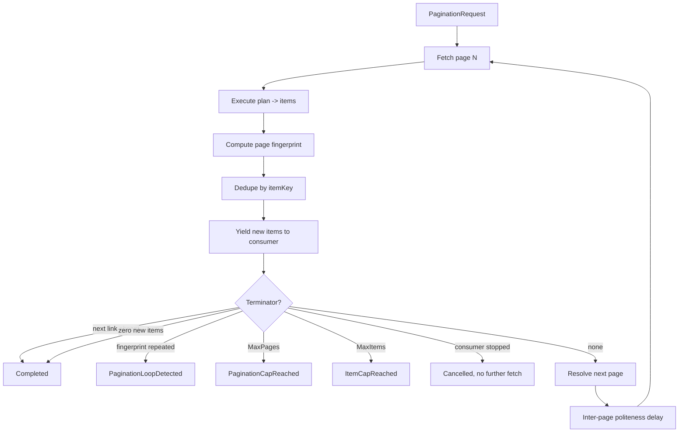

# Pagination Engine

> Feature spec for code-forge implementation planning.
> Source: extracted from docs/sanare/tech-design.md §8
> Created: 2026-09-06

| Field | Value |
|-------|-------|
| Component | pagination-engine |
| Priority | P0 |
| SRS Refs | — (no SRS; traces to tech-design §3.6 AC-016, AC-017, AC-018) |
| Tech Design | §8.1 — row 10 "Pagination Engine"; §8.3.4 (pagination flow); §7.4 (caps); §7.4 (edge cases) |
| Depends On | plan-runtime |
| Blocks | quality-evaluator (item-count health), sample-app-lenovo |

## Purpose

The brief requires paginated endpoints, and a lister like the Lenovo tablet catalogue is exactly that. This
component drives the page loop: fetch, extract, dedupe, decide whether to continue, and stream. Streaming
matters as much as looping — a caller that wants the first 20 tablets should cause 1 page fetch, not 12,
because the cheapest way to be polite to a site is not to ask it for pages nobody reads.

## Scope

**Included:**

- `IPaginationDriver` — drive a lister plan across pages and stream items.
- The seven strategies: `None`, `NextLink`, `PageNumber`, `Offset`, `Cursor`, `LoadMoreButton`,
  `InfiniteScroll`.
- Next-page resolution per strategy, including URL templating and cursor extraction.
- Item de-duplication by the plan's declared `itemKey`.
- Terminator detection: absent next link, repeated page fingerprint, zero new items, `MaxPages`,
  `MaxItems`.
- Politeness delay between pages (delegated to the acquisition limiter, plus an explicit inter-page delay).
- Streaming via `IAsyncEnumerable<T>` with correct early-stop semantics.
- Partial-pagination reporting when the loop stops on a cap or an error.
- Per-page provenance so an item can be traced to the page and locator that produced it.

**Excluded:**

- Fetching (acquisition) and extracting (plan runtime) — both are called, neither is reimplemented.
- Browser scroll/click mechanics — declared here, executed by `browser-tier`.
- Deciding the strategy — chosen at authoring time and recorded in the plan.
- Cross-run incremental crawling / change detection — out of scope for v1.

## Core Responsibilities

1. **Loop** over pages, calling acquisition + runtime once per page.
2. **Resolve** the next page for the declared strategy, or stop.
3. **Dedupe** items so a repeated or overlapping page cannot inflate results.
4. **Terminate** safely — every strategy has at least two independent stop conditions.
5. **Stream** results and stop fetching the moment the consumer stops consuming.
6. **Report** how the loop ended: complete, capped, looped, or failed.

## Interfaces

### Inputs

- **`PaginationRequest`** — plan, schema, start URL, `PaginationPolicy` (`MaxPages`, `MaxItems`,
  `InterPageDelay`), cancellation token.
- **`ExtractionPlan.pagination`** — `strategy`, `nextSelector` / `urlTemplate` / `cursorPointer`,
  `maxPages`, `itemKey`, `totalPagesLocator`.

### Outputs

- **`IAsyncEnumerable<PagedItem<T>>`** — each item with `PageNumber`, `PageUrl`, and its
  `FieldObservation` set.
- **`PaginationSummary`** — pages fetched, items yielded, items deduped, termination reason, per-page
  timings.

### Dependencies

- **`plan-runtime`** — per-page extraction.
- **`acquisition-pipeline`** / **`browser-tier`** — page acquisition (invoked through the same abstraction
  the single-page path uses).
- **`observability`** — page-loop metrics.

## Data Flow



## Key Behaviors

### Interface

```csharp
public interface IPaginationDriver
{
    IAsyncEnumerable<PagedItem<T>> StreamAsync<T>(
        PaginationRequest request, CancellationToken ct = default);

    ValueTask<PaginationSummary> GetSummaryAsync(string runId, CancellationToken ct = default);
}

public sealed record PagedItem<T>(
    T Value, int PageNumber, string PageUrl, IReadOnlyList<FieldObservation> Observations);
```

### Strategy semantics

| Strategy | Next-page resolution | Stops when | Tier |
|----------|---------------------|------------|------|
| `None` | — | after page 1 | any |
| `NextLink` | `link[rel=next]` href, else `nextSelector`'s href, resolved against the base URI | selector absent or href equals the current URL | any |
| `PageNumber` | `urlTemplate` with `{page}` incremented; upper bound from `totalPagesLocator` when present | page > total, or an empty page | any |
| `Offset` | `urlTemplate` with `{offset}` += `{limit}` | returned count < limit, or empty | any |
| `Cursor` | token at `cursorPointer` in the payload | token absent, null, empty, or identical to the previous token | any |
| `LoadMoreButton` | click the declared button, wait for item count to grow | button absent/disabled, count unchanged, or `MaxClicks` (default 50) | Browser only |
| `InfiniteScroll` | scroll to bottom, wait for stability | item count unchanged after 2 consecutive scrolls, or `MaxScrolls` (default 50) | Browser only |

`LoadMoreButton` and `InfiniteScroll` in a non-browser plan are rejected at validation with
`SNR-PAG-003` — they are physically impossible over raw HTTP, so this is a plan defect, not a run-time
surprise.

### De-duplication and loop detection

- `itemKey` is a JSON pointer into the extracted item (typically the product URL or SKU). Keys are compared
  ordinally after trimming.
- A `HashSet<string>` of seen keys spans the whole run; a repeated key is counted in
  `PaginationSummary.ItemsDeduped` and not yielded.
- The **page fingerprint** is `sha256` over the ordered item keys of the page. A fingerprint equal to any
  previous page's fingerprint terminates the loop with `SNR-PAG-002 PaginationLoopDetected`. This catches the
  common real-world failure where `?page=99` silently serves page 1 again.
- A page yielding **zero new items** terminates normally (`Completed`), not as an error — many listers pad a
  final empty page.
- If `itemKey` is absent from an item, the item is still yielded but excluded from dedupe, with a warning
  diagnostic; a run where > 20 % of items lack keys emits `SNR-PAG-004` so the evaluator can see that dedupe
  is effectively off.

### Caps and status mapping

| Condition | Summary reason | Run status |
|-----------|----------------|------------|
| Natural end | `Completed` | `Succeeded` |
| `MaxPages` (default 100, ceiling 10 000) | `PaginationCapReached` + `SNR-PAG-005` | `PaginationCapReached` |
| `MaxItems` (1…1 000 000) | `ItemCapReached` + `SNR-PAG-006` | `Succeeded` when the cap was the caller's explicit request; `PartialPagination` when it was the configured default |
| Loop detected | `LoopDetected` | `PartialPagination` |
| Page N failed after retries | `PageFailed` | `PartialPagination`, with the items from pages 1…N-1 preserved |

Partial results are always returned. Losing 11 good pages because page 12 timed out would be the wrong
trade for an aggregation pipeline.

### Streaming and early stop

- Implemented with `[EnumeratorCancellation]` and `await foreach`; the next page is fetched **lazily**, only
  when the consumer requests an item beyond the current page's buffer.
- A consumer that breaks after 20 items on a 24-item first page causes exactly **one** fetch (AC-018).
- Cancellation propagates into the in-flight acquisition and abandons the loop within one page boundary.
- A `PaginationSummary` is emitted even for an abandoned enumeration, via the run record.

### Single-page listers

A lister that fits on one page uses `strategy: None`, terminates after page 1, and emits **no** cap warning
(§7.4 edge case) — a warning there would be noise the evaluator would have to learn to ignore.

### Politeness

Between pages the driver waits `max(InterPageDelay, limiterDelay)` where `InterPageDelay` defaults to 750 ms
with ±20 % jitter. The per-host limiter is still authoritative; the inter-page delay only ever makes the
crawl slower, never faster.

## Constraints

- **Never fetch a page the consumer will not see** (lazy streaming).
- **Every strategy has ≥ 2 stop conditions** — one intended and one defensive; unbounded loops are
  structurally impossible.
- Memory is bounded: only item keys (not items) are retained across pages.
- Page order is preserved in the yielded stream.
- Browser-only strategies are validated against the plan tier.
- No test may sleep in real time; the inter-page delay uses an injected `TimeProvider`.

## Acceptance Criteria

| AC-ID | Priority | Criterion | Expected Result | Verification Method |
|-------|----------|-----------|-----------------|---------------------|
| AC-016 | P0 | Given the Lenovo tablet lister fixtures spanning 3 pages | All items across all pages are returned in page order with no duplicates | Integration — fixture replay |
| AC-017 | P0 | Given a lister whose page 4 serves page 1's content again | The loop stops with `SNR-PAG-002 PaginationLoopDetected` and pages 1–3's items are returned | Integration — loop fixture |
| AC-018 | P0 | Given a consumer that stops after 20 items of a 24-item first page | Exactly one page fetch occurs | Integration — fetch counter |
| AC-PAG-001 | P0 | Given `MaxPages = 2` over a 5-page lister | 2 pages are fetched; status is `PaginationCapReached`; items from both pages are returned | Unit — cap boundary |
| AC-PAG-002 | P0 | Given `MaxItems = 30` with 24 items per page | The loop stops mid-page 2 at exactly 30 items; no third fetch occurs | Unit — item cap boundary |
| AC-PAG-003 | P0 | Given a single-page lister with `strategy: None` | One fetch, `Completed`, no cap warning emitted | Unit — edge case |
| AC-PAG-004 | P0 | Given a final page containing only items already seen | The loop ends as `Completed`, not `LoopDetected` | Unit — zero-new-items vs fingerprint distinction |
| AC-PAG-005 | P0 | Given a `NextLink` href identical to the current page URL | The loop terminates instead of self-looping | Unit — self-reference guard |
| AC-PAG-006 | P0 | Given a `Cursor` strategy where the cursor repeats | Terminates with `LoopDetected` | Unit |
| AC-PAG-007 | P0 | Given a `LoadMoreButton` strategy in a Tier 2 (HTML) plan | Plan validation fails with `SNR-PAG-003` | Unit — negative |
| AC-PAG-008 | P0 | Given page 3 of 5 failing after retries | Pages 1–2's items are returned with status `PartialPagination` and a diagnostic naming page 3 | Integration — fault injection |
| AC-PAG-009 | P0 | Given cancellation during page 2 | Enumeration stops within one page boundary and no page 3 request is issued | Integration — cancellation |
| AC-PAG-010 | P0 | Given items whose `itemKey` pointer is absent | Items are still yielded, dedupe is skipped for them, and > 20 % triggers `SNR-PAG-004` | Unit — degraded dedupe |
| AC-PAG-011 | P0 | Given a 100-page crawl | Retained memory grows with keys only; item objects are not accumulated | Integration — memory assertion |
| AC-PAG-012 | P0 | Given `MaxPages = 20 000` requested | Clamped to the 10 000 ceiling with a warning | Unit — validation bound |
| AC-PAG-013 | P1 | Given an `Offset` lister whose last page returns fewer than `limit` items | The loop ends after that page | Unit |
| AC-PAG-014 | P1 | Given `PageNumber` with a `totalPagesLocator` reading 3 | Exactly 3 pages are fetched even if `MaxPages` is 100 | Unit |
| AC-PAG-015 | P1 | Given an `InfiniteScroll` lister whose item count stops growing | Scrolling stops after 2 stable iterations, well below `MaxScrolls` | Integration — browser |
| AC-PAG-016 | P1 | Given `InterPageDelay = 750 ms` across 3 pages | A fake `TimeProvider` observes two delays of 750 ms ± 20 %; the test completes in milliseconds | Unit — politeness without sleeping |

## Error Handling

| Code | Raised when | Severity | Status | Behavior |
|------|-------------|----------|--------|----------|
| `SNR-PAG-001` | Next-page resolution failed (template/cursor unusable) | Error | `PartialPagination` | Return items collected so far |
| `SNR-PAG-002` | Page fingerprint repeated | Warning | `PartialPagination` | Terminate loop, keep items |
| `SNR-PAG-003` | Browser-only strategy in a non-browser plan | Error | `PlanInvalid` | Rejected at validation |
| `SNR-PAG-004` | More than 20 % of items lack an `itemKey` | Warning | unchanged | Dedupe degraded; evaluator signal |
| `SNR-PAG-005` | `MaxPages` hit | Info | `PaginationCapReached` | Items returned |
| `SNR-PAG-006` | `MaxItems` hit | Info | `Succeeded` / `PartialPagination` | Items returned |

## File Structure

```
src/
└── Sanare.Core/
    └── Pagination/
        ├── IPaginationDriver.cs
        ├── PaginationDriver.cs
        ├── PaginationRequest.cs
        ├── PaginationPolicy.cs
        ├── PaginationSummary.cs
        ├── PagedItem.cs
        ├── PaginationTerminationReason.cs
        ├── Strategies/
        │   ├── IPaginationStrategy.cs
        │   ├── NoPaginationStrategy.cs
        │   ├── NextLinkStrategy.cs
        │   ├── PageNumberStrategy.cs
        │   ├── OffsetStrategy.cs
        │   ├── CursorStrategy.cs
        │   ├── LoadMoreButtonStrategy.cs
        │   └── InfiniteScrollStrategy.cs
        ├── Dedupe/
        │   ├── ItemKeyExtractor.cs
        │   └── PageFingerprint.cs
        └── PaginationValidator.cs
```

## Test Module

**Test file**: `tests/Sanare.Core.Tests/Pagination/PaginationDriverTests.cs`

**Test scope**:

- **Unit**: one class per strategy covering next-page resolution, natural termination, and the defensive
  terminator; fingerprint equality; item-key extraction including the missing-key path; cap boundaries at
  exactly the limit and one over; `MaxPages` clamping; self-referential next links; validation of
  browser-only strategies against plan tier; inter-page delay measured through a fake `TimeProvider`.
- **Integration**: full 3-page Lenovo lister replay from fixtures with a counting acquisition fake;
  early-stop fetch counting; mid-crawl failure producing `PartialPagination`; cancellation mid-page;
  memory growth over a synthetic 100-page crawl; browser-tier `InfiniteScroll` against the local test site.
- **Fixtures / Mocks**: `tests/Sanare.Core.Tests/Fixtures/Data/lenovo-com/tablet-lister-page1.html`
  … `page3.html`, `tablet-lister-loop-page4.html` (a copy of page 1), `tablet-lister-empty-page.html`,
  `bol-com/lister-cursor-page1.json` … `page2.json`; a `CountingContentAcquirer` fake that records every
  requested URL so "how many pages did we actually fetch" is directly assertable.

Companion test files: `tests/Sanare.Core.Tests/Pagination/StrategyTests.cs`,
`tests/Sanare.Core.Tests/Pagination/LoopDetectionTests.cs`,
`tests/Sanare.Core.Tests/Pagination/StreamingSemanticsTests.cs`,
`tests/Sanare.Core.Tests/Pagination/PaginationValidatorTests.cs`.
