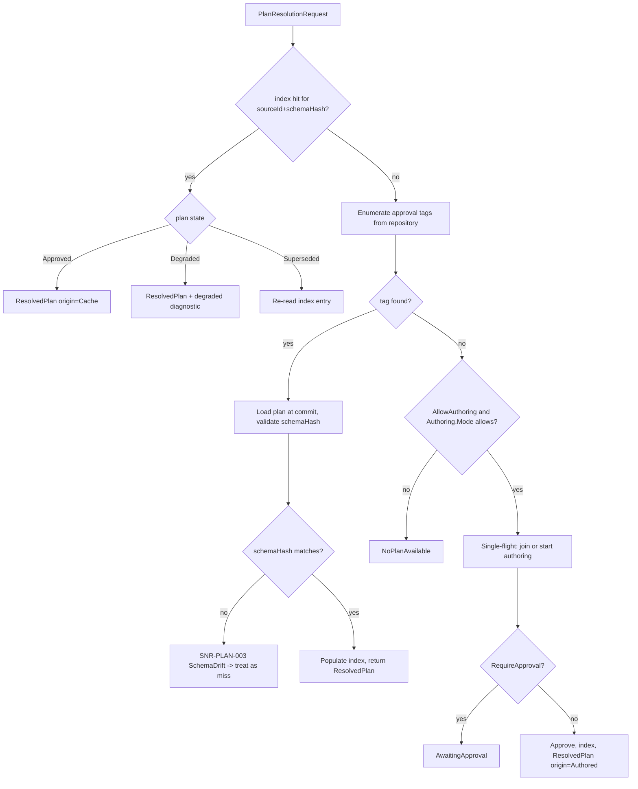

# Plan Resolver

> Feature spec for code-forge implementation planning.
> Source: extracted from docs/sanare/tech-design.md §8
> Created: 2026-09-06

| Field | Value |
|-------|-------|
| Component | plan-resolver |
| Priority | P0 |
| SRS Refs | — (no SRS; traces to tech-design §3.6 AC-001, AC-011, AC-012, AC-021) |
| Tech Design | §8.1 — row 11 "Plan Resolver"; §7.5 (plan lifecycle); §10.3 (index strategy); §11.2 (authorization) |
| Depends On | script-repository, extraction-plan-model |
| Blocks | scrape-api-contracts (RunAsync entry path), authoring-workflow, healing-workflow |

## Purpose

Every consumer request starts here: *for this source and this schema, is there an approved plan, and which
commit is it?* The resolver answers that in microseconds from a warm cache, decides whether to trigger
authoring when the answer is "no", and guarantees that two simultaneous requests for an unauthored source
produce **one** authoring run rather than two. It is also the component that makes cache keys correct, by
being the single place a plan commit id is bound to a request.

## Scope

**Included:**

- `IPlanResolver` — resolve `(sourceId, schemaHash)` → `ResolvedPlan` (plan + commit id + approval tag).
- The approved-plan index: git approval tags materialised into an in-memory `ConcurrentDictionary`.
- Cache invalidation on repository change (new tag, rollback, branch update).
- Plan lifecycle state evaluation: `Approved`, `AwaitingApproval`, `Degraded`, `Superseded`, `Absent`.
- Miss handling: trigger authoring, return `NoPlanAvailable`, or return `AwaitingApproval` per policy.
- **Single-flight coalescing** of concurrent authoring triggers per `(sourceId, schemaHash)`.
- Schema-hash compatibility checks — a schema change invalidates a plan.
- Preview resolution (explicit opt-in to a candidate plan, for the admin/dev path).
- Emitting the commit id that the result cache key and the run record must carry.

**Excluded:**

- Reading/writing git objects — `script-repository`.
- Producing plans — `authoring-workflow`.
- Deciding a plan has degraded — `quality-evaluator` (this component only reads the flag).
- Executing plans — `plan-runtime`.

## Core Responsibilities

1. **Resolve** the approved plan for a request, fast and correctly.
2. **Index** approval tags and keep the index coherent with the repository.
3. **Coalesce** concurrent misses into one authoring run.
4. **Enforce** that only `Approved` plans serve normal traffic.
5. **Detect** schema drift and refuse a plan authored for a different schema hash.
6. **Expose** the resolved commit id so caching and provenance stay honest.

## Interfaces

### Inputs

- **`PlanResolutionRequest`** — `SourceId`, `SchemaHash`, `SchemaName`, `SchemaVersion`, `Mode`
  (`ApprovedOnly` | `AllowPreview`), `AllowAuthoring`.
- **Repository change notifications** from `script-repository`.
- **Source health flags** from `quality-evaluator` (`Degraded`).

### Outputs

- **`ResolvedPlan`** — `ExtractionPlan`, `CommitId`, `ApprovalTag`, `PlanState`, `ResolvedAt`, `Origin`
  (`Cache` | `Repository` | `Authored`).
- **`PlanResolutionFailure`** — status (`NoPlanAvailable`, `AwaitingApproval`, `AuthoringFailed`,
  `SchemaValidationFailed`) with an error code and message.

### Dependencies

- **`script-repository`** — tag enumeration, plan load by commit, change notifications.
- **`extraction-plan-model`** — plan deserialization and validation.
- **`authoring-workflow`** — invoked on a miss (via an interface, to avoid a package cycle).

## Data Flow



## Key Behaviors

### Interface

```csharp
public interface IPlanResolver
{
    ValueTask<PlanResolution> ResolveAsync(
        PlanResolutionRequest request, CancellationToken ct = default);

    void Invalidate(string sourceId, string? schemaHash = null);

    PlanIndexStatistics GetStatistics();
}

public readonly record struct PlanResolution(
    ResolvedPlan? Plan, ScrapeStatus Status, string? ErrorCode, string? Message)
{
    public bool IsResolved => Plan is not null;
}
```

### The index

- Key: `(sourceId, schemaHash)`. Value: `ResolvedPlan` plus the tag name and commit id.
- Built lazily on first miss for a source, and eagerly at startup when
  `Resolver.PreloadOnStart = true` (the production default — a cold first request should not pay for tag
  enumeration).
- Backed by `ConcurrentDictionary`; reads are lock-free.
- The approval tag namespace `approved/{source-id}/{schema-name}@{schemaVersion}/{n}` is enumerated and the
  **highest `n`** wins. `n` is a monotonic integer, so a rollback is a *new* tag pointing at an *older*
  commit, and the resolver needs no special rollback logic — the highest tag is always the truth.

### Invalidation

| Event | Action |
|-------|--------|
| New approval tag | Replace the entry for that `(sourceId, schemaHash)` |
| Rollback (new tag → older commit) | Same path; the entry now points at the older commit |
| Heal branch commit | No effect — heal branches are not approved |
| Repository externally modified (file-watcher or explicit `Invalidate`) | Drop affected entries, re-resolve on next request |
| Source config change | Drop all entries for the source |

Invalidation is by *removal*, never by mutation, so a concurrent reader either sees the old complete entry
or misses and re-resolves. There is no window where a half-updated plan is observable.

### Single-flight authoring

```
key = (sourceId, schemaHash)
if an authoring task exists for key -> await it
else -> create and register it, await, remove on completion
```

- Implemented over `ConcurrentDictionary<PlanKey, Lazy<Task<PlanResolution>>>` with
  `LazyThreadSafetyMode.ExecutionAndPublication`.
- 10 concurrent first-time requests for the same source produce exactly **one** authoring run and 10
  identical results (AC-021). Without this, the first cold request for a popular source would fan out into
  ten LLM authoring runs and ten bursts of traffic at the target — expensive and rude.
- A failed authoring task is removed immediately so the next request may retry, but a per-key
  `AuthoringCooldown` (default 5 min) prevents a hard-failing source from being re-authored on every
  request.
- Cancellation of one waiter does not cancel the shared authoring task; other waiters still complete.

### Schema drift

The plan records `schemaHash`. If the caller's hash differs, the plan is not usable — the schema is a
contract and a plan authored against a different contract may silently populate the wrong fields. The
resolver treats this as a miss (`SNR-PLAN-003`), logs the drift with both hashes, and follows the normal
miss path (authoring or `NoPlanAvailable`). It never attempts a partial reuse.

### Approval gating (§11.2)

| `RequireApproval` | `Authoring.Mode` | Behaviour on miss |
|-------------------|------------------|-------------------|
| `true` (prod default) | `Manual` | Author candidate, return `AwaitingApproval` with the candidate branch name |
| `true` | `Automatic` | Author candidate, return `AwaitingApproval` |
| `false` (dev) | `Automatic` | Author, auto-approve, tag, return the plan |
| any | authoring disabled | `NoPlanAvailable` |

`AllowPreview` mode is the only way to resolve a non-approved plan, is available through the administration
API only, and stamps `Origin = Preview` on the result so no preview run can be mistaken for production data.

### Degraded plans still serve

A plan marked `Degraded` by the evaluator is **still returned** and still executed, with a diagnostic
attached. Withholding data because quality dropped would turn a partial outage into a total one; the
aggregation pipeline is better served by degraded data plus a loud signal.

## Constraints

- Resolution from a warm index must be allocation-light and lock-free; the target is < 1 ms p99, since it is
  on every request path.
- Exactly one authoring run per `(sourceId, schemaHash)` at a time — not configurable.
- Only `Approved` plans serve non-preview traffic.
- The returned commit id is mandatory and flows into the result-cache key (AC-022) and the run record.
- No I/O on the warm path — a cache hit touches no git objects and no disk.
- Thread-safe under high concurrency; the index supports at least 10 000 entries without degradation.

## Acceptance Criteria

| AC-ID | Priority | Criterion | Expected Result | Verification Method |
|-------|----------|-----------|-----------------|---------------------|
| AC-001 | P0 | Given a source with an approved plan | Resolution returns the plan and its commit id without invoking authoring | Unit — warm path |
| AC-011 | P0 | Given a rollback tag pointing at an older commit | The resolver returns the older plan on the next request | Integration — real repository |
| AC-012 | P0 | Given no approved plan and authoring enabled with `RequireApproval = true` | Status is `AwaitingApproval`; no plan is returned; the candidate branch is named | Unit — gating |
| AC-021 | P0 | Given 10 concurrent requests for an unauthored source | Exactly 1 authoring invocation; all 10 receive identical results | Integration — concurrency |
| AC-021b | P0 | Given 10 concurrent requests where authoring fails | Exactly 1 invocation; all 10 receive the same failure; a second wave within the cooldown does not re-invoke | Integration — failure coalescing |
| AC-022 | P0 | Given a resolved plan | The returned commit id is non-empty and matches the tag's target commit | Unit — provenance |
| AC-PR-001 | P0 | Given a caller schema hash differing from the plan's | Resolution is a miss with `SNR-PLAN-003` logged, showing both hashes | Unit — schema drift |
| AC-PR-002 | P0 | Given authoring disabled and no plan | Status is `NoPlanAvailable`; authoring is never invoked | Unit — negative |
| AC-PR-003 | P0 | Given two approval tags `/1` and `/2` for the same source and schema | Tag `/2` wins | Unit — tag ordering |
| AC-PR-004 | P0 | Given approval tags `/9` and `/10` | `/10` wins (numeric, not lexicographic, ordering) | Unit — the classic ordering bug |
| AC-PR-005 | P0 | Given a new approval tag after a warm cache hit | The next resolution returns the new commit | Integration — invalidation |
| AC-PR-006 | P0 | Given `Invalidate(sourceId)` during concurrent reads | Readers see either the complete old entry or a fresh resolution; never a partial entry | Integration — race |
| AC-PR-007 | P0 | Given a plan marked `Degraded` | It is still returned, with a degradation diagnostic attached | Unit — availability over purity |
| AC-PR-008 | P0 | Given a request with `Mode = AllowPreview` and only a candidate plan | The candidate is returned with `Origin = Preview` | Unit — preview path |
| AC-PR-009 | P0 | Given a normal request and only a candidate plan | The candidate is **not** returned | Unit — negative |
| AC-PR-010 | P0 | Given a corrupt plan document at the approved commit | Resolution fails with `SNR-PLAN-001`, not a raw deserialization exception | Unit — robustness |
| AC-PR-011 | P0 | Given a warm index hit | Zero git and zero filesystem operations occur | Unit — I/O counting fake |
| AC-PR-012 | P0 | Given one waiter cancels during shared authoring | The remaining waiters still receive a result | Integration — cancellation isolation |
| AC-PR-013 | P1 | Given `PreloadOnStart = true` and 50 approved sources | All entries are indexed at startup; the first request is a warm hit | Integration — preload |
| AC-PR-014 | P1 | Given 10 000 indexed entries | Resolution p99 stays under 1 ms | Benchmark — index scale |
| AC-PR-015 | P1 | Given a source config change | All entries for that source are dropped | Unit — invalidation scope |

## Error Handling

| Code | Raised when | Severity | Status | Behavior |
|------|-------------|----------|--------|----------|
| `SNR-PLAN-001` | Plan document at the approved commit is unreadable or invalid | Error | `PlanInvalid` | Do not fall back to an older plan; surface it |
| `SNR-PLAN-003` | Plan `schemaHash` differs from the request's | Warning | miss path | Log both hashes; author or `NoPlanAvailable` |
| `SNR-GIT-002` | Tag enumeration failed | Error | `NoPlanAvailable` | Retry once, then fail |
| `AuthoringFailed` | The coalesced authoring run failed | Error | `AuthoringFailed` | Shared with all waiters; cooldown applied |

A resolver failure never falls back to an arbitrary older plan: serving data from an unknown plan version
would break the provenance guarantee the whole design rests on.

## File Structure

```
src/
└── Sanare.Core/
    └── Resolution/
        ├── IPlanResolver.cs
        ├── PlanResolver.cs
        ├── PlanResolutionRequest.cs
        ├── PlanResolution.cs
        ├── ResolvedPlan.cs
        ├── PlanKey.cs
        ├── PlanState.cs
        ├── PlanIndexStatistics.cs
        ├── Index/
        │   ├── IApprovedPlanIndex.cs
        │   ├── ApprovedPlanIndex.cs
        │   └── ApprovalTagParser.cs
        ├── SingleFlight/
        │   ├── AuthoringCoordinator.cs
        │   └── AuthoringCooldown.cs
        └── PlanIndexPreloader.cs
```

## Test Module

**Test file**: `tests/Sanare.Core.Tests/Resolution/PlanResolverTests.cs`

**Test scope**:

- **Unit**: tag parsing and numeric ordering (`/9` vs `/10`); state-to-behaviour mapping for every
  `PlanState`; approval-gating matrix across `RequireApproval` × `Authoring.Mode` × `AllowAuthoring`;
  schema-drift detection; preview mode; corrupt-plan handling; warm-hit I/O counting with a recording
  repository fake; cooldown boundaries with a fake `TimeProvider`.
- **Integration**: a real `LibGit2Sharp` repository in a temp directory exercising approve → resolve →
  rollback → resolve; invalidation under concurrent reads; 10-way single-flight with a counting authoring
  fake for both success and failure; cancellation isolation; startup preload of 50 sources.
- **Benchmark**: `benchmarks/Sanare.Benchmarks/PlanResolutionBenchmarks.cs` covering warm
  resolution at 10 000 entries.
- **Fixtures / Mocks**: `RecordingScriptRepository` (counts git operations), `CountingAuthoringWorkflow`
  (counts invocations and can be made to fail or hang), sample plan documents under
  `tests/Sanare.Core.Tests/Fixtures/Plans/`, and a fake `TimeProvider`.

Companion test files: `tests/Sanare.Core.Tests/Resolution/ApprovedPlanIndexTests.cs`,
`tests/Sanare.Core.Tests/Resolution/AuthoringCoordinatorTests.cs`,
`tests/Sanare.Core.Tests/Resolution/ApprovalTagParserTests.cs`,
`tests/Sanare.Core.Tests/Resolution/PlanResolverConcurrencyTests.cs`.
