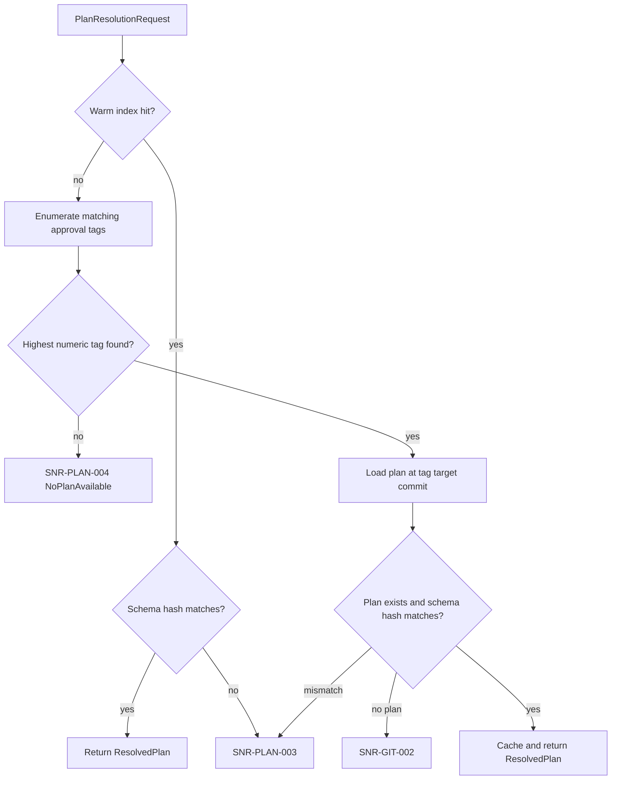

# Plan Resolver

> Feature spec for code-forge implementation planning.
> Source: extracted from docs/sanare/tech-design.md §8
> Created: 2026-09-06
> Implementation status: partial — persistent approved-plan resolution slice implemented; authoring-dependent behavior remains deferred.

| Field | Value |
|-------|-------|
| Component | plan-resolver |
| Priority | P0 |
| SRS Refs | — (no SRS; traces to tech-design §3.6 AC-001, AC-011, AC-012, AC-021) |
| Tech Design | §8.1 — row 11 "Plan Resolver"; §7.5 (plan lifecycle); §10.3 (index strategy); §11.2 (authorization) |
| Depends On | script-repository, extraction-plan-model |
| Blocks | scrape-api-contracts (RunAsync entry path), authoring-workflow, healing-workflow |

## Purpose

The implemented resolver binds an approved extraction plan and its immutable git commit to a source/schema request. It first serves compatible plans from an in-memory index and otherwise resolves the latest numbered approval tag from the script repository. It never authors or executes a plan.

## Scope

### Implemented slice

- `IPlanResolver` resolves an approved plan for `(sourceId, schemaName, schemaVersion, schemaHash)`.
- A lock-free `ConcurrentDictionary` warm index is keyed by `(sourceId, schemaName, schemaVersion)`.
- A cold resolution enumerates `approved/{source-id}/{schema-name}@{schemaVersion}/{n}` tags, selects the highest numeric `n`, loads that commit, deserializes the plan, and caches it.
- Schema-hash compatibility is checked on both warm and cold paths. A mismatch returns `SNR-PLAN-003`; an absent approval tag returns `SNR-PLAN-004`; a tag whose plan is absent returns `SNR-GIT-002`.
- `Invalidate(sourceId, schemaHash?)` drops matching warm-index entries. The `GitBackedExtractionPlanProvider` adapts this resolver to the unchanged `IExtractionPlanProvider` runner boundary.

### Deferred target-state scope

This specification also records the planned resolver behavior. Repository-change notifications and preload-on-start; plan lifecycle states beyond an approved plan or `NoPlanAvailable`; authoring on a miss, single-flight coordination, cooldowns, and `AwaitingApproval`; preview resolution; and degraded-plan diagnostics are not implemented. These require future authoring, administration, and quality-evaluator workflows.

Reading and writing git objects remains `script-repository` responsibility; producing and executing plans remain `authoring-workflow` and `plan-runtime` responsibility.

## Core Responsibilities

1. Resolve the latest approved plan for a request.
2. Cache resolved plans by source, schema name, and schema version.
3. Reject cached or loaded plans whose schema hash differs from the request.
4. Return the resolved commit id and approval tag for provenance.
5. Remove selected cached entries on explicit invalidation.

## Interfaces

### Inputs

- **`PlanResolutionRequest`** — `SourceId`, `SchemaName`, `SchemaVersion`, and `SchemaHash`.

### Outputs

- **`ResolvedPlan`** — `ExtractionPlan`, `CommitId`, and `ApprovalTag`.
- **`PlanResolution`** — a resolved plan or `PlanResolutionFailure.NoPlanAvailable` with an error code and message.

### Dependencies

- **`script-repository`** — approval-tag enumeration and plan loading at an immutable commit ref.
- **`extraction-plan-model`** — plan deserialization.
- **`IExtractionPlanProvider`** — consumed through `GitBackedExtractionPlanProvider`, preserving the runner contract.

The authoring workflow is not a dependency of the implemented resolver because a miss does not invoke authoring.

## Data Flow



## Key Behaviors

### Interface

```csharp
public interface IPlanResolver
{
    ValueTask<PlanResolution> ResolveAsync(
        PlanResolutionRequest request, CancellationToken ct = default);

    void Invalidate(string sourceId, string? schemaHash = null);
}
```

### Warm index and tag resolution

- The index key is `(sourceId, schemaName, schemaVersion)`; the schema hash is evaluated after lookup.
- A warm hit is lock-free and does not query the repository.
- On a cold request, tags in the matching approval namespace are parsed and the highest valid numeric suffix wins.
- The selected tag's target commit is used to read the plan, so a resolution is bound to immutable content.

### Schema compatibility and invalidation

- A differing request schema hash is rejected with `SNR-PLAN-003` on either a warm or cold path.
- `Invalidate` removes index entries for a source; a non-null second argument narrows removal to entries whose cached plan schema hash matches it.
- The current repository has no change notification or preload mechanism; hosts must explicitly call `Invalidate` when they need to discard cached entries.

## Constraints

- Only approval tags are eligible for resolution.
- The resolver is thread-safe and warm-path lookups use no repository I/O.
- No authoring, approval, or degraded-state policy is performed on a miss.

## Acceptance Criteria

| AC-ID | Priority | Criterion | Expected Result | Verification Method |
|-------|----------|-----------|-----------------|---------------------|
| AC-001 | P0 | Given a highest-numbered valid approval tag | Resolution returns the plan, its target commit id, and tag | Unit |
| AC-022 | P0 | Given a resolved plan | The returned commit id matches the approval tag target commit | Unit |
| AC-PR-001 | P0 | Given a caller schema hash differing from the plan's | Resolution fails with `SNR-PLAN-003` | Unit |
| AC-PR-002 | P0 | Given no matching approval tags | Resolution fails with `SNR-PLAN-004` | Unit |
| AC-PR-003 | P0 | Given a resolved plan followed by a compatible request | The second request is served from the index without repository lookup | Unit |
| AC-PR-004 | P0 | Given explicit invalidation | The next request re-reads approval tags from the repository | Unit |
| AC-PR-005 | P0 | Given a stored plan document that fails canonical deserialization | Resolution fails with `SNR-PLAN-001` and is not cached | Unit |

## Error Handling

| Code | Condition | Retryable | Resolver action |
|------|-----------|-----------|-----------------|
| `SNR-PLAN-001` | Stored plan document fails canonical deserialization | No | Return `PlanInvalid`; do not cache. |
| `SNR-PLAN-003` | Plan schema hash differs from request | No | Return unresolved result; do not cache a cold mismatch. |
| `SNR-PLAN-004` | No valid approval tag exists | No | Return `NoPlanAvailable`. |
| `SNR-GIT-002` | Selected approval-tag commit has no plan at the expected path | No | Return unresolved result. |

## File Structure

The implemented resolver is intentionally smaller than the target-state layout described elsewhere in this specification:

```
src/
└── Sanare.Core/
    └── Resolution/
        ├── ApprovalTagParser.cs
        ├── IPlanResolver.cs
        ├── PlanResolution.cs
        ├── PlanResolutionFailure.cs
        ├── PlanResolutionRequest.cs
        ├── PlanResolver.cs
        └── ResolvedPlan.cs
```

`GitBackedExtractionPlanProvider.cs` is in `Sanare.Core/` because it adapts the resolver to the existing runner-facing provider contract.

## Test Module

**Test file**: `tests/Sanare.Core.Tests/Resolution/PlanResolverTests.cs`

**Test scope**:

- **Unit**: no approval-tag miss; highest numeric tag selection (`/9` versus `/10`); schema-drift rejection on warm and cold paths; warm-hit repository-I/O avoidance; and explicit invalidation.
- **Integration**: resolver tests use the in-memory repository test double. Git-backed behavior is covered by `GitScriptRepositoryTests`.
- **Fixtures / Mocks**: a recording `IScriptRepository` test double and canonical `ExtractionPlan` fixtures.

The target-state test suite will add authoring, lifecycle, preview, preload, and concurrency cases when those capabilities are implemented.
