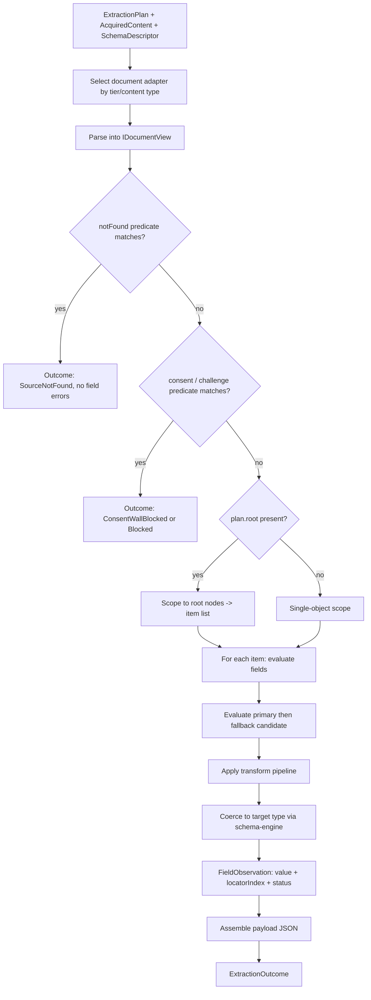

# Plan Runtime

> Feature spec for code-forge implementation planning.
> Source: extracted from docs/sanare/tech-design.md §8
> Created: 2026-09-06
> Implementation status: partial — a minimal, deterministic v0.1 HTML interpreter (`IPlanExecutor`/`PlanExecutor`, `ExtractionOutcome`, `Documents/HtmlDocument`) exists under `src/Sanare.Core/Runtime/`, matching `PlanExecutor.cs`'s own documented v0.1 operation subset. The Operations/Locators/Budgets subdirectory structure and companion test files described below are target-state and not yet built — see `docs/audit-report.md`.

| Field | Value |
|-------|-------|
| Component | plan-runtime |
| Priority | P0 |
| SRS Refs | — (no SRS; traces to tech-design §3.6 AC-002, AC-003, AC-004, AC-005, AC-014, AC-015, AC-023) |
| Tech Design | §8.1 — row 9 "Plan Runtime"; §5.1 (Solution A); §7.3 (coercion); §10.1.1 (allow-list); §17 DR-001, DR-004 |
| Depends On | schema-engine, extraction-plan-model, acquisition-pipeline |
| Blocks | pagination-engine, quality-evaluator, agent-toolset, authoring-workflow, healing-workflow |

## Purpose

This is the deterministic interpreter that turns a model-authored declarative plan plus an acquired document
into a typed object graph. It is the reason the design is safe: the LLM never executes anything, it only
proposes operations from a closed allow-list, and this hand-written .NET runtime is the only thing that
runs. It is also the reason the design is honest — it reports what it could not extract instead of quietly
returning an empty object.

## Scope

**Included:**

- `IPlanExecutor` — execute a plan against an `AcquiredContent` and produce `ExtractionOutcome`.
- Document adapters: HTML/DOM (AngleSharp), JSON (`JsonDocument`), and structured-data extraction
  (JSON-LD, microdata, `__NEXT_DATA__`, `__NUXT__`, `window.__INITIAL_STATE__`).
- The operation interpreter for all allow-listed selector, transform, and predicate operations.
- Primary-plus-fallback locator evaluation with per-candidate provenance.
- Culture-aware type coercion into the schema's target types.
- Root/item scoping for collection extraction.
- The `notFound` predicate and consent/challenge predicates.
- Per-field observation records feeding the quality report.
- Deterministic execution: same plan + same document ⇒ byte-identical output.
- Execution budgets: operation count, wall-clock, per-field time, node-set size.

**Excluded:**

- Fetching documents — `acquisition-pipeline` / `browser-tier`.
- Iterating pages — `pagination-engine` (which calls this runtime per page).
- Choosing which plan to run — `plan-resolver`.
- Authoring or repairing plans — `authoring-workflow` / `healing-workflow`.
- Scoring the result against thresholds — `quality-evaluator` consumes the observations produced here.
- Compiling C# (the opt-in Solution B escape hatch) — a separate, off-by-default executor.

## Core Responsibilities

1. **Interpret** plan operations deterministically with no dynamic code execution.
2. **Locate** values with the primary candidate, then exactly one fallback candidate, recording which one won.
3. **Coerce** raw text into the schema's types using the source culture.
4. **Report** every field's outcome: extracted (with locator index), missing, or coercion-failed.
5. **Bound** execution so a hostile or pathological document cannot hang the process.
6. **Refuse** anything outside the allow-list, loudly.

## Interfaces

### Inputs

- **`ExtractionPlan`** (validated) from `plan-resolver` or `authoring-workflow`.
- **`AcquiredContent`** from `acquisition-pipeline` / `browser-tier` / `fixture-corpus`.
- **`SchemaDescriptor`** from `schema-engine` — target types, required-ness, units, enum synonyms.
- **`RuntimeOptions`** — budgets, strictness, culture override.

### Outputs

- **`ExtractionOutcome`** — payload (`JsonElement` + typed materialisation), `IReadOnlyList<FieldObservation>`,
  diagnostics, timings, and the classification of terminal predicates (`NotFound`, `ConsentWall`, `Challenge`).

### Dependencies

- **AngleSharp** (+ `AngleSharp.XPath`) — DOM parsing and CSS/XPath queries.
- **`System.Text.Json`** — JSON documents, JsonPath-lite evaluation, output construction.
- **`schema-engine`** — coercion targets and validation.

## Data Flow



## Key Behaviors

### Interface

```csharp
public interface IPlanExecutor
{
    ValueTask<ExtractionOutcome> ExecuteAsync(
        ExtractionPlan plan,
        AcquiredContent content,
        SchemaDescriptor schema,
        RuntimeOptions options,
        CancellationToken ct = default);
}

public sealed record FieldObservation(
    string Pointer, FieldStatus Status, int? LocatorIndex,
    string? RawValue, string? CoercionError, TimeSpan Elapsed);

public enum FieldStatus { Extracted, Missing, CoercionFailed, Skipped }
```

### Document adapters

| Tier | Adapter | Notes |
|------|---------|-------|
| `JsonApi` | `JsonDocumentView` | `jsonPath` operations only; CSS/XPath rejected at validation time |
| `StructuredData` | `StructuredDataView` | Extracts JSON-LD `<script type="application/ld+json">`, microdata, and named state blobs into a JSON view, then behaves as `JsonDocumentView`; multiple JSON-LD blocks are merged by `@type` with a plan-declared preference |
| `Html` | `HtmlDocumentView` | AngleSharp DOM; CSS via `QuerySelectorAll`, XPath via `AngleSharp.XPath` |
| `Browser` | `HtmlDocumentView` | **Identical** code path over the rendered DOM — one interpreter, two sources of HTML |

Adapters expose a single `IDocumentView` abstraction so the interpreter has no tier-specific branches beyond
selection.

### Per-field selector pairs

Every eligible field declares exactly two ordered locator candidates: `PrimaryLocator` (index `0`) and
`FallbackLocator` (index `1`). They may use independent selector strategies or equivalent alternate DOM
locations, but both are intended to recover the same field value.

1. Evaluate the primary candidate through the field's complete downstream pipeline: selection, transforms,
   type coercion, and field/schema constraints. It succeeds only when that pipeline succeeds; a non-empty
   node set or raw text is not sufficient.
2. On a primary miss, a transform/operation failure, an uncoercible result, or a failed constraint, evaluate
   the fallback through that same pipeline. A successful fallback records `LocatorIndex = 1` and emits an
   `Info` diagnostic with the primary failure reason (including a transform failure, not only selection or
   coercion). The evaluator records this as a low-confidence drift signal; it is a cheap recovery, not
   silent proof that the source remains healthy.
3. If neither candidate yields a valid field value, the terminal status is derived from the fallback
   candidate's own failure reason, mirroring `schema-engine`'s structural codes (§ Validation,
   `schema-engine.md`): an absent value reports `Missing` for an optional field or `SNR-SCH-004`
   (`RequiredFieldMissing`) for a required field; a present-but-uncoercible value reports `SNR-SCH-005`
   (`TypeCoercionFailed`) regardless of required-ness; any other non-required structural constraint
   violation reports `SNR-SCH-002`. A required field never yields `Succeeded` from this branch and may
   dispatch healing when enabled.

The executor does not try a third candidate or invoke an LLM. Pair repair belongs to `healing-workflow`.

### Operation interpreter

Every operation in §10.1.1's allow-list has exactly one hand-written implementation. Grouped:

- **Selectors** — `selectFirst`, `selectAll`, `xpath`, `jsonPath`, `attribute`, `text`, `html`, `index`.
- **Text transforms** — `trim`, `collapseWhitespace`, `stripCurrency`, `stripUnit`, `regexCapture`,
  `concat`, `split`.
- **Typed transforms** — `parseInt`, `parseDecimal`, `parseBool`, `parseDate`, `resolveUrl`, `mapEnum`,
  `convertUnit`.
- **Structure transforms** — `keyValueTable`, `definitionList` (these two are what make the Lenovo spec
  table a `IReadOnlyDictionary<string,string>` in one operation).
- **Combinators / predicates** — `coalesce`, `exists`, `notFoundPredicate`.

An unknown operation name is rejected at plan validation and, defensively, again at execution with
`SNR-PLAN-002` — the runtime never falls back to "ignore the step".

`regexCapture` runs with `RegexOptions.NonBacktracking` where the pattern permits, and always with a
250 ms match timeout, so a catastrophic pattern cannot stall a run.

### Coercion

Delegated to `schema-engine` with the source culture (§7.3), covering the cases this project actually meets:
`"€ 1.299,00"` under `nl-NL`, `"12 GB"` into `int` with a stripped unit, `"ja"/"nee"` into `bool`, `mAh + V`
into `Wh` via `convertUnit`, duplicate spec-table keys suffixed `#2`. Failures are recorded per field, never
thrown, so one bad field does not lose the other forty.

### Terminal predicates

- `notFound` — matched ⇒ outcome `SourceNotFound` with **no** field errors, because a deleted product is not
  a broken scraper. This distinction is what stops the evaluator from dispatching pointless heals.
- `consent` — matched ⇒ `ConsentWallBlocked`.
- `challenge` — matched ⇒ `Blocked`.

Predicates are evaluated before field extraction, in that order.

### Determinism

- No wall-clock, no RNG, no ambient culture: `CultureInfo` comes from the plan, never from the thread.
- Node-set ordering is document order; dictionary output preserves insertion order.
- Output JSON is written with the schema's canonical property order.
- Consequence: executing the same plan against the same fixture twice produces byte-identical JSON
  (AC-023), which is what makes the heal regression gate meaningful.

### Budgets

| Budget | Default | On breach |
|--------|---------|-----------|
| Operations executed | 5 000 | `SNR-EXT-002`, partial outcome returned |
| Wall-clock per document | 10 s | `SNR-EXT-002` |
| Node set per selector | 10 000 | Truncate + warning diagnostic |
| Regex match | 250 ms | Field marked `CoercionFailed` with `SNR-EXT-003` |
| Output payload | 32 MiB | `SNR-EXT-004` |

## Constraints

- **No dynamic code execution** — no Roslyn, no scripting engine, no `EvaluateAsync` in the default path;
  an architecture test asserts the absence of those references from `Sanare.Core`.
- **One interpreter for HTML and rendered HTML** — no tier-specific extraction semantics.
- **Never throw for a field failure** — field errors are data.
- **Never return `Succeeded` with a missing required field** (AC-005).
- **Never escalate tiers at run time** (DR-004).
- Thread-safe and allocation-conscious: a single executor instance serves concurrent runs; documents are
  parsed once per page and shared across fields.

## Acceptance Criteria

| AC-ID | Priority | Criterion | Expected Result | Verification Method |
|-------|----------|-----------|-----------------|---------------------|
| AC-002 | P0 | Given the Lenovo tablet product fixture and its plan | All declared fields including the full spec-table dictionary are extracted with correct types | Integration — fixture replay with snapshot verification |
| AC-003 | P0 | Given a price `"€ 1.299,00"` and culture `nl-NL` | Coerced to `1299.00m` with currency `EUR` in the sibling field | Unit — coercion boundary |
| AC-003b | P0 | Given a price `"1,299.00"` and culture `nl-NL` | Coercion fails with `SNR-SCH-005`; no silent misparse to `1.299` | Unit — negative, the dangerous case |
| AC-004 | P0 | Given a spec table with duplicate label cells | Keys are suffixed `#2`, `#3`; no entry is lost and no exception is thrown | Unit — `keyValueTable` |
| AC-005 | P0 | Given a required field whose every locator is empty | Status is `SchemaValidationFailed`, payload is `null`, and the result includes `SNR-SCH-004` with a `Missing` observation; healing is dispatched when enabled | Unit — the core honesty guarantee |
| AC-014 | P0 | Given a plan whose primary locator broke but whose fallback matches | Extraction succeeds with `LocatorIndex = 1` and an `Info` diagnostic | Unit — primary/fallback pair |
| AC-015 | P0 | Given a page matching the `notFound` predicate | Outcome is `SourceNotFound` with zero field errors | Unit — deleted-product path |
| AC-023 | P0 | Given the same plan and fixture executed twice | The output JSON is byte-identical | Unit — determinism |
| AC-023b | P0 | Given execution on a thread with `CurrentCulture = en-US` and a plan culture of `nl-NL` | Results match the `nl-NL` expectation; ambient culture has no effect | Unit — ambient-culture immunity |
| AC-RT-001 | P0 | Given a plan operation name not on the allow-list | Execution fails with `SNR-PLAN-002`; the step is not skipped | Unit — allow-list negative |
| AC-RT-002 | P0 | Given a Tier `JsonApi` plan containing a CSS selector | Rejected at validation with `SNR-PLAN-002` | Unit — adapter/operation compatibility |
| AC-RT-003 | P0 | Given a document with 12 000 matching nodes and a cap of 10 000 | The node set is truncated with a warning; extraction continues | Unit — node-set bound |
| AC-RT-004 | P0 | Given a catastrophic regex and a hostile input | The field fails with `SNR-EXT-003` within ~250 ms; the run continues | Unit — ReDoS guard |
| AC-RT-005 | P0 | Given a plan exceeding 5 000 executed operations | Aborts with `SNR-EXT-002` and returns the partial outcome collected so far | Unit — operation budget |
| AC-RT-006 | P0 | Given malformed HTML with unclosed tags | AngleSharp's recovery is used; extraction proceeds; no exception escapes | Unit — robustness |
| AC-RT-007 | P0 | Given a JSON-LD block and a microdata block that disagree | The plan's declared preference wins deterministically | Unit — structured-data merge |
| AC-RT-008 | P0 | Given a relative `href` and `resolveUrl` | It resolves against the document base URI; a `javascript:` URL is rejected | Unit — URL safety |
| AC-RT-009 | P0 | Given `selectAll` over an empty node set for a list field | The result is an empty list, not `null` | Unit — collection semantics |
| AC-RT-010 | P0 | Given an enum label not in the synonym map | The field is `CoercionFailed`, not silently defaulted to the first enum member | Unit — negative |
| AC-RT-011 | P0 | Given a consent-wall fixture | Outcome is `ConsentWallBlocked` before any field is evaluated | Unit — predicate ordering |
| AC-RT-012 | P0 | Given 50 concurrent executions of the same plan on one executor instance | All results are correct and identical; no shared-state corruption | Integration — concurrency |
| AC-RT-013 | P1 | Given a `convertUnit` from mAh + V to Wh | The computed value matches the expected within 0.01 | Unit — unit conversion |
| AC-RT-014 | P1 | Given a browser-rendered DOM and an HTTP DOM with identical markup | Extraction produces identical output | Integration — one interpreter, two sources |
| AC-RT-015 | P1 | Given a payload exceeding 32 MiB | Fails with `SNR-EXT-004` before materialising the whole graph | Integration — output bound |

## Error Handling

| Code | Raised when | Severity | Status | Notes |
|------|-------------|----------|--------|-------|
| `SNR-EXT-001` | A selector or transform failed unexpectedly | Warning | contributes to `PartialExtraction` | Recorded per field, never thrown |
| `SNR-EXT-002` | Operation or wall-clock budget exceeded | Error | `ExtractionFailed` | Partial outcome returned |
| `SNR-EXT-003` | Regex match timeout | Warning | `PartialExtraction` | Field-scoped |
| `SNR-EXT-004` | Output payload exceeds the ceiling | Error | `ExtractionFailed` | — |
| `SNR-SCH-002` | Structural validation failed (not a required-missing or coercion case) | Error | `SchemaValidationFailed` | Null payload; heal trigger |
| `SNR-SCH-004` | Required field missing | Error | `SchemaValidationFailed` | Null payload; heal trigger |
| `SNR-SCH-005` | Type coercion failed | Error | `SchemaValidationFailed` | Null payload; heal trigger |
| `SNR-PLAN-002` | Plan version or operation is unsupported by the executing runtime/allow-list | Error | `PlanInvalid` | Compatibility and security boundary |

## File Structure

> This section is split into what is built today and what is target-state. See the top-of-file
> Implementation status and `docs/audit-report.md` NEW-007.

### Implemented (v0.1)

```
src/
└── Sanare.Core/
    └── Runtime/
        ├── IPlanExecutor.cs
        ├── PlanExecutor.cs
        ├── ExtractionOutcome.cs
        └── Documents/
            └── HtmlDocument.cs
```

### Planned / target-state (not yet built)

> The tree below is the eventual full-scope runtime described by this spec's Scope and Key Behaviors
> sections. None of it exists yet beyond the four implemented files listed above — no `Operations/`,
> `Locators/`, or `Budgets/` subdirectory, no `FieldObservation.cs` or `RuntimeOptions.cs`, and no
> additional `Documents/` adapters (`IDocumentView.cs`, `HtmlDocumentView.cs`, `JsonDocumentView.cs`,
> `StructuredDataView.cs`, `StructuredDataExtractor.cs`, `DocumentViewFactory.cs`) have been built.

```
src/
└── Sanare.Core/
    └── Runtime/
        ├── IPlanExecutor.cs
        ├── PlanExecutor.cs
        ├── ExtractionOutcome.cs
        ├── FieldObservation.cs
        ├── RuntimeOptions.cs
        ├── Documents/
        │   ├── IDocumentView.cs
        │   ├── HtmlDocumentView.cs
        │   ├── JsonDocumentView.cs
        │   ├── StructuredDataView.cs
        │   ├── StructuredDataExtractor.cs
        │   └── DocumentViewFactory.cs
        ├── Operations/
        │   ├── IOperation.cs
        │   ├── OperationRegistry.cs
        │   ├── Selectors/
        │   │   ├── SelectFirstOperation.cs
        │   │   ├── SelectAllOperation.cs
        │   │   ├── XPathOperation.cs
        │   │   ├── JsonPathOperation.cs
        │   │   ├── AttributeOperation.cs
        │   │   ├── TextOperation.cs
        │   │   ├── HtmlOperation.cs
        │   │   └── IndexOperation.cs
        │   ├── Transforms/
        │   │   ├── TrimOperation.cs
        │   │   ├── CollapseWhitespaceOperation.cs
        │   │   ├── StripCurrencyOperation.cs
        │   │   ├── StripUnitOperation.cs
        │   │   ├── RegexCaptureOperation.cs
        │   │   ├── ConcatOperation.cs
        │   │   ├── SplitOperation.cs
        │   │   ├── ParseIntOperation.cs
        │   │   ├── ParseDecimalOperation.cs
        │   │   ├── ParseBoolOperation.cs
        │   │   ├── ParseDateOperation.cs
        │   │   ├── ResolveUrlOperation.cs
        │   │   ├── MapEnumOperation.cs
        │   │   └── ConvertUnitOperation.cs
        │   ├── Structure/
        │   │   ├── KeyValueTableOperation.cs
        │   │   └── DefinitionListOperation.cs
        │   └── Predicates/
        │       ├── CoalesceOperation.cs
        │       ├── ExistsOperation.cs
        │       └── NotFoundPredicateOperation.cs
        ├── Locators/
        │   ├── PrimaryFallbackEvaluator.cs
        │   └── LocatorResult.cs
        └── Budgets/
            ├── ExecutionBudget.cs
            └── BudgetExceededException.cs
```

## Test Module

> This section is split into what is built today and what is target-state. See the top-of-file
> Implementation status and `docs/audit-report.md` NEW-007.

### Implemented (v0.1)

**Test file**: `tests/Sanare.Core.Tests/Runtime/FixtureScrapeRunnerTests.cs`

**Test scope**: end-to-end coverage of the v0.1 HTML interpreter through `FixtureScrapeRunner` —
successful extraction, missing required field, malformed request URL, unresolvable culture,
non-required-field coercion failure, missing plan, missing fixture, determinism across repeated runs
(matching status, payload, and schema hash), and the `StreamAsync` not-supported path. Fixtures are
provided as inline HTML strings in the test file rather than from the `Fixtures/Data/` corpus.

### Planned / target-state (not yet built)

> The test inventory below is the eventual full-scope suite described by this spec's Scope and Key
> Behaviors sections. None of it exists yet beyond `FixtureScrapeRunnerTests.cs` listed above.

**Test file**: `tests/Sanare.Core.Tests/Runtime/PlanExecutorTests.cs`

**Test scope**:

- **Unit**: one focused test class per operation family, each covering a happy case, an empty-input case,
  and a malformed-input case; primary/fallback candidate ordering; predicate precedence; culture matrix for
  `nl-NL` / `en-US` / `de-DE` on decimals, dates, and booleans; duplicate-key spec tables; enum synonym
  misses; budget boundaries at exactly the limit and one over; ambient-culture immunity; determinism by
  double execution and byte comparison.
- **Integration**: full replay of the Lenovo lister and product fixtures with Verify snapshots of the
  produced JSON; identical-output comparison between `HtmlDocumentView` over raw HTML and over a
  browser-rendered DOM of the same markup; 50-way concurrent execution; a bol.com JSON fixture through the
  `JsonApi` adapter.
- **Fixtures / Mocks**: `tests/Sanare.Core.Tests/Fixtures/Data/lenovo-com/` (lister pages,
  `tablet-product-yoga-tab-gen2.html` with its full spec table, `product-not-found.html`,
  `consent-wall.html`, `malformed.html`), `bol-com/product-lister.json`, plus hand-written minimal
  documents for each operation's edge cases. No network and no browser in the default suite.

Companion test files: `tests/Sanare.Core.Tests/Runtime/OperationTests.cs`,
`tests/Sanare.Core.Tests/Runtime/PrimaryFallbackEvaluatorTests.cs`,
`tests/Sanare.Core.Tests/Runtime/CoercionMatrixTests.cs`,
`tests/Sanare.Core.Tests/Runtime/StructuredDataViewTests.cs`,
`tests/Sanare.Core.Tests/Runtime/DeterminismTests.cs`.
