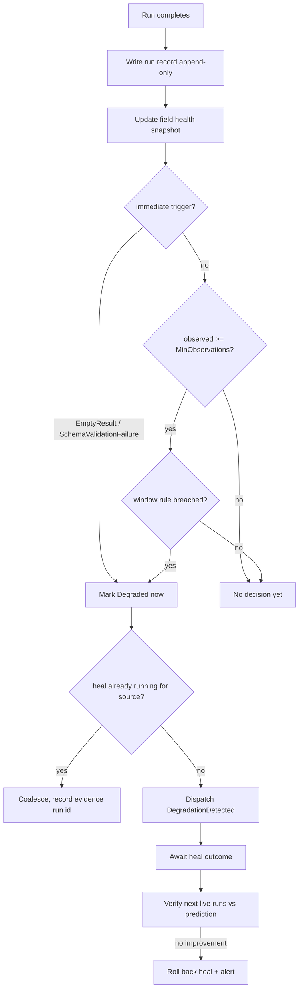

# Quality Evaluator

> Feature spec for code-forge implementation planning.
> Source: extracted from docs/sanare/tech-design.md §8
> Created: 2026-09-06

| Field | Value |
|-------|-------|
| Component | quality-evaluator |
| Priority | P0 |
| SRS Refs | — (no SRS; traces to tech-design §3.6 AC-014, AC-015, AC-016, AC-017) |
| Tech Design | §8.1 — row 14 "Quality Evaluator"; §7.5 (field health computation rules); §7.4 (edge cases); §10.1.3 (run record); §10.3 (index strategy) |
| Depends On | schema-engine, plan-resolver |
| Blocks | healing-workflow, observability |

## Purpose

A scraper that quietly returns `null` for the price field is worse than one that crashes, because nothing
downstream notices until someone asks why the product feed looks wrong. This component is the noticing.

It records what every run actually produced, maintains per-field health over a trailing window, compares
it against the baseline measured when the plan was approved, and decides when a plan has stopped working
well enough to warrant a heal. It is the trigger source for the self-healing loop and the data source for
the quality report returned to every caller.

## Scope

**Included:**

- Run record persistence (`telemetry/runs/{yyyy-MM-dd}/{run-id}.json`) — append-only.
- Per-field health aggregation: `nullRate`, `coerceFailRate`, `drift`, `observed`, item counts.
- Baselines captured at plan approval time.
- Degradation rules, both windowed and immediate-trip.
- `DegradationDetected` dispatch to the healing workflow, with coalescing.
- The `QualityReport` attached to every `ScrapeResult<T>`.
- Health snapshot persistence (`telemetry/health/{source-id}.json`) and the per-source ring buffer.
- Post-heal verification: comparing predicted improvement against the next live runs.
- Alerting when healing is exhausted or degradation persists.

**Excluded:**

- Producing the runs — `plan-runtime` / `scrape-api-contracts` emit the per-field observations.
- Repairing anything — `healing-workflow`.
- OTel export, log enrichment, and redaction plumbing — `observability` (this component supplies metrics
  to it).
- Retention/pruning of telemetry beyond the ring buffer — `hosting-configuration`.

## Core Responsibilities

1. **Record** every run, including failed ones, with per-field outcomes.
2. **Aggregate** field health over the trailing window.
3. **Compare** against the approval-time baseline.
4. **Decide** whether a plan is `Degraded`, immediately or on a window condition.
5. **Dispatch** one heal per source at a time.
6. **Verify** that a heal actually improved production behaviour, and roll it back if not.
7. **Report** quality to the caller and to the metrics pipeline.

## Interfaces

### Inputs

- **`RunObservation`** — the run record produced at the end of every `RunAsync`/`StreamAsync`:
  `RunId`, `SourceId`, `SchemaHash`, `PlanCommitId`, `Status`, `Tier`, `Origin`, `PagesFetched`,
  `ItemCount`, `Fields[]` (`Pointer`, `Observed`, `Missing`, `CoercionFailed`, `LocatorIndex`,
  `PrimaryFailureReason`), `Diagnostics[]`, `HttpStatusCounts`, `BytesDownloaded`, `LlmTokens`,
  `DurationMs`. `LocatorIndex = 1` records a valid fallback selection and `PrimaryFailureReason` preserves
  why candidate 0 did not complete its pipeline.

### Outputs

- **`QualityReport`** — `Score`, `FieldHealth[]`, `MissingRequiredFields[]`, `ItemCount`,
  `IsDegraded`, `BaselineComparison`, `Warnings[]`.
- **`DegradationDetected`** — `SourceId`, `SchemaHash`, `PlanCommitId`, `FailingFields[]`,
  `Classification hint`, `EvidenceRunIds[]`, `TriggeredBy` (rule name).
- **`FieldHealthSnapshot`** — persisted per source.

### Dependencies

- **`plan-resolver`** — to mark a plan `Degraded` and to read the approval-time baseline.
- **`schema-engine`** — required-ness and field weights.
- **`healing-workflow`** — dispatch target (via an abstraction so the dependency is one-way at build time).
- `TimeProvider` — all windowing is clock-driven and must be fake-able.

## Data Flow



## Key Behaviors

### Interfaces

```csharp
public interface IQualityEvaluator
{
    ValueTask RecordAsync(RunObservation observation, CancellationToken ct = default);
    ValueTask<FieldHealthSnapshot> GetHealthAsync(string sourceId, string schemaHash, CancellationToken ct = default);
    ValueTask<QualityReport> BuildReportAsync(RunObservation observation, CancellationToken ct = default);
    ValueTask CaptureBaselineAsync(string sourceId, string schemaHash, string planCommitId, CancellationToken ct = default);
}
```

### Field health computation (§7.5, verbatim rules)

Over the trailing window `W` — **20 runs or 7 days, whichever is smaller**:

```
nullRate(f)     = missing(f) / observed(f)
coerceFailRate  = coercionErrors(f) / observed(f)
drift(f)        = | nullRate_window − nullRate_baseline |
baseline(f)     = nullRate measured at plan approval time
```

### Degradation rules

Windowed rules require `observed ≥ MinObservations` (default 5) and any of:

| Rule | Condition | Applies to |
|------|-----------|-----------|
| `NullRateDrift` | `nullRate(f) − baseline(f) > NullRateDelta` (default 0.25) | required fields |
| `CoercionFailure` | `coerceFailRate > 0.10` | any field |
| `ItemCountCollapse` | `itemCount < 50 %` of the trailing median | collection schemas |
| `FallbackRecoveryRate` | `fallbackRate(f) > FallbackRateDelta` (default 0.10), where `fallbackRate(f) = count(LocatorIndex == 1) / observed(f)` | any field with a fallback candidate |

`FallbackRecoveryRate` is the only rule that dispatches `DegradationDetected` with `Classification hint =
FallbackRecovered` rather than `Unknown`; the healing workflow's classifier (§ Step 3, `healing-workflow.md`)
still re-derives the classification independently from fresh evidence, but the hint lets the evaluator
route straight to candidate replenishment instead of a full diff when the pattern is already this legible
from telemetry alone.

Immediate triggers fire on a **single** run, with no window and no `MinObservations` gate:

| Rule | Condition |
|------|-----------|
| `EmptyResult` | zero items from a lister that previously returned items |
| `SchemaValidationFailure` | run ended with `ScrapeStatus.SchemaValidationFailed` (`SNR-SCH-002` or `SNR-SCH-004`) |
| `ConsentWallBlocked` | run ended in `ConsentWallBlocked` |
| `BlockedStreak` | `Blocked` on 3 consecutive runs |

The `EmptyResult` immediacy is deliberate and is called out in §7.4's edge cases: waiting five runs to
notice that a product lister returned nothing means five cycles of an empty product feed. One empty run
where there used to be 40 tablets is already conclusive.

Conversely, a lister that has **never** returned items has no `previously-populated` baseline, so
`EmptyResult` does not fire on it — that is an authoring failure, not a degradation, and is handled at
approval time.

### Baselines

`CaptureBaselineAsync` is called when a plan is approved. It records, per field, the `nullRate` observed
during validation (usually 0.0 for required fields, possibly non-zero for genuinely optional fields such
as a discount price that only some products have). Without a baseline, a field that is legitimately absent
80 % of the time would look permanently degraded.

Baselines are stored with the plan commit id. A new approved plan gets a fresh baseline; the old one is
retained for post-heal comparison.

### Coalescing and dispatch

- **One heal per source at a time** (§7.4, *not configurable*). A second trigger while a heal is running is
  coalesced: its run id is appended to the in-flight heal's evidence set.
- Dispatch is fire-and-forget from the run path — evaluating quality must never add latency to a consumer's
  request. Recording is done on the completion path; dispatch is queued.
- A degraded plan **keeps serving**. Degradation marks the plan and starts a heal; it does not stop the
  source from returning data. Partial data plus an honest `IsDegraded` flag beats no data.

### Post-heal verification

After a heal is promoted, the evaluator compares the next `VerificationRuns` (default 5) against the
heal's predicted per-field improvement:

1. If observed health meets or beats the prediction → heal confirmed, new baseline captured.
2. If health is unchanged or worse → automatic rollback to the previous approved commit, alert raised,
   and the heal branch retained for human inspection.

This closes the loop the user asked for: the system does not merely attempt a fix, it checks that the fix
worked against real traffic, and undoes it when it did not.

### Storage

- Run records: `telemetry/runs/{yyyy-MM-dd}/{run-id}.json`, append-only, one file per run, ULID run ids
  so the filename sorts chronologically.
- Health snapshots: `telemetry/health/{source-id}.json`, rewritten atomically (temp file + rename).
- In memory: a per-source ring buffer of the last 20 observations, so the windowed rules evaluate without
  reading the disk on every run.
- Cold start rebuilds the ring buffer from the most recent run records for the source; a missing or
  corrupt health snapshot is rebuilt rather than treated as fatal.

## Constraints

- **Recording must not fail a run.** A telemetry write error is logged and swallowed; the caller still gets
  their data.
- **Evaluation is off the hot path** — recording is cheap (one file write), dispatch is queued.
- **All windowing uses `TimeProvider`** so tests control the clock; no test sleeps.
- **Append-only**: run records are never mutated. Corrections are new records.
- **Immediate triggers bypass `MinObservations` entirely** — implementing them as a special case of the
  windowed rules is the classic mistake here.
- Health snapshots contain counters and pointers only, never page content (§11.3).
- One heal per source; the limit is not configurable.

## Acceptance Criteria

| AC-ID | Priority | Criterion | Expected Result | Verification Method |
|-------|----------|-----------|-----------------|---------------------|
| AC-014 | P0 | Given a required field missing in 30 % more runs than baseline over the window | The plan is marked `Degraded` and a heal is dispatched | Unit — windowed rule |
| AC-015 | P0 | Given a lister that returned 40 items yesterday and 0 today | Degradation fires **on that single run**, with no `MinObservations` wait | Unit — immediate trigger |
| AC-016 | P0 | Given a degradation while a heal is already running for the source | No second heal starts; the run id is appended to the in-flight evidence set | Unit — coalescing |
| AC-017 | P0 | Given a promoted heal whose next 5 runs show no improvement | The heal is rolled back automatically and an alert is raised | Integration — verification loop |
| AC-QE-001 | P0 | Given `observed = 4` and a breached null-rate rule | No degradation (below `MinObservations = 5`) | Unit — boundary |
| AC-QE-002 | P0 | Given `observed = 5` and the same breach | Degradation fires | Unit — boundary |
| AC-QE-003 | P0 | Given `nullRate − baseline = 0.25` exactly | No trigger (rule is strictly greater than) | Unit — boundary |
| AC-QE-004 | P0 | Given `nullRate − baseline = 0.26` | Trigger | Unit — boundary |
| AC-QE-005 | P0 | Given `coerceFailRate = 0.10` exactly | No trigger; at 0.11, trigger | Unit — boundary |
| AC-QE-006 | P0 | Given an optional field with baseline `nullRate = 0.8` staying at 0.8 | No degradation | Unit — baseline correctness |
| AC-QE-007 | P0 | Given a lister that has never returned items | `EmptyResult` does not fire | Unit — negative |
| AC-QE-008 | P0 | Given `Blocked` on 2 consecutive runs | No trigger; on the 3rd, trigger | Unit — streak boundary |
| AC-QE-009 | P0 | Given a plan marked `Degraded` | Subsequent consumer requests still receive data, with `IsDegraded = true` | Integration — serve-while-degraded |
| AC-QE-010 | P0 | Given a telemetry write failure | The run still returns its payload; the error is logged | Unit — non-fatal |
| AC-QE-011 | P0 | Given item count dropping from a trailing median of 40 to 19 | `ItemCountCollapse` triggers; at 20 it does not | Unit — 50 % boundary |
| AC-QE-012 | P0 | Given a window of 25 runs spanning 10 days | Only the last 20 runs **and** only those within 7 days are considered | Unit — dual window |
| AC-QE-013 | P0 | Given plan approval | A baseline is captured and stored against the plan commit id | Unit — baseline capture |
| AC-QE-014 | P0 | Given a corrupt health snapshot on start-up | It is rebuilt from run records; start-up does not fail | Integration — recovery |
| AC-QE-015 | P0 | Given a run record | It contains counters and pointers only — no page content, no header values | Unit — redaction |
| AC-QE-016 | P1 | Given a confirmed heal | A new baseline is captured from the post-heal runs | Integration — verification |
| AC-QE-017 | P1 | Given 10 000 recorded runs across 60 days | Health evaluation for one source reads only that source's ring buffer | Integration — performance |
| AC-QE-018 | P1 | Given a `QualityReport` for a partial extraction | It names the missing required fields explicitly | Unit — report content |
| AC-QE-019 | P1 | Given exhausted healing attempts | An alert is raised with the failing fields and the last diagnosis | Integration — alerting |

## Error Handling

| Code | Raised when | Severity | Behavior |
|------|-------------|----------|----------|
| `SNR-EVAL-001` | Run record write failed | Warning | Log and continue; the run result is unaffected |
| `SNR-EVAL-002` | Health snapshot corrupt or unreadable | Warning | Rebuild from run records; if that fails, start a fresh window |
| `SNR-EVAL-003` | Heal dispatch failed (workflow unavailable) | Error | Plan stays `Degraded`; retry on the next qualifying run; alert after 3 failures |
| `SNR-EVAL-004` | Baseline missing for an approved plan | Warning | Treat the first `MinObservations` runs as the baseline and log that it was inferred |
| `SNR-EVAL-005` | Post-heal verification could not run (no traffic in the verification window) | Info | Verification remains pending; no rollback without evidence |

## File Structure

```
src/
└── Sanare.Core/
    └── Quality/
        ├── IQualityEvaluator.cs
        ├── QualityEvaluator.cs
        ├── QualityOptions.cs
        ├── Records/
        │   ├── RunObservation.cs
        │   ├── RunRecord.cs
        │   ├── RunRecordStore.cs
        │   └── RunRecordJsonContext.cs
        ├── Health/
        │   ├── FieldHealth.cs
        │   ├── FieldHealthSnapshot.cs
        │   ├── FieldHealthAggregator.cs
        │   ├── HealthSnapshotStore.cs
        │   └── ObservationRingBuffer.cs
        ├── Baselines/
        │   ├── PlanBaseline.cs
        │   └── BaselineStore.cs
        ├── Rules/
        │   ├── IDegradationRule.cs
        │   ├── NullRateDriftRule.cs
        │   ├── CoercionFailureRule.cs
        │   ├── ItemCountCollapseRule.cs
        │   ├── EmptyResultRule.cs
        │   ├── SchemaValidationFailureRule.cs
        │   ├── ConsentWallRule.cs
        │   ├── BlockedStreakRule.cs
        │   └── DegradationRuleSet.cs
        ├── Dispatch/
        │   ├── IHealDispatcher.cs
        │   ├── HealCoalescer.cs
        │   └── DegradationDetected.cs
        ├── Verification/
        │   ├── HealVerifier.cs
        │   └── HealVerificationResult.cs
        └── Reporting/
            ├── QualityReport.cs
            └── QualityReportBuilder.cs
```

## Test Module

**Test file**: `tests/Sanare.Core.Tests/Quality/QualityEvaluatorTests.cs`

**Test scope**:

- **Unit**: every degradation rule at its exact boundary (`observed` 4/5, drift 0.25/0.26,
  `coerceFailRate` 0.10/0.11, item count 20/19 against a median of 40, blocked streak 2/3); the dual
  window (20 runs vs 7 days) with a fake `TimeProvider`; baseline arithmetic including a legitimately
  sparse optional field; `EmptyResult` firing on a previously-populated source and **not** firing on a
  never-populated one; coalescing when a heal is in flight; `QualityReport` content for succeeded,
  partial, and failed runs; run-record redaction.
- **Integration**: a simulated 30-run history driving a plan from healthy → degraded → heal dispatched →
  heal promoted → verified, and the mirror case where verification fails and triggers rollback;
  cold-start ring-buffer rebuild from run-record files; corrupt-snapshot recovery; a telemetry write
  failure proving the run still returns its payload.
- **Fixtures / Mocks**: a generated run-record corpus under
  `tests/Sanare.Core.Tests/Fixtures/Telemetry/` (healthy, drifting, collapsed, blocked-streak
  series), an in-memory `IHealDispatcher` spy, a temp state root, and a fake `TimeProvider` for every
  window and verification test — no test sleeps.

Companion test files: `tests/Sanare.Core.Tests/Quality/DegradationRuleTests.cs`,
`tests/Sanare.Core.Tests/Quality/FieldHealthAggregatorTests.cs`,
`tests/Sanare.Core.Tests/Quality/HealCoalescerTests.cs`,
`tests/Sanare.Core.Tests/Quality/HealVerifierTests.cs`,
`tests/Sanare.Core.Tests/Quality/RunRecordStoreTests.cs`.
