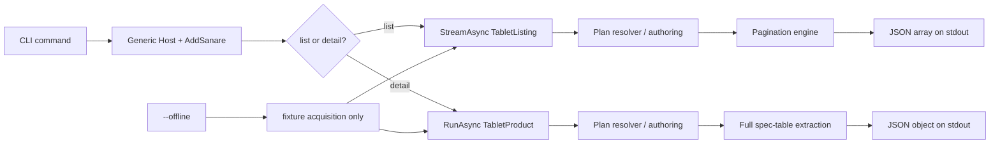

# Lenovo Sample Application

> Feature spec for code-forge implementation planning.
> Source: extracted from docs/sanare/tech-design.md §8
> Created: 2026-09-06

| Field | Value |
|-------|-------|
| Component | sample-app-lenovo |
| Priority | P0 |
| SRS Refs | — (no SRS; traces to tech-design §3.6 AC-001, AC-004, AC-007, AC-008, AC-014, AC-015, AC-020, AC-024, AC-028) |
| Tech Design | §8.1 — row 18 "Lenovo Sample App"; §4 scenarios A/B; §14.3 rollout; §16 milestones M1/M6 |
| Depends On | hosting-configuration |
| Blocks | — |

## Purpose

This is the executable proof that the library does the job it was designed for, against the exact two
Lenovo NL pages requested by the product brief:

1. **Tablet lister** — `https://www.lenovo.com/nl/nl/tablets/` — return every tablet across pagination.
2. **Product detail** — `https://www.lenovo.com/nl/nl/p/tablets/android-tablets/yoga-tab-series/lenovo-yoga-tab-gen-2/len103y0003#tech_specs`
   — return product identity, price/availability and the entire specification table.

The sample is deliberately not a hand-written Lenovo scraper. It registers typed schemas, asks the
framework to resolve or author plans, runs those approved plans, and prints schema-valid JSON. If the
sample needed hidden Lenovo-specific selectors in application code, it would prove the opposite of the
product claim.

## Scope

**Included:**

- A .NET console application using the generic host.
- Typed `TabletListing`, `TabletProduct`, and `ProductSpecification` schemas.
- The two exact Lenovo source registrations and URLs.
- Paginated streaming of all tablet cards.
- Product-detail extraction including every row/group in the specification table.
- CLI modes for live authoring/run, fixture capture, offline replay, plan validation and output.
- Checked-in sample fixtures and approved example plans suitable for offline CI.
- README instructions, example JSON output, and clear first-run approval flow.

**Excluded:**

- A production service/API, database, UI or scheduler.
- bol.com implementation (named as the next reference source, not part of this sample).
- Hand-authored Lenovo selectors in C#.
- Any browser evasion, ChatGPT impersonation, CAPTCHA solving, or proxy rotation. (Robots.txt `Disallow`
  bypass is not excluded — it is the library's ordinary default behaviour; see `acquisition-pipeline`.)
- Publishing the sample project as a NuGet package.

## Core Responsibilities

1. **Demonstrate** schema-first authoring and typed output end to end.
2. **Demonstrate** pagination through `StreamAsync<TabletListing>`.
3. **Demonstrate** a detail page with a dynamic key/value spec table.
4. **Demonstrate** live capture once and deterministic offline replay thereafter.
5. **Document** the approval, inspect, validate, and heal workflows a consumer will use.
6. **Prove** the sample contains no scraper-specific extraction code.

## Interfaces

### Commands

```text
dotnet run --project samples/Sanare.Samples.Lenovo -- list [--live|--offline]
dotnet run --project samples/Sanare.Samples.Lenovo -- detail [--live|--offline]
dotnet run --project samples/Sanare.Samples.Lenovo -- capture list|detail
dotnet run --project samples/Sanare.Samples.Lenovo -- validate
dotnet run --project samples/Sanare.Samples.Lenovo -- approve <candidate-commit> --by <identity>
```

Exit codes: `0` success; `2` awaiting approval; `3` no plan; `4` blocked/policy denied; `5` partial or
schema-invalid output; `10` unexpected failure.

### Outputs

- JSON to stdout, encoded UTF-8, one array for `list` and one object for `detail`.
- Human diagnostics to stderr, so piping stdout to a consumer remains valid JSON.
- Plans, fixtures, run records and git history under the configured sample state root.

## Data Flow



## Key Behaviors

### Typed schemas

```csharp
public sealed record TabletListing(
    [property: ScrapeRequired, ScrapeHint("The marketing product name shown on the product card")]
    string Name,
    Uri ProductUrl,
    [property: ScrapeMoney(Culture = "nl-NL")] decimal? Price,
    string? Currency,
    string? Availability,
    Uri? ImageUrl,
    string? Badge,
    string? ShortDescription);

public sealed record TabletProduct(
    [property: ScrapeRequired] string Name,
    string? PartNumber,
    [property: ScrapeMoney(Culture = "nl-NL")] decimal? Price,
    string? Currency,
    string? Availability,
    IReadOnlyList<Uri> Images,
    [property: ScrapeRequired, ScrapeMinItems(1)]
    IReadOnlyList<ProductSpecification> Specifications);

public sealed record ProductSpecification(
    string? Group,
    [property: ScrapeRequired] string Name,
    [property: ScrapeRequired] string Value);
```

The specification table is a list rather than a dictionary because Lenovo may reuse a label under
different groups, row ordering is meaningful for debugging, and a dictionary would silently discard
duplicate names.

### Source registrations

```csharp
builder.Services
    .AddSanare(o =>
    {
        o.StateRoot = stateRoot;
        o.Authoring.Mode = offline ? AuthoringMode.Disabled : AuthoringMode.Automatic;
        o.Authoring.RequireApproval = true;
        o.Browser.Enabled = !offline;
        o.Identity.Profile = BrowsingIdentityProfile.AssistantBrowser;
        o.ExecutionMode = offline ? ExecutionMode.OfflineFixture : ExecutionMode.Live;
    })
    .AddChatClient(sp => sp.GetRequiredService<IChatClient>())
    .AddSource("lenovo-com/tablet-lister", s =>
    {
        s.StartUrl = new("https://www.lenovo.com/nl/nl/tablets/");
        s.Culture = "nl-NL";
        s.RequestsPerMinute = 15;
        s.MinDelay = TimeSpan.FromSeconds(2);
        s.AllowBrowserTier = true;
        s.Pagination = PaginationPolicy.Auto(maxPages: 50);
    })
    .AddSource("lenovo-com/yoga-tab-gen2-detail", s =>
    {
        s.StartUrl = new("https://www.lenovo.com/nl/nl/p/tablets/android-tablets/yoga-tab-series/lenovo-yoga-tab-gen-2/len103y0003#tech_specs");
        s.Culture = "nl-NL";
        s.RequestsPerMinute = 10;
        s.MinDelay = TimeSpan.FromSeconds(3);
        s.AllowBrowserTier = true;
    });
```

`PaginationPolicy.Auto` is appropriate in the sample because discovery is part of what it demonstrates;
the approved plan stores the concrete strategy the authoring run discovered.

### First-run experience

1. `list --live` finds no approved plan and invokes authoring.
2. Authoring probes JSON/structured-data/HTML before Playwright, captures fixtures, validates a candidate,
   commits it, then returns exit code 2 (`AwaitingApproval`).
3. The operator inspects the candidate and its fixture, then runs `approve ... --by user@example`.
4. Re-running `list --live` streams products and prints JSON.
5. Future runs resolve the approved tag and do not call the LLM unless quality degradation dispatches a
   heal.

A `--demo-auto-approve` option may exist for a disposable local state root, but the default README path
teaches the production-safe approval flow.

### Lister pagination and identity

The application consumes the lazy stream and writes one valid JSON array without buffering the entire
catalog:

```csharp
await using var writer = new Utf8JsonWriter(Console.OpenStandardOutput());
writer.WriteStartArray();
await foreach (var item in runner.StreamAsync<TabletListing>(ListerRequest, cancellationToken))
    JsonSerializer.Serialize(writer, item, LenovoJsonContext.Default.TabletListing);
writer.WriteEndArray();
await writer.FlushAsync(cancellationToken);
```

The library, not the sample, deduplicates product URLs, detects loops, honors the 50-page cap, `Retry-After`,
the per-host limiter and caches, and applies the source's configured `RespectRobots` setting (bypassed by
default; `robots.txt` is still fetched/parsed for `Crawl-delay` and `llms.txt` discovery regardless). The
sample never sleeps manually and never rotates identity.

### Detail spec table

The detail plan must return **all visible name/value rows**, across collapsible groups if the browser tier
is needed to reveal them. It must not hard-code a list of expected spec names: those names are the data.
Group headings are attached to each row where available. Rows with an empty name or value fail the item
constraint instead of producing a misleading blank spec.

The URL fragment `#tech_specs` is preserved in the source definition to document the intended section,
but ordinary HTTP acquisition correctly does not send fragments to the server. The plan locates the spec
section in the response; browser acquisition may use the fragment for scrolling/navigation.

### Offline fixtures and plans

Checked-in sample assets:

- one tablet lister first page plus every subsequent page needed for a complete recorded run,
- one Yoga Tab Gen 2 product detail,
- linked JSON API responses or HAR entries when those were the selected acquisition evidence,
- redacted manifest entries with content hashes,
- an approved example plan for each source.

`--offline` selects only fixture acquisition and performs zero DNS/connect attempts. Golden output is
versioned beside fixtures. CI runs `validate` and both offline commands, comparing schema semantics (not
volatile capture timestamps) to the golden output.

Because live websites change, the repository's CI never uses Lenovo live. A separate manual workflow or
operator command can refresh captures, and that change is reviewed like any fixture/plan change.

### Output contract

- stdout is JSON only; logs go to stderr.
- Source-generated `System.Text.Json` metadata (`LenovoJsonContext`) is used.
- Decimal prices are JSON numbers and currency is `EUR`; display formatting is a consumer concern.
- URLs are absolute and canonicalised.
- `list` output contains no duplicate `ProductUrl`.
- For non-success, stdout is empty and stderr includes status, diagnostics, run id and plan commit.

## Constraints

- **The exact two user-provided URLs are used.**
- **No Lenovo selectors, JSON paths, endpoint routes or browser scripts in C# application code.** They
  belong only in generated, versioned extraction plans.
- **Network-first tiering.** The approved plan uses the cheapest passing tier; Playwright only after
  Tier 0–2 fail and only under the double opt-in.
- **No live traffic in CI.** Offline mode is enforced, not conventional.
- **No aggressive evasion.** Honest stable identity, pacing, consent handling and caching only.
- **Full spec table**, not a curated subset.
- **Complete pagination** up to configured terminators/caps, with lazy streaming.
- Sample project is `Packable=false`.
- Captures contain no cookies/auth tokens/PII after redaction.

## Acceptance Criteria

| AC-ID | Priority | Criterion | Expected Result | Verification Method |
|-------|----------|-----------|-----------------|---------------------|
| AC-001 | P0 | Given the lister schema and Lenovo tablets URL with no plan | The framework authors a candidate and returns `AwaitingApproval` | Manual/integration — first-run flow |
| AC-004 | P0 | Given an approved lister plan | `StreamAsync<TabletListing>` emits schema-valid typed products | Offline integration |
| AC-007 | P0 | Given a multi-page recorded catalog | Products from every page are returned exactly once | Offline integration — pagination golden |
| AC-008 | P0 | Given the Yoga detail fixture | Product identity and every non-empty spec row are returned | Offline integration — golden |
| AC-014 | P0 | Given an approved plan and unchanged fixture | No LLM call occurs during normal execution | Integration — chat-client spy |
| AC-015 | P0 | Given only structured JSON evidence that satisfies the schema | The authored plan selects Tier 0, not browser | Integration — tier assertion |
| AC-020 | P0 | Given `--offline` | No DNS/connect call occurs | Integration — connect-throwing handler |
| AC-024 | P0 | Given lister output | Each item includes provenance for source, plan commit, fixture/run and tier | Offline integration |
| AC-028 | P0 | Given no documented Lenovo API | The sample still attempts public structured JSON/HTML without a policy override | Integration — policy boundary |
| AC-LN-001 | P0 | Given `list --offline` | stdout is one valid JSON array and stderr contains diagnostics only | Process integration |
| AC-LN-002 | P0 | Given `detail --offline` | stdout is one valid `TabletProduct` JSON object | Process integration |
| AC-LN-003 | P0 | Given the detail fixture has duplicate spec labels under different groups | Both rows are preserved with their groups | Offline integration |
| AC-LN-004 | P0 | Given a row with an empty name or value | It is rejected and the result is partial/schema-invalid, not silently included | Unit/offline integration |
| AC-LN-005 | P0 | Given lister pages repeating a product | The canonical `ProductUrl` appears once | Offline integration |
| AC-LN-006 | P0 | Given CI execution | Both commands and `validate` pass with network disabled | CI job |
| AC-LN-007 | P0 | Given a scan of sample C# source | No CSS/XPath/JSONPath locator, Lenovo endpoint route, or Playwright script is present | Architecture test |
| AC-LN-008 | P0 | Given a first-run candidate | Exit code is 2 and stderr prints the candidate commit plus approval command | Process integration |
| AC-LN-009 | P0 | Given approved example plans | Each carries a git approval tag and references retained fixtures | Repository test |
| AC-LN-010 | P0 | Given capture output | Headers/cookies/tokens and configured PII patterns are absent | Secret/redaction scan |
| AC-LN-011 | P1 | Given Ctrl+C mid-list | Cancellation stops pagination promptly; the partial stdout is not reported as successful | Process integration |
| AC-LN-012 | P1 | Given a product price rendered as Dutch locale | Output is a JSON decimal and `currency` is `EUR` | Offline integration |
| AC-LN-013 | P1 | Given a live plan that only passes in browser | Browser is used only when both global and source flags are on | Manual integration |
| AC-LN-014 | P1 | Given a live run with browser unavailable | The diagnostic is actionable and the sample does not attempt fingerprint spoofing or retry storms | Manual integration |

## Error Handling

The sample does not invent application-specific error codes. It maps library status/codes to the documented
exit codes and prints an actionable diagnostic to stderr.

| Status | Exit | Example code | Message includes |
|--------|------|--------------|------------------|
| `AwaitingApproval` | 2 | status only | candidate commit and exact approval command |
| `NoPlanAvailable` | 3 | status only | source id, schema hash, how to enable authoring |
| `Blocked` / policy denied | 4 | `SNR-ACQ-*` / `SNR-BRW-*` | host, policy/tier, retry guidance |
| partial / schema invalid | 5 | `SNR-EXT-003` / `SNR-SCH-004` / `SNR-SCH-005` | run id, failing fields, heal state |
| unexpected | 10 | stable `SNR-*` code | run id and plan commit; no raw HTML |

## File Structure

```
samples/
└── Sanare.Samples.Lenovo/
    ├── Sanare.Samples.Lenovo.csproj
    ├── Program.cs
    ├── LenovoCommands.cs
    ├── LenovoSources.cs
    ├── Schemas/
    │   ├── TabletListing.cs
    │   ├── TabletProduct.cs
    │   ├── ProductSpecification.cs
    │   └── LenovoJsonContext.cs
    ├── Output/
    │   ├── JsonStreamWriter.cs
    │   └── ExitCodeMapper.cs
    ├── appsettings.json
    ├── appsettings.Development.json
    └── README.md
samples/
└── Sanare.Samples.Lenovo.State/
    ├── scripts/
    │   └── plans/lenovo-com/
    ├── fixtures/
    │   └── lenovo-com/
    └── golden/
        ├── tablet-list.json
        └── yoga-tab-gen2.json
```

## Test Module

**Test file**: `tests/Sanare.Samples.Lenovo.Tests/LenovoSampleTests.cs`

**Test scope**:

- **Unit**: schema derivation for the three records; Dutch price coercion; exit-code mapping; JSON stream
  writer; source ids and the exact two URLs (including the detail fragment); architecture scan proving no
  selectors/endpoints/browser scripts occur in sample C#.
- **Offline integration**: execute `list --offline`, `detail --offline`, and `validate` as processes with
  network replaced by a connect-throwing handler; parse stdout; validate against derived schemas; compare
  semantic JSON to golden files; assert complete page coverage, product dedupe, all spec rows, duplicate
  spec-label preservation, provenance, and zero `IChatClient` calls for approved plans.
- **Live/manual**: opt-in (`LENOVO_LIVE_TESTS=1`) capture/author/approval smoke tests against the two exact
  URLs, honoring rate limits and the source's configured `RespectRobots` setting (default bypass). Never run
  in ordinary CI. Browser fallback is tested only when the cheaper tiers fail.
- **Fixtures / Mocks**: redacted Lenovo HTML/JSON/HAR captures committed with their manifest and approved
  plans; golden JSON; connect-throwing handler; spy `IChatClient`; temp copy of the sample state repository.
  Live captures are refreshed manually and reviewed, never fetched implicitly by tests.

Companion test files: `tests/Sanare.Samples.Lenovo.Tests/TabletListerOfflineTests.cs`,
`tests/Sanare.Samples.Lenovo.Tests/ProductDetailOfflineTests.cs`,
`tests/Sanare.Samples.Lenovo.Tests/NoNetworkInCiTests.cs`,
`tests/Sanare.Samples.Lenovo.Tests/SampleArchitectureTests.cs`.
