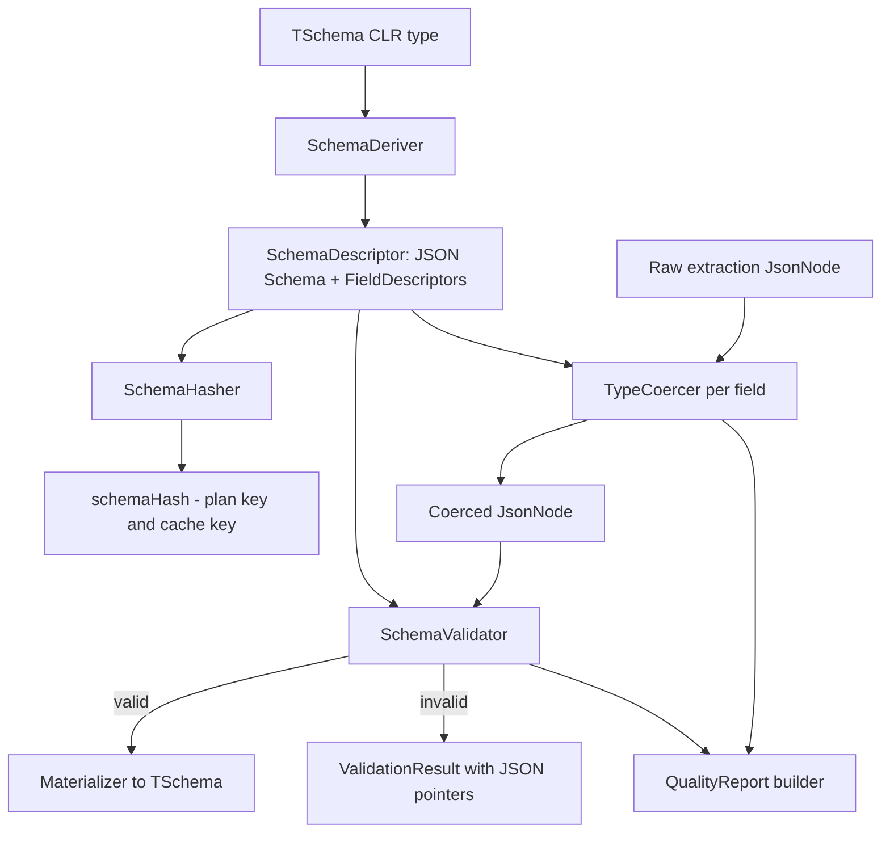

# Schema Engine

> Feature spec for code-forge implementation planning.
> Source: extracted from docs/sanare/tech-design.md §8
> Created: 2026-09-06
> Implementation status: implemented — derivation, hashing, validation, coercion, quality reporting, and materialization are all built under `src/Sanare.Core/Schema/`, matching the File Structure and Test Module sections below. Known deviation: materialization uses plain reflection rather than the `System.Text.Json` source-generation path described in Scope/Constraints — see `docs/audit-report.md`.

| Field | Value |
|-------|-------|
| Component | schema-engine |
| Priority | P0 |
| SRS Refs | — (no SRS; traces to tech-design §3.6 AC-005, AC-006, AC-007, AC-026) |
| Tech Design | §8.1 — row 2 "Schema Engine"; §7.3 (validation matrix, type coercion); §7.4 |
| Depends On | scrape-api-contracts |
| Blocks | plan-runtime, authoring-workflow, quality-evaluator |

## Purpose

The schema engine is the bridge between a consumer's C# type and everything the rest of the system needs
to know about it. It derives a JSON Schema from `TSchema`, computes a stable schema hash that keys plans
and caches, validates an extraction result against that schema, coerces raw string values into typed ones
using culture and unit metadata, and produces the per-field `QualityReport` that drives self-healing.
It is the component that makes "as typed as possible, but obviously dynamic" literally true: the consumer
writes a record, and the engine turns it into the contract that the LLM writes against and the runtime
validates against.

## Scope

**Included:**

- JSON Schema (draft 2020-12) derivation from a POCO/record, honouring nullability, `required`, and the
  `Scrape*` attributes.
- Deterministic schema hashing (`schemaHash`) used as a plan key and cache key component.
- Descriptor model (`SchemaDescriptor`, `FieldDescriptor`) consumed by the runtime and the agent toolset.
- Validation of an extracted `JsonNode` document against the derived schema, producing JSON-pointer-scoped
  errors.
- Culture- and unit-aware type coercion for every target type in §7.3's coercion table.
- Unit normalisation via a transform library (mAh + V → Wh, inch → mm, g → kg).
- `QualityReport` / `FieldHealth` construction, including unmapped-field detection.
- Materialisation of the validated `JsonNode` into `TSchema` via `System.Text.Json` source generation (current implementation uses reflection instead; see the top-of-file Implementation status and `docs/audit-report.md` NEW-006).

**Excluded:**

- Locating values in a document — that is `plan-runtime` executing plan locators; the engine only receives
  already-located raw strings or nodes.
- Deciding what to do about a failed validation (heal, re-author, degrade) — `plan-resolver` and
  `quality-evaluator` own that.
- Persisting field health across runs — that is `quality-evaluator`.
- The attribute type definitions themselves — those live in `scrape-api-contracts`.

## Core Responsibilities

1. **Derive** a JSON Schema and a flat field descriptor list from a CLR type, once, and cache it.
2. **Hash** the derived schema deterministically so the same type always produces the same key across
   processes and machines.
3. **Coerce** raw extracted text into target CLR types under the source's culture and the field's unit.
4. **Validate** the assembled document against the schema and report failures by JSON pointer.
5. **Report** per-field presence, coercion outcome, and unmapped source fields.
6. **Materialise** the validated document into the consumer's type without reflection at run time where
   source generation is available.

## Interfaces

### Inputs

- **`Type` / `TSchema`** (from `plan-runtime`, `authoring-workflow`) — the CLR type to describe.
- **`JsonNode` extraction document** (from `plan-runtime`) — the assembled raw extraction, values still
  string-typed at the leaves.
- **`CoercionContext`** (from `plan-runtime`) — source culture, field descriptor, plan-declared synonym
  maps and unit hints.

### Outputs

- **`SchemaDescriptor`** (to `plan-runtime`, `agent-toolset`, `authoring-workflow`) — JSON Schema text,
  `SchemaHash`, ordered `FieldDescriptor` list.
- **`ValidationResult`** (to `plan-runtime`) — success flag plus pointer-scoped errors.
- **`QualityReport`** (to `scrape-api-contracts` result, `quality-evaluator`).
- **`TSchema` instance** (to the consumer, via the runner).

### Dependencies

- **`scrape-api-contracts`** — attributes, `QualityReport`, `FieldHealth`, `ScrapeDiagnostic`.
- **`System.Text.Json`** — `JsonNode`, `JsonSerializerOptions`, source-generation contexts.
- **`System.Globalization`** — `CultureInfo`, `NumberFormatInfo`, `DateTimeStyles`.

## Data Flow



## Key Behaviors

### Derivation

```csharp
public interface ISchemaDeriver
{
    SchemaDescriptor Derive(Type schemaType);
    SchemaDescriptor Derive<TSchema>() where TSchema : class;
}

public sealed record SchemaDescriptor(
    Type ClrType, string SchemaName, int SchemaVersion,
    string JsonSchema, string SchemaHash,
    IReadOnlyList<FieldDescriptor> Fields,
    string? CollectionPointer);

public sealed record FieldDescriptor(
    string JsonPointer, string Name, Type ClrType, bool Required,
    string? Description, string? Unit, string? Culture, string? Hint,
    IReadOnlyList<string>? EnumSynonyms);
```

Derivation rules, applied in order:

1. Public instance properties with a getter are candidates; `[ScrapeIgnore]` removes a property and its
   whole subtree.
2. Required-ness is inferred as: `[ScrapeField(Required = …)]` when present, else `true` for a
   non-nullable reference or non-nullable value type, else `false`. `required` C# members are always
   required regardless of nullability.
3. `SchemaName` is the type's name; `SchemaVersion` comes from `[ScrapeField]` on the type or defaults
   to `1`.
4. `CollectionPointer` is the pointer of the single `[ScrapeCollection]`-marked property, or the pointer
   of the root when the type itself is a collection; more than one `[ScrapeCollection]` is `SNR-SCH-001`.
5. Recursion is bounded at depth 8 and 200 total mapped properties (§7.4); a cycle or a breach is
   `SNR-SCH-001` naming the offending property path.
6. Culture resolution per field: `[ScrapeCulture]` on the property → on the declaring type → the source
   default → the invariant culture.
7. Derivation is pure and cached in a `ConcurrentDictionary<Type, SchemaDescriptor>`; the same `Type`
   never derives twice in a process.

### Hashing

`SchemaHash` is `"sha256:" + hex(SHA256(canonicalJson))` where `canonicalJson` is the derived JSON Schema
serialised with: properties sorted by ordinal name, no insignificant whitespace, `\n` line endings, and
descriptions/hints **included** (a changed description changes the contract the LLM wrote against, so it
must invalidate the plan). The hash must be identical across operating systems, .NET runtime versions, and
process restarts — this is asserted directly.

### Coercion

```csharp
public interface ITypeCoercer
{
    CoercionOutcome Coerce(string? raw, FieldDescriptor field, CoercionContext context);
}

public readonly record struct CoercionOutcome(
    bool Success, JsonNode? Value, string? RawValue,
    string? NormalisedUnit, string? FailureReason);
```

Coercion pipeline for a leaf value:

1. **Normalise text** — HTML-decode, strip zero-width (`U+200B`–`U+200D`, `U+FEFF`) and soft hyphens
   (`U+00AD`), replace non-breaking spaces with spaces, trim, collapse internal whitespace runs to one
   space.
2. **Empty check** — an empty result is `Missing`: `null` for a nullable target (success, recorded as
   missing in quality), `SNR-SCH-004` for a required target.
3. **Strip declared unit** — when `field.Unit` is set, remove a matching trailing unit token
   case-insensitively; retain the numeric remainder.
4. **Strip currency** — for `decimal`, remove currency symbols and ISO codes; if the schema declares a
   sibling currency field, write the stripped symbol there.
5. **Parse per target type** using the field's resolved culture and the §7.3 table.
6. **Residual check** — if any non-numeric residue remains after a numeric parse attempt, fail with
   `SNR-SCH-005` rather than parsing a prefix.
7. **Convert unit** — when the parsed unit differs from the declared canonical unit, apply a registered
   conversion; an unregistered conversion is `SNR-SCH-005`, never a silent pass-through.
8. Both `RawValue` and the converted value are recorded so provenance can show what the page actually said.

Per-type specifics:

| Target | Behaviour |
|--------|-----------|
| `string` | Step 1 only |
| `int`/`long` | `NumberStyles.Integer \| AllowThousands` with the field culture |
| `decimal` | `NumberStyles.Number \| AllowCurrencySymbol` with the field culture; `"1.299,00 €"` under `nl-NL` → `1299.00m` |
| `bool` | Per-culture truthy/falsy table (`ja`/`nee`, `yes`/`no`, `true`/`false`, `✓`/`✗`, `1`/`0`) plus a `presence` mode where node-exists ⇒ `true` |
| `DateTime`/`DateOnly` | ISO-8601 first (`DateTimeStyles.RoundtripKind`), then the culture's short and long date patterns; `DateTime` normalised to UTC |
| `Uri` | Resolved against the document base URI; non-http(s) scheme fails |
| `enum` | Ordinal-ignore-case match on member name, then `[Description]`, then the plan's synonym map |
| `T[]`/`IReadOnlyList<T>` | Element-wise; an empty node set yields an empty list, never `null` |
| `IReadOnlyDictionary<string,string>` | Label cell as key, trimmed and whitespace-collapsed; duplicate keys suffixed `#2`, `#3`, … in document order |

### Validation

```csharp
public interface ISchemaValidator
{
    ValidationResult Validate(JsonNode document, SchemaDescriptor schema);
}

public sealed record ValidationResult(
    bool IsValid, IReadOnlyList<SchemaViolation> Violations);

public sealed record SchemaViolation(string JsonPointer, string Keyword, string Message);
```

Validation is structural (type, required, enum membership, array bounds) and always reports **all**
violations, not the first, so a heal prompt sees the whole picture. Violations on required fields produce
`SNR-SCH-004`; other structural failures produce `SNR-SCH-002`.

### Quality report

`Completeness` = (number of descriptors whose value is present and coerced) ÷ (total descriptors), computed
over the flattened item set for collection schemas (a lister with 96 items and 3 missing prices has a
price `NullRate` of `3/96`, not `0` or `1`). `UnmappedFields` lists source keys the plan surfaced but the
schema has no pointer for — this is how AC-026 is satisfied; unmapped fields are a `Warning`, never a
failure.

## Constraints

- **Deterministic across environments**: schema derivation and hashing must not depend on reflection
  ordering, locale, or hash-seed randomisation. Property ordering is normalised by ordinal name.
- **Trim/AOT friendly**: materialisation uses `System.Text.Json` source-generated contexts when the
  consumer supplies one; the reflection fallback is guarded and warns under trimming.
- **Depth ≤ 8, ≤ 200 mapped properties** (§7.4) — breaching either is a derivation error, not a truncation.
- **No network, no disk**: the engine is pure computation and is fully unit-testable.
- **Coercion never silently succeeds partially**: a partial parse is a failure.

## Acceptance Criteria

| AC-ID | Priority | Criterion | Expected Result | Verification Method |
|-------|----------|-----------|-----------------|---------------------|
| AC-005 | P0 | Given a schema with a required field, when the extracted document omits it | Validation fails with a `SchemaViolation` whose `JsonPointer` names the missing field and code `SNR-SCH-004`; the run is not `Succeeded` | Unit — validate a deliberately incomplete document; assert pointer text |
| AC-006 | P0 | Given a `decimal` field and the page value `"1.299,00 €"` under `nl-NL` | Coerced to `1299.00m`; `RawValue` retains the original string; no diagnostic | Unit — `TypeCoercerTests.Decimal_NlNl_WithCurrency` |
| AC-007 | P0 | Given a `decimal` field and the page value `"Op aanvraag"` | Coercion fails with `SNR-SCH-005` naming the pointer and target type; the field is recorded as `CoercionSucceeded = false`; no partial value is written | Unit — assert failure, code, and that `Value` is null |
| AC-026 | P1 | Given the plan surfaces a key the schema has no pointer for | It appears in `QualityReport.UnmappedFields`; severity is `Warning`; status remains `Succeeded` | Unit — assert list contents and that no error diagnostic is added |
| AC-SCH-001 | P0 | Given the same `TSchema` derived twice in one process | The second call returns the cached instance (reference-equal) and an identical `SchemaHash` | Unit — assert `ReferenceEquals` and hash equality |
| AC-SCH-002 | P0 | Given the same `TSchema` derived in two separate processes | `SchemaHash` values are byte-identical | Integration — derive in a spawned child process and compare stdout hash |
| AC-SCH-003 | P0 | Given a field description is changed via `[ScrapeField(Description = …)]` | `SchemaHash` changes | Unit — assert inequality before/after |
| AC-SCH-004 | P0 | Given a type with a property graph 9 levels deep | Derivation fails with `SNR-SCH-001` naming the property path at depth 9 | Unit — boundary test; a depth-8 graph must succeed |
| AC-SCH-005 | P0 | Given a type with 201 mapped properties | Derivation fails with `SNR-SCH-001`; a 200-property type succeeds | Unit — both boundaries |
| AC-SCH-006 | P0 | Given a type with a reference cycle (`A` → `B` → `A`) | Derivation fails with `SNR-SCH-001` rather than stack-overflowing or looping | Unit — assert the failure completes within 1 second |
| AC-SCH-007 | P0 | Given a type with two `[ScrapeCollection]` properties | Derivation fails with `SNR-SCH-001` naming both properties | Unit — negative test |
| AC-SCH-008 | P0 | Given an `int` field with `[ScrapeUnit("GB")]` and the value `"12 GB"` | Coerced to `12`; `NormalisedUnit` is `"GB"` | Unit — unit stripping |
| AC-SCH-009 | P0 | Given an `int` field and the value `"12 GB extra"` after unit stripping leaves `"extra"` residue | Coercion fails with `SNR-SCH-005`; the value is **not** parsed as `12` | Unit — the critical no-partial-parse test |
| AC-SCH-010 | P0 | Given a battery field declaring `[ScrapeUnit("Wh")]` and page values `"10200 mAh"` + `3.85 V` | Converted to `39.27 Wh` (±0.01); both raw and normalised values recorded | Unit — unit conversion |
| AC-SCH-011 | P0 | Given a field declaring a unit with no registered conversion to the canonical unit | Coercion fails with `SNR-SCH-005`; no unconverted value is emitted | Unit — negative test |
| AC-SCH-012 | P0 | Given a nullable `decimal?` field whose node is absent | Value is `null`, coercion succeeds, and `FieldHealth.Present` is `false` | Unit — missing-optional path |
| AC-SCH-013 | P0 | Given a `IReadOnlyList<string>` field whose node set is empty | The value is an empty list, not `null` | Unit — empty-collection invariant |
| AC-SCH-014 | P0 | Given a spec table with two rows labelled `"Poort"` | Dictionary keys are `"Poort"` and `"Poort#2"` in document order | Unit — duplicate-key suffixing |
| AC-SCH-015 | P0 | Given a document with 3 violations | `ValidationResult.Violations` has 3 entries, not 1 | Unit — all-violations-reported |
| AC-SCH-016 | P0 | Given a collection of 96 items with 3 missing prices | `FieldHealth.NullRate` for the price pointer is `0.03125` (±1e-9) | Unit — collection-aware null-rate maths |
| AC-SCH-017 | P1 | Given an `enum` field and a page label matching only a plan-declared synonym | Coerced to the enum member | Unit — synonym-map path |
| AC-SCH-018 | P1 | Given a `Uri` field with a relative `href` and a document base URI | Resolved to the absolute URL; a `javascript:` href fails with `SNR-SCH-005` | Unit — positive and negative |
| AC-SCH-019 | P1 | Given text containing zero-width and soft-hyphen characters | They are stripped before parsing and comparison | Unit — normalisation test with explicit code points |

## Error Handling

| Code | Raised when | Severity | Effect on run |
|------|-------------|----------|---------------|
| `SNR-SCH-001` | Schema type cannot be mapped (depth, count, cycle, multiple collection roots, unsupported shape) | Error | Fails before any request; status `SchemaValidationFailed` |
| `SNR-SCH-002` | Assembled document fails structural validation | Error | Status `SchemaValidationFailed` |
| `SNR-SCH-004` | A required field is absent | Error | Status `SchemaValidationFailed`; feeds heal dispatch |
| `SNR-SCH-005` | A value cannot be coerced to the target type or unit | Error for required fields, Warning for optional | Optional → `PartialExtraction`; required → `SchemaValidationFailed` |

Coercion failures always record the offending pointer and the target type name, never the raw page value,
in `Message`; the raw value goes to `Detail` and is suppressed unless diagnostic detail is enabled.

## File Structure

```
src/
└── Sanare.Core/
    └── Schema/
        ├── ISchemaDeriver.cs
        ├── SchemaDeriver.cs
        ├── SchemaDescriptor.cs
        ├── FieldDescriptor.cs
        ├── SchemaHasher.cs
        ├── ISchemaValidator.cs
        ├── SchemaValidator.cs
        ├── ValidationResult.cs
        ├── SchemaViolation.cs
        ├── Coercion/
        │   ├── ITypeCoercer.cs
        │   ├── TypeCoercer.cs
        │   ├── CoercionContext.cs
        │   ├── CoercionOutcome.cs
        │   ├── TextNormalizer.cs
        │   ├── CultureTruthTable.cs
        │   └── UnitConverter.cs
        ├── Quality/
        │   └── QualityReportBuilder.cs
        └── Materialization/
            ├── IDocumentMaterializer.cs
            └── DocumentMaterializer.cs
```

## Test Module

**Test file**: `tests/Sanare.Core.Tests/Schema/TypeCoercerTests.cs`

**Test scope**:

- **Unit**: `SchemaDeriver` over a bank of schema types (`TabletListing`, `TabletProduct`, deep/cyclic/
  oversized negatives); `SchemaHasher` determinism and sensitivity; `TypeCoercer` over every row of the
  §7.3 coercion table with `nl-NL` and `en-US` cultures; `TextNormalizer` code-point tests;
  `UnitConverter` registered and unregistered conversions; `SchemaValidator` multi-violation reporting;
  `QualityReportBuilder` null-rate arithmetic over collections.
- **Integration**: cross-process schema-hash stability (spawn `dotnet run` on a tiny hashing harness and
  compare); materialisation of a full Lenovo product document into `TabletProduct` end-to-end from a
  stored JSON extraction document.
- **Fixtures / Mocks**: `tests/Sanare.Core.Tests/Schema/Data/*.json` extraction documents
  (`tablet-listing-complete.json`, `tablet-listing-missing-price.json`,
  `tablet-product-specs.json`, `tablet-product-required-missing.json`); no HTTP or LLM mocks — this
  component has no external dependencies.

Companion test files: `tests/Sanare.Core.Tests/Schema/SchemaDeriverTests.cs`,
`tests/Sanare.Core.Tests/Schema/SchemaHasherTests.cs`,
`tests/Sanare.Core.Tests/Schema/SchemaValidatorTests.cs`,
`tests/Sanare.Core.Tests/Schema/QualityReportBuilderTests.cs`.
