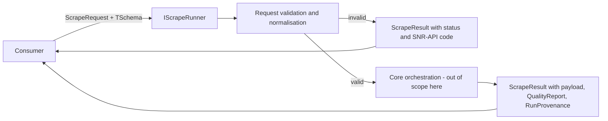

# Scrape API Contracts

> Feature spec for code-forge implementation planning.
> Source: extracted from docs/sanare/tech-design.md §8
> Created: 2026-09-06

| Field | Value |
|-------|-------|
| Component | scrape-api-contracts |
| Priority | P0 |
| SRS Refs | — (no SRS; traces to tech-design §3.6 AC-001, AC-003, AC-024) |
| Tech Design | §8.1 — row 1 "Scrape API Contracts"; §9.2.1; §7.4 |
| Depends On | — |
| Blocks | schema-engine, extraction-plan-model, fixture-corpus, acquisition-pipeline, plan-runtime, observability, hosting-configuration |

## Purpose

This component is the entire public surface of the library: the `IScrapeRunner` entry point, the request
and result records, the status vocabulary, the diagnostic and provenance types, and the attributes a
consumer puts on their POCO schema. Everything else in the system is an implementation detail behind these
contracts. It exists as its own component — and its own package, `Sanare.Abstractions` — so
that a consumer can reference the contracts without dragging in Playwright, git, or the AI stack, and so
that the contracts can be frozen and API-diffed independently of the machinery that satisfies them.

## Scope

**Included:**

- `IScrapeRunner` with the generic single-document and streaming-collection entry points.
- `ScrapeRequest`, `ScrapeResult<T>`, `ScrapeStatus`, `ScrapeDiagnostic`, `QualityReport`, `FieldHealth`,
  `RunProvenance`, `AcquisitionTier`, `PaginationPolicy`.
- Schema-shaping attributes: `[ScrapeField]`, `[ScrapeUnit]`, `[ScrapeCulture]`, `[ScrapeHint]`,
  `[ScrapeCollection]`, `[ScrapeIgnore]`.
- Administration contracts `IScraperAdministration` and `IFixtureAdministration` (§9.2.2, §9.2.3).
- Request-level argument validation and normalisation (§7.4 validation matrix rows for `ScrapeRequest`).
- The status → error-code mapping table (§9.2.5) as a pure function.
- A frozen public-API baseline enforced in CI.

**Excluded:**

- Any behaviour that fetches, parses, extracts, or calls a model — this package is contract-only.
- JSON Schema derivation from the POCO (that is `schema-engine`; this component only defines the
  attributes it reads).
- DI registration extension methods (that is `hosting-configuration`).
- Concrete `IScrapeRunner` implementation — the orchestrating implementation lives in
  `Sanare.Core` and is specified across `plan-resolver`, `plan-runtime`, and
  `acquisition-pipeline`.

## Core Responsibilities

1. **Define the entry point** — one interface, two methods, no overload sprawl; the generic parameter is
   the consumer's schema type and is the only thing that varies.
2. **Define the result envelope** — a result is always returned; failures are statuses and diagnostics,
   not exceptions, for every condition the library can anticipate.
3. **Define the status vocabulary** — a closed enum that is exhaustive over the library's failure modes so
   consumers can `switch` on it without a default-throw.
4. **Define the schema attributes** — the declarative knobs (unit, culture, hint, required, collection
   root) the authoring agent reads as field metadata.
5. **Validate and normalise requests** — reject malformed input at the boundary with a stable error code
   before any work is scheduled.
6. **Freeze the surface** — a `PublicAPI` baseline plus an approval test so an accidental breaking change
   fails the build.

## Interfaces

### Inputs

- **`ScrapeRequest`** (consumer) — target URL, optional source id, freshness, max items, pagination
  override, culture override, and an authoring-permission flag.
- **`TSchema`** (consumer type argument) — the POCO or record describing the desired JSON shape.
- **`CancellationToken`** (consumer) — cooperative cancellation for the whole run.

### Outputs

- **`ScrapeResult<TSchema>`** (consumer) — status, payload, quality report, provenance, diagnostics.
- **`IAsyncEnumerable<ScrapeItem<TItem>>`** (consumer) — streamed items for paginated collections.
- **`ScrapeStatus`** (consumer, observability) — the single authoritative outcome discriminator.

### Dependencies

- **`System.Text.Json`** — attribute-free serialisation contracts and `JsonSerializerOptions` plumbing on
  the request; source-generation contexts live with the consumer.
- **.NET BCL only** — this package intentionally has zero third-party dependencies.

## Data Flow



## Key Behaviors

### Entry point shape

```csharp
public interface IScrapeRunner
{
    Task<ScrapeResult<TSchema>> RunAsync<TSchema>(
        ScrapeRequest request,
        CancellationToken cancellationToken = default) where TSchema : class;

    IAsyncEnumerable<ScrapeItem<TItem>> StreamAsync<TItem>(
        ScrapeRequest request,
        CancellationToken cancellationToken = default) where TItem : class;
}
```

`RunAsync` materialises the whole result, including all pages, and is the default. `StreamAsync` yields
items as pages are enumerated and is the memory-bounded path for large listers; it surfaces terminal
failures by throwing `ScrapeStreamException` carrying the same `ScrapeStatus` and diagnostics that
`RunAsync` would have returned, because an `IAsyncEnumerable` has no envelope to put them in.

### Request record and normalisation

```csharp
public sealed record ScrapeRequest
{
    public required Uri Url { get; init; }
    public string? SourceId { get; init; }
    public TimeSpan? Freshness { get; init; }
    public int? MaxItems { get; init; }
    public PaginationPolicy? Pagination { get; init; }
    public string? Culture { get; init; }
    public bool AllowAuthoring { get; init; } = true;
    public IReadOnlyDictionary<string, string>? Parameters { get; init; }
    public string? PlanCommitId { get; init; }
}
```

Normalisation order, applied before anything else runs:

1. `Url` must be absolute with scheme `http` or `https`, host non-empty, no userinfo component, and
   ≤ 2 048 characters. Otherwise `SNR-API-001`.
2. `SourceId`, when supplied, must match `^[a-z0-9-]+(/[a-z0-9-]+)*$` and be ≤ 128 characters, otherwise
   `SNR-API-002`. When omitted it is derived deterministically as `{host-slug}/{first-path-segment-slug}`,
   with `root` substituted for an empty path, so the same URL always resolves to the same source.
3. `MaxItems`, when supplied, is clamped into `1…1_000_000`; a clamp emits a warning diagnostic
   `SNR-API-003` and does not fail the run.
4. `Freshness` must be within `TimeSpan.Zero…30 days`, otherwise `SNR-API-004`.
5. `Culture`, when supplied, must parse as a `CultureInfo`; an unknown culture is `SNR-API-005`.
6. The normalised request is exposed on the result's provenance so a consumer can see exactly what ran.

Validation failures are returned as a `ScrapeResult<TSchema>` with the matching status and a diagnostic —
they are not thrown — with the single exception of `ArgumentNullException` for a null `request`, which is
a programming error rather than a data condition.

### Result envelope

```csharp
public sealed record ScrapeResult<T>
{
    public required ScrapeStatus Status { get; init; }
    public T? Payload { get; init; }
    public required QualityReport Quality { get; init; }
    public required RunProvenance Provenance { get; init; }
    public required IReadOnlyList<ScrapeDiagnostic> Diagnostics { get; init; }
    public bool IsSuccess => Status is ScrapeStatus.Succeeded;
    public bool HasPayload => Payload is not null;
}
```

`Payload` is non-null for `Succeeded`, `PartialExtraction`, and `PartialPagination`, and null for every
other status. `PartialExtraction` means the document was produced but at least one non-required field is
missing or failed coercion; a missing **required** field is `SchemaValidationFailed` with a null payload.

### Status vocabulary

```csharp
public enum ScrapeStatus
{
    Succeeded, PartialExtraction, InvalidRequest, NoPlanAvailable, AwaitingApproval,
    AuthoringFailed, SchemaValidationFailed, PlanInvalid, ExtractionFailed,
    PaginationCapReached, PartialPagination, RateLimited, Blocked,
    DisallowedByRobots, ConsentWallBlocked, BrowserFailed, FixtureNotFound,
    SourceNotFound, Timeout, Cancelled
}
```

The enum is closed and additive-only; new members require a minor version bump and a note in §10.4's
migration section, because consumers are expected to `switch` exhaustively.

### Diagnostics, quality, and provenance

```csharp
public sealed record ScrapeDiagnostic(
    string Code, DiagnosticSeverity Severity, string Message,
    string? JsonPointer = null, string? Detail = null);

public sealed record QualityReport(
    double Completeness, int ItemCount,
    IReadOnlyList<FieldHealth> Fields,
    IReadOnlyList<string> UnmappedFields,
    bool MeetsThreshold);

public sealed record FieldHealth(
    string JsonPointer, bool Required, bool Present,
    bool CoercionSucceeded, double NullRate);

public sealed record RunProvenance(
    string SourceId, string? PlanCommitId, AcquisitionTier Tier,
    ResultOrigin Origin, DateTimeOffset StartedAt, TimeSpan Duration, int PagesFetched,
    int RequestsIssued, IReadOnlyList<string> FixtureIds,
    string SchemaHash, string RunId)
{
    public bool ServedFromCache => Origin is ResultOrigin.HttpCache or ResultOrigin.ResultCache;
    public bool ServedFromFixture => Origin == ResultOrigin.Fixture;
}
```

`Message` is the sanitised, human-readable string; `Detail` may carry unsanitised context and is only
populated when the diagnostic-detail option is enabled. `Code` is always an `SNR-{AREA}-{nnn}` value from
§7.7 — never free text — so consumers and alerting can key off it.

### Schema attributes

| Attribute | Target | Effect |
|-----------|--------|--------|
| `[ScrapeField(Description = ..., Required = ...)]` | property | Supplies a natural-language description to the authoring agent and overrides required-ness inferred from nullability |
| `[ScrapeUnit("GB")]` | property | Declares the expected unit; drives unit-stripping and normalisation during coercion |
| `[ScrapeCulture("nl-NL")]` | property or class | Declares the number/date culture for coercion; property-level wins over class-level, which wins over the source default |
| `[ScrapeHint("in the tech-specs table, row label 'Processor'")]` | property | Free-text locator hint passed verbatim to the authoring agent; never interpreted by the runtime |
| `[ScrapeCollection(ItemName = "product")]` | property | Marks the repeated-structure root for a lister schema |
| `[ScrapeIgnore]` | property | Excluded from schema derivation and never extracted |

Attributes carry **no** behaviour. They are read by `schema-engine`; defining them here keeps the
consumer's compile-time dependency limited to the abstractions package.

### Status to error-code mapping

A pure static function `ScrapeStatusCodes.For(ScrapeStatus)` returns the ordered set of codes a consumer
can expect for a status, matching §9.2.5 exactly. It exists so the mapping is testable and cannot drift
from the documented table.

## Constraints

- **No third-party dependencies**: `Sanare.Abstractions` references only the BCL. A PR adding
  a package reference to this project must not be merged. *(Currently enforced by review only — see
  AC-015 under Test Module for the automated check this still needs.)*
- **Binary compatibility**: the package is intended to ship a `PublicAPI.Shipped.txt`/`PublicAPI.Unshipped.txt` pair;
  removals or signature changes require a major version. *(Not yet implemented — see AC-014 under
  Test Module.)*
- **No exceptions for anticipated conditions**: every condition enumerated in §7.7 surfaces as a status
  plus diagnostic. Exceptions are reserved for programming errors (`ArgumentNullException`) and for
  `StreamAsync`, which has no envelope.
- **Nullable reference types enabled** and warnings-as-errors; `required` members are used so a result can
  never be constructed without its quality and provenance.
- **Culture-independence**: all internal string comparisons use `StringComparison.Ordinal`; the only
  culture-sensitive code paths are the coercion hints, which are data, not behaviour.

## Acceptance Criteria

| AC-ID | Priority | Criterion | Expected Result | Verification Method |
|-------|----------|-----------|-----------------|---------------------|
| AC-001 | P0 | Given a `ScrapeRequest` with a relative URL, when it is validated | `ScrapeResult.Status` is `InvalidRequest` and `Diagnostics` contains exactly one entry with `Code == "SNR-API-001"`; `Payload` is null | Unit — `RequestValidatorTests.RelativeUrl_IsRejected` asserts status, code, and null payload |
| AC-002 | P0 | Given a `ScrapeRequest` whose URL contains userinfo (`https://u:p@host/x`) | Rejected with `SNR-API-001`; the diagnostic `Message` does not contain the substring `p@` | Unit — assert code and assert the sanitised message excludes credentials |
| AC-003 | P0 | Given a `SourceId` of `"Lenovo/Tablets"` (uppercase) | Rejected with `SNR-API-002`; no normalisation to lowercase is attempted | Unit — `RequestValidatorTests.SourceId_MustBeLowerKebab` |
| AC-004 | P0 | Given no `SourceId` and URL `https://www.lenovo.com/nl/nl/tablets/`, when the source id is derived | The derived id equals `www-lenovo-com/nl` and is byte-identical across two independent calls | Unit — assert equality and determinism over 2 invocations |
| AC-005 | P0 | Given `MaxItems = 0`, when the request is normalised | `MaxItems` becomes `1`; a `Warning`-severity diagnostic with `SNR-API-003` is present; `Status` is not a failure | Unit — assert clamped value, warning severity, and that validation still passes |
| AC-006 | P0 | Given `MaxItems = 5_000_000`, when the request is normalised | `MaxItems` becomes `1_000_000` with `SNR-API-003` | Unit — boundary test at the upper clamp |
| AC-007 | P0 | Given `Freshness = TimeSpan.FromDays(31)` | Rejected with `SNR-API-004` | Unit — boundary test one day past the 30-day limit |
| AC-008 | P0 | Given `Freshness = TimeSpan.FromDays(30)` exactly | Accepted; no diagnostic is emitted | Unit — boundary test at the inclusive limit |
| AC-009 | P0 | Given `Culture = "xx-ZZ"` | Rejected with `SNR-API-005` | Unit — unknown culture is a data error, not an exception |
| AC-010 | P0 | Given a null `ScrapeRequest`, when `RunAsync` is called | `ArgumentNullException` is thrown with `ParamName == "request"` — this is the one case that throws | Unit — `Assert.Throws<ArgumentNullException>` |
| AC-011 | P0 | Given a result constructed with `Status = Succeeded`, when `IsSuccess` is read | Returns `true`; for every other member of `ScrapeStatus` it returns `false` | Unit — theory over all `Enum.GetValues<ScrapeStatus>()` |
| AC-012 | P0 | Given every member of `ScrapeStatus`, when `ScrapeStatusCodes.For` is called | Every status returns a distinct-per-status code list (which may be empty), and every returned code matches `^SNR-[A-Z]{3,5}-\d{3}$` | Unit — theory over all enum values, regex-assert each code |
| AC-013 | P0 | Given a `ScrapeResult<T>` is constructed without `Quality` or `Provenance` | Compilation fails because both are `required` members | Unit — a compile-fail assertion via `Microsoft.CodeAnalysis.CSharp` source test, or documented as compiler-enforced with a positive construction test |
| AC-014 | P1 | Given the public surface of `Sanare.Abstractions`, when the approval test runs | The generated API text matches the checked-in `PublicApi.approved.txt` exactly | **Not yet implemented** — no `PublicApiGenerator`/`Verify` approval test exists; the surface is frozen by review only |
| AC-015 | P1 | Given the `Sanare.Abstractions` project file, when its resolved package references are inspected | The set of non-framework `PackageReference` items is empty (analyzers and build-only assets excluded) | **Not yet implemented** — no automated `.csproj` parsing assertion exists; enforced by review only (the project file currently has zero `PackageReference` items) |
| AC-016 | P1 | Given a diagnostic is created with a `Detail` value while detail-reporting is disabled | `Detail` is null on the diagnostic exposed to the consumer while `Message` is unchanged | Unit — `Diagnostics/DiagnosticSanitizerTests.Sanitize_clears_detail_when_detail_reporting_is_disabled` |

## Error Handling

| Code | Raised when | Severity | Surfaced as |
|------|-------------|----------|-------------|
| `SNR-API-001` | URL absent, relative, non-http(s), oversized, or containing userinfo | Error | `InvalidRequest` |
| `SNR-API-002` | `SourceId` fails the slug pattern or length | Error | `InvalidRequest` |
| `SNR-API-003` | `MaxItems` clamped | Warning | Non-fatal diagnostic on an otherwise normal result |
| `SNR-API-004` | `Freshness` outside `0…30 days` | Error | `InvalidRequest` |
| `SNR-API-005` | `Culture` is not a resolvable `CultureInfo` | Error | `InvalidRequest`; invalid configured source culture is a fatal registration error |

Sanitisation rules for this component: `Message` never contains credentials, cookie values, query-string
values, or raw page content. URLs in messages are reduced to scheme + host + path. `Detail` may carry more
context but is suppressed unless `ScraperOptions.Diagnostics.IncludeDetail` is set, and is never written
to the audit log.

## File Structure

```
src/
└── Sanare.Abstractions/
    ├── Sanare.Abstractions.csproj
    ├── PublicAPI.Shipped.txt      # planned — not yet created (see AC-014)
    ├── PublicAPI.Unshipped.txt    # planned — not yet created (see AC-014)
    ├── IScrapeRunner.cs
    ├── ScrapeRequest.cs
    ├── ScrapeResult.cs
    ├── ScrapeItem.cs
    ├── ScrapeStatus.cs
    ├── ScrapeStatusCodes.cs
    ├── ScrapeStreamException.cs
    ├── AcquisitionTier.cs
    ├── PaginationPolicy.cs
    ├── Diagnostics/
    │   ├── ScrapeDiagnostic.cs
    │   ├── DiagnosticSeverity.cs
    │   └── DiagnosticSanitizer.cs
    ├── Quality/
    │   ├── QualityReport.cs
    │   ├── FieldHealth.cs
    │   └── RunProvenance.cs
    ├── Attributes/
    │   ├── ScrapeFieldAttribute.cs
    │   ├── ScrapeUnitAttribute.cs
    │   ├── ScrapeCultureAttribute.cs
    │   ├── ScrapeHintAttribute.cs
    │   ├── ScrapeCollectionAttribute.cs
    │   └── ScrapeIgnoreAttribute.cs
    ├── Administration/
    │   ├── IScraperAdministration.cs
    │   └── IFixtureAdministration.cs
    └── Internal/
        └── RequestValidator.cs
```

## Test Module

**Test file**: `tests/Sanare.Abstractions.Tests/Internal/RequestValidatorTests.cs`

**Test scope**:

- **Unit**: `RequestValidator.Validate(ScrapeRequest)` covering every row of the §7.4 validation matrix
  including both clamp boundaries and both `Freshness` boundaries, plus `SourceIdDeriver.Derive(Uri)`
  determinism and slug shape (`RequestValidatorTests.cs`); `ScrapeStatusCodes.For` over every enum
  member (`ScrapeStatusCodesTests.cs`); `DiagnosticSanitizer` redaction of `Detail` and of credentials/
  query values in a sanitised URL (`Diagnostics/DiagnosticSanitizerTests.cs`).
- **Integration**: none — this package performs no I/O by design.
- **Fixtures / Mocks**: no HTTP or filesystem mocks; test data is constructed inline per test.

Companion test files: `tests/Sanare.Abstractions.Tests/ScrapeStatusCodesTests.cs`,
`tests/Sanare.Abstractions.Tests/Diagnostics/DiagnosticSanitizerTests.cs`.

**Not yet implemented**: the `PublicAPI.Shipped.txt`/`PublicAPI.Unshipped.txt` baseline, the
`PublicApiGenerator` + `Verify` approval test (`PublicApiApprovalTests.cs`), and the `.csproj`
zero-dependency assertion described under Constraints and AC-014/AC-015 do not exist yet. Until they
land, the "frozen public-API baseline" and "no third-party dependencies" constraints are enforced only
by code review, not by CI.
