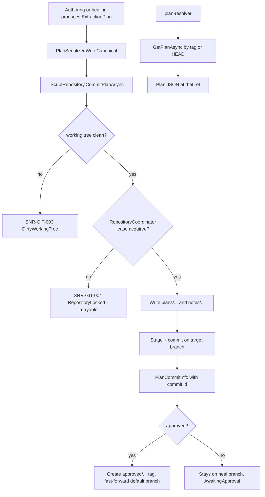

# Script Repository

> Feature spec for code-forge implementation planning.
> Source: extracted from docs/sanare/tech-design.md §8
> Created: 2026-09-06

| Field | Value |
|-------|-------|
| Component | script-repository |
| Priority | P0 |
| SRS Refs | — (no SRS; traces to tech-design §3.6 AC-002, AC-004, AC-015, AC-024) |
| Tech Design | §8.1 — row 4 "Script Repository"; §6.4 (on-disk layout, naming); §7.5 (plan lifecycle); §10.3; §17 DR-003, DR-008, DR-013 |
| Depends On | extraction-plan-model |
| Blocks | plan-resolver, authoring-workflow, healing-workflow |

## Purpose

Extraction plans are the system's source code, so they live in a real git repository on disk. This
component owns that repository: it initialises it, reads plans by branch/tag/commit, commits authored and
healed plans with structured messages, manages `heal/*` branches and `approved/*` tags, and exposes
history and diffs. Using git rather than a bespoke store gives merging, history, blame, rollback, and
human inspectability for free — which is exactly what the user asked for.

## Scope

**Included:**

- Repository bootstrap at `{StateRoot}/scripts/` (init, first commit, `.gitattributes`, `.gitignore`,
  identity configuration).
- Two interchangeable backends: **LibGit2Sharp** (default, in-process) and a **`git` CLI** backend
  (DR-003), behind one interface.
- Reading a plan at `HEAD`, at a branch, at a tag, or at an explicit commit.
- Committing plans with a canonical, machine-parseable commit-message format.
- Branch management for heals (`heal/{source-id}/{yyyyMMdd}-{shortReason}`).
- Approval tags (`approved/{source-id}/{schema-name}@{schemaVersion}/{n}`) with monotonic `n`.
- Fast-forward promotion of an approved heal branch onto the default branch, and rollback by re-tagging an
  earlier commit.
- Plan history, diff between two commits, and blame for a plan file.
- Inter-process locking, dirty-working-tree detection, and divergence handling.
- Attaching agent diagnosis notes at `notes/{source-id}/*.md` in the same commit as the plan change.

**Excluded:**

- Deciding *what* to commit or whether a plan is good — `authoring-workflow` / `healing-workflow`.
- Choosing which committed plan to run — `plan-resolver`.
- Fixtures, cache, and telemetry storage — those are non-git directories owned by other components.
- Remote git operations (push/pull/fetch). The repository is local-only by design; a consumer may add a
  remote themselves, but the library never talks to one.

## Core Responsibilities

1. **Own** the on-disk git repository lifecycle, creating it if absent and validating it if present.
2. **Read** plan documents at any git reference, cheaply and concurrently.
3. **Write** plan documents as commits with structured, greppable messages and provenance trailers.
4. **Isolate** unproven work on heal branches so `HEAD` of the default branch is always servable.
5. **Promote** and **roll back** approved plans through tags and fast-forward merges.
6. **Protect** the repository from concurrent writers, human edits, and divergence.

## Interfaces

### Inputs

- **`ExtractionPlan` + `PlanCommitRequest`** (from `authoring-workflow`, `healing-workflow`).
- **`PlanReference`** (from `plan-resolver`) — `(sourceId, schemaName, schemaVersion)` plus an optional
  explicit ref.
- **`ScriptRepositoryOptions`** (from `hosting-configuration`) — state root, backend choice, default
  branch name, committer identity, auto-approval flag.

### Outputs

- **Plan JSON text + `PlanCommitInfo`** (to `plan-resolver`, `plan-runtime`).
- **`PlanCommitId`** (to the result-cache key, `RunProvenance`, telemetry).
- **`PlanHistoryEntry[]`, unified diffs** (to `IScraperAdministration`, heal prompts).

### Dependencies

- **`extraction-plan-model`** — serialization and canonical writing; the repository stores canonical bytes
  only.
- **LibGit2Sharp** — default backend.
- **`System.IO`** — locking (via the default `FileLockRepositoryCoordinator`), atomic file replace.
- **`IRepositoryCoordinator`** (DR-013) — write-lease abstraction; `hosting-configuration`'s
  `RepositoryOptions.ICoordinatorFactory` selects the implementation at DI-registration time.

## Data Flow



## Key Behaviors

### Interface

```csharp
public interface IScriptRepository
{
    ValueTask InitializeAsync(CancellationToken ct = default);

    ValueTask<PlanDocument?> GetPlanAsync(
        string sourceId, string schemaName, int schemaVersion,
        GitRef? reference = null, CancellationToken ct = default);

    ValueTask<PlanCommitInfo> CommitPlanAsync(
        PlanCommitRequest request, CancellationToken ct = default);

    ValueTask<string> CreateHealBranchAsync(
        string sourceId, string reason, CancellationToken ct = default);

    ValueTask<PlanCommitInfo> ApproveAsync(
        string sourceId, string schemaName, int schemaVersion,
        string commitId, CancellationToken ct = default);

    ValueTask<PlanCommitInfo> RollbackAsync(
        string sourceId, string schemaName, int schemaVersion,
        string targetCommitId, CancellationToken ct = default);

    ValueTask<IReadOnlyList<PlanHistoryEntry>> GetHistoryAsync(
        string sourceId, string schemaName, int schemaVersion,
        int limit = 50, CancellationToken ct = default);

    ValueTask<string> GetDiffAsync(
        string fromCommitId, string toCommitId, string path, CancellationToken ct = default);

    ValueTask<RepositoryStatus> GetStatusAsync(CancellationToken ct = default);
}

public sealed record PlanDocument(
    string Json, string CommitId, string Ref, DateTimeOffset CommittedAt, string Message);
```

### Paths and naming

| Artefact | Path / name |
|----------|-------------|
| Plan file | `plans/{source-id}/{schema-name}@{schemaVersion}.plan.json` |
| Agent note | `notes/{source-id}/{yyyyMMdd-HHmmss}-{kind}.md` |
| Heal branch | `heal/{source-id}/{yyyyMMdd}-{shortReason}` |
| Approval tag | `approved/{source-id}/{schema-name}@{schemaVersion}/{n}` |

`{n}` is monotonically increasing per `(source-id, schema-name, schemaVersion)`, discovered by listing
existing tags in that namespace and taking `max + 1`. Tag creation is retried once on conflict (another
process won the race) and then fails with `SNR-GIT-006`.

### Commit message format

```
{verb}({source-id}/{schema-name}): {summary}

Schema: {schema-name}@{schemaVersion} ({schemaHash})
Tier: {tier}
Plan-Version: {planVersion}
Score: {score}
Fixtures: {fixtureId}, {fixtureId}, …
Model: {model}
Attempts: {attempts}
Reason: {authoring|heal:{degradationId}|rollback|approval}
```

`{verb}` is one of `author`, `heal`, `rollback`, or `approve`. The trailer block is parsed back into
`PlanCommitInfo` on read, so a plan's provenance survives even if the JSON body is edited by hand.

### Repository bootstrap

1. If `{StateRoot}/scripts/.git` is absent, `git init` (or LibGit2Sharp equivalent) with the configured
   default branch name (`main`).
2. Write `.gitattributes` pinning `*.plan.json text eol=lf` and `*.md text eol=lf` so plans never acquire
   CRLF on Windows and hash identically across platforms.
3. Write `.gitignore` excluding nothing by default but present for user convenience.
4. Configure `user.name` / `user.email` from options (default
   `sanare` / `scraper@localhost`) at the **repository** level, never globally.
5. Commit the scaffold as `chore: initialize plan repository`.
6. If `.git` exists, validate that the default branch exists and that the layout matches; a repository
   whose `plans/` directory is missing is accepted (it will be created on first commit).

### Repository coordination (DR-013)

```csharp
public interface IRepositoryCoordinator
{
    ValueTask<IAsyncDisposable> AcquireWriteLeaseAsync(
        TimeSpan timeout, CancellationToken ct = default);
}
```

`IScriptRepository` depends only on this abstraction, never on a concrete locking mechanism. The default
registration is `FileLockRepositoryCoordinator` (single-machine `FileStream` lock, described below);
`hosting-configuration`'s `RepositoryOptions.ICoordinatorFactory` is how a host substitutes a distributed
lease implementation. The seam exists specifically so a lease can later be backed by Redis, a cloud blob
lease, or a database advisory lock without `script-repository`'s public contract — or this file's
behavioural contract — changing.

### Concurrency and integrity

- Every write acquires a lease from an `IRepositoryCoordinator` (DR-013) before touching the working tree.
  The default implementation, `FileLockRepositoryCoordinator`, is an inter-process lock file at
  `{StateRoot}/scripts/.sanare-lock`; acquisition retries with jitter for up to 30 seconds, then fails
  `SNR-GIT-004` (retryable). `IScriptRepository` calls only the coordinator abstraction — it has no direct
  `FileStream` locking code of its own — so a host that registers a distributed semaphore/mutex-backed
  `IRepositoryCoordinator` for multi-process or multi-machine deployments (§ hosting-configuration
  `ICoordinatorFactory`) changes no call site here.
- Reads do not take a coordinator lease; they read at an explicit commit id or ref via the object database,
  so a concurrent commit cannot tear a read.
- Before any write, `GetStatusAsync` must report a clean working tree; human edits present ⇒
  `SNR-GIT-003`, so an agent can never absorb a person's half-finished change into a machine commit.
- A commit whose target branch has diverged fails `SNR-GIT-005`; the healing workflow reacts by rebasing
  onto the current approved commit and re-running the regression gate — it never force-pushes.
- Files are written atomically (temp file in the same directory + `File.Move(overwrite: true)`).

### Backend parity

Both backends implement the identical interface and are covered by the same test suite executed twice
(a `[Theory]` over backends). The CLI backend shells out with `--no-pager`, an explicit
`-c core.autocrlf=false`, and never inherits ambient global config that could alter behaviour. If the CLI
backend is selected and `git` is not on `PATH`, initialisation fails fast with `SNR-GIT-001` rather than
silently falling back.

## Constraints

- **Local only** — no remotes, no network. A user may add a remote manually; the library ignores it.
- **Never destructive** — no `reset --hard`, no force-update of refs, no history rewriting, no branch
  deletion of `main`. Superseded plans are superseded by new commits, never deleted (§7.5).
- **Canonical bytes only** — the repository writes what `extraction-plan-model` canonicalises, so diffs
  are meaningful.
- **LF line endings** everywhere, enforced by `.gitattributes` and asserted by test on Windows.
- **≤ 512 KB per plan file** (§7.3) — a larger document is rejected before commit.
- Backend selection is a configuration decision, never a run-time fallback.
- **Coordination is abstracted, never hard-wired** (DR-013) — `IScriptRepository` calls only
  `IRepositoryCoordinator`; the default `FileLockRepositoryCoordinator` is single-machine, but swapping in a
  distributed implementation must not require a code change here, only a different `hosting-configuration`
  `RepositoryOptions.ICoordinatorFactory` registration.

## Acceptance Criteria

| AC-ID | Priority | Criterion | Expected Result | Verification Method |
|-------|----------|-----------|-----------------|---------------------|
| AC-002 | P0 | Given no plan exists and authoring succeeds | A commit appears on the default branch containing `plans/{source}/{schema}@{v}.plan.json`; `GetPlanAsync` returns it | Integration — temp repo, assert file and commit id |
| AC-004 | P0 | Given authoring exhausts its attempt budget | No commit is created; `HEAD` is unchanged from before the run | Integration — capture `HEAD` before/after; assert equality |
| AC-015 | P0 | Given approval gating is enabled and a heal produces a plan | The plan is committed on a `heal/…` branch only; `GetPlanAsync` with no ref (default branch) still returns the previous plan | Integration — assert branch isolation |
| AC-024 | P1 | Given a committed plan | Its commit message trailer block round-trips into `PlanCommitInfo` with model, attempts, fixtures, and score | Unit — message parse test |
| AC-GIT-001 | P0 | Given an empty state root | `InitializeAsync` creates a repository with the configured default branch and a scaffold commit | Integration — bootstrap |
| AC-GIT-002 | P0 | Given an already-initialised repository | `InitializeAsync` is a no-op and does not add a commit | Integration — idempotence |
| AC-GIT-003 | P0 | Given a plan file modified by hand in the working tree | `CommitPlanAsync` fails with `SNR-GIT-003`; the human edit is untouched | Integration — dirty-tree guard |
| AC-GIT-004 | P0 | Given the lock file is held by another process | `CommitPlanAsync` retries then fails with `SNR-GIT-004` marked retryable, within ~30 s | Integration — hold the lock from a second process |
| AC-GIT-005 | P0 | Given two processes committing different plans concurrently | Both commits land, serialized by the lock; neither plan file is corrupted | Integration — parallel writer stress, 2 processes × 10 commits |
| AC-GIT-006 | P0 | Given the target branch has diverged since the plan was read | `CommitPlanAsync` fails with `SNR-GIT-005`; no force update occurs | Integration — divergence |
| AC-GIT-007 | P0 | Given an approval tag `…/7` already exists | The next approval creates `…/8` | Integration — monotonic numbering |
| AC-GIT-008 | P0 | Given the same commit is approved twice | The second call is an idempotent no-op returning the existing tag, not `SNR-GIT-006` | Integration — idempotent approval |
| AC-GIT-009 | P0 | Given a different commit is approved under an existing tag name | Fails with `SNR-GIT-006` | Integration — conflict |
| AC-GIT-010 | P0 | Given a rollback to an earlier commit | A new approval tag points at the earlier commit; the newer commit remains in history | Integration — non-destructive rollback |
| AC-GIT-011 | P0 | Given a plan committed on Windows | The blob contains LF only; the same content committed on Linux yields an identical blob hash | Integration — line-ending parity (assert blob sha) |
| AC-GIT-012 | P0 | Given the CLI backend is configured and `git` is absent from `PATH` | `InitializeAsync` fails with `SNR-GIT-001`; it does **not** fall back to LibGit2Sharp | Unit — PATH-scrubbed process |
| AC-GIT-013 | P0 | Given the same operation sequence on both backends | Resulting commit graph, file contents, tags, and branch names are equivalent | Integration — `[Theory]` parity suite |
| AC-GIT-014 | P0 | Given a plan document larger than 512 KB | The commit is rejected before any git operation | Unit — size boundary; 512 KB exactly succeeds |
| AC-GIT-015 | P1 | Given 60 commits touching a plan and `limit: 50` | `GetHistoryAsync` returns the 50 newest, newest-first | Integration — history paging boundary |
| AC-GIT-016 | P1 | Given two plan commits | `GetDiffAsync` returns a unified diff limited to that plan's path | Integration — diff scoping |
| AC-GIT-017 | P1 | Given a heal commit with a diagnosis note | The note file and the plan change land in the **same** commit | Integration — atomicity of note + plan |
| AC-GIT-018 | P0 | Given a host registers a custom `IRepositoryCoordinator` in place of `FileLockRepositoryCoordinator` | `CommitPlanAsync` acquires/releases its write lease exclusively through the substituted implementation; no `.sanare-lock` file is created | Integration — coordinator substitution (mirrors AC-HC-024) |
| AC-GIT-019 | P0 | Given the configured coordinator's `AcquireWriteLeaseAsync` times out | `CommitPlanAsync` fails with `SNR-GIT-004` regardless of which `IRepositoryCoordinator` implementation is active | Unit — fake coordinator that always times out |

## Error Handling

| Code | Raised when | Severity | Retryable | Effect |
|------|-------------|----------|-----------|--------|
| `SNR-GIT-001` | Repository cannot be opened/created; CLI backend selected but `git` missing | Fatal | No | Host startup fails fast |
| `SNR-GIT-002` | Approved-plan tags cannot be enumerated | Error | Yes (once) | Resolver retries once, then returns no plan and an actionable diagnostic |
| `SNR-GIT-003` | Working tree dirty at write time | Error | No | Authoring/heal aborts without committing |
| `SNR-GIT-004` | The active `IRepositoryCoordinator` (DR-013) cannot grant a write lease within its retry window | Error | Yes | Caller may retry the whole operation |
| `SNR-GIT-005` | Target branch diverged | Error | Yes (after rebase) | Heal rebases onto the current approved commit and re-validates |
| `SNR-GIT-006` | Approval tag exists for a different commit | Error | No | Approval refused; requires explicit rollback |

All git errors carry the repository path, the ref involved, and the backend name so an operator can
reproduce the state by hand with plain `git` commands.

## File Structure

```
src/
└── Sanare.Core/
    └── Repository/
        ├── IScriptRepository.cs
        ├── PlanDocument.cs
        ├── PlanCommitRequest.cs
        ├── PlanCommitInfo.cs
        ├── PlanHistoryEntry.cs
        ├── RepositoryStatus.cs
        ├── GitRef.cs
        ├── ScriptRepositoryOptions.cs
        ├── PlanPathBuilder.cs
        ├── CommitMessageFormatter.cs
        ├── CommitMessageParser.cs
        ├── ApprovalTagSequencer.cs
        ├── Coordination/
        │   ├── IRepositoryCoordinator.cs
        │   └── FileLockRepositoryCoordinator.cs
        └── Backends/
            ├── LibGit2ScriptRepository.cs
            ├── GitCliScriptRepository.cs
            └── GitCliProcessRunner.cs
```

`IRepositoryCoordinator` and `FileLockRepositoryCoordinator` are the same types registered by
`hosting-configuration`'s `RepositoryOptions.ICoordinatorFactory` (default) — they are defined once in
`Sanare.Core` so both the core repository component and the hosting extensions reference the
identical contract.

## Test Module

**Test file**: `tests/Sanare.Core.Tests/Repository/ScriptRepositoryTests.cs`

**Test scope**:

- **Unit**: `PlanPathBuilder` naming rules; `CommitMessageFormatter`/`Parser` round-trip including
  awkward values (commas in fixture ids, multi-line summaries); `ApprovalTagSequencer` `max + 1` logic
  over unordered tag lists; `FileLockRepositoryCoordinator` acquisition/timeout; `IScriptRepository`
  against a fake `IRepositoryCoordinator` (AC-GIT-018/019) proving it never touches `.sanare-lock` directly
  and always surfaces `SNR-GIT-004` on a coordinator timeout regardless of implementation; the 512 KB
  size boundary.
- **Integration**: the full interface exercised against a real repository in a temp directory, run as a
  `[Theory]` across both backends — bootstrap, commit, branch, tag, approve, rollback, history, diff,
  dirty-tree, divergence, concurrent-writer stress (via the default `FileLockRepositoryCoordinator`), and
  the Windows/Linux LF blob-hash parity check.
- **Fixtures / Mocks**: plan JSON reused from `tests/Sanare.Core.Tests/Plans/Data/`; a fake
  `IRepositoryCoordinator` for coordinator-substitution unit tests; otherwise no mocks — git is exercised
  for real, with each test given an isolated temp state root that is deleted in `DisposeAsync`. The
  CLI-backend theory is skipped with a clear reason when `git` is absent from `PATH`.

Companion test files: `tests/Sanare.Core.Tests/Repository/CommitMessageTests.cs`,
`tests/Sanare.Core.Tests/Repository/ApprovalTagSequencerTests.cs`,
`tests/Sanare.Core.Tests/Repository/RepositoryConcurrencyTests.cs`,
`tests/Sanare.Core.Tests/Repository/GitBackendParityTests.cs`.
