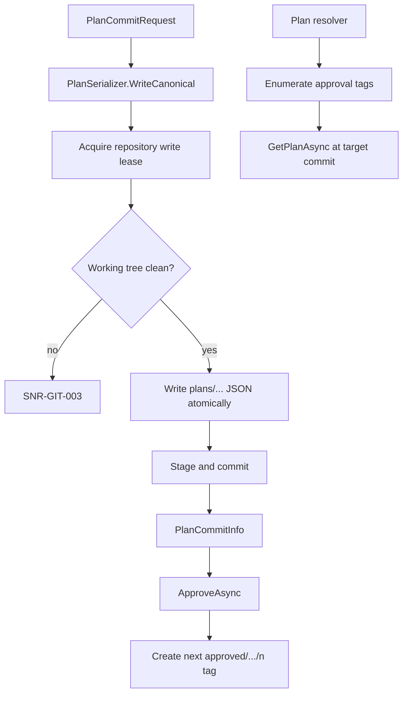

# Script Repository

> Feature spec for code-forge implementation planning.
> Source: extracted from docs/sanare/tech-design.md §8
> Created: 2026-09-06
> Implementation status: partial — local LibGit2Sharp-backed approved-plan storage slice implemented; advanced versioning remains deferred.

| Field | Value |
|-------|-------|
| Component | script-repository |
| Priority | P0 |
| SRS Refs | — (no SRS; traces to tech-design §3.6 AC-002, AC-004, AC-015, AC-024) |
| Tech Design | §8.1 — row 4 "Script Repository"; §6.4 (on-disk layout, naming); §7.5 (plan lifecycle); §10.3; §17 DR-003, DR-008, DR-013 |
| Depends On | extraction-plan-model |
| Blocks | plan-resolver, authoring-workflow, healing-workflow |

## Purpose

The script repository persists extraction plans as canonical JSON in a local git repository. The implemented slice bootstraps that repository, reads plans at a ref, commits plans under a write lease, and creates monotonic approval tags. It provides immutable inputs to `plan-resolver` without changing the runner contract.

## Scope

### Implemented slice

- Bootstrap a local repository at `{StateRoot}/scripts/`, including an initial commit, `.gitattributes`, `.gitignore`, and configured identity.
- Use the in-process **LibGit2Sharp** implementation behind `IScriptRepository`.
- Read a plan at the default branch `HEAD` or an explicit `GitRef` (branch, tag, or commit).
- Serialize a plan canonically and commit it, with dirty-working-tree detection and a repository-coordination lease.
- Create monotonic approval tags at `approved/{source-id}/{schema-name}@{schemaVersion}/{n}` and enumerate matching approval tags.
- Provide `IRepositoryCoordinator` with the default `FileLockRepositoryCoordinator` for inter-process write coordination.

### Deferred target-state scope

The git CLI backend, heal branches, fast-forward promotion, rollback-by-name, history, diffs, blame, diagnosis notes, and divergence handling are not implemented. They remain planned `script-repository` work. Remote git operations are out of scope for both the slice and the target component.

Deciding what to commit remains with `authoring-workflow`/`healing-workflow`; choosing which approved plan runs remains with `plan-resolver`; fixtures, cache, and telemetry are non-git storage owned by other components.

## Core Responsibilities

1. Bootstrap and own the local plan repository.
2. Read a plan document at `HEAD` or a caller-supplied immutable git ref.
3. Commit canonical plan JSON on the configured default branch or a caller-supplied branch.
4. Serialize writers using a repository-coordinator lease and reject a dirty working tree.
5. Create and enumerate approval tags for approved-plan resolution.

## Interfaces

### Inputs

- **`PlanCommitRequest`** containing an `ExtractionPlan`, commit verb, summary, reason, and optional branch.
- **Plan identity and optional `GitRef`** for reads.
- **`ScriptRepositoryOptions`** — repository path, default branch, commit identity, and lease timeout.

### Outputs

- **`PlanDocument`** — canonical JSON and the commit/ref metadata from which it was read.
- **`PlanCommitInfo`** — commit id, path, and commit metadata for commits and approvals.
- **`RepositoryStatus`** and matching `ApprovalTag` entries.

### Dependencies

- **`extraction-plan-model`** — canonical serialization.
- **LibGit2Sharp** — the sole implemented backend.
- **`IRepositoryCoordinator`** — write-lease abstraction; `FileLockRepositoryCoordinator` is the default local implementation.

## Data Flow



## Key Behaviors

### Interface

```csharp
public interface IScriptRepository
{
    ValueTask InitializeAsync(CancellationToken ct = default);
    ValueTask<PlanDocument?> GetPlanAsync(
        string sourceId, string schemaName, int schemaVersion,
        GitRef? reference = null, CancellationToken ct = default);
    ValueTask<PlanCommitInfo> CommitPlanAsync(PlanCommitRequest request, CancellationToken ct = default);
    ValueTask<PlanCommitInfo> ApproveAsync(
        string sourceId, string schemaName, int schemaVersion,
        string commitId, CancellationToken ct = default);
    ValueTask<RepositoryStatus> GetStatusAsync(CancellationToken ct = default);
    ValueTask<IReadOnlyList<ApprovalTag>> GetApprovalTagsAsync(
        string sourceId, string schemaName, int schemaVersion, CancellationToken ct = default);
}
```

### Paths and naming

| Artefact | Path / name |
|----------|-------------|
| Plan file | `plans/{source-id}/{schema-name}@{schemaVersion}.plan.json` |
| Approval tag | `approved/{source-id}/{schema-name}@{schemaVersion}/{n}` |
| Write lease | `.sanare-lock` in the repository root |

`{n}` is monotonically increasing per `(source-id, schema-name, schemaVersion)`: the repository lists matching tags, takes `max + 1`, and creates the tag at the supplied commit.

### Commit and bootstrap behavior

- Plan commits use a stable message consisting of `{verb}({source-id}/{schema-name}): {summary}` followed by `Schema`, `Tier`, `Plan-Version`, and `Reason` trailers.
- Bootstrap writes `.gitattributes` for LF plan and Markdown files and `.gitignore` for the lock and temporary plan files, then commits `chore: initialize plan repository`.
- Initialization is idempotent when the configured path already contains a valid git repository.

### Repository coordination and integrity

- Each commit and approval-tag write acquires an `IRepositoryCoordinator` lease before modifying the repository.
- `FileLockRepositoryCoordinator` holds an exclusive `.sanare-lock` file and retries until the configured timeout, then raises retryable `SNR-GIT-004`.
- Commits reject a dirty working tree with `SNR-GIT-003` rather than including an unrelated human edit.
- Plan files are written through a temporary file in the same directory and atomically moved into place before staging.
- Read operations do not acquire a write lease and read the git object at the requested ref.

## Constraints

- The repository is local-only.
- Canonical plan JSON must not exceed `ScriptRepositoryOptions.MaxPlanSizeBytes`; oversized documents fail with `SNR-GIT-014`.
- Approval tags must point to an existing commit; invalid commit ids fail with `SNR-GIT-002`.

## Acceptance Criteria

| AC-ID | Priority | Criterion | Expected Result | Verification Method |
|-------|----------|-----------|-----------------|---------------------|
| AC-GIT-001 | P0 | Given an absent repository | Initialization creates a clean repository and scaffold commit | Unit |
| AC-GIT-002 | P0 | Given an initialized repository | Re-initialization is idempotent | Unit |
| AC-GIT-003 | P0 | Given a committed plan | `GetPlanAsync` returns canonical JSON and its commit id | Unit |
| AC-GIT-004 | P0 | Given an explicit commit ref | `GetPlanAsync` reads the plan at that commit | Unit |
| AC-GIT-005 | P0 | Given an approved commit | `ApproveAsync` creates the next numeric approval tag | Unit |
| AC-GIT-006 | P0 | Given a dirty working tree | `CommitPlanAsync` fails with `SNR-GIT-003` | Unit |
| AC-GIT-007 | P0 | Given a lease timeout | The write fails with retryable `SNR-GIT-004` | Unit |
| AC-GIT-008 | P0 | Given the same commit approved twice | `ApproveAsync` is idempotent and returns the existing tag | Unit |

## Error Handling

| Code | Condition | Retryable | Repository action |
|------|-----------|-----------|-------------------|
| `SNR-GIT-002` | Requested commit or tag target cannot be resolved | No | Fail the operation. |
| `SNR-GIT-003` | Working tree is dirty before a commit | No | Refuse to commit. |
| `SNR-GIT-004` | Write lease cannot be acquired before timeout | Yes | Fail without changing the repository. |
| `SNR-GIT-006` | The computed next monotonic tag name already exists (concurrent/external tag creation) | No | Refuse the approval. |
| `SNR-GIT-014` | Canonical JSON exceeds the configured size limit | No | Refuse to write the plan. |

## File Structure

```
src/
└── Sanare.Core/
    └── Repository/
        ├── FileLockRepositoryCoordinator.cs
        ├── GitRef.cs
        ├── GitScriptRepository.cs
        ├── IRepositoryCoordinator.cs
        ├── IScriptRepository.cs
        ├── PlanCommitInfo.cs
        ├── PlanCommitRequest.cs
        ├── PlanDocument.cs
        ├── RepositoryStatus.cs
        ├── ScriptRepositoryException.cs
        └── ScriptRepositoryOptions.cs
```

`IRepositoryCoordinator` is defined in `Sanare.Core` so the repository component and any host that
constructs `GitScriptRepository` share the same write-lease contract. `FileLockRepositoryCoordinator`
is the only implementation provided by this slice; a host wires it in (or substitutes a distributed
coordinator) via constructor injection — there is no hosting-configuration factory type yet.

## Test Module

**Test file**: `tests/Sanare.Core.Tests/Repository/GitScriptRepositoryTests.cs`

**Test scope**:

- **Integration**: an isolated real LibGit2Sharp repository verifies bootstrap idempotence, canonical plan commit/read round-trips, reads at an explicit commit, monotonic approval tagging, tag enumeration, and repository status.
- **Unit**: `GitScriptRepositoryTests.cs` covers `FileLockRepositoryCoordinator`'s retryable timeout behavior (`SNR-GIT-004`) by acquiring an exclusive lock on `.sanare-lock`.
- **Fixtures / Mocks**: temporary repository roots and canonical plan fixtures; no CLI backend is exercised because it is deferred.

The target-state suite will add CLI-parity, healing, promotion/rollback, history/diff/blame, and divergence scenarios when those APIs are implemented.
