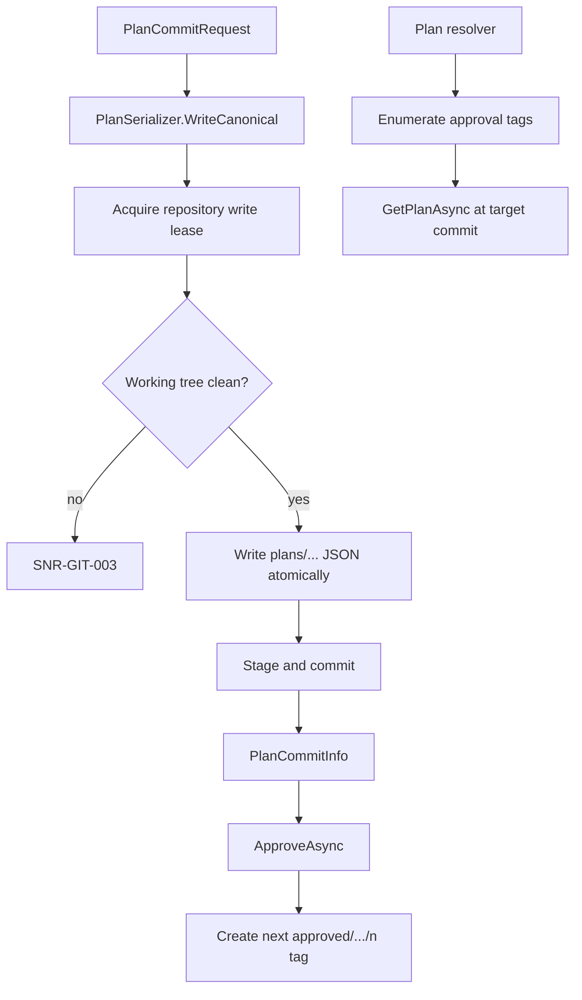

# Script Repository

> Feature spec for code-forge implementation planning.
> Source: extracted from docs/sanare/tech-design.md §8
> Created: 2026-09-06
> Implementation status: partial — the full local LibGit2Sharp-backed surface is implemented (storage, approval, history, diff, heal branches, promotion, rollback, diagnosis notes, pruning); the optional `git` CLI backend, remotes, blame, merge/conflict resolution, and the `IScraperAdministration` surface remain deferred.

| Field | Value |
|-------|-------|
| Component | script-repository |
| Priority | P0 |
| SRS Refs | — (no SRS; traces to tech-design §3.6 AC-002, AC-004, AC-015, AC-024) |
| Tech Design | §8.1 — row 4 "Script Repository"; §6.4 (on-disk layout, naming); §7.5 (plan lifecycle); §10.3; §17 DR-003, DR-008, DR-013 |
| Depends On | extraction-plan-model |
| Blocks | plan-resolver, authoring-workflow, healing-workflow |

## Purpose

The script repository persists extraction plans as canonical JSON in a local git repository. The implemented slice bootstraps that repository, reads plans at a ref, commits plans under a write lease, and creates monotonic approval tags. It provides immutable inputs to `plan-resolver` without changing the runner contract.

## Scope

### Implemented slice

- Bootstrap a local repository at `{StateRoot}/scripts/`, including an initial commit, `.gitattributes`, `.gitignore`, and configured identity.
- Use the in-process **LibGit2Sharp** implementation behind `IScriptRepository`.
- Read a plan at the default branch `HEAD` or an explicit `GitRef` (branch, tag, or commit).
- Serialize a plan canonically and commit it, with dirty-working-tree detection and a repository-coordination lease.
- Create monotonic approval tags at `approved/{source-id}/{schema-name}@{schemaVersion}/{n}` and enumerate matching approval tags.
- Provide `IRepositoryCoordinator` with the default `FileLockRepositoryCoordinator` for inter-process write coordination.
- Read a plan's commit history, with approval tags and provenance presence attached to each entry.
- Diff the `plans/` tree between two refs, capping patch text at the plan size limit and flagging truncation.
- Create `heal/{yyyyMMdd}-{source-id}-{reason}` branches from the current approved commit, de-duplicating colliding names.
- Fast-forward promote a heal branch onto the default branch and approve the promoted tip in one operation.
- Roll back to an earlier commit by creating a new approval tag, without deleting tags or rewriting history.
- Commit human-readable diagnosis notes under `notes/{source-id}/`.
- Prune merged or stale heal branches.

### Deferred target-state scope

The optional `git` CLI backend, blame, and merge/conflict resolution are not implemented. Blame and merge/conflict resolution remain planned `script-repository` work; the CLI backend is deferred by decision, as described next. Remote git operations are out of scope for both the slice and the target component.

The CLI backend is deliberately deferred rather than merely unbuilt. DR-003 accepts LibGit2Sharp as the default and describes the CLI backend as existing "for environments where [packaging LibGit2Sharp's native binaries per RID] is a problem" — an environment accommodation, not a functional requirement. Every behaviour in this spec is satisfied by the in-process backend, so the CLI backend is warranted only once a concrete deployment target rejects the native binaries. Reviving it means reimplementing all fourteen `IScriptRepository` members against `git` plumbing and proving parity by running the shared test harness against both backends.

The `IScraperAdministration` surface that exposes history and diffs to operators belongs to `plan-resolver`'s admin work, not here; this component supplies the repository-level primitives it will call.

Deciding what to commit remains with `authoring-workflow`/`healing-workflow`; choosing which approved plan runs remains with `plan-resolver`; fixtures, cache, and telemetry are non-git storage owned by other components.

## Core Responsibilities

1. Bootstrap and own the local plan repository.
2. Read a plan document at `HEAD` or a caller-supplied immutable git ref.
3. Commit canonical plan JSON on the configured default branch or a caller-supplied branch.
4. Serialize writers using a repository-coordinator lease and reject a dirty working tree.
5. Create and enumerate approval tags for approved-plan resolution.
6. Expose a plan's history and the diff between two refs as inspection primitives.
7. Own the heal-branch lifecycle: creation from the approved commit, fast-forward promotion, and pruning.
8. Move the approval pointer backwards on rollback without destroying history.

## Interfaces

### Inputs

- **`PlanCommitRequest`** containing an `ExtractionPlan`, commit verb, summary, reason, and optional branch.
- **Plan identity and optional `GitRef`** for reads.
- **`ScriptRepositoryOptions`** — repository path, default branch, commit identity, and lease timeout.

### Outputs

- **`PlanDocument`** — canonical JSON and the commit/ref metadata from which it was read.
- **`PlanCommitInfo`** — commit id, path, and commit metadata for commits and approvals.
- **`RepositoryStatus`** and matching `ApprovalTagEntry` values.
- **`PlanHistory`** — a plan path and its ordered `PlanHistoryEntry` values, each pairing a `PlanCommitInfo` with its summary and whether the plan carried provenance at that commit.
- **`PlanDiff`** — the two compared commit ids and the changed `PlanDiffFile` entries, each with a status, line counts, patch text, and a truncation flag.

### Dependencies

- **`extraction-plan-model`** — canonical serialization.
- **LibGit2Sharp** — the sole implemented backend.
- **`IRepositoryCoordinator`** — write-lease abstraction; `FileLockRepositoryCoordinator` is the default local implementation.

## Data Flow


```mermaid
flowchart TD
    A[PlanCommitRequest] --> B[PlanSerializer.WriteCanonical]
    B --> C[Acquire repository write lease]
    C --> D{Working tree clean?}
    D -- no --> E[SNR-GIT-003]
    D -- yes --> F[Write plans/... JSON atomically]
    F --> G[Stage and commit]
    G --> H[PlanCommitInfo]
    H --> I[ApproveAsync]
    I --> J[Create next approved/.../n tag]
    K[Plan resolver] --> L[Enumerate approval tags]
    L --> M[GetPlanAsync at target commit]
```

## Key Behaviors

### Interface

```csharp
public interface IScriptRepository
{
    ValueTask InitializeAsync(CancellationToken ct = default);
    ValueTask<PlanDocument?> GetPlanAsync(
        string sourceId, string schemaName, int schemaVersion,
        GitRef? reference = null, CancellationToken ct = default);
    ValueTask<PlanCommitInfo> CommitPlanAsync(PlanCommitRequest request, CancellationToken ct = default);
    ValueTask<PlanCommitInfo> ApproveAsync(
        string sourceId, string schemaName, int schemaVersion,
        string commitId, CancellationToken ct = default);
    ValueTask<RepositoryStatus> GetStatusAsync(CancellationToken ct = default);
    ValueTask<IReadOnlyList<ApprovalTagEntry>> GetApprovalTagsAsync(
        string sourceId, string schemaName, int schemaVersion, CancellationToken ct = default);
    ValueTask<PlanHistory> GetHistoryAsync(
        string sourceId, string schemaName, int schemaVersion,
        int? limit = null, CancellationToken ct = default);
    ValueTask<PlanDiff> DiffAsync(string fromCommitId, string toCommitId, CancellationToken ct = default);
    ValueTask<string> CreateHealBranchAsync(
        string sourceId, string schemaName, int schemaVersion,
        string shortReason, CancellationToken ct = default);
    ValueTask<PlanCommitInfo> PromoteAsync(
        string sourceId, string schemaName, int schemaVersion,
        string branch, CancellationToken ct = default);
    ValueTask<PlanCommitInfo> RollbackAsync(
        string sourceId, string schemaName, int schemaVersion,
        string targetCommitId, CancellationToken ct = default);
    ValueTask CommitDiagnosisNoteAsync(
        string sourceId, string markdown, string relatedCommitId, CancellationToken ct = default);
    ValueTask<IReadOnlyList<string>> PruneHealBranchesAsync(
        TimeSpan olderThan, CancellationToken ct = default);
}
```

### Paths and naming

| Artefact | Path / name |
|----------|-------------|
| Plan file | `plans/{source-id}/{schema-name}@{schemaVersion}.plan.json` |
| Approval tag | `approved/{source-id}/{schema-name}@{schemaVersion}/{n}` |
| Heal branch | `heal/{source-id}/{yyyyMMdd}-{shortReason}`, with `-2`, `-3`, … appended on collision |
| Diagnosis note | `notes/{source-id}/{yyyyMMddHHmmss}-{shortCommitId}.md` |
| Write lease | `.sanare-lock` in the repository root |

`{n}` is monotonically increasing per `(source-id, schema-name, schemaVersion)`: the repository lists matching tags, takes `max + 1`, and creates the tag at the supplied commit.

### Commit and bootstrap behavior

- Plan commits use a stable message consisting of `{verb}({source-id}/{schema-name}): {summary}` followed by `Schema`, `Tier`, `Plan-Version`, and `Reason` trailers.
- Bootstrap writes `.gitattributes` for LF plan and Markdown files and `.gitignore` for the lock and temporary plan files, then commits `chore: initialize plan repository`.
- Initialization is idempotent when the configured path already contains a valid git repository.

### Repository coordination and integrity

- Each commit and approval-tag write acquires an `IRepositoryCoordinator` lease before modifying the repository.
- `FileLockRepositoryCoordinator` holds an exclusive `.sanare-lock` file and retries until the configured timeout, then raises retryable `SNR-GIT-004`.
- Commits reject a dirty working tree with `SNR-GIT-003` rather than including an unrelated human edit.
- Plan files are written through a temporary file in the same directory and atomically moved into place before staging.
- Read operations do not acquire a write lease and read the git object at the requested ref.

### History and diff

- `GetHistoryAsync` walks commits touching the plan's path only, newest first, and returns an empty history for an uninitialized repository rather than failing. A non-positive `limit` is rejected with `SNR-GIT-015`.
- Each entry reports the approval tag pointing at that commit, if any, and whether the plan carried provenance there. When several tags point at one commit, the highest-numbered wins.
- `DiffAsync` compares the `plans/` subtree only, so diagnosis notes and repository scaffold files never appear in a plan diff.
- Patch text is capped at `MaxPlanSizeBytes`. Truncation cuts on a UTF-8 character boundary and sets the file's truncation flag; it never raises `SNR-GIT-014`, which applies to writes.

### Heal, promotion, and rollback

- `CreateHealBranchAsync` branches from the plan's currently approved commit, falling back to the default-branch tip when nothing is approved yet. The reason is slugified to `[a-z0-9-]`; any other character is rejected with `SNR-GIT-015` rather than silently dropped, so a traversal-shaped reason cannot be laundered into a valid branch name.
- `PromoteAsync` is fast-forward only. It verifies the branch tip descends from the default-branch tip, moves the branch ref, and then approves the promoted tip. A diverged branch fails with `SNR-GIT-005` **before any ref is written**, so a rejected promotion leaves the repository byte-identical.
- `RollbackAsync` requires an existing approval and a target that is an ancestor of it, then creates a *new* highest-numbered approval tag at that target. It never deletes or moves a tag and never commits, so the superseded plan stays reachable and auditable. Re-running it for the already-approved commit is a no-op.
- `PruneHealBranchesAsync` deletes a heal branch once it has been promoted, because a promoted tip is reachable from the default branch and deleting the branch ref strands nothing. An unpromoted branch is kept whenever its tip carries a tag or it is newer than the supplied age. Pruning never runs automatically and never touches `plans/`.
- `CommitDiagnosisNoteAsync` writes onto the branch holding the related commit, so a note follows the heal branch it explains. Notes live outside `plans/` and therefore never appear in plan history or diffs.

## Constraints

- The repository is local-only.
- Canonical plan JSON must not exceed `ScriptRepositoryOptions.MaxPlanSizeBytes`; oversized documents fail with `SNR-GIT-014`.
- Approval tags must point to an existing commit; invalid commit ids fail with `SNR-GIT-002`.

## Acceptance Criteria

| AC-ID | Priority | Criterion | Expected Result | Verification Method |
|-------|----------|-----------|-----------------|---------------------|
| AC-GIT-001 | P0 | Given an absent repository | Initialization creates a clean repository and scaffold commit | Unit |
| AC-GIT-002 | P0 | Given an initialized repository | Re-initialization is idempotent | Unit |
| AC-GIT-003 | P0 | Given a committed plan | `GetPlanAsync` returns canonical JSON and its commit id | Unit |
| AC-GIT-004 | P0 | Given an explicit commit ref | `GetPlanAsync` reads the plan at that commit | Unit |
| AC-GIT-005 | P0 | Given an approved commit | `ApproveAsync` creates the next numeric approval tag | Unit |
| AC-GIT-006 | P0 | Given a dirty working tree | `CommitPlanAsync` fails with `SNR-GIT-003` | Unit |
| AC-GIT-007 | P0 | Given a lease timeout | The write fails with retryable `SNR-GIT-004` | Unit |
| AC-GIT-008 | P0 | Given the same commit approved twice | `ApproveAsync` is idempotent and returns the existing tag | Unit |
| AC-GIT-009 | P1 | Given several revisions of a plan | `GetHistoryAsync` returns them newest first with approval tags and provenance flags attached | Unit |
| AC-GIT-010 | P1 | Given an uninitialized repository or a non-positive limit | History returns empty; a non-positive limit fails with `SNR-GIT-015` | Unit |
| AC-GIT-011 | P1 | Given two plan commits | `DiffAsync` reports the changed `plans/` files with status and line counts | Unit |
| AC-GIT-012 | P1 | Given a diff larger than the size limit | The patch is truncated on a character boundary and flagged truncated | Unit |
| AC-GIT-013 | P1 | Given an approved plan | `CreateHealBranchAsync` branches from the approved commit using the dated naming scheme and de-duplicates collisions | Unit |
| AC-GIT-014 | P0 | Given a fast-forwardable heal branch | `PromoteAsync` advances the default branch and approves the tip; a diverged branch fails `SNR-GIT-005` with no ref written | Unit |
| AC-GIT-015 | P0 | Given an earlier ancestor commit | `RollbackAsync` creates a new highest-numbered approval tag there without deleting or moving any tag | Unit |
| AC-GIT-016 | P0 | Given a non-ancestor target or no prior approval | Rollback fails with `SNR-GIT-005`; a missing plan blob fails with `SNR-GIT-002` | Unit |
| AC-GIT-017 | P2 | Given promoted and stale heal branches | `PruneHealBranchesAsync` deletes them and keeps tagged or recent unpromoted branches | Unit |

## Error Handling

| Code | Condition | Retryable | Repository action |
|------|-----------|-----------|-------------------|
| `SNR-GIT-002` | Requested commit or tag target cannot be resolved | No | Fail the operation. |
| `SNR-GIT-003` | Working tree is dirty before a commit | No | Refuse to commit. |
| `SNR-GIT-004` | Write lease cannot be acquired before timeout | Yes | Fail without changing the repository. |
| `SNR-GIT-005` | A branch tip is not a descendant of the approved commit (promotion), or a rollback target is not its ancestor | No | Refuse the operation; leave every ref untouched. |
| `SNR-GIT-006` | The computed next monotonic tag name already exists (concurrent/external tag creation) | No | Refuse the approval. |
| `SNR-GIT-014` | Canonical JSON exceeds the configured size limit | No | Refuse to write the plan. |
| `SNR-GIT-015` | `sourceId` or `schemaName` fails identifier validation (path traversal, ref injection, invalid characters) | No | Refuse the operation before touching the repository. |

## File Structure

```
src/
└── Sanare.Core/
    └── Repository/
        ├── FileLockRepositoryCoordinator.cs
        ├── GitRef.cs
        ├── GitScriptRepository.cs
        ├── IRepositoryCoordinator.cs
        ├── IScriptRepository.cs
        ├── PlanCommitInfo.cs
        ├── PlanCommitMessage.cs
        ├── PlanCommitRequest.cs
        ├── PlanDiff.cs
        ├── PlanDocument.cs
        ├── PlanHistory.cs
        ├── RepositoryStatus.cs
        ├── ScriptRepositoryException.cs
        └── ScriptRepositoryOptions.cs
```

`IRepositoryCoordinator` is defined in `Sanare.Core` so the repository component and any host that
constructs `GitScriptRepository` share the same write-lease contract. `FileLockRepositoryCoordinator`
is the only implementation provided by this slice; a host wires it in (or substitutes a distributed
coordinator) via constructor injection — there is no hosting-configuration factory type yet.

`PlanCommitMessage` owns both directions of the commit-message trailer format, so the writer and the
history reader share one definition of each trailer key and cannot drift apart.

## Test Module

**Test files**: `tests/Sanare.Core.Tests/Repository/`

| File | Covers |
|------|--------|
| `ScriptRepositoryFixture.cs` | Shared harness: isolated repository root, option defaults, plan/revision commit helpers, cleanup. |
| `FakeScriptRepository.cs` | In-memory `IScriptRepository` double shared with the `plan-resolver` tests. |
| `GitScriptRepositoryTests.cs` | Bootstrap, commit/read round-trips, approval tagging, status, lease timeout (AC-GIT-001…AC-GIT-008). |
| `ScriptRepositoryHistoryTests.cs` | History ordering, tag and provenance attachment, empty and invalid-limit cases (AC-GIT-009, AC-GIT-010). |
| `ScriptRepositoryDiffTests.cs` | Diff content, status, line counts, and `plans/`-only scoping (AC-GIT-011). |
| `ScriptRepositoryDiffTruncationTests.cs` | Oversized patch truncation on a character boundary (AC-GIT-012). |
| `ScriptRepositoryHealBranchTests.cs` | Branch naming, approved-commit base, collision de-duplication, reason validation (AC-GIT-013). |
| `ScriptRepositoryPromotionTests.cs` | Fast-forward promotion, divergence rejection, and pruning (AC-GIT-014, AC-GIT-017, AC-024). |
| `ScriptRepositoryRollbackTests.cs` | Rollback tagging, ancestry and approval preconditions, idempotence (AC-GIT-015, AC-GIT-016). |

**Test scope**:

- **Integration**: every suite drives a real isolated LibGit2Sharp repository through `ScriptRepositoryFixture`; there are no git mocks.
- **Unit**: `GitScriptRepositoryTests.cs` covers `FileLockRepositoryCoordinator`'s retryable timeout behavior (`SNR-GIT-004`) by acquiring an exclusive lock on `.sanare-lock`.
- **Fixtures / Mocks**: temporary repository roots and canonical plan fixtures; no CLI backend is exercised because it is deferred.

These tests caught two defects worth recording, both of which are now regression-covered. Pruning
originally checked "tip is tagged → skip" before the promoted check, and since promotion tags the
promoted tip, no promoted branch was ever prunable. Slugification originally dropped unexpected
characters, so `../../etc/passwd` was laundered into the valid slug `etc-passwd` instead of being
rejected; unexpected characters now raise `SNR-GIT-015`.

The target-state suite will add CLI-parity, blame, and merge/conflict scenarios when those APIs are implemented.

## Implementation Plan

> Planned: 2026-09-13. Milestone M3 (with `plan-resolver`'s admin surface). This section is the build
> order for the deferred target-state scope above; it does not restate the behaviour already described,
> only how to land what is missing.
>
> **Status: executed 2026-09-13.** T1–T9 and T11 landed; the sections above now describe shipped
> behaviour rather than intent. **T10 (git CLI backend) was descoped** — see "Deferred scope" below and
> the rationale under "Deferred target-state scope". The plan is kept as the record of how the component
> was built and why the one remaining task was not.

### Preconditions

Six things this spec assumes are settled are not. The first two were documentation defects and are already
corrected above (T1); the remaining four must be resolved inside this component's landing rather than
discovered mid-build:

1. **`ApprovalTag` never existed.** *(Resolved by T1.)* The interface listing under "Interface" declared
   `GetApprovalTagsAsync` returning `IReadOnlyList<ApprovalTag>`, but the shipped code returns
   `IReadOnlyList<ApprovalTagEntry>` (`GitScriptRepository.GetApprovalTagsAsync`), and both
   `Sanare.Core.Resolution.PlanResolver` and `plan-resolver`'s test double consume that type. The spec
   text was stale, not the code, so the listing was corrected rather than a depended-upon type renamed.
   The "Error Handling" table was likewise missing `SNR-GIT-005` and `SNR-GIT-015`, the latter thrown
   from four places in the shipped code and documented in none.
2. **The `DEVELOPMENT.md` todo and this spec disagreed about remotes.** *(Resolved by T1.)* The todo line
   asked for "remote synchronization"; "Deferred target-state scope" above states remote git operations
   are out of scope for *both* the slice and the target component, and the technical design places the
   repository in the local state root with remotes described only as an optional host-configured recovery
   path (tech-design line 1571). The spec won: remotes stay out, and the todo wording now says so.
3. **Rollback is not tag deletion, and nothing currently enforces that.** Tech-design line 670 fixes the
   semantics: "Rollback is `Approved` re-pointing to an earlier commit; the superseded plan becomes
   `Superseded`, never deleted." `ApproveInternalAsync` already computes `max + 1` over the existing
   tag set, so a rollback expressed as a *new* highest-numbered tag at an older commit is naturally
   correct for `PlanResolver`, which orders numerically via `ApprovalTagParser`. No tag is ever removed.
   T7 implements rollback on that basis; T2 makes the resolver-visible consequence testable.
4. **`PlanResolver` caches by `(sourceId, schemaHash)` and is not invalidated by repository writes.**
   `PlanResolver` holds a warm `_index` and `IPlanResolver` already exposes an invalidation entry point.
   Every new operation that changes which commit is approved (rollback, promotion) must therefore be
   observable to a caller that has already resolved once. This component does not reach into the
   resolver; T7 and T6 return the new approval tag in `PlanCommitInfo` so the admin layer can invalidate,
   and the verification matrix asserts that contract rather than assuming it.
5. **Extending `IScriptRepository` breaks an existing test double.** `FakeScriptRepository`, nested in
   `tests/Sanare.Core.Tests/Resolution/PlanResolverTests.cs`, implements the interface member-by-member and
   throws `NotSupportedException` from everything `plan-resolver` does not call. Each new interface member
   is therefore a compile break in a *different* component's test suite. Default interface implementations
   would hide that, at the cost of letting a real backend silently not implement an operation, so T2 keeps
   the members abstract and extends the double explicitly as each task lands.
6. **The commit-message trailer block is written but never parsed.** `BuildCommitMessage` emits `Schema`,
   `Tier`, `Plan-Version`, `Score`, `Fixtures`, `Model`, `Attempts`, and `Reason`; `PlanCommitInfo`'s doc
   comment claims it is "parsed back from the commit message's structured trailer block", but no parser
   exists — every `PlanCommitInfo` today is built from values already in hand, and `ApproveAsync` fills the
   provenance fields with `string.Empty`/`0`/`[]` placeholders. History entries are read from commits
   nobody holds the request for, so T3 must write that parser as its first step.

### Delivery decisions

| Decision | Choice | Rationale |
|---|---|---|
| Package | `src/Sanare.Core/Repository/`; no new project | Every new operation is a method on the existing `IScriptRepository` over the same LibGit2Sharp handle. A `Sanare.Git` package would be referenced only by `Sanare.Core` and would split one component across two assemblies for no isolation benefit. |
| Interface shape | Extend `IScriptRepository` in place; do **not** add a parallel `IAdvancedScriptRepository` | `plan-resolver`, `authoring-workflow`, and `healing-workflow` all bind to one repository abstraction. A second interface would force every consumer to hold both and would make the "swappable backend" seam (DR-003) mean two things. The existing `<remarks>` block listing the backlog is deleted as each item lands. |
| `Sanare.Abstractions` | Untouched | No new type here belongs to the frozen zero-dependency public surface; `PlanHistory`/`PlanDiff` are repository-layer records in `Sanare.Core`. This keeps `tests/Sanare.Abstractions.Tests/ApprovedApi/` unchanged and off the critical path. |
| Rollback representation | A new, higher-numbered approval tag pointing at an older commit | Mandated by tech-design line 670 and required by `ApprovalTagParser`'s numeric ordering. Deleting or moving a tag would rewrite history that provenance records (AC-024) already cite by commit id. |
| Promotion representation | Fast-forward the default branch, then tag | `healing-workflow.md` line 253 requires that heal commits never touch the default branch directly and that promotion is a tag move. Fast-forward-only means a diverged branch is a detectable error (`SNR-GIT-005`) rather than a silent merge commit. |
| Divergence detection | `repo.ObjectDatabase.CanMergeWithoutConflict`-free ancestry check via merge-base | A merge-base comparison answers exactly the question the error table asks ("is the target a descendant of the approved commit?") without attempting a merge the component is forbidden to perform. |
| Git CLI backend | Land last (T10), behind the same `IScriptRepository`, gated by a `ScriptRepositoryOptions` backend selector | DR-003 calls the CLI backend "optional", existing "for environments where [per-RID native binaries] are a problem". Building it before the LibGit2Sharp surface is complete would mean implementing every operation twice against a moving target. |
| Blame | Deferred, not built | `IScraperAdministration` (§9.2.2) exposes `ListPlansAsync`, `GetHistoryAsync`, `DiffAsync`, `ApproveAsync`, and `RollbackAsync` — no blame entry point exists, and no acceptance criterion cites it. Building an unreachable API is speculative work. |
| Garbage collection scope | Stale **heal branches** only; never plan files, never tags, never objects | Tags are provenance anchors and plan history is the product. "Garbage collection" here means pruning merged/abandoned `heal/*` refs so the ref namespace stays legible; `git gc` on the object database is the host's business. |
| New dependencies | None | LibGit2Sharp is already referenced; the CLI backend shells out to an existing `git` via `System.Diagnostics.Process`. |
| Error codes | Reuse `SNR-GIT-001` … `SNR-GIT-006`, `SNR-GIT-014`, `SNR-GIT-015` | The technical design's error table (lines 890–895) already names every condition these operations can hit. No new code is minted. |

### Task order

**T1 — Reconcile the specification with the shipped code.** *(Done, landed with this plan.)* Closing the
documentation contradictions the build would otherwise inherit, so no task below starts from a false
premise: the `IScriptRepository` listing's `IReadOnlyList<ApprovalTag>` is now `IReadOnlyList<ApprovalTagEntry>`;
the "Outputs" bullet matches; `SNR-GIT-005` and `SNR-GIT-015` are in the "Error Handling" table; the
`DEVELOPMENT.md` todo names the scope this component actually owns instead of "remote synchronization";
and [overview.md](overview.md) row 4 explains what `partial` means here. Depends on: —

**T2 — Advanced-operation test harness.** `GitScriptRepositoryTests.cs` is a single 312-line class with a
private temp-repository fixture and no seam for building multi-commit or multi-branch histories. Extract
that fixture into a reusable `ScriptRepositoryFixture` (temp root, options, coordinator, validator,
`CommitPlan(...)` and `CommitPlanOn(branch, ...)` helpers returning commit ids) under
`tests/Sanare.Core.Tests/Repository/`, and leave the existing tests passing against it unchanged. Every
task below needs a repository with a shaped history; building that inline in each test is how this suite
becomes unmaintainable. In the same task, promote `FakeScriptRepository` out of
`PlanResolverTests.cs` into a shared test-support file, since every subsequent task adds an interface
member that breaks it (precondition 5) and the breakage belongs in one file rather than in
`plan-resolver`'s suite. Depends on: —

**T3 — Trailer parser, then `GetHistoryAsync`.** First close precondition 6: add
`PlanCommitMessage.TryParse(string message, out PlanCommitInfo)` as the inverse of `BuildCommitMessage`,
sharing one constant per trailer key so the writer and reader cannot drift, and tolerating a missing or
malformed trailer by returning what it could read rather than throwing — the repository must stay
readable after a human commits by hand. Then
`ValueTask<PlanHistory> GetHistoryAsync(sourceId, schemaName, schemaVersion, int? limit, ct)`
walking `repo.Commits.QueryBy(planPath)` for the plan file's path, newest-first, bounded by `limit`
(default 50). Each `PlanHistoryEntry` carries commit id, author timestamp, verb, reason, and the approval
tag pointing at it (null when unapproved), the commit→tag mapping coming from the existing tag
enumeration. Renames are not followed: a plan path is a stable identity derived from
`(sourceId, schemaName, schemaVersion)`, so a "rename" is a different plan. `PlanHistory` is a new record
in `Repository/PlanHistory.cs`. Reads take no write lease, matching `GetPlanAsync`. Depends on: T2.

**T4 — `DiffAsync`.** `ValueTask<PlanDiff> DiffAsync(fromCommitId, toCommitId, ct)` over
`repo.Diff.Compare<Patch>` restricted to the `plans/` tree, returning per-file added/deleted line counts
and the patch text. Both commit ids resolve through the existing `ResolveCommit` helper so an unknown id
fails `SNR-GIT-002` exactly as `ApproveAsync` does. Cap the emitted patch text at
`MaxPlanSizeBytes` and set a `Truncated` flag rather than returning an unbounded string to an admin API.
This is the primitive behind `IScraperAdministration.DiffAsync` and the "diff summary" that
`healing-workflow` (AC-025) records in a heal commit. Depends on: T2.

**T5 — Heal-branch creation.** `ValueTask<string> CreateHealBranchAsync(sourceId, string shortReason, ct)`
producing `heal/{source-id}/{yyyyMMdd}-{shortReason}` per tech-design line 476 and `healing-workflow.md`
line 226. Branch from the currently approved commit for the source — not from `HEAD` — because a heal must
repair what is actually serving traffic; when no approval tag exists, branch from the default branch tip.
`shortReason` is slugified and validated against the same character class as `sourceId`
(`^[a-z0-9-]+$`) so a reason string can never inject a ref path, and the name is suffixed `-2`, `-3`, …
on same-day collision. `CommitPlanAsync` already accepts `PlanCommitRequest.Branch`, so no commit-path
change is needed. Depends on: T2.

**T6 — Fast-forward promotion.** `ValueTask<PlanCommitInfo> PromoteAsync(sourceId, schemaName, schemaVersion, string branch, ct)`
under a write lease: verify the branch tip is a descendant of the default-branch tip via merge-base, fast-forward
the default branch ref to it, then create the next approval tag through the existing `ApproveInternalAsync`.
A non-descendant tip throws `SNR-GIT-005 BranchDiverged` and leaves every ref untouched — no merge commit
is ever created, because `healing-workflow` requires promotion to be a tag move over an already-clean
branch. A dirty working tree refuses with `SNR-GIT-003` on the same grounds as `CommitPlanAsync`. The
returned `PlanCommitInfo.ApprovalTag` is what lets the caller invalidate `PlanResolver`'s warm index.
Depends on: T2, T5.

**T7 — Rollback by name.** `ValueTask<PlanCommitInfo> RollbackAsync(sourceId, schemaName, schemaVersion, string targetCommitId, ct)`
creating a **new** highest-numbered approval tag at `targetCommitId` and committing nothing. Guards, all
under one lease: the target must resolve (`SNR-GIT-002`); it must be an ancestor of the current approved
commit, since rolling "back" to an unrelated or newer commit is an approval, not a rollback
(`SNR-GIT-005`); and the plan file must exist at that commit, so a rollback can never point the resolver
at a commit with no plan to read. Rolling back to the already-approved commit is an idempotent no-op
returning the existing tag, mirroring `ApproveAsync`'s AC-GIT-008 behaviour. Because the tag number
strictly increases, `ApprovalTagParser`'s numeric ordering resolves the rolled-back commit without the
resolver knowing rollback exists. Depends on: T2, T3.

**T8 — Diagnosis notes.** `ValueTask CommitDiagnosisNoteAsync(sourceId, string markdown, string relatedCommitId, ct)`
writing `notes/{source-id}/{yyyyMMddHHmmss}-{shortCommitId}.md` (the `notes/{source-id}/*.md` slot in the
on-disk layout at tech-design line 488) through the same temp-file-then-`File.Move` path plans use, on the
branch holding `relatedCommitId`. Notes are size-capped like plans and are excluded from `GetHistoryAsync`,
which filters to the `plans/` tree. This is what makes a heal commit "legible" per `healing-workflow.md`
line 56. Depends on: T5.

**T9 — Heal-branch garbage collection.** `ValueTask<IReadOnlyList<string>> PruneHealBranchesAsync(TimeSpan olderThan, ct)`
deleting `heal/*` branches whose tip is either already an ancestor of the default branch (promoted, so the
branch is redundant) or older than `olderThan` with no approval tag pointing into it (abandoned). Never
deletes a branch whose tip carries a tag, never touches `plans/` content, never runs automatically —
the host or admin API calls it. Returns the deleted branch names for audit. Depends on: T5, T6.

**T10 — Optional git CLI backend.** *Descoped; not built. Retained as the design of record for whoever
revives it — see "Deferred scope".* Introduce `IScriptRepository`'s second implementation,
`CliScriptRepository`, selected by a `ScriptRepositoryOptions.Backend` enum (`LibGit2` default, `Cli`),
shelling out to a configured `git` executable with `ProcessStartInfo` and no shell interpolation — every
identifier already passes `ValidateIdentifiers`, and arguments go through `ArgumentList`, never a
concatenated command line. A missing or unusable executable fails startup with `SNR-GIT-001`, matching
the error table's "missing selected git executable" condition. Correctness is established by running the
entire T2 harness against both backends via a shared theory, not by a separate CLI test suite: DR-003's
promise is parity, and parity is only credible if the same assertions run twice. Depends on: T3, T4, T5,
T6, T7, T8, T9.

**T11 — Specification and status sync.** Move the now-implemented items out of "Deferred target-state
scope", update the "Implementation status" header, extend the "Acceptance Criteria" table with the
AC-GIT-009 … AC-GIT-017 rows introduced below, refresh the "File Structure" and "Test Module" sections,
and update row 4 of [overview.md](overview.md) with a note in the style of the existing row-6 note.
Depends on: T10 — satisfied by T10's descoping rather than its delivery, which is why AC-GIT-018 is
recorded as not delivered instead of being dropped from the matrix.

### Verification matrix

| AC-ID | Covered by | Test kind |
|---|---|---|
| AC-GIT-009 | T3 history test over five commits to one plan path plus one commit to a *different* plan, asserting four entries, newest-first, and that the other plan's commit is absent | Unit |
| AC-GIT-010 | T3 `limit = 2` test asserting exactly the two newest entries and that the approval tag is populated on the tagged entry and null on the others | Unit |
| AC-GIT-011 | T4 diff test between two plan revisions asserting the changed-line counts and that an unknown commit id throws `SNR-GIT-002` | Unit |
| AC-GIT-012 | T4 oversize-patch test asserting `Truncated` is set and the emitted text is at the cap | Unit |
| AC-GIT-013 | T5 branch-naming test asserting `heal/{source}/{date}-{reason}`, that it branches from the approved commit rather than `HEAD`, and that `../` in the reason is rejected | Unit |
| AC-GIT-014 | T6 promotion test asserting the default branch fast-forwards and a new approval tag appears; plus a diverged-branch test asserting `SNR-GIT-005` and that no ref moved | Integration |
| AC-GIT-015 / AC-015 | T7 rollback test asserting a new higher-numbered tag at the older commit, that the previous tag still exists, and that `PlanResolver` resolves the rolled-back plan after invalidation | Integration |
| AC-GIT-016 | T7 guard tests: non-ancestor target → `SNR-GIT-005`; missing plan file at target → `SNR-GIT-002`; already-approved target → idempotent no-op | Unit |
| AC-GIT-017 | T9 prune test over one promoted branch, one stale untagged branch, and one stale **tagged** branch, asserting only the first two are deleted | Unit |
| AC-GIT-018 | *Not delivered.* T10 was descoped; the criterion is reserved for a future CLI backend | — |
| AC-006 | T3 + T7 together — plans are committed, tagged, diffed, and rolled back, closing the M3 exit criterion | Integration |
| AC-024 | T3 round-trip test asserting `PlanCommitMessage.TryParse(BuildCommitMessage(request))` recovers schema, tier, score, fixtures, model, attempts, and reason, plus a hand-written-commit test asserting a malformed trailer degrades instead of throwing | Unit |
| AC-025 | T8 note test asserting the file lands at `notes/{source-id}/….md` on the heal branch and is excluded from `GetHistoryAsync` | Unit |

New tests live in `tests/Sanare.Core.Tests/Repository/`: `ScriptRepositoryHistoryTests.cs`,
`ScriptRepositoryDiffTests.cs`, `ScriptRepositoryHealBranchTests.cs`,
`ScriptRepositoryPromotionTests.cs`, `ScriptRepositoryRollbackTests.cs`, and
`ScriptRepositoryBackendParityTests.cs`, all over the T2 fixture.

### Deferred scope

- **Git CLI backend (T10)** — descoped during execution, not attempted. DR-003 accepts LibGit2Sharp as
  the default and positions the CLI backend as an accommodation "for environments where [packaging the
  native binaries per RID] is a problem". No acceptance criterion depends on it, and the in-process
  backend satisfies every behaviour in this spec, so the backend buys portability insurance rather than
  function. Against that, `IScriptRepository` now has fourteen members, each of which would need a second
  implementation against `git` plumbing plus a parity theory across the whole harness — a cost
  disproportionate to speculative insurance. Revisit when a concrete deployment target actually rejects
  the native binaries; AC-GIT-018 is reserved for that work and deliberately unallocated.
- **Remote synchronization** — out of scope per "Deferred target-state scope" above and resolved in T1.
  If a host configures a remote, credentials come from the host's git credential manager (tech-design
  line 1571) and pushing is the host's operation, not this component's.
- **Blame** — no admin entry point and no acceptance criterion references it; revisit only if
  `IScraperAdministration` gains one.
- **Merge and conflict resolution** — promotion is fast-forward-only by decision; a diverged heal branch
  is rebased and re-validated by `healing-workflow` (tech-design line 779), not merged here.
- **Object-database `git gc` / repacking** — a host operational concern; T9 prunes refs only.
- **The admin API surface itself** (`ListPlansAsync`, `GetHistoryAsync`, `DiffAsync`, `RollbackAsync`
  on `IScraperAdministration`) — this plan delivers the repository primitives those methods call;
  `plan-resolver` and the hosting layer own the public surface.
