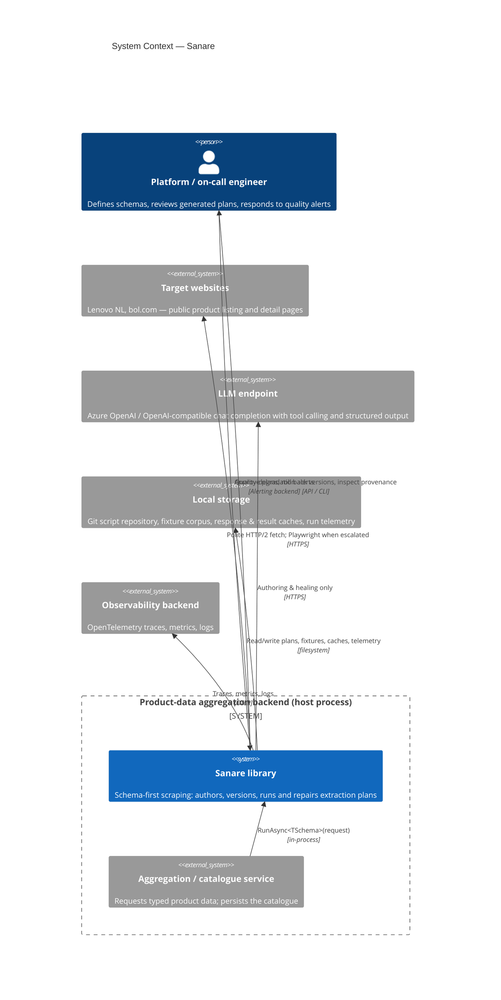
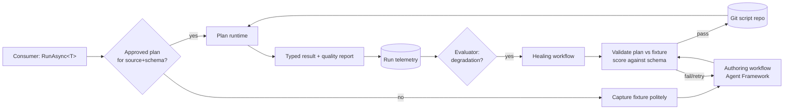
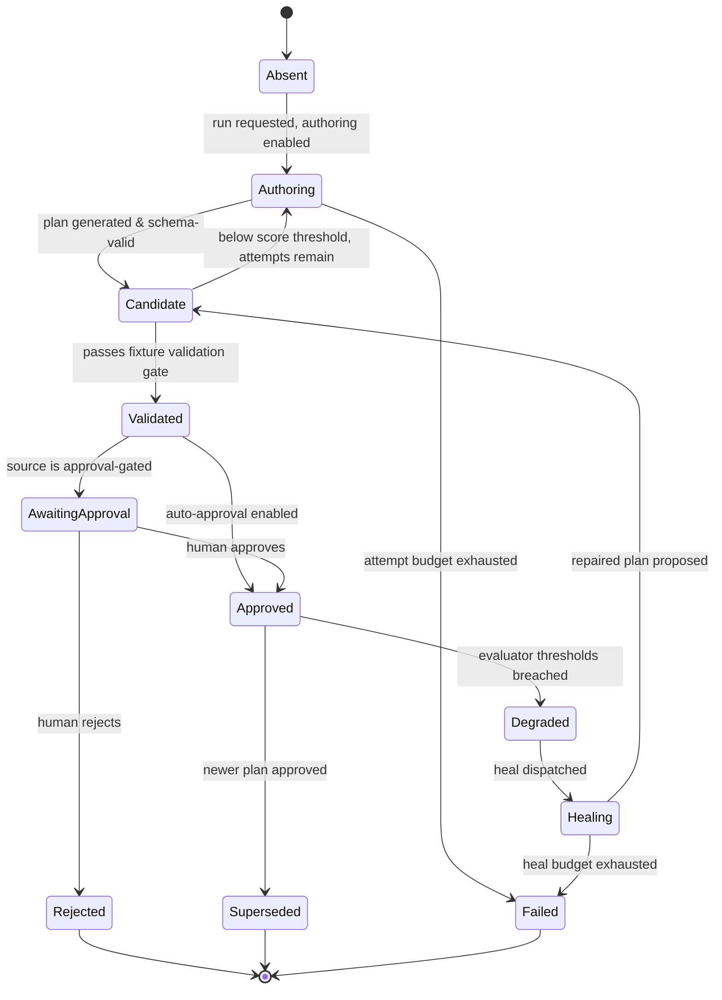
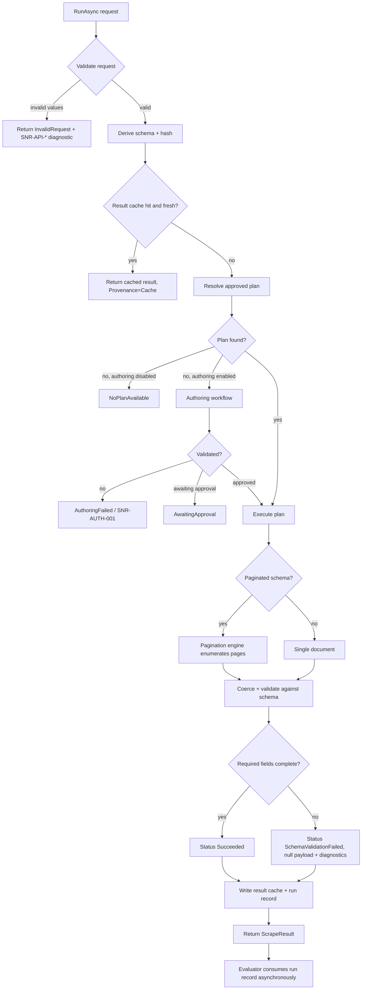
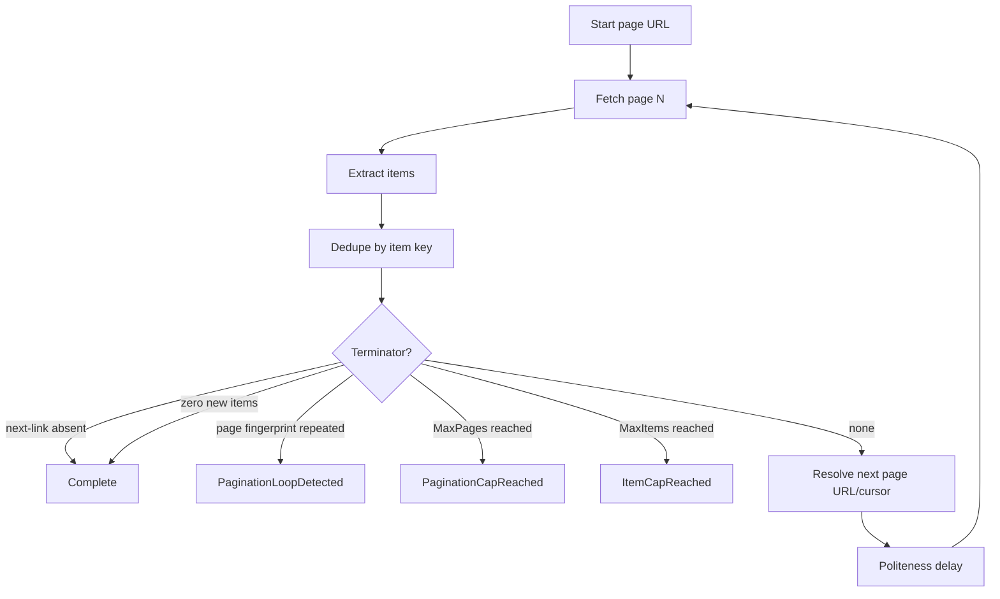
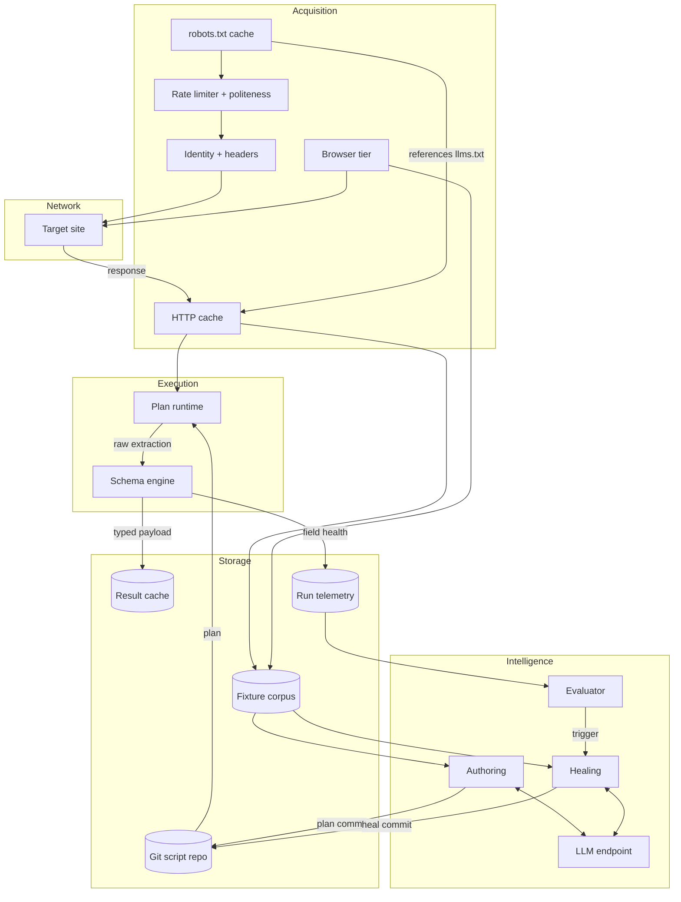
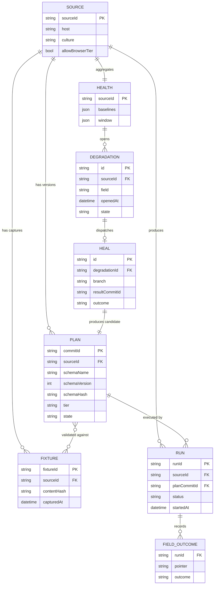

# Technical Design: Sanare

## 1. Document Information

| Field                    | Value                                                                                                                 |
| ------------------------ | --------------------------------------------------------------------------------------------------------------------- |
| **Document Title**       | Sanare — Technical Design                                                                                             |
| **Project / Feature**    | `sanare` — a .NET library that authors, versions, runs, and repairs site scrapers using the Microsoft Agent Framework |
| **Status**               | Draft                                                                                                                 |
| **Version**              | 1.5                                                                                                                   |
| **Author**               | Spec-Forge (tech-design-generation)                                                                                   |
| **Created**              | 2026-09-06                                                                                                            |
| **Last Updated**         | 2026-09-06                                                                                                            |
| **Reviewers**            | Platform/data engineering owner of the product-data aggregation backend                                               |
| **Upstream Documents**   | `ideas/sanare/draft.md` (idea, status: graduated)                                                                     |
| **Downstream Documents** | `docs/features/*.md` (component feature specs), `docs/features/overview.md`                                           |
| **Related Documents**    | `ideas/sanare/research/competitors.md`                                                                                |

## 2. Revision History

| Version | Date | Author | Changes |
|---------|------|--------|---------|
| 1.0 | 2026-09-06 | Spec-Forge | Initial technical design derived from `ideas/sanare/draft.md`. Covers the schema-first API, the tiered acquisition pipeline, the LLM authoring and self-healing workflows on the Microsoft Agent Framework, the git-backed script repository, the on-disk fixture corpus, pagination, politeness/caching, and the Lenovo sample application. |
| 1.1 | 2026-09-06 | Spec-Forge | Agent Framework facts verified against release **1.20.0**: package pins and preview/abandoned-package traps recorded in §7.1; renamed API vocabulary (`AgentSession`, `AgentResponse<T>`, `AsAIAgent`, `CreateSessionAsync`) adopted; §8.3.2 given an explicit workflow/executor/request-port mapping; §9.2.4 states the deliberate non-dependency on `Microsoft.Agents.AI.Hosting`; §13.2 pins the OpenTelemetry source names and the single-layer instrumentation rule; §18 Appendix B expanded. |
| 1.2 | 2026-09-06 | Spec-Forge | Adds bounded `llms.txt` discovery evidence, a composable content-transformation pipeline, reduced/full LLM content views, and TOON at JSON-shaped tool-output boundaries; preserves fixture-first authoring, robots precedence, typed internal models, and the fixed ten-tool surface. |
| 1.3 | 2026-09-06 | Spec-Forge | Resolves OQ-1–OQ-6 (see DR-010–DR-015): configurable, OmniRoute-compatible model-profile routing for authoring vs. healing (§7.1, §9.2.4); pyramid fixture-retention policy (§7.4); monthly per-source LLM budget with typed exhaustion behaviour (§7.4, §11.5, §13.2); a swappable script-repository coordination lease abstraction, file-lock default (§8.1, `script-repository`); adaptive, per-source-configurable polite rate limiting plus an operator-only manual challenge-clearing workflow that does not weaken NG-1/NG-2/NG-3 or the "never escalate around a block" rule (§7.4, §11.4, `acquisition-pipeline`, `browser-tier`); confirms no admin UI and full Aspire/OpenTelemetry-compatible observability (§13, `observability`). |
| 1.4 | 2026-09-06 | Spec-Forge | Adds explicit `Compliance` (default) and audited `Stealth` acquisition modes. Compliance enforces `robots.txt` and identifies Sanare; Stealth capability-gates proxy rotation, CAPTCHA detection, and coherent TLS/JA3 and UA/fingerprint profiles. Both modes retain mandatory traffic safeguards; CAPTCHA solving is future work and authentication/paywall/access-control bypass remains out of scope. |
| 1.5 | 2026-09-06 | Spec-Forge | **Renames the project from "Self-Healing Scraper" to "Sanare" (DR-017).** Purely a naming/branding change with no architectural impact: `SelfHealingScraper.*` package/namespace prefixes become `Sanare.*`; the `self-healing-scraper` slug becomes `sanare` (directories, doc titles, project/feature identifiers); the `SHS-{AREA}-{nnn}` error-code prefix becomes `SNR-{AREA}-{nnn}`; the `shs.*` telemetry/metric namespace becomes `sanare.*`; `docs/self-healing-scraper/` and `ideas/self-healing-scraper/` are renamed to `docs/sanare/` and `ideas/sanare/`. No requirement, acceptance criterion, decision record, or behavioural default introduced by v1.0–v1.4 is altered. |

## 3. Overview

### 3.1 Background

A .NET product-data aggregation backend needs structured product data — catalogue listings and complete
technical-specification tables — from vendor and retailer sites that publish no usable public API. The two
in-hand reference sources are Lenovo's Dutch storefront and (next) bol.com.

The status quo for such a backend is a growing set of hand-written scrapers. Their cost is not in the
initial write; it is in keeping them correct:

- **Silent decay.** A renamed CSS class or a relocated spec table does not raise an exception — it yields
  `null`. Incomplete products flow into the catalogue and the defect surfaces days later, downstream.
- **Human fix latency.** Every break is a ticket: reproduce, open devtools against the live site, find the
  new selector, patch, test, deploy.
- **Debugging traffic causes blocking.** Iterating against the live site is the fastest way to get
  throttled or challenged, precisely when engineers need to iterate.
- **Fingerprintable traffic.** Default `HttpClient` traffic (header set/ordering, absence of `Sec-Fetch-*`,
  no cookie continuity) is trivially classified as a bot, so targets return consent walls or challenge
  pages, which naive parsers happily parse into empty results.
- **Browser-for-everything overcorrection.** Running Playwright for every page costs 100–1000× the
  resources of an HTTP fetch and makes catalogue-scale crawling untenable.
- **No history.** Regenerated or hand-patched extraction logic has no diff, blame, or rollback, so
  regressions cannot be bisected and a previously-working extraction cannot be restored.

This design specifies a library that inverts the maintenance model: an LLM agent **authors a
deterministic, version-controlled extraction artifact** from locally captured page fixtures; steady-state
runs execute that artifact with no LLM involvement; and a quality evaluator detects decay and dispatches an
automated repair workflow. The Microsoft Agent Framework provides the agent, tool-calling, structured
output, workflow orchestration, human-in-the-loop, and observability substrate.

### 3.2 Goals

| #   | Goal                                                                                                        | Measure of success                                                                                                                  |
| --- | ----------------------------------------------------------------------------------------------------------- | ----------------------------------------------------------------------------------------------------------------------------------- |
| G-1 | Schema-first, typed public API: a consumer supplies a URL and a C# type and receives instances of that type | `RunAsync<TSchema>` compiles with no `object`/`dynamic` in the consumer's code path; sample app binds directly to POCOs             |
| G-2 | LLM writes the scraper, does not perform the scraping                                                       | Steady-state runs make zero LLM calls; LLM spend is confined to authoring and healing runs                                          |
| G-3 | Prefer cheap networked extraction; escalate to a browser only when required                                 | ≥ 80 % of reference-target pages resolved without launching a browser                                                               |
| G-4 | Generated extraction logic is versioned with real history                                                   | Every authoring/heal run produces a git commit; any prior version is restorable by commit id                                        |
| G-5 | Authoring, healing, and regression testing run against locally stored production captures                   | Full test suite and heal loop execute with network access disabled                                                                  |
| G-6 | The system detects its own degradation and repairs it                                                       | A simulated layout change is detected by the evaluator and repaired by the healing workflow without a human writing a selector      |
| G-7 | Be a well-behaved client: rate-limited, cached, backed off, and not obviously robotic                       | No reference-target run exceeds the configured per-host request rate; repeat runs within TTL make no upstream requests              |
| G-8 | Support paginated sources as a first-class concern                                                          | The Lenovo tablet lister returns the complete multi-page product set as a single streamed sequence                                  |
| G-9 | Ship a working sample covering a lister page and a detail/spec page                                         | Sample app produces validated typed output for both reference URLs from fixtures, and against the live site when explicitly enabled |

### 3.3 Non-Goals

| # | Non-goal | Rationale |
|---|----------|-----------|
| NG-1 | Automated CAPTCHA solving or challenge defeat | CAPTCHA and challenge detection are supported; solver services, human-in-the-loop completion, and agent-controlled browser solving are future work |
| NG-2 | Unconditional or hidden evasion behaviour | Proxy rotation and coherent TLS/JA3 and UA/fingerprint profiles are allowed only through explicitly enabled, observable stealth capabilities; they are never default or adaptive escalation |
| NG-3 | Bypassing authentication, paywalls, or access controls | Only publicly reachable pages are in scope, in both acquisition modes |
| NG-4 | A hosted service, control-plane UI, or multi-tenant SaaS | Deliverable is an embeddable library plus a sample app |
| NG-5 | Distributed crawl scheduling / queue infrastructure | Single-process and embeddable; the host application owns scheduling and scale-out |
| NG-6 | A general-purpose "ask the web anything" agent | The system extracts a *declared schema* from a *declared source* |
| NG-7 | Per-page LLM extraction as the primary path | Rejected on cost, latency, and determinism grounds (see §5) |
| NG-8 | Automatic crawling of an entire domain (spidering beyond declared pagination) | Only the requested entry point and its declared pagination are traversed |

### 3.4 Scope

**Decomposition verdict: single feature.** This is one cohesive library whose components share a single
schema model, a single acquisition pipeline, and a single script store; they ship as one versioned package
family and have no independent deployment lifecycle. Implementation granularity is therefore expressed as
component feature specs under `docs/features/`, not as separate sub-project tech designs.

**In scope**

- Public library surface: request/result contracts, schema derivation from C# types, typed and streamed
  execution, diagnostics, and DI/hosting integration.
- Tiered acquisition: structured data → HTML parsing → headless browser, with recorded tier rationale.
- Politeness: per-host rate limiting, `robots.txt` awareness, conditional requests, HTTP and result
  caching, exponential backoff, and a realistic assistant-browser identity.
- Extraction plan model (the artifact the LLM authors) and its deterministic runtime.
- On-disk fixture corpus: capture, hash, manifest, refresh, redaction, replay.
- Git-backed script repository: commits, heal branches, approval tags, rollback, provenance.
- Agent Framework workflows for authoring and for self-healing, including a human-in-the-loop approval
  port and checkpointing.
- Quality evaluation: run telemetry, per-field health metrics, thresholds, and heal dispatch.
- Pagination strategies and caps.
- Sample application covering the Lenovo tablet lister and the Yoga Tab Gen 2 specification page.

**Out of scope** — everything in §3.3, plus: persistence of the aggregated product catalogue itself
(the consumer owns that), and any site-specific business logic beyond the sample.

### 3.5 User Scenarios

| # | Persona | Type | Goal | Steps | Success Condition |
|---|---------|------|------|-------|-------------------|
| US-01 | Aggregation backend | Agent | Obtain the complete tablet catalogue as typed objects | 1. Call `RunAsync<TabletListing>` with the lister URL and a pagination policy 2. Library resolves an approved extraction plan 3. Plan executes over all pages via the acquisition pipeline 4. Results validated against the schema | A typed `IAsyncEnumerable<TabletListing>` streams every tablet across all pages, each with source URL and provenance, with no LLM call made |
| US-02 | Aggregation backend | Agent | Obtain full specifications for one product | 1. Call `RunAsync<TabletSpecs>` with the product URL 2. Library serves from the result cache if fresh, otherwise executes the approved plan | A populated `TabletSpecs` with every row of the on-page spec table mapped, plus a quality report listing any unmapped rows |
| US-03 | Platform engineer | Human | Add a new source with no existing extraction plan | 1. Define a POCO schema 2. Call `RunAsync<T>` for the new URL 3. Library captures a fixture, runs the authoring workflow, validates against the fixture, and commits the plan | First call returns validated typed data (or a clear `AuthoringFailed` result with the agent's diagnosis); a commit exists in the script repository referencing the fixture hash |
| US-04 | Platform engineer | Human | Review what the agent generated before it is used in production | 1. Configure the source as approval-gated 2. Authoring completes and pauses at the approval port 3. Engineer inspects the plan diff and the fixture-validation report 4. Approves or rejects | Plan is tagged approved and becomes the resolved version, or is rejected and the run returns `AwaitingApproval` without emitting unapproved data |
| US-05 | Quality evaluator | Agent | Detect and repair a layout change without human intervention | 1. Evaluator observes `BatteryWh` null-rate crossing the threshold across recent runs 2. Dispatches a heal run 3. Fresh fixture captured and diffed against the stored one 4. Agent repairs the plan 5. Repaired plan validated against both new and historical fixtures 6. Committed on a heal branch | Null-rate returns below threshold on the next run; the heal is recorded as a commit with the diagnosis; no previously-passing field regressed |
| US-06 | On-call engineer | Human | Understand why a source's data quality dropped | 1. Receive alert naming source, field, metric change, and heal outcome 2. Open the run's provenance record 3. Inspect the plan diff and the retained fixture | Engineer can reconstruct exactly which plan version produced which field values from which captured bytes, without touching the live site |
| US-07 | Aggregation backend | Agent | Refresh a catalogue nightly without being blocked or re-fetching unchanged pages | 1. Scheduled run 2. Pipeline applies per-host rate limits, jitter, and conditional requests 3. Unchanged pages return 304 / cache hits | Run completes within the host's rate budget; upstream request count is materially lower than page count; no 429/403 escalation |
| US-08 | Platform engineer | Human | Roll back a bad heal | 1. Identify the offending commit from provenance 2. Re-tag the previous approved commit 3. Re-run | The prior plan version is resolved and executed; output matches the pre-heal baseline against retained fixtures |
| US-09 | Aggregation backend | Agent | Handle a source that cannot be scraped by HTTP alone | 1. Structured-data and HTML tiers fail the validation gate during authoring 2. Workflow escalates to the browser tier 3. Browser plan authored, consent wall dismissed, content captured | Typed data is produced via the browser tier, and the recorded plan states why escalation occurred |
| US-10 | Platform engineer | Human | Run the whole test suite offline | 1. Disable network egress 2. Run tests | All extraction, pagination, healing-regression, and sample-app tests pass against the fixture corpus |

### 3.6 Acceptance Criteria

> Every P0 behaviour lists its boundary/error/negative conditions alongside the happy path.

| AC-ID | Priority | Criterion | Expected Result | Verification Method |
|-------|----------|-----------|-----------------|---------------------|
| AC-001 | P0 | Given an approved extraction plan for a source, when `RunAsync<T>` is called, then the plan executes without any LLM call | `ScrapeResult<T>.Payload` is populated; the LLM client test double records zero invocations | Integration — run against fixture-backed transport, assert on a counting `IChatClient` decorator |
| AC-002 | P0 | Given no plan exists for `(host, schema, version)`, when `RunAsync<T>` is called with authoring enabled, then the authoring workflow runs and produces a committed plan | Result is `Succeeded`; script repository contains a new commit whose message references the fixture content hash | Integration — empty repo + recorded fixture + scripted LLM responses |
| AC-003 | P0 | Given no plan exists and authoring is disabled, when `RunAsync<T>` is called | Result status is `NoPlanAvailable` with `Payload == null`; no upstream request is issued | Unit — assert status and that the transport recorded zero requests |
| AC-004 | P0 | Given the authoring workflow cannot reach the configured validation score after the max attempt budget | Result status is `AuthoringFailed`, containing per-attempt scores and the agent's final diagnosis; nothing is committed to the default branch | Integration — scripted LLM that always emits an invalid plan; assert attempt count equals budget and repository HEAD is unchanged |
| AC-005 | P0 | Given a schema with a required field, when extraction omits that field or cannot coerce it | The result is `SchemaValidationFailed` with a `null` payload and a diagnostic naming the JSON pointer — `SNR-SCH-004` when the field is absent, `SNR-SCH-005` when it is present but fails coercion; required-field partial data is not returned, and healing is dispatched when enabled | Unit — validate a deliberately incomplete extraction against the generated JSON Schema and assert status, payload, diagnostic, and healing dispatch |
| AC-006 | P0 | Given a field declared `decimal`, when the page value is `"1.299,00 €"` under a `nl-NL` source culture | The value coerces to `1299.00m`; currency and culture are recorded in provenance | Unit — coercion table tests, including `en-US`, `nl-NL`, thousands separators, and unit suffixes |
| AC-007 | P0 | Given a field declared `decimal`, when the page value is non-numeric (`"Op aanvraag"`) | Coercion fails with `TypeCoercionError` naming field, raw value, and target type; the field is reported in the quality report rather than silently nulled | Unit — negative coercion tests |
| AC-008 | P0 | Given a per-host rate limit of N requests/minute, when a run needs more than N requests | Requests are paced so that no rolling 60-second window exceeds N; the run still completes | Integration — fake clock + request timestamp assertions |
| AC-009 | P0 | Given the target responds `429` with `Retry-After`, when the pipeline retries | The pipeline waits at least the `Retry-After` duration, applies exponential backoff with jitter on subsequent failures, and abandons after the configured attempt cap with `RateLimited` status | Integration — stub transport returning 429 sequences |
| AC-010 | P0 | Given the target responds `403` consistently for a host | The host is circuit-broken for the configured cool-down; subsequent calls fail fast with `Blocked` without issuing requests | Integration — assert zero requests during the open-circuit window |
| AC-011 | P0 | Given `robots.txt` disallows the requested path and `AcquisitionMode.Compliance` is active | The run returns `DisallowedByRobots` before any content request is made | Unit — robots parser + pipeline gate |
| AC-012 | P0 | Given a fixture exists for a URL, when the fixture-replay transport is active | No network socket is opened; extraction runs against the stored bytes | Integration — run the full suite with an egress-blocking handler installed |
| AC-013 | P0 | Given a heal run produces a repaired plan, when the plan is validated | The repaired plan must pass against the newly captured fixture **and** all retained historical fixtures for that source; failing any historical fixture rejects the heal | Integration — repair a lister plan and assert rejection when an old fixture regresses |
| AC-014 | P0 | Given per-field null-rate for a P0 field exceeds its configured threshold over the evaluation window | The evaluator raises a `QualityDegraded` signal naming source, field, previous and current rate, and dispatches at most one concurrent heal run per source | Unit + Integration — seeded telemetry store; assert single dispatch under concurrent triggers |
| AC-015 | P0 | Given a source is configured as approval-gated, when authoring or healing completes | The workflow suspends at the approval port; the plan is committed to a non-default branch only; `RunAsync` returns `AwaitingApproval` and emits no data from the unapproved plan | Integration — assert branch name, absent tag, and result status |
| AC-016 | P0 | Given a paginated lister with 4 pages, when enumerated | All items from all pages are yielded exactly once, in page order, deduplicated by item key | Integration — 4-page fixture set; assert count, order, and no duplicates |
| AC-017 | P0 | Given a paginated source whose "next" link never terminates | Enumeration stops at `MaxPages`, and the result is flagged `PaginationCapReached` | Integration — cyclic fixture set |
| AC-018 | P0 | Given the HTTP tiers fail the authoring validation gate, when browser escalation is enabled | The workflow escalates to the browser tier and the resulting plan records `EscalationReason` | Integration — JS-rendered fixture served by a local static server |
| AC-019 | P0 | Given browser escalation is disabled and HTTP tiers fail | Result is `AuthoringFailed` with reason `BrowserTierDisabled`; no browser process is launched | Unit — assert no browser launch |
| AC-020 | P0 | Given generated plan content, when it is persisted | Only declarative plan operations from the allow-list are accepted; a plan containing an unknown or non-allow-listed operation is rejected at load time with `PlanValidationError` | Unit — malicious/unknown-op plan fixtures |
| AC-021 | P1 | Given a successful run, when the same request is repeated inside the result TTL | The cached typed result is returned and no upstream request is issued | Integration — assert transport request count is zero on second call |
| AC-022 | P1 | Given the plan version changes, when a previously cached request is repeated | The cache entry is invalidated (plan commit id is part of the cache key) and the run re-executes | Unit — cache key composition test |
| AC-023 | P1 | Given a consent/cookie wall is detected in a response body | The pipeline applies the configured consent strategy (stored cookie, or browser-tier dismissal) and retries once; if the wall persists, the result is `ConsentWallBlocked` | Integration — consent-wall fixture |
| AC-024 | P1 | Given a run completes, when provenance is inspected | The record names plan commit id, fixture hash used for validation, tier used, request count, cache hits, and per-field extraction outcomes | Unit — provenance serialization test |
| AC-025 | P1 | Given the sample app is executed with `--offline` | Both reference targets produce fully validated typed output from the committed fixtures | E2E — run the sample app in CI with network disabled |
| AC-026 | P1 | Given a field is present in the page but not in the schema | The value is recorded in the quality report's `UnmappedFields`, not discarded silently | Unit — spec-table extraction with an extra row |
| AC-027 | P1 | Given two runs for the same host execute concurrently | The per-host rate limiter and circuit breaker are shared, and combined throughput respects the single host budget | Integration — parallel runs with timestamp assertions |
| AC-028 | P2 | Given OpenTelemetry is configured | Spans are emitted for acquisition, extraction, authoring, and healing, with the source and plan version as attributes | Integration — in-memory span exporter |
| AC-029 | P1 | Given a permitted `robots.txt` response references an `llms.txt` document, when authoring probes the source | The pipeline acquires, redacts, caches, and fixtures the discovery document through the same governed path as page content; its hints are included only when relevant to the requested schema or source | Integration — fixture-backed robots and discovery-document responses; assert cache/fixture records and evidence-pack inclusion |
| AC-030 | P1 | Given `llms.txt` is absent, malformed, blocked, disallowed by robots, oversized, or irrelevant | Authoring continues deterministically without discovery evidence; the condition is diagnostic/telemetry only and neither bypasses a safety gate nor changes tier selection by itself | Unit + integration — each condition against fixture-backed acquisition; assert normal evidence-pack fallback and no extra network access |
| AC-031 | P1 | Given an agent calls an existing tool without requesting a content view | It receives a prompt-safe `Reduced` view with truthful totals and truncation metadata; no unbounded fixture or raw JSON is injected into model context | Unit — invoke each document-returning tool against an oversized fixture and assert reduced result plus true counts |
| AC-032 | P1 | Given a source's monthly LLM spend reaches its configured budget | Further authoring/healing attempts for that source return `SNR-AUTH-007 BudgetExhausted` instead of invoking the model; existing approved plans keep serving cached/replayed results | Unit — simulate a ledger at/over the cap and assert no `IChatClient` invocation and correct status |
| AC-033 | P1 | Given the circuit breaker opens on a challenge/IP-block signal for a source | Automated acquisition stops for that source (`SNR-ACQ-011 ChallengePaused`) and only an operator-invoked manual browser hand-off (DR-014) or breaker cool-down can resume it; no automated CAPTCHA-solving, fingerprint spoofing, or access-control bypass occurs | Integration — simulate a challenge response, assert automated retries cease and hand-off audit event appears only after explicit operator action |
| AC-032 | P1 | Given an agent explicitly requests a `Full` view for a fixture-backed tool result | The result remains redacted, audited, and within configured byte/token ceilings; exceeding the ceiling returns a bounded slice with truthful truncation metadata rather than silently truncating or reading the network | Integration — oversized fixture and expansion request; assert audit event, bounds, and zero sockets |
| AC-033 | P2 | Given an existing tool returns a JSON-shaped payload to an LLM | Its tool-output boundary serializes it deterministically as `ToolOutputFormat.Toon`; typed domain models and stored fixtures remain JSON/typed data internally | Unit — repeat serialization for byte-identical TOON; assert the internal model and fixture bytes are unchanged |

### 3.7 Success Metrics

| Metric | Baseline (hand-written scrapers) | Target | Measurement |
|--------|----------------------------------|--------|-------------|
| Time from layout change to restored data quality | Days (human ticket) | < 1 evaluation cycle (default 24 h), unattended | Timestamp between first `QualityDegraded` signal and the next run passing thresholds |
| Human effort to onboard a new source | 0.5–2 engineer-days | < 30 minutes (write POCO, run once, review plan) | Recorded during sample onboarding of a third source |
| LLM cost per steady-state page | n/a | 0 tokens | Assertion in AC-001 plus token counters on the chat client |
| Share of pages served without a browser | ~ (varies) | ≥ 80 % on reference targets | Tier counter in run telemetry |
| Upstream requests per catalogue refresh | 1 per page | ≤ 0.5 per page after warm cache | Request counter vs. item count |
| Blocked/challenged responses per 1 000 requests | — | < 5 | 403/429/challenge-page counter |
| Silent field loss (fields null without a signal) | Unknown/undetected | 0 — every null on a required field yields a quality-report entry | Quality report assertions |

## 4. System Context

The library is embedded in the consumer's process. It talks to three external systems: the target
websites, an LLM endpoint (only during authoring and healing), and the local disk (git repository, fixture
corpus, caches, telemetry).



**External dependency summary**

| System | Direction | Protocol | Criticality | Failure behaviour |
|--------|-----------|----------|-------------|-------------------|
| Target websites | Outbound | HTTPS (HTTP/2), optional browser | Required for capture/refresh | Backoff, circuit break, serve from cache/fixture where the policy allows |
| LLM endpoint | Outbound | HTTPS | Required only for authoring/healing | Steady-state runs unaffected; authoring/heal returns a typed failure |
| Local storage | Bidirectional | Filesystem | Required | Fail fast at startup if the repository or corpus root is unwritable |
| Observability backend | Outbound | OTLP | Optional | Degrade to local logging |

## 5. Solution Design

The central architectural question: **what artifact does the LLM produce, and when does the LLM run?**

### 5.1 Solution A: LLM-authored declarative extraction plan, executed by a deterministic runtime (Recommended)

The agent analyses a *stored fixture* and emits a strongly-typed, JSON-serialisable **Extraction Plan** —
a bounded, declarative document describing where the data lives (JSON-LD, an embedded JSON blob, an
internal JSON endpoint, CSS/XPath selectors, or a scripted browser interaction), how to paginate, and how
each schema field maps to a located value with its transforms. A hand-written .NET runtime interprets the
plan; the LLM never executes anything and never sees a steady-state page.



**Key properties**

- The plan is data, not code: it can be validated against a JSON Schema, diffed as text, reviewed by a
  human, and executed without compilation or sandboxing risk.
- Steady-state execution is deterministic, fast, and free of LLM tokens.
- The plan's operation set is an allow-list, so a hallucinated or hostile operation is rejected at load.
- Playwright is expressed as a bounded *interaction script* inside the plan (goto, wait-for, click,
  scroll, evaluate-selector) rather than arbitrary JavaScript.
- **Escape hatch**: when the declarative vocabulary is genuinely insufficient, the plan may reference a
  compiled C# transform module authored by the agent, executed in an isolated `AssemblyLoadContext` in a
  child process with resource caps. This is opt-in per source and off by default.

**Trade-off**: the declarative vocabulary must be rich enough for real sites. Mitigated by the transform
library (regex, culture-aware number/unit parsing, table-to-dictionary, join/split, dedupe), by the
escape hatch, and by the fact that the vocabulary is versioned alongside the runtime.

### 5.2 Solution B: LLM-generated C# scraper source compiled at runtime (Alternative)

The agent writes an actual C# class implementing `IScraper<TSchema>`; the library compiles it with Roslyn,
loads it into a collectible `AssemblyLoadContext`, and invokes it. Versioning is still git-backed.

**Advantages**: unlimited expressiveness; the artifact is idiomatic code an engineer can read and edit;
no vocabulary ceiling.

**Disadvantages**: executing model-authored code is a first-class security problem (needs process
isolation, an assembly reference allow-list, syscall/network restrictions, CPU/memory caps, and review
before every promotion); compilation adds seconds per authoring iteration and a Roslyn dependency to the
runtime; diffs are large and semantically noisy, so automated regression reasoning is harder; and a
healing agent editing free-form code is far more likely to introduce a subtle regression than one editing
a constrained plan.

### 5.3 Comparison Matrix

| Dimension | Solution A — Declarative plan | Solution B — Generated C# | Solution C — LLM extracts every page |
|-----------|------------------------------|---------------------------|--------------------------------------|
| Steady-state cost | Zero tokens, ms-scale | Zero tokens, ms-scale | Tokens × pages; seconds per page |
| Determinism | High — pure function of bytes + plan | High | Low — output varies run to run |
| Security surface | Minimal — interpreted allow-list | High — arbitrary code execution | Low |
| Expressiveness | Medium-high (+ opt-in code escape hatch) | Maximum | Maximum |
| Reviewability of a change | Excellent — small semantic diffs | Fair — noisy code diffs | None — no artifact |
| Automated regression reasoning | Strong — field-level plan diff | Weak | N/A |
| Authoring iteration latency | Fast (validate = interpret) | Slower (compile per attempt) | N/A |
| Healing precision | High — repair one field's locator | Medium | N/A |
| Implementation effort | Higher up front (runtime + vocabulary) | Lower up front, higher in hardening | Lowest |
| Typed-contract fit | Excellent | Excellent | Poor — post-hoc validation only |

### 5.4 Decision & Rationale

**Adopt Solution A**, with Solution B available as an explicitly opt-in escape hatch for a single source.

Rationale, in priority order:

1. **The requirement is catalogue-scale product data.** Solution C's per-page token cost and
   non-determinism disqualify it as the primary path; two runs must not disagree about a product's
   battery capacity.
2. **Self-healing needs a diffable, semantically small artifact.** The healing agent's job — "the
   `BatteryWh` locator no longer matches; find the new one" — is a bounded edit in Solution A and an
   open-ended refactor in Solution B.
3. **Executing model-authored code by default is an unacceptable default posture** for a library embedded
   in a production backend. Solution A's interpreted allow-list means a hallucinated operation is a
   validation error, not a remote-code-execution primitive.
4. **Reviewability is a stated requirement** (git history, merging, rollback). Plan diffs express intent
   changes directly; code diffs bury them.
5. Solution B's expressiveness advantage is recoverable where it actually matters, via the opt-in compiled
   transform module, without paying its security and review costs everywhere.

Consequences accepted: a richer runtime must be built and maintained, and the plan vocabulary is a
versioned compatibility surface (see §7.5 and §17 DR-002).

## 6. Architecture Design

### 6.1 Container View

```mermaid
C4Container
    title Container View — Sanare library

    Person(engineer, "Platform engineer")
    System_Ext(target, "Target website")
    System_Ext(llm, "LLM endpoint")

    Container_Boundary(lib, "Sanare (NuGet package family)") {
        Container(api, "Scrape API", ".NET class library", "IScrapeRunner, ScrapeRequest/ScrapeResult, DI extensions")
        Container(schema, "Schema Engine", ".NET", "POCO -> JSON Schema, validation, type coercion, quality report")
        Container(resolver, "Plan Resolver", ".NET", "Resolves (host, schema, schemaVersion) -> approved plan commit")
        Container(runtime, "Plan Runtime", ".NET", "Interprets extraction plans; pagination driver; transform library")
        Container(acq, "Acquisition Pipeline", ".NET", "Tiered fetch, politeness, caching, identity, consent handling")
        Container(browser, "Browser Tier", "Playwright for .NET", "Bounded interaction scripts; JS-rendered pages")
        Container(authoring, "Authoring Workflow", "Microsoft Agent Framework", "Fixture -> candidate plan -> validate -> commit")
        Container(healing, "Healing Workflow", "Microsoft Agent Framework", "Diagnose -> repair -> regression-validate -> commit on heal branch")
        Container(evaluator, "Quality Evaluator", ".NET hosted service", "Field health metrics, thresholds, heal dispatch")
        ContainerDb(gitrepo, "Script Repository", "Git working tree on disk", "Versioned plans, heal branches, approval tags")
        ContainerDb(corpus, "Fixture Corpus", "Files + manifest on disk", "Captured production pages and payloads")
        ContainerDb(caches, "Caches & Telemetry", "Files on disk", "HTTP cache, result cache, run records")
    }

    Rel(engineer, api, "Configures, approves, rolls back")
    Rel(api, schema, "Derive & validate")
    Rel(api, resolver, "Resolve plan")
    Rel(resolver, gitrepo, "Read plan at tagged commit")
    Rel(api, runtime, "Execute plan")
    Rel(runtime, acq, "Request documents")
    Rel(acq, browser, "Escalate when required")
    Rel(acq, target, "HTTPS")
    Rel(acq, caches, "Read/write")
    Rel(acq, corpus, "Capture / replay")
    Rel(api, authoring, "On missing plan")
    Rel(authoring, llm, "Chat + tools + structured output")
    Rel(authoring, corpus, "Read fixture")
    Rel(authoring, gitrepo, "Commit plan")
    Rel(evaluator, caches, "Read run telemetry")
    Rel(evaluator, healing, "Dispatch heal")
    Rel(healing, llm, "Chat + tools")
    Rel(healing, corpus, "Capture fresh + read historical")
    Rel(healing, gitrepo, "Commit on heal branch")
```



### 6.2 Layering and Dependency Rule

```
        Consumer application (aggregation backend, sample app)
                              │
        ┌─────────────────────▼─────────────────────┐
        │  L4 Orchestration  Authoring · Healing ·  │  Agent Framework
        │                    Quality Evaluator      │
        ├───────────────────────────────────────────┤
        │  L3 Execution      Plan Resolver ·        │
        │                    Plan Runtime           │
        ├───────────────────────────────────────────┤
        │  L2 Acquisition    Pipeline · Identity ·  │
        │                    Politeness · Cache ·   │
        │                    Browser Tier           │
        ├───────────────────────────────────────────┤
        │  L1 Foundation     Schema Engine ·        │
        │                    Plan Model · Script    │
        │                    Repository · Fixtures  │
        └───────────────────────────────────────────┘
```

**Dependency rule**: dependencies point downward only. L1 has no dependency on the Agent Framework or on
Playwright — this keeps the deterministic core testable and keeps the AI dependency optional at runtime
for consumers that only execute already-approved plans.

### 6.3 Package Layout

| Package | Contents | Depends on |
|---------|----------|------------|
| `Sanare.Abstractions` | Contracts, plan model, result/diagnostic types, attributes | — |
| `Sanare.Core` | Schema engine, plan runtime, resolver, fixture corpus, script repository | Abstractions |
| `Sanare.Http` | Acquisition pipeline, identity, politeness, caching, robots | Core |
| `Sanare.Browser` | Playwright tier | Http |
| `Sanare.Agents` | Authoring & healing workflows, evaluator, agent tools | Core, Http |
| `Sanare.Extensions.Hosting` | DI registration, hosted services, options binding | all above |
| `Sanare.Samples.Lenovo` | Sample app (not published) | Hosting, Browser, Agents |

Splitting `Browser` and `Agents` out means a consumer that only runs approved HTTP-tier plans takes
neither the Playwright browser payload nor the AI stack as a dependency.

## 7. Technology Stack & Conventions

### 7.1 Stack Decision

| Concern | Choice | Rationale |
|---------|--------|-----------|
| Runtime | .NET 9 (`net9.0`), C# 13, nullable enabled, `TreatWarningsAsErrors` | Host backend is .NET; the Agent Framework and Playwright for .NET both target modern .NET |
| Agent orchestration | **Microsoft Agent Framework** — `Microsoft.Agents.AI`, `Microsoft.Agents.AI.Abstractions`, `Microsoft.Agents.AI.Workflows`, all **1.20.0 (GA, MIT)** | Explicit requirement. Provides the agent abstraction (`AIAgent`/`ChatClientAgent`), function tools, session state, structured output, graph workflows with checkpointing, human-in-the-loop request ports, and OpenTelemetry integration |
| LLM abstraction | `Microsoft.Extensions.AI` **10.9.0 (GA)** (`IChatClient`) beneath the agent | Provider-neutral (Azure OpenAI / OpenAI / local / OmniRoute-compatible proxies); middleware pipeline for logging, caching, and token accounting. Owns `IChatClient`, `ChatMessage`, `ChatOptions`, `ChatResponseFormat`, `AITool`, `AIFunction`, `AIFunctionFactory`. Model selection is routed through named, per-role model profiles rather than a single default (DR-010), so an OmniRoute proxy/model-combo route is registered like any other `IChatClient` |
| HTML parsing | **AngleSharp** | Standards-compliant HTML5 DOM with real CSS-selector semantics; needed because plans express CSS selectors and the runtime must match browser behaviour |
| XPath / fallback | `AngleSharp.XPath` | Spec tables often need axis navigation ("value cell following the label cell") |
| JSON | `System.Text.Json` with source-generated contexts | Typed, trimming-friendly, fast; used for plans, fixtures manifests, and result payloads |
| JSON Schema | Schema generated from the POCO plus a validating reader | Gives the LLM a precise target and gives the runtime a mechanical validation gate |
| Browser tier | **Playwright for .NET** (Chromium) | Explicit requirement; supports the interaction primitives the plan vocabulary exposes |
| Git | **LibGit2Sharp** (in-process), with an optional `git` CLI backend | Satisfies "ship git" without requiring a system git install; the CLI backend exists for environments that prefer it (see DR-003) |
| Resilience | `Microsoft.Extensions.Http.Resilience` (Polly) | Retry, timeout, circuit breaker, and hedging as standard pipeline strategies |
| Rate limiting | `System.Threading.RateLimiting` | First-party sliding/token-bucket limiters, per host |
| Caching | `Microsoft.Extensions.Caching.Hybrid` over a disk store | Two-tier memory + persistent cache with stampede protection |
| Observability | OpenTelemetry (.NET SDK) | Traces/metrics/logs; Agent Framework emits agent and workflow spans |
| Options/config | `Microsoft.Extensions.Options` with data-annotation validation and `ValidateOnStart` | Fail fast on misconfiguration |
| Testing | xUnit, FluentAssertions-style asserts, `Microsoft.AspNetCore.TestHost`/Kestrel static server for fixture serving, Verify for plan snapshot tests | Deterministic, offline-capable |

> **Version pinning note.** The Agent Framework package surface was verified against
> `Microsoft.Agents.AI` **1.20.0** and its frozen `PublicAPI.Shipped.txt` files. Pin the following:
> `Microsoft.Agents.AI`, `Microsoft.Agents.AI.Abstractions`, `Microsoft.Agents.AI.Workflows`,
> `Microsoft.Agents.AI.OpenAI`, and `Microsoft.Agents.AI.Foundry` at `1.20.0` (GA, MIT,
> `net10.0;net9.0;net8.0;netstandard2.0;net472`). Two traps: `Microsoft.Agents.AI.Hosting` is
> **preview-only** (`1.20.0-preview.*`) and has no frozen public-API file, so this design does **not**
> depend on it — DI wiring is plain `Microsoft.Extensions.DependencyInjection` (§9.2.4); and
> `Microsoft.Agents.AI.AzureAI` is **abandoned at `1.0.0-rc5`** — use `Microsoft.Agents.AI.Foundry`
> for Microsoft Foundry hosting. The official docs still print `--prerelease` on install commands for
> GA packages; that is documentation lag, not a prerelease requirement.
>
> **API vocabulary (verified at 1.20.0).** The framework was renamed after the 2025 preview. This
> document uses the current names throughout: `AgentSession` (not `AgentThread`), `AgentResponse` /
> `AgentResponse<T>` (not `AgentRunResponse`), `AgentResponseUpdate`,
> `chatClient.AsAIAgent(...)` (not `CreateAIAgent`), `await agent.CreateSessionAsync(ct)` (not
> `GetNewThread()`), and `AIAgent.SerializeSessionAsync` / `DeserializeSessionAsync` for session
> persistence. Structured output is obtained from `AgentResponse<T>.Result` via
> `RunAsync<T>(...)`, or from `AgentRunOptions.ResponseFormat = ChatResponseFormat.ForJsonSchema<T>()`.
> Any residual signature drift remains a local change inside `Sanare.Agents`, which is the
> only package that references `Microsoft.Agents.AI.*`.

### 7.2 Naming Conventions

**Code**

| Element | Convention | Example |
|---------|-----------|---------|
| Namespaces | `Sanare.{Layer}.{Area}` | `Sanare.Core.Planning` |
| Interfaces | `I` + noun phrase | `IScrapeRunner`, `IPlanRepository`, `IFixtureStore` |
| Options types | `{Area}Options`, bound from `Sanare:{Area}` | `PolitenessOptions` |
| Plan operation types | `{Verb}{Noun}Operation` | `SelectNodesOperation`, `ParseNumberOperation` |
| Result envelopes | `{Verb}Result<T>` | `ScrapeResult<T>`, `AuthoringResult` |
| Async methods | `…Async`, always accept `CancellationToken` as the last parameter | `RunAsync<T>(request, ct)` |
| Agent tools | `{verb}_{noun}` (snake_case, exposed to the model) | `fetch_fixture_slice`, `test_selector` |
| Test methods | `Method_Scenario_ExpectedOutcome` | `RunAsync_NoPlanAndAuthoringDisabled_ReturnsNoPlanAvailable` |

**Plan / API identifiers**

| Element | Convention | Example |
|---------|-----------|---------|
| Source id | `{host-slug}/{purpose-slug}` | `lenovo-com/tablet-lister` |
| Plan file path | `plans/{source-id}/{schema-name}@{schemaVersion}.plan.json` | `plans/lenovo-com/tablet-lister/TabletListing@1.plan.json` |
| Fixture id | `{source-id}/{capture-slug}-{yyyyMMddTHHmmssZ}-{hash8}` | `lenovo-com/tablet-lister/page1-20260906T101500Z-9f2c1ab4` |
| Git branch | `heal/{source-id}/{yyyyMMdd}-{shortReason}` | `heal/lenovo-com/tablet-lister/20260906-battery-null-rate` |
| Git tag (approved) | `approved/{source-id}/{schema-name}@{schemaVersion}/{n}` | `approved/lenovo-com/tablet-lister/TabletListing@1/7` |
| Error codes | `SNR-{AREA}-{nnn}` | `SNR-ACQ-004` |
| Metric names | `sanare.{area}.{metric}` | `sanare.acquisition.requests`, `sanare.quality.field_null_rate` |
| Activity/span names | `sanare.{area}.{operation}` | `sanare.authoring.generate_plan` |

**On-disk storage layout**

```
{StateRoot}/
├── scripts/                       # git repository (working tree + .git)
│   ├── plans/{source-id}/*.plan.json
│   └── notes/{source-id}/*.md     # agent diagnoses attached to heal commits
├── fixtures/
│   ├── manifest.json
│   └── {source-id}/{capture-slug}-{timestamp}-{hash8}.{html|json|har}
├── cache/
│   ├── http/                      # conditional-request metadata + bodies
│   └── results/                   # typed result cache keyed incl. plan commit
└── telemetry/
    └── runs/{yyyy-MM-dd}/{run-id}.json
```

### 7.3 Parameter Validation & Input Parsing

#### Validation Rules Matrix

| Input | Source | Rule | On violation |
|-------|--------|------|--------------|
| `ScrapeRequest.Url` | Consumer | Absolute, scheme `http`/`https`, host non-empty, ≤ 2 048 chars, no credentials in userinfo | `InvalidRequest` + `SNR-API-001`; null `request` throws `ArgumentNullException` |
| `ScrapeRequest.SourceId` | Consumer (optional) | Matches `^[a-z0-9-]+(/[a-z0-9-]+)*$`, ≤ 128 chars; defaults to derived host slug + path slug | `InvalidRequest` + `SNR-API-002` |
| `TSchema` | Consumer type | Must be a class/record with a public parameterless or fully-bindable constructor; no cycles deeper than 8; ≤ 200 mapped properties | `SNR-SCH-001` at schema derivation |
| `ScrapeRequest.MaxItems` | Consumer | `null` or 1…1 000 000 | Clamp with warning → `SNR-API-003` |
| `PaginationPolicy.MaxPages` | Consumer/config | 1…10 000, default 100 | Clamp with warning |
| `ScrapeRequest.Freshness` | Consumer | `TimeSpan.Zero`…30 days | `SNR-API-004` |
| Plan document | Git repo / LLM | Valid against `plan.schema.json`; every operation in the allow-list; ≤ 512 KB; ≤ 500 operations; selector strings ≤ 1 024 chars | Reject → `SNR-PLAN-001` |
| Plan `schemaVersion` | Plan | Must equal the runtime's supported plan-vocabulary major version | `SNR-PLAN-002` (triggers re-authoring) |
| LLM structured output | LLM | Must deserialize to the plan model and pass the plan schema | Retry with the validation error appended, up to the attempt budget |
| Fetched content type | Target | Must be in the configured allow-list (`text/html`, `application/xhtml+xml`, `application/json`, `application/ld+json`, `text/plain`) | `SNR-ACQ-006` |
| Response size | Target | ≤ `MaxResponseBytes` (default 16 MiB) | Abort read → `SNR-ACQ-007` |
| Redirect chain | Target | ≤ 10 hops; cross-host redirects re-checked against robots and rate limits | `SNR-ACQ-008` |
| Fixture file | Disk | Content hash must match the manifest entry | `SNR-FIX-002` (corrupt fixture) |
| Options at startup | Config | Data annotations + custom validators; `ValidateOnStart` | `OptionsValidationException` at host start |

#### Type Coercion

Coercion is culture-aware and driven by the source's declared culture plus per-field hints.

| Target type | Accepted inputs | Rules |
|-------------|-----------------|-------|
| `string` | any text node | Trim, collapse internal whitespace, strip zero-width and soft-hyphen characters, HTML-decode |
| `int` / `long` | `"12"`, `"1.234"` (nl-NL), `"1,234"` (en-US), `"12 GB"` | Strip declared unit suffix, parse with the source culture's `NumberFormatInfo`, reject on residual non-numeric characters |
| `decimal` | `"1.299,00"`, `"€ 1.299,00"`, `"1299.00"` | Strip currency symbol/code into a sibling currency field when the schema declares one; parse with source culture |
| `bool` | `"ja"/"nee"`, `"yes"/"no"`, `"true"/"false"`, `"✓"`, presence-of-node | Per-culture truthy/falsy table plus a `presence` mode |
| `DateTime`/`DateOnly` | ISO-8601, `dd-MM-yyyy`, `d MMMM yyyy` | Try ISO first, then the source culture's patterns; always store UTC for `DateTime` |
| `Uri` | absolute or relative href | Resolve against the document base URI; reject non-http(s) schemes |
| `enum` | text label | Case-insensitive match on name, `[Description]`, or a plan-declared synonym map; unmatched → coercion error |
| `T[]` / `IReadOnlyList<T>` | node set | Element-wise coercion; empty node set yields an empty list, not `null` |
| `IReadOnlyDictionary<string,string>` | table/definition-list | Key from the label cell (trimmed, whitespace-collapsed); duplicate keys suffixed `#2`, `#3`, … |
| Nullable value types | missing node | `null`; recorded in the quality report as `Missing` |
| Non-nullable required | missing node | `SNR-SCH-004`; return `SchemaValidationFailed` with a null payload and dispatch healing when enabled |

**Unit normalisation.** Fields may declare a canonical unit via `[ScrapeUnit("Wh")]`; the transform library
converts common source units (mAh + V → Wh, inch → mm, g → kg) and records both raw and normalised values
in provenance. An unconvertible unit is a coercion error, never a silent pass-through.

#### Input Sanitization

- **Content transformation pipeline.** Every fixture-derived tool result and authoring evidence item passes
  through a composable `ContentTransformationPipeline` of deterministic `IContentTransformer` stages after
  fixture redaction and before prompt/tool serialization. Stages may remove non-content nodes, normalise
  whitespace, project document outlines/table skeletons, slice around candidate matches, summarise repeated
  structures, and apply honest size limits. Stages never fetch, mutate a fixture, or invoke a model.
- **Content views.** `ContentView.Reduced` is the default LLM-facing view. It selects the smallest useful
  transformed projection and always reports source bytes/items, returned bytes/items, and `Truncated` when
  anything is omitted. `ContentView.Full` is an explicit, fixture-only, audited expansion for a named
  bounded slice; it remains redacted and subject to the full-view ceiling. There is no unbounded or
  network-backed raw view.
- **HTML** is never concatenated into prompts raw. Its `Reduced` projection uses the existing
  **prompt-safety reducer**: scripts/styles/comments/SVG paths/base64 data-URIs removed, attributes
  reduced to an allow-list (`id`, `class`, `itemprop`, `data-*` up to a length cap, `href`, `src`),
  text nodes truncated, and the DOM sliced to the neighbourhood of candidate matches. This bounds tokens
  **and** limits prompt-injection surface.
- **JSON-shaped results.** JSON remains typed or JSON internally and in fixtures. Only the LLM tool-output
  boundary may serialize a bounded result as deterministic `ToolOutputFormat.Toon`; callers and persistence
  never depend on TOON. Its metadata uses the same truthful totals and truncation contract as content views.
- **Discovery documents.** A `DiscoveryDocument` is a captured `llms.txt` response referenced by a permitted
  `robots.txt` document. It is non-authoritative, untrusted discovery evidence: it may suggest pages,
  endpoints, or schema terminology, but cannot override robots decisions, source configuration, acquisition
  tiers, plan/schema validation, or any safety limit. It is acquired only via the governed acquisition
  pipeline and then treated like every other redacted fixture-derived evidence item.
- **Prompt-injection defence**: fixture content is delivered to the model as tool-call *results* clearly
  fenced and labelled as untrusted data; the system prompt states that page content is data, never
  instructions; and — decisively — the model's output is not executed but *validated against the plan
  schema and the operation allow-list*, so an injected instruction cannot become behaviour.
- **Selector sanitisation**: selectors are parsed by AngleSharp before persistence; anything unparseable is
  rejected at authoring time rather than failing at runtime.
- **Path safety**: source ids, fixture ids, and plan paths are slug-validated and combined with
  `Path.GetFullPath` + a root-containment check to prevent traversal outside `{StateRoot}`.
- **Secret hygiene**: `Authorization`, `Cookie`, and `Set-Cookie` values are redacted from fixtures,
  telemetry, logs, and prompts. Fixtures pass a configurable PII redaction pass (email/phone/postal
  patterns) before being written.
- **Browser isolation**: the browser tier runs with a per-source ephemeral profile, no persisted local
  storage beyond the managed cookie jar, downloads disabled, and a per-page navigation allow-list
  restricted to the source host plus declared asset hosts.

### 7.4 Boundary Values & Edge Cases

#### System Limits

| Limit | Default | Configurable | Behaviour at limit |
|-------|---------|--------------|--------------------|
| Requests per host | 20/min, burst 5 (adaptive: backs off toward ~1/s on 429/403/challenge signals, recovers gradually toward the configured ceiling; per-source floor/ceiling configurable — DR-014) | Yes, per host | Queue and pace; never drop |
| Concurrent requests per host | 2 | Yes | Additional requests wait |
| Global concurrent browser contexts | 2 | Yes | Queue; `BrowserPoolExhausted` after `BrowserWaitTimeout` |
| Response body size | 16 MiB | Yes | Abort read → `SNR-ACQ-007` |
| Pages per paginated run | 100 | Yes | Stop, flag `PaginationCapReached` |
| Items per run | unbounded (`MaxItems` optional) | Yes | Stop at `MaxItems`, flag `ItemCapReached` |
| Authoring attempts | 5 | Yes | `AuthoringFailed` with per-attempt scores |
| Healing attempts | 3 | Yes | `HealingFailed`, escalate to human alert |
| Concurrent heals per source | 1 | No | Second trigger is coalesced |
| Plan document size | 512 KiB / 500 operations | Yes | Reject → `SNR-PLAN-001` |
| Prompt payload per authoring turn | 60 000 tokens (reduced content) | Yes | Tighten transformation/slicing; if still over, split into per-field turns |
| Discovery-document response body | 512 KiB | Yes | Stop read, record diagnostic, and continue authoring without discovery evidence |
| Discovery evidence contribution | 8 000 tokens per authoring turn | Yes | Omit the discovery item before reducing primary fixture evidence; report omission truthfully |
| Explicit `Full` content view | 256 KiB / 16 000 tokens per tool call | Yes | Return the requested bounded slice with `Truncated = true` and true totals; audit the expansion |
| JSON-shaped tool output | 16 000 tokens per tool call | Yes | Apply deterministic TOON serialization and result limits; return truthful truncation metadata |
| Fixture retention per source | Pyramid (DR-011): 3 "full" reference captures + all small/redacted bug-pinned fixtures + all captures referenced by an approved tag | Yes | Prune oldest unreferenced full capture beyond the cap; bug-pinned/tagged fixtures are never auto-pruned |
| Result cache TTL | 6 h (lister) / 24 h (detail) | Yes | Re-execute after expiry |
| HTTP cache max age | Honour response headers; floor 5 min, ceiling 7 days | Yes | Revalidate conditionally |
| Monthly LLM budget per source | Unset (unbounded) | Yes, per source (DR-012) | Preflight-check before authoring/healing attempts; deny with `SNR-AUTH-007 BudgetExhausted` and reduce evaluator cadence as the cap is approached |
| Circuit breaker | 5 consecutive 403/challenge in 5 min → open 30 min | Yes | Fail fast with `Blocked`; an operator may clear a hard challenge/IP block via the manual browser hand-off (DR-014) rather than waiting out the breaker |
| Run wall-clock | 30 min | Yes | Cancel, return partial results with `Timeout` |

#### Edge Case Handling

| Edge case | Handling |
|-----------|----------|
| Zero results on a lister that previously returned many | Not treated as success: the evaluator's `EmptyResult` rule fires immediately (not after a window) and dispatches a heal |
| Single-page lister with no pagination control | Pagination strategy `None`; one page, no cap warning |
| Last page returns the same items as the previous page | Item-key dedupe plus a page-fingerprint check terminate enumeration and flag `PaginationLoopDetected` |
| Consent/cookie wall on first fetch | Apply stored consent cookie; if absent, escalate to browser tier to dismiss and persist the cookie for the host; if still walled → `ConsentWallBlocked` |
| Challenge/interstitial page returned with HTTP 200 | Challenge-page heuristics (title/markers/absence of expected anchors) classify it as `Blocked`, so it is never parsed as content |
| Hard challenge/IP block persists after the circuit breaker opens | Reported honestly as `Blocked`; no automated bypass is attempted (DR-006, DR-014). An operator may run the manual browser hand-off to view and clear the challenge themselves during development; the pipeline only resumes on that explicit human signal |
| Soft 404 (200 with "product not found") | Plan declares a `notFound` predicate; matching yields `SourceNotFound`, not an empty extraction |
| Spec table split across multiple tabs/accordions | HTML tier extracts all panels present in the initial DOM; if content is loaded on tab activation, authoring escalates to the browser tier with an interaction script |
| Spec label present, value cell empty | `Missing` in the quality report, distinct from "label absent entirely" (`Unmapped`) |
| Duplicate spec labels ("Weight" for device and for box) | Dictionary keys disambiguated with `#n`; plan may map a specific occurrence by index or by section |
| Currency/locale variation across storefronts | Source culture is part of source configuration, not inferred per run |
| Product variant/configurator pages (several SKUs on one URL) | Plan declares a `variantSelector`; the schema receives a list of variants; a schema that expects one product yields `AmbiguousResult` |
| Page redirects to a different locale | Cross-host/locale redirect is re-validated against robots and the declared source; mismatch → `UnexpectedRedirect` |
| Network flake mid-pagination | Per-page retry; if a page ultimately fails, enumeration returns partial results flagged `PartialPagination` with the failed page indices |
| Fixture missing when replay mode is forced | `SNR-FIX-001 FixtureNotFound` — never silently falls back to the network in offline mode |
| Fixture stale relative to live layout | Detected during heal (fresh capture diff); stale fixtures are refreshed, old ones retained for regression |
| Git repository has uncommitted local edits | Authoring/heal commits are refused with `SNR-GIT-003 DirtyWorkingTree` to avoid capturing human edits into an agent commit |
| Two processes writing the same plan file | Repository operations take an inter-process file lock; loser retries then fails with `SNR-GIT-004 RepositoryLocked` |
| LLM endpoint unavailable during authoring | `AuthoringUnavailable`; approved plans keep running unaffected |
| Clock skew / `Retry-After` in the past | Treated as zero, then normal backoff applies |
| Schema changed but plan unchanged | Plan resolution key includes the schema hash; a changed schema forces re-authoring rather than silently mapping to the old shape |

### 7.5 Business Logic Rules

#### State Machine — Extraction plan lifecycle



Transition rules:

- Only an **Approved** plan may serve a consumer request. `Candidate`/`AwaitingApproval` plans exist on
  non-default branches and are invisible to `RunAsync` unless the request explicitly opts into a preview.
- **Approved → Degraded** requires the evaluator's window condition (§7.5 computation rules), except for
  `EmptyResult` and `SchemaValidationFailure` which trip immediately.
- **Healing → Candidate** requires passing *both* the fresh fixture and every retained historical fixture
  that the superseded plan passed. This is the anti-regression invariant behind AC-013.
- Rollback is `Approved` re-pointing to an earlier commit; the superseded plan becomes `Superseded`,
  never deleted.

#### Computation Rules

**Plan validation score.** For a candidate plan run against fixture set `F` and schema `S`:

```
fieldScore(f) = 1.0  if extracted && coerces && passes field constraints
              = 0.5  if extracted && coerces but flagged low-confidence (e.g. fallback locator used)
              = 0.0  otherwise

score(F,S) = Σ over required fields  w_req * fieldScore(f)   +   Σ over optional fields  w_opt * fieldScore(f)
             ────────────────────────────────────────────────────────────────────────────────────────────────
                            Σ w_req over required   +   Σ w_opt over optional

w_req = 3, w_opt = 1   (defaults, configurable per source)
```

Gates: a candidate is `Validated` when `score ≥ MinPlanScore` (default 0.9) **and** every required field
scores 1.0 **and**, for collection schemas, `itemCount ≥ MinItemsPerPage` (default 1).

**Field health (evaluator).** Over the trailing window `W` (default 20 runs or 7 days, whichever is
smaller) for each field `f`:

```
nullRate(f)     = missing(f) / observed(f)
coerceFailRate  = coercionErrors(f) / observed(f)
drift(f)        = | nullRate_window − nullRate_baseline |
baseline(f)     = nullRate measured at plan approval time
```

Degradation triggers when `observed ≥ MinObservations` (default 5) and any of:
`nullRate(f) − baseline(f) > NullRateDelta` (default 0.25) for a required field;
`coerceFailRate > 0.10`; `itemCount` drops below 50 % of the trailing median; or an immediate trigger
(`EmptyResult`, `SchemaValidationFailure`, `ConsentWallBlocked`, `Blocked` on 3 consecutive runs).

**Politeness delay.**

```
delay = max(rateLimiterDelay, minHostDelay) + jitter
jitter ~ U(0, JitterMs)                       (default 0…750 ms)
minHostDelay = 1500 ms default, per host
backoff(n) = min(BaseDelay * 2^(n-1), MaxDelay) + jitter    (Base 2 s, Max 5 min)
Retry-After, when present and sane (≤ 1 h), overrides backoff(n) as a floor
```

**Result cache key.**

`sha256(sourceId ‖ canonicalUrl ‖ schemaHash ‖ planCommitId ‖ paginationPolicyHash ‖ requestVariantHash)`

Including `planCommitId` makes cache invalidation on plan change automatic (AC-022).

**Fixture identity.** `sha256(normalisedBody)` where normalisation strips volatile content (nonces, CSRF
tokens, session ids, timestamps declared in the source's volatility rules) so that "same layout, new
render" does not produce a spurious new fixture.

#### Conditional Logic — Tier selection

Applied at authoring time; the outcome is recorded in the plan and re-used at run time.

```
1. If the source declares an internal JSON endpoint, or one is discovered
   (XHR-shaped URL returning JSON containing the target fields)     → Tier 0: JSON API
2. Else if the page contains JSON-LD / microdata / an embedded state
   blob (__NEXT_DATA__, __NUXT__, window.__INITIAL_STATE__) that
   covers the required fields                                       → Tier 1: Structured data
3. Else if the required fields are present in the raw HTTP HTML     → Tier 2: HTML parse
4. Else if browser escalation is enabled                            → Tier 3: Browser
5. Else                                                             → AuthoringFailed (BrowserTierDisabled)
```

Escalation rule at run time: a Tier 0–2 plan that fails its validation predicate on a live run *does not*
silently escalate; it records the failure, returns a degraded result, and lets the evaluator dispatch a
heal. Silent run-time escalation is rejected because it hides decay — exactly the failure mode this
project exists to eliminate.

### 7.6 Error Handling Strategy

#### Core Principles

1. **Never return a "successful" empty result.** Missing data is a first-class, typed, reportable outcome.
2. **Typed status over exceptions for anticipated run outcomes.** `ScrapeResult<T>` carries a status enum and
   diagnostic list. Invalid request values return `InvalidRequest`; exceptions are reserved for null API objects,
   impossible caller misuse that cannot be represented in a result, and startup misconfiguration.
3. **Every failure names a stable error code** (`SNR-{AREA}-{nnn}`) that maps to a documented remediation.
4. **Failures are attributable**: every diagnostic carries source id, plan commit, tier, URL, and — where
   applicable — the JSON pointer of the offending field.
5. **Degrade, don't crash.** Partial pagination, partially-extracted items, and cache-served staleness are
   returned with flags rather than thrown away.
6. **Never leak secrets or raw untrusted content** into exception messages or logs (see §7.3).
7. **Idempotency.** Retries never double-commit to git and never double-dispatch a heal.

#### Storage/Constraint → Error Translation

Analogue of DB-constraint translation, for this system's persistent stores:

| Underlying condition | Detected as | Surfaced error |
|----------------------|-------------|----------------|
| Git working tree dirty | LibGit2Sharp status | `SNR-GIT-003 DirtyWorkingTree` |
| Git index/repo lock held | Lock file present | `SNR-GIT-004 RepositoryLocked` (retryable) |
| Commit target branch diverged | Non-fast-forward | `SNR-GIT-005 BranchDiverged` → heal re-based onto the current approved commit and re-validated |
| Approval tag already exists | Tag conflict | `SNR-GIT-006 VersionAlreadyApproved` (idempotent no-op if the same commit) |
| Fixture hash mismatch | Manifest vs. file | `SNR-FIX-002 FixtureCorrupt` |
| Fixture referenced by an approved tag would be pruned | Retention check | Pruning skipped; `SNR-FIX-003 RetentionBlocked` warning |
| Unsafe ownership or world-writable state root | Permission inspection | `SNR-STO-001 StateRootInsecure` (fatal, fail fast at startup) |
| Disk full / state root cannot be created or atomically written | IO/probe failure | `SNR-STO-002 StateRootUnavailable` (fatal, fail fast at startup) |
| Cache entry deserialization failure | JSON error | Entry evicted, run proceeds, `SNR-CACHE-001` warning |

#### Error Taxonomy

| Area | Code range | Category | Retryable | Consumer-visible status |
|------|-----------|----------|-----------|--------------------------|
| `API` | 001–099 | Request validation and public API contract | No | `InvalidRequest`; null API objects still throw `ArgumentNullException` |
| `SCH` | 001–099 | Schema derivation/validation/coercion | No | `SchemaValidationFailed` or `PartialExtraction` |
| `PLAN` | 001–099 | Plan document invalid/incompatible | No (triggers re-authoring) | `PlanInvalid` or resolver miss |
| `ACQ` | 001–099 | Fetch/transport/politeness | Mostly yes | `Blocked`, `RateLimited`, `ExtractionFailed`, `DisallowedByRobots` |
| `ID` | 001–099 | Browsing-identity configuration | No | fatal startup/configuration error |
| `BRW` | 001–099 | Browser tier | Sometimes | `BrowserFailed` or fatal startup error |
| `EXT` | 001–099 | Extraction runtime | No | `ExtractionFailed`, `PartialExtraction` |
| `PAG` | 001–099 | Pagination | Partially | `PartialPagination`, `PaginationCapReached`, or `ItemCapReached` |
| `AUTH` | 001–099 | Authoring workflow | Yes (bounded) | `AuthoringFailed` or `PartialExtraction` |
| `EVAL` | 001–099 | Quality evaluation and health persistence | Deferred retry | internal warning/error + heal dispatch |
| `HEAL` | 001–099 | Healing workflow | Yes (bounded) | internal + alert; approved plan remains degraded |
| `GIT` | 001–099 | Script repository | Sometimes | fatal startup error or administrative failure |
| `FIX` | 001–099 | Fixture corpus | No | `FixtureNotFound`, corruption failure, or refused capture |
| `OBS` | 001–099 | Telemetry, audit, and alerting | Usually no | administrative failure, startup failure, or warning |
| `CFG` | 001–099 | Hosting/source configuration | No | fatal startup/configuration error |
| `CACHE` | 001–099 | Cache | Yes by eviction | warning; run proceeds without the bad entry |
| `STO` | 001–099 | State-root storage/security | No | fatal startup error |

#### Retry & Circuit Breaker Config

| Scenario | Strategy | Parameters |
|----------|----------|------------|
| Transient network (`5xx`, socket, timeout) | Exponential backoff + jitter | 3 attempts, base 2 s, cap 30 s |
| `429` | Honour `Retry-After` as floor, then backoff | 4 attempts, cap 5 min |
| `403` / challenge page | No immediate retry; counts toward circuit breaker | breaker: 5 failures / 5 min → open 30 min |
| Consent wall | 1 retry after applying consent strategy | then `ConsentWallBlocked` |
| Browser launch/nav failure | Restart context, retry | 2 attempts |
| LLM call failure | Provider-level retry then workflow-level attempt | 3 transport retries; attempt counts against the authoring/heal budget only on validation failure, not transport failure |
| Git lock contention | Retry with backoff | 5 attempts, base 200 ms |
| Timeouts | Per-request 30 s (HTTP), 60 s (browser nav), per-run 30 min | Cancellation propagates through `CancellationToken` |

### 7.7 Error Catalog & Traceability

| Code | Name | Message (sanitised) | Cause | Remediation | Related AC |
|------|------|---------------------|-------|-------------|-----------|
| SNR-API-001 | InvalidUrl | "Request URL must be an absolute http(s) URI without userinfo." | Missing, relative, oversized, unsupported-scheme, or credential-bearing URL | Fix the call | — |
| SNR-API-002 | InvalidSourceId | "Source id has an invalid format." | Source id violates the slug or length constraint | Fix the call or source registration | — |
| SNR-API-003 | LimitClamped | "MaxItems was clamped to the supported range." | Out-of-range optional limit | Inspect the warning; pass an in-range value when exactness matters | — |
| SNR-API-004 | InvalidFreshness | "Freshness must be between zero and 30 days." | Invalid request duration | Fix the call | — |
| SNR-API-005 | InvalidCulture | "Culture could not be resolved." | Unknown culture name | Fix the call or source registration | — |
| SNR-SCH-001 | SchemaDerivationFailed | "Schema type cannot be mapped: {reason}." | Unsupported type shape, depth, count, cycle, or collection root | Simplify the schema type | AC-005 |
| SNR-SCH-002 | SchemaValidationFailed | "Extracted document failed structural validation at {pointer}." | Wrong output shape or constraint violation | Heal or re-author | AC-005 |
| SNR-SCH-003 | Reserved | Not emitted | Reserved to preserve published schema-code numbering | Do not use | — |
| SNR-SCH-004 | RequiredFieldMissing | "Required field {pointer} was not found." | Extraction did not produce a required field | Heal | AC-005, AC-014 |
| SNR-SCH-005 | TypeCoercionFailed | "Value for {pointer} could not be converted to {type}." | Format, culture, or unit mismatch | Heal or adjust coercion hints | AC-006, AC-007 |
| SNR-PLAN-001 | PlanInvalid | "Extraction plan rejected: {reason}." | Structural defect, tier conflict, forbidden operation/header, invalid pointer/cap, or invalid embedded schema hash | Re-author | AC-020 |
| SNR-PLAN-002 | PlanVersionUnsupported | "Plan vocabulary version is not supported by this runtime." | Version outside `Current-1…Current` or operation outside the runtime allow-list | Re-author | AC-020 |
| SNR-PLAN-003 | SchemaHashMismatch | "Approved plan does not match the requested schema." | Request schema changed after approval | Treat as a resolver miss and author a matching plan | AC-003 |
| SNR-ACQ-001 | RequestFailed | "Request to {host} failed after retries." | Transport, socket, timeout, or 5xx failure | Retry later | AC-009 |
| SNR-ACQ-002 | RateLimited | "Host {host} rate-limited the request beyond the wait cap." | 429/503 with an excessive or exhausted delay | Retry later at a lower rate | AC-009 |
| SNR-ACQ-003 | Blocked | "Host {host} is refusing requests or its circuit is open." | 403/challenge streak | Investigate identity and politeness; do not bypass | AC-010 |
| SNR-ACQ-004 | DisallowedByRobots | "robots.txt disallows {path}." | Robots rule | Reconfigure the source or stop | AC-011 |
| SNR-ACQ-005 | ConsentWallBlocked | "Consent wall could not be cleared for {host}." | Consent wall persists after one allowed attempt | Configure a supported consent action or stop | AC-023 |
| SNR-ACQ-006 | UnsupportedContentType | "Response content type is unsupported." | Non-allow-listed response | Adjust source configuration deliberately | — |
| SNR-ACQ-007 | ResponseTooLarge | "Response exceeded the configured byte ceiling." | Oversized body | Raise the cap deliberately or narrow the request | — |
| SNR-ACQ-008 | RedirectLimitExceeded | "Redirect chain exceeded the configured limit." | Excessive redirects | Correct the source URL or redirect policy | — |
| SNR-ACQ-009 | DiscoveryDocumentUnavailable | "Referenced discovery document could not be used." | Referenced `llms.txt` is unavailable, malformed, disallowed, blocked, unsupported, or exceeds its limit | Inspect source guidance if needed; authoring continues without it | AC-030 |
| SNR-ACQ-010 | DiscoveryDocumentTooLarge | "Discovery document exceeded the configured byte ceiling." | Referenced `llms.txt` response exceeds `MaxDiscoveryDocumentBytes` | Raise the limit deliberately only when justified; authoring continues without it | AC-030 |
| SNR-ACQ-011 | ChallengePaused | "Host {host} presented a hard challenge; awaiting a manual hand-off." | Circuit breaker open on a challenge/IP-block signal | An operator may run the manual browser hand-off (DR-014) or wait for the breaker to close; not auto-bypassed | AC-010 |
| SNR-ID-001 | IdentityProfileIncoherent | "Browsing identity profile violates a coherence rule." | Contradictory browser headers or profile values | Fix the profile | AC-010 |
| SNR-ID-002 | IdentityProfileNotFound | "Source references an unknown browsing identity profile." | Invalid source override | Register or correct the profile | AC-010 |
| SNR-BRW-001 | BrowserDisabled | "Browser tier is required but is not authorized." | Global or per-source browser flag is off | Author a lower-tier plan or explicitly authorize browser use | AC-018 |
| SNR-BRW-002 | BrowserPoolExhausted | "No browser context became available within the wait timeout." | Browser concurrency cap | Reduce parallelism or raise the cap deliberately | — |
| SNR-BRW-003 | BrowserWaitTimedOut | "Browser wait strategy timed out." | Page did not reach the declared state | Retry once, then heal | — |
| SNR-BRW-004 | BrowserInteractionFailed | "A declared browser interaction could not be completed." | Selector missing or element not actionable | Heal the interaction plan | AC-014 |
| SNR-BRW-005 | BrowserUnavailable | "Playwright browser is not installed or could not be launched." | Missing installation or launch failure | Install/configure the approved browser runtime | AC-018 |
| SNR-EXT-001 | FieldOperationFailed | "Selector or transform failed for {pointer}." | Locator/transform failure, including no match or unexpected ambiguity | Record the field failure and heal when required | AC-014 |
| SNR-EXT-002 | ExecutionBudgetExceeded | "Extraction exceeded an operation or wall-clock budget." | Pathological or oversized plan execution | Return the partial outcome and re-author | AC-020 |
| SNR-EXT-003 | RegexTimedOut | "Regular expression timed out for {pointer}." | Unsafe or expensive expression/input | Fail the field and repair the expression | AC-020 |
| SNR-EXT-004 | OutputTooLarge | "Extracted output exceeded its byte ceiling." | Oversized assembled payload | Narrow extraction or raise the cap deliberately | — |
| SNR-PAG-001 | NextPageResolutionFailed | "The next page could not be resolved." | Cursor, link, or template produced no usable request | Return collected items and heal pagination | — |
| SNR-PAG-002 | PaginationLoopDetected | "Pagination repeated a previously seen page." | Repeated page fingerprint or cursor | Stop and heal pagination | AC-017 |
| SNR-PAG-003 | BrowserStrategyTierConflict | "Browser-only pagination requires a browser plan." | Browser pagination operation in a non-browser plan | Reject the plan and re-author | AC-020 |
| SNR-PAG-004 | ItemKeyCoverageLow | "More than 20 percent of items lack an item key." | Unreliable item-key extraction | Continue with degraded deduplication and evaluator signal | — |
| SNR-PAG-005 | PaginationCapReached | "Pagination stopped at the configured page cap." | `MaxPages` reached before natural completion | Return collected items; raise the cap only if intended | AC-017 |
| SNR-PAG-006 | ItemCapReached | "Pagination stopped at the configured item cap." | `MaxItems` reached | Treat an explicit caller cap as success; otherwise return partial pagination | — |
| SNR-AUTH-001 | RequiredFieldsUnavailable | "No allowed acquisition tier exposes all required fields." | Required evidence is absent from every authorized tier | Review probes, hints, or tier authorization | AC-004, AC-019 |
| SNR-AUTH-002 | AuthoringAttemptsExhausted | "Authoring exhausted its attempt budget below the quality gate." | No candidate passed score and required-field gates | Retain the best branch candidate for review | AC-004 |
| SNR-AUTH-003 | BrowserRequiredButDisabled | "Authoring requires the browser tier, but browser use is disabled." | Only browser acquisition can expose the schema | Author a lower-tier plan or explicitly enable both browser flags | AC-018 |
| SNR-AUTH-004 | PromptBudgetExceeded | "A field could not fit within the bounded per-field prompt budget." | Evidence remains too large after slicing | Fail that field and continue with a partial result | AC-020 |
| SNR-AUTH-005 | InvalidModelOutput | "The model returned invalid structured output twice consecutively." | Unparseable or schema-invalid response | Count the attempt and retry within budget | AC-004 |
| SNR-AUTH-006 | CheckpointStoreUnavailable | "Authoring checkpoint store is not writable." | Persistence failure | Fix storage; do not run an unresumable workflow | — |
| SNR-AUTH-007 | BudgetExhausted | "Source {source} has exhausted its monthly LLM budget." | `sanare.budget.spent_ratio` ≥ 1.0 for the source | Authoring/healing paused until the next budget period or an explicit operator override | — |
| SNR-EVAL-001 | RunRecordWriteFailed | "Quality run record could not be written." | Telemetry persistence failure | Log and continue; retry on later runs | AC-025 |
| SNR-EVAL-002 | HealthSnapshotCorrupt | "Health snapshot is unreadable." | Corrupt/missing snapshot | Rebuild from run records, else start a fresh window | AC-014 |
| SNR-EVAL-003 | HealDispatchFailed | "Healing could not be dispatched." | Workflow unavailable | Keep the plan degraded, retry on the next qualifying run, alert after three failures | AC-014 |
| SNR-EVAL-004 | BaselineMissing | "Approved plan has no quality baseline." | Historical baseline unavailable | Infer one from the first minimum observation window | AC-014 |
| SNR-EVAL-005 | PostHealVerificationPending | "Post-heal verification has no traffic evidence yet." | No requests in the verification window | Keep verification pending; never roll back without evidence | AC-013 |
| SNR-HEAL-001 | HealingAttemptsExhausted | "Healing exhausted its attempt budget." | No patch passed current and regression fixtures | Keep degraded; retain best branch and alert | AC-013 |
| SNR-HEAL-002 | HealRegressionRejected | "Patched plan regressed a retained fixture." | Repair broke previously passing evidence | Feed back the regression and consume one attempt | AC-013 |
| SNR-HEAL-003 | PatchScopeViolation | "Proposed patch exceeded the permitted repair scope." | Patch changed protected or unrelated plan content | Re-request a minimal patch; first violation is free | AC-013 |
| SNR-HEAL-004 | FreshCaptureFailed | "Fresh evidence could not be captured." | Block, open breaker, or network failure | Defer; retry on a later trigger and alert after three deferrals | AC-014 |
| SNR-HEAL-005 | SourceNotFound | "Source was classified as not found." | Page or endpoint no longer exists | Alert; do not attempt locator repair | — |
| SNR-HEAL-006 | ContentRemoved | "Expected content appears to have been removed." | Source remains but target content is absent | Propose a schema/product decision; do not invent a locator | — |
| SNR-GIT-001 | RepositoryUnavailable | "Script repository could not be opened or created." | Invalid repository or missing selected git executable | Fix installation/path; fail startup | AC-008 |
| SNR-GIT-002 | TagEnumerationFailed | "Approved-plan tags could not be enumerated." | Repository read failure | Retry once, then return no plan | AC-003 |
| SNR-GIT-003 | DirtyWorkingTree | "Script repository has uncommitted changes." | Manual edits | Commit or stash them | AC-008 |
| SNR-GIT-004 | RepositoryLocked | "Script repository remained locked beyond the retry window." | Concurrent writer | Retry the whole operation | AC-008 |
| SNR-GIT-005 | BranchDiverged | "Target branch diverged from the approved commit." | Concurrent repository change | Rebase and revalidate before committing | AC-013 |
| SNR-GIT-006 | VersionAlreadyApproved | "Approval tag exists for another commit." | Conflicting approval | Refuse approval; require an explicit rollback/version | AC-015 |
| SNR-FIX-001 | FixtureNotFound | "Requested fixture does not exist." | Missing offline evidence | Capture it during an allowed online run | AC-012 |
| SNR-FIX-002 | FixtureCorrupt | "Fixture corpus entry is corrupt or orphaned." | Manifest/file/hash inconsistency | Repair the corpus or recapture | AC-012 |
| SNR-FIX-003 | CaptureForbiddenOffline | "Fixture capture is forbidden in offline mode." | Network-producing operation requested offline | Switch explicitly to an online capture mode | AC-012 |
| SNR-FIX-004 | FixtureSliceClamped | "Fixture slice context was clamped to 32000 characters." | Requested context exceeded the hard cap | Return the bounded slice with a warning | — |
| SNR-OBS-001 | AuditWriteFailed | "Audit event could not be persisted." | Append-only audit failure | Fail the originating administrative operation | AC-025 |
| SNR-OBS-002 | DuplicateInstrumentation | "Both agent and chat-client GenAI instrumentation are enabled." | Double telemetry registration | Configure exactly one GenAI layer | AC-025 |
| SNR-OBS-003 | SensitiveDataRequiresEncryption | "Sensitive telemetry cannot be enabled on this state root." | State root is not verified as encrypted | Keep sensitive data off or use encrypted storage | AC-025 |
| SNR-OBS-004 | AlertSinkFailed | "Alert sink failed." | External sink exception | Log and continue; do not fail the scrape | AC-025 |
| SNR-OBS-005 | MetricCardinalityGuarded | "Metric tag value exceeded its cardinality guard." | Unbounded tag value | Replace with `other` and log once per tag name | AC-025 |
| SNR-CFG-001 | DuplicateSourceId | "Source id is registered more than once." | Duplicate DI/source registration | Remove or rename one registration | — |
| SNR-CFG-002 | CompiledPlanMarkerInvalid | "Compiled plans require a valid signed marker." | Escape hatch enabled without authorization | Disable it or install a valid marker | AC-024 |
| SNR-CFG-003 | OfflineNetworkConflict | "Offline mode conflicts with a network-capable option." | Contradictory configuration | Disable all network paths or select an online mode | AC-012 |
| SNR-CFG-004 | InvalidScriptsRepository | "Existing scripts directory is not a valid repository." | Non-empty or malformed repository path | Correct it; never initialize over existing content | AC-008 |
| SNR-CACHE-001 | CacheEntryCorrupt | "Cached entry could not be decoded and was evicted." | Corrupt/incompatible cache value | Continue as a cache miss | — |
| SNR-STO-001 | StateRootInsecure | "State root ownership or permissions are unsafe." | World-writable path or unsafe ownership | Secure the path; fail startup | AC-024 |
| SNR-STO-002 | StateRootUnavailable | "State root cannot be created or atomically written." | Permissions, disk, or filesystem failure | Fix the environment; fail startup | — |
## 8. Detailed Design

### 8.1 Component Overview

| # | Component | Slug | Responsibility | Layer | Depends on | Priority |
|---|-----------|------|----------------|-------|-----------|----------|
| 1 | Scrape API Contracts | `scrape-api-contracts` | Public surface: `IScrapeRunner`, `ScrapeRequest`, `ScrapeResult<T>`, statuses, diagnostics, attributes | L1 | — | P0 |
| 2 | Schema Engine | `schema-engine` | POCO → JSON Schema, field metadata, validation, type coercion, quality report | L1 | 1 | P0 |
| 3 | Extraction Plan Model | `extraction-plan-model` | Plan document model, operation vocabulary, plan JSON Schema, validator | L1 | 1 | P0 |
| 4 | Script Repository | `script-repository` | Git-backed plan storage: commits, branches, approval tags, history, rollback, diffs; write coordination behind a swappable `IRepositoryCoordinator` (file lock by default — DR-013) | L1 | 3 | P0 |
| 5 | Fixture Corpus | `fixture-corpus` | Capture, hash, index, replay, retention, redaction of production pages/payloads | L1 | 1 | P0 |
| 6 | Acquisition Pipeline | `acquisition-pipeline` | Tiered fetch, robots, politeness, rate limiting, caching, retries, circuit breaking, consent | L2 | 1, 5 | P0 |
| 7 | Browsing Identity | `browsing-identity` | ChatGPT-style browsing identity, header profiles, cookie jar, challenge/consent detection | L2 | 6 | P0 |
| 8 | Browser Tier | `browser-tier` | Playwright context pool, bounded interaction script execution, network capture, HTML snapshot | L2 | 6, 7 | P0 |
| 9 | Plan Runtime | `plan-runtime` | Deterministic interpreter for extraction plans; locator + transform library | L3 | 2, 3, 6 | P0 |
| 10 | Pagination Engine | `pagination-engine` | Pagination strategies, page enumeration, dedupe, loop/cap detection, streaming | L3 | 9 | P0 |
| 11 | Plan Resolver | `plan-resolver` | Resolve (source, schema, version) → approved plan; cache; hot-reload; rollback entry point | L3 | 4, 3 | P0 |
| 12 | Authoring Workflow | `authoring-workflow` | Agent-Framework workflow that turns a fixture + schema into a validated plan | L4 | 2, 3, 4, 5, 9, 13 | P0 |
| 13 | Agent Toolset | `agent-toolset` | Typed function tools exposed to agents (DOM query, selector test, plan dry-run, fixture slice) | L4 | 5, 9 | P0 |
| 14 | Quality Evaluator | `quality-evaluator` | Run telemetry store, field-health metrics, degradation rules, heal dispatch, alerts | L4 | 2, 11 | P0 |
| 15 | Healing Workflow | `healing-workflow` | Agent-Framework workflow: diagnose → repair → regression-validate → commit on heal branch | L4 | 4, 5, 9, 12, 13, 14 | P0 |
| 16 | Observability | `observability` | Traces, metrics, logs, run records, redaction | cross | 1 | P1 |
| 17 | Hosting & Configuration | `hosting-configuration` | DI extensions, options binding/validation, hosted services, state-root bootstrap | cross | all | P0 |
| 18 | Lenovo Sample App | `sample-app-lenovo` | End-to-end demo: tablet lister (paginated) + product detail with spec table | app | 17 | P0 |

### 8.2 Component Interaction

```mermaid
sequenceDiagram
    autonumber
    participant C as Consumer
    participant API as ScrapeRunner
    participant SE as Schema Engine
    participant PR as Plan Resolver
    participant AW as Authoring Workflow
    participant AT as Agent Toolset
    participant AP as Acquisition Pipeline
    participant FC as Fixture Corpus
    participant RT as Plan Runtime
    participant SR as Script Repository
    participant QE as Quality Evaluator

    C->>API: RunAsync<TabletListing>(request, ct)
    API->>SE: DeriveSchema(typeof(TabletListing))
    SE-->>API: schema + hash
    API->>PR: Resolve(sourceId, schemaHash)

    alt Approved plan exists
        PR-->>API: plan @ commit
    else No plan
        PR-->>API: NotFound
        API->>AW: Author(sourceId, url, schema)
        AW->>AP: Fetch (tier probe)
        AP->>FC: Capture fixture
        AW->>AT: fetch_fixture_slice / test_selector / dry_run_plan
        AT->>RT: Execute candidate plan against fixture
        RT-->>AT: extraction + score
        AW->>SR: Commit validated plan (+ approval tag or heal-style branch)
        AW-->>API: plan @ commit
    end

    API->>RT: Execute(plan, request)
    RT->>AP: GetDocument(url)
    AP-->>RT: document (cache / network / browser tier)
    RT-->>API: raw extraction
    API->>SE: Validate + coerce
    SE-->>API: typed payload + quality report
    API->>QE: Record run outcome
    API-->>C: ScrapeResult<TabletListing>
    QE-->>QE: Evaluate window; dispatch heal if degraded
```

### 8.3 Core Workflow

#### 8.3.1 Request execution



#### 8.3.2 Authoring workflow (Agent Framework)

Sequential workflow with a bounded refinement loop. Each numbered node is a workflow step; steps 3–6 form
the loop governed by the attempt budget.

1. **Acquire** — probe the source across tiers (JSON endpoint → structured data → HTML → browser),
   capture every response into the fixture corpus, and record which tiers can see the required fields.
   If `robots.txt` validly references an `llms.txt` document, acquire it through the same governed path
   and capture it as a `DiscoveryDocument` fixture; its absence, failure, or irrelevance never blocks this
   step.
2. **Reduce** — build the prompt-safe `Reduced` content view (§7.3) plus a candidate-evidence pack:
   JSON-LD blocks, embedded state blobs, table/definition-list skeletons, repeated-structure candidates
   for collections, and — only when it names pages, fields, or terms relevant to the requested schema and
   fits within its evidence-contribution limit (§7.4) — a reduced excerpt of the captured discovery
   document. Discovery evidence is additive context only; it never substitutes for or overrides fixture
   evidence, schema requirements, or validation.
3. **Propose** — the authoring agent receives the JSON Schema, the field metadata (descriptions, units,
   culture, examples), and the evidence pack; it returns an **Extraction Plan** as structured output.
4. **Statically validate** — plan schema, operation allow-list, selector parseability, size caps.
   Failures are fed back into the loop as a tool result, not thrown.
5. **Dry-run** — the plan runtime executes the candidate plan **against the fixture only** (never the
   network) and produces a per-field extraction report and a score (§7.5).
6. **Judge** — if `score < MinPlanScore` or a required field is missing, the failing fields, their
   attempted locators, and nearby DOM context are returned to the agent for a repair turn. Loop until the
   score gate passes or the attempt budget is exhausted.
7. **Commit** — write the plan, a human-readable rationale note, and the fixture references into the
   script repository. Auto-approve or create an approval-gated candidate per source configuration.
8. **Emit** — return the plan commit id to the caller and record authoring telemetry (attempts, tokens,
   duration, final tier).

Workflow state is checkpointable so an interrupted authoring run resumes rather than restarting, and the
approval gate is a human-in-the-loop suspension point rather than a polling loop.

**Agent Framework mapping (verified against 1.20.0).** Steps 1–2 and 4–5 are deterministic
`Executor` nodes — `partial` classes with `[MessageHandler]` methods — assembled with
`WorkflowBuilder(startBinding).AddEdge(...)` and driven by `InProcessExecution.RunStreamingAsync`.
Step 3 is an `AIAgent` node built with `chatClient.AsAIAgent(instructions, name, tools: [...])` and
invoked with `RunAsync<ExtractionPlanDraft>(...)`, taking the plan from `AgentResponse<T>.Result`;
the refinement loop in step 6 reuses a single `AgentSession` created by `CreateSessionAsync` so
failure feedback accumulates as conversation rather than being re-prompted. Step 7's approval gate is
a `RequestPort.Create<PlanApprovalRequest, PlanApprovalDecision>("plan-approval")` node, which
suspends the run and surfaces a `RequestInfoEvent`; the administration API (§9.2.2) resumes it with
`ResumeStreamingAsync`. Durability uses `CheckpointManager` over a
`FileSystemJsonCheckpointStore` rooted in the state root, so checkpoints land at superstep
boundaries next to the fixtures and plans they reference. Outputs leave the graph through
`YieldOutputAsync` and are read from `WorkflowOutputEvent.As<T>()`.

#### 8.3.3 Healing workflow

1. **Trigger** — evaluator raises `DegradationDetected(sourceId, schemaHash, failingFields, evidenceRunIds)`.
   Heals are coalesced per source; one heal at a time.
2. **Capture** — fetch the affected URLs fresh, store as new fixtures, and compute a **structural diff**
   against the fixture the current plan was validated on (added/removed/renamed classes and ids, changed
   node depth around each failing locator, new consent/challenge markers).
3. **Classify** — a deterministic classifier runs before the LLM: `ConsentWall`, `Challenge`,
   `LayoutChange`, `ContentRemoved`, `PaginationChange`, `FormatChange`, `SourceNotFound`, `Unknown`.
   `ConsentWall` has a deterministic remediation (apply consent strategy) and can be resolved without any
   model call. `Challenge` has no remediation — it is reported as `Blocked` with no circumvention attempted.
4. **Repair** — for `LayoutChange`/`FormatChange`/`PaginationChange`, the healing agent receives the
   current plan, the failing fields, the structural diff, and the reduced new DOM, and returns a
   **minimal patch** to the plan (changed operations only), not a rewritten plan.
5. **Regression-validate** — the patched plan must pass the new fixture **and every retained historical
   fixture the superseded plan passed**. Any regression rejects the patch (`SNR-HEAL-002`) and returns the
   regression report to the agent for one more attempt.
6. **Commit** — commit on `heal/{source-id}/{date}-{reason}` with the diagnosis, the diff summary, and
   before/after per-field scores in the commit message. Auto-promote to the approved tag when
   auto-promotion is enabled for the source; otherwise leave the branch for review and raise an alert.
7. **Verify** — the next live run for the source is compared against the predicted improvement; a heal
   that does not improve field health in production is automatically rolled back.

#### 8.3.4 Pagination



Supported strategies, declared in the plan: `None`, `NextLink` (rel=next or a selector), `PageNumber`
(URL template with a bounded range and a total-pages locator), `Offset` (offset/limit template),
`Cursor` (token extracted from the payload), `LoadMoreButton` (browser tier only, with a max-click cap),
`InfiniteScroll` (browser tier only, scroll-until-stable with a max-scroll cap). Results stream as
`IAsyncEnumerable<T>` so a caller can stop early and page fetches stop with them.

### 8.4 Data Flow



**Data classification and retention**

| Data | Contains | Location | Retention |
|------|----------|----------|-----------|
| Extraction plans | No PII; selectors and transforms | Git repo | Forever (history is the point) |
| Fixtures | Public page content; redacted of credentials and PII patterns | `fixtures/` | 10 per source + all tag-referenced |
| Discovery documents | Public `llms.txt` content; redacted like any other fixture | `fixtures/discovery/` | Same policy as fixtures for the source |
| HTTP cache | Response bodies/headers minus `Set-Cookie` | `cache/http/` | Header-driven, ceiling 7 days |
| Result cache | Typed payloads | `cache/results/` | TTL per source, default 6–24 h |
| Run telemetry | Field health counters, statuses, timings, no page content | `telemetry/runs/` | 90 days |
| Cookie jar | Consent cookies only, per host | `{StateRoot}/cookies/` | Cookie-declared expiry |
| Prompts/completions | Reduced content-view slices (TOON for JSON-shaped items) | Not persisted by default; opt-in debug capture with redaction | 7 days when enabled |

## 9. API Design

### 9.1 Overview

The public surface is a **.NET library API**, not an HTTP service (see §3.3 NG-4). Everything a consumer
needs is reachable through `IScrapeRunner` plus two administrative interfaces.

| Interface | Purpose | Audience |
|-----------|---------|----------|
| `IScrapeRunner` | Execute a scrape for a schema; single or paginated | Application code |
| `IScraperAdministration` | Inspect/approve/roll back plans, list history, trigger authoring or heals manually | Operators, admin UI |
| `IFixtureAdministration` | Capture, list, prune, and replay fixtures | Operators, tests |
| DI extensions | `AddSanare(...)` and sub-builders | Composition root |

### 9.2 Detailed Specifications

#### 9.2.1 `IScrapeRunner`

```csharp
public interface IScrapeRunner
{
    Task<ScrapeResult<TSchema>> RunAsync<TSchema>(
        ScrapeRequest request,
        CancellationToken cancellationToken = default)
        where TSchema : class;

    IAsyncEnumerable<ScrapeItem<TItem>> StreamAsync<TItem>(
        ScrapeRequest request,
        CancellationToken cancellationToken = default)
        where TItem : class;
}
```

| Member | Input | Output | Notes |
|--------|-------|--------|-------|
| `RunAsync<TSchema>` | `ScrapeRequest` | `ScrapeResult<TSchema>` | Materialises everything, respecting `MaxItems`/`MaxPages` |
| `StreamAsync<TItem>` | `ScrapeRequest` | `IAsyncEnumerable<ScrapeItem<TItem>>` | Yields per item as pages arrive; stopping enumeration stops fetching |

```csharp
public sealed record ScrapeRequest
{
    public required Uri Url { get; init; }
    public string? SourceId { get; init; }              // default: derived from host + path
    public TimeSpan? Freshness { get; init; }           // max acceptable result-cache age
    public int? MaxItems { get; init; }
    public PaginationPolicy? Pagination { get; init; }  // overrides the plan's default
    public string? Culture { get; init; }                // source culture override for coercion
    public bool AllowAuthoring { get; init; } = true;    // request-level permission, subject to host policy
    public IReadOnlyDictionary<string, string>? Parameters { get; init; } // plan template variables
    public string? PlanCommitId { get; init; }           // pin to an exact plan version
}

public sealed record ScrapeResult<TSchema>
{
    public required ScrapeStatus Status { get; init; }
    public TSchema? Payload { get; init; }
    public required QualityReport Quality { get; init; }
    public required RunProvenance Provenance { get; init; }
    public required IReadOnlyList<ScrapeDiagnostic> Diagnostics { get; init; }
    public bool IsSuccess => Status == ScrapeStatus.Succeeded;
    public bool HasPayload => Payload is not null;
}

public enum ScrapeStatus
{
    Succeeded, PartialExtraction, InvalidRequest, NoPlanAvailable, AwaitingApproval,
    AuthoringFailed, SchemaValidationFailed, PlanInvalid, ExtractionFailed,
    PaginationCapReached, PartialPagination, RateLimited, Blocked,
    DisallowedByRobots, ConsentWallBlocked, BrowserFailed, FixtureNotFound,
    SourceNotFound, Timeout, Cancelled
}

public sealed record RunProvenance
{
    public required string RunId { get; init; }
    public required string SourceId { get; init; }
    public string? PlanCommitId { get; init; }
    public required string SchemaHash { get; init; }
    public required AcquisitionTier Tier { get; init; }       // JsonApi | StructuredData | Html | Browser
    public required int PagesFetched { get; init; }
    public required int RequestsIssued { get; init; }
    public required ResultOrigin Origin { get; init; }        // Network | HttpCache | ResultCache | Fixture
    public bool ServedFromCache => Origin is ResultOrigin.HttpCache or ResultOrigin.ResultCache;
    public bool ServedFromFixture => Origin == ResultOrigin.Fixture;
    public required DateTimeOffset StartedAt { get; init; }
    public required TimeSpan Duration { get; init; }
    public required IReadOnlyList<string> FixtureIds { get; init; }
}

public sealed record QualityReport
{
    public required double Completeness { get; init; }              // 0..1, weighted as in §7.5
    public required IReadOnlyList<FieldHealth> Fields { get; init; }
    public required IReadOnlyList<string> UnmappedFields { get; init; }
    public required int ItemCount { get; init; }
    public required bool MeetsThreshold { get; init; }
}

public sealed record FieldHealth(
    string JsonPointer, bool Required, bool Present,
    bool CoercionSucceeded, double NullRate);
```

**Typed-but-dynamic contract.** The consumer's compile-time type is `TSchema`. Everything dynamic — which
selectors ran, which tier served the page, what could not be filled — is expressed through
`QualityReport`/`RunProvenance` rather than by weakening the payload type. `[ScrapeField]`,
`[ScrapeUnit]`, `[ScrapeCulture]`, and `[ScrapeExample]` attributes on the POCO enrich the schema handed
to the LLM without affecting the runtime type.

#### 9.2.2 `IScraperAdministration`

```csharp
public interface IScraperAdministration
{
    Task<IReadOnlyList<PlanSummary>> ListPlansAsync(string? sourceId, CancellationToken ct = default);
    Task<PlanHistory> GetHistoryAsync(string sourceId, string schemaName, int schemaVersion, CancellationToken ct = default);
    Task<PlanDiff> DiffAsync(string fromCommitId, string toCommitId, CancellationToken ct = default);
    Task<ApprovalResult> ApproveAsync(string commitId, string approvedBy, CancellationToken ct = default);
    Task<ApprovalResult> RollbackAsync(string sourceId, string schemaName, int schemaVersion, string toCommitId, string reason, CancellationToken ct = default);
    Task<AuthoringResult> AuthorAsync(AuthoringRequest request, CancellationToken ct = default);
    Task<HealResult> HealAsync(HealRequest request, CancellationToken ct = default);
    Task<SourceHealth> GetHealthAsync(string sourceId, CancellationToken ct = default);
}
```

#### 9.2.3 `IFixtureAdministration`

```csharp
public interface IFixtureAdministration
{
    Task<FixtureRef> CaptureAsync(Uri url, string sourceId, string captureSlug, CancellationToken ct = default);
    Task<IReadOnlyList<FixtureRef>> ListAsync(string sourceId, CancellationToken ct = default);
    Task<FixtureContent> ReadAsync(string fixtureId, CancellationToken ct = default);
    Task<PruneReport> PruneAsync(string sourceId, RetentionPolicy? policy = null, CancellationToken ct = default);
    Task<ValidationReport> ValidatePlanAsync(string sourceId, string planCommitId, CancellationToken ct = default);
}
```

`ValidatePlanAsync` is the operation the CI pipeline calls: it replays every retained fixture for a source
against a plan and fails the build on regression. It performs **zero network I/O**.

#### 9.2.4 Registration

```csharp
services.AddSanare(options =>
    {
        options.StateRoot = "/var/lib/sanare";
        options.Authoring.Mode = AuthoringMode.Automatic;
        options.Authoring.RequireApproval = true;
        options.Browser.Enabled = true;
        options.Identity.Profile = BrowsingIdentityProfile.AssistantBrowser;
    })
    // Model profiles are named and per-role (DR-010). Each profile resolves its own IChatClient, so a
    // profile can point at Azure OpenAI, OpenAI, a local model, or an OmniRoute proxy/model-combo route —
    // the registration shape does not change with the provider.
    .AddChatClient("Authoring", sp => omniRouteFactory.Create("gpt-5.1"))
    .AddChatClient("Healing", sp => omniRouteFactory.Create("gpt-5-mini"))   // cheaper/faster profile
    .AddSource("lenovo-com/tablet-lister", source =>
    {
        source.Culture = "nl-NL";
        source.RequestsPerMinute = 15;          // ceiling; adaptive limiter backs off below this (DR-014)
        source.MinDelay = TimeSpan.FromSeconds(2);
        source.AllowBrowserTier = true;
        source.Pagination = PaginationPolicy.NextLink(maxPages: 50);
        source.MonthlyLlmBudget = 25.00m;       // USD; null/unset = unbounded (DR-012)
    })
    .AddQualityEvaluator(evaluator =>
    {
        evaluator.Interval = TimeSpan.FromHours(6);
        evaluator.NullRateDelta = 0.25;
        evaluator.AutoPromoteHeals = false;
    });
```

Registration uses plain `Microsoft.Extensions.DependencyInjection` and deliberately does **not** take a
dependency on `Microsoft.Agents.AI.Hosting`, which is preview-only (§7.1). The agents the authoring and
healing workflows need are constructed inside `Sanare.Agents` from the registered per-profile
`IChatClient` via `AsAIAgent(...)`, so a consumer that already hosts agents by another mechanism is not
forced into a second convention. A host that omits the `"Healing"` profile falls back to the `"Authoring"`
profile for healing runs, so single-model configurations need only one `.AddChatClient` call.

#### 9.2.5 Consumer-visible error codes

Full catalog in §7.7. Mapping from status to the codes a consumer will see:

| Status | Typical codes | Consumer action |
|--------|--------------|-----------------|
| `InvalidRequest` | SNR-API-001/002/004/005 | Correct the request; do not retry unchanged |
| `PartialExtraction` | SNR-EXT-003 | Use partial data; a heal may already be queued |
| `SchemaValidationFailed` | SNR-SCH-002/004/005 | Do not use the null payload; inspect diagnostics while healing runs |
| `NoPlanAvailable` | status only | Enable authoring or supply a plan |
| `AwaitingApproval` | status only | Approve the candidate plan |
| `AuthoringFailed` | SNR-AUTH-002/003 | Adjust authoring config (retry budget or browser-tier flags) or supply a plan manually |
| `Blocked` / `RateLimited` | SNR-ACQ-002/003 | Back off; do not retry aggressively |
| `DisallowedByRobots` | SNR-ACQ-004 | Stop; reconfigure the source |
| `ConsentWallBlocked` | SNR-ACQ-005 | Enable browser tier or supply a consent cookie |
| `FixtureNotFound` | SNR-FIX-001 | Capture fixtures before running offline |

## 10. Storage Design

> This system has **no relational database**. Section 10 is retained but reframed as the design of the
> on-disk stores, which play the same role: durable schemas, indexes, and migrations.

### 10.1 Store Schemas

#### 10.1.1 Extraction plan (`plans/{source-id}/{schema-name}@{version}.plan.json`)

```jsonc
{
  "planVersion": 1,                       // plan vocabulary major version
  "sourceId": "lenovo-com/tablet-lister",
  "schemaName": "TabletListing",
  "schemaVersion": 1,
  "schemaHash": "sha256:…",
  "culture": "nl-NL",
  "tier": "Html",                         // JsonApi | StructuredData | Html | Browser
  "acquisition": {
    "method": "GET",
    "urlTemplate": "https://www.lenovo.com/nl/nl/tablets/?page={page}",
    "headers": {},
    "waitFor": null,                       // browser tier only
    "interactions": []                     // browser tier only, allow-listed steps
  },
  "notFound": { "op": "exists", "selector": "[data-testid='pdp-not-found']" },
  "consent": { "strategy": "cookie", "name": "OptanonAlertBoxClosed" },
  "pagination": {
    "strategy": "NextLink",
    "nextSelector": "a[rel='next']",
    "maxPages": 50,
    "itemKey": "$.products[*].sku"
  },
  "root": { "op": "selectAll", "selector": "[data-testid='product-card']" },
  "fields": [
    {
      "pointer": "/products/-/name",
      "required": true,
      "locators": [
        { "op": "selectFirst", "selector": "h3.product-title" },
        { "op": "jsonPath", "source": "jsonld", "path": "$.name" }
      ],
      "transforms": [ { "op": "text" }, { "op": "trim" }, { "op": "collapseWhitespace" } ],
      "type": "string"
    },
    {
      "pointer": "/products/-/price",
      "required": false,
      "locators": [ { "op": "selectFirst", "selector": "[data-testid='price-final']" } ],
      "transforms": [ { "op": "text" }, { "op": "stripCurrency", "into": "/products/-/currency" },
                      { "op": "parseDecimal", "culture": "nl-NL" } ],
      "type": "decimal"
    }
  ],
  "validation": { "minItemsPerPage": 1, "requiredFieldCoverage": 1.0 },
  "provenance": {
    "authoredAt": "2026-09-06T10:15:00Z",
    "authoredBy": "authoring-workflow",
    "model": "…",
    "attempts": 2,
    "fixtureIds": ["lenovo-com/tablet-lister/page1-20260906T101500Z-9f2c1ab4"],
    "score": 0.97
  }
}
```

The **operation allow-list** is closed: `selectFirst`, `selectAll`, `xpath`, `jsonPath`, `regexCapture`,
`attribute`, `text`, `html`, `trim`, `collapseWhitespace`, `stripCurrency`, `stripUnit`, `parseInt`,
`parseDecimal`, `parseBool`, `parseDate`, `resolveUrl`, `mapEnum`, `convertUnit`, `keyValueTable`,
`definitionList`, `concat`, `split`, `index`, `coalesce`, `exists`, `notFoundPredicate`, plus the browser
interaction steps `click`, `waitForSelector`, `waitForNetworkIdle`, `scroll`, `selectOption`, `type`.
Nothing else is executable — this is the security boundary that replaces code sandboxing.

#### 10.1.2 Fixture manifest (`fixtures/manifest.json`)

```jsonc
{
  "version": 1,
  "fixtures": [{
    "id": "lenovo-com/tablet-lister/page1-20260906T101500Z-9f2c1ab4",
    "sourceId": "lenovo-com/tablet-lister",
    "url": "https://www.lenovo.com/nl/nl/tablets/",
    "capturedAt": "2026-09-06T10:15:00Z",
    "tier": "Html",
    "contentType": "text/html",
    "file": "lenovo-com/tablet-lister/page1-20260906T101500Z-9f2c1ab4.html",
    "bytes": 482113,
    "contentHash": "sha256:…",
    "normalisedHash": "sha256:…",
    "redactions": ["email", "cookie"],
    "referencedByTags": ["approved/lenovo-com/tablet-lister/TabletListing@1/7"],
    "notes": "post-consent, page 1 of tablet lister"
  }]
}
```

#### 10.1.3 Run record (`telemetry/runs/{date}/{run-id}.json`)

```jsonc
{
  "runId": "01JD…", "sourceId": "…", "schemaHash": "sha256:…", "planCommitId": "…",
  "startedAt": "…", "durationMs": 4321, "status": "Succeeded",
  "tier": "Html", "origin": "Network", "pagesFetched": 4, "itemCount": 96,
  "fields": [{ "pointer": "/products/-/price", "observed": 96, "missing": 3, "coercionFailed": 0 }],
  "diagnostics": [], "httpStatusCounts": { "200": 4 }, "bytesDownloaded": 1839221,
  "llmTokens": null
}
```

#### 10.1.4 Source health index (`telemetry/health/{source-id}.json`)

Rolling aggregate maintained by the evaluator: per-field baseline and trailing-window null/coercion rates,
last heal attempt, current plan commit, and open degradation records. Rebuildable from run records, so it
is a cache rather than a source of truth.

### 10.2 Entity Relationships



### 10.3 Index Strategy

| Access pattern | Index | Implementation |
|----------------|-------|----------------|
| Resolve approved plan for (source, schemaName, schemaVersion) | Git tag namespace `approved/…` + in-memory `ConcurrentDictionary` keyed by `(sourceId, schemaHash)` | O(1) after warm-up; invalidated on repository change |
| Plan history for a source | `git log -- plans/{source-id}/` | Native git |
| Fixtures for a source | `manifest.json` grouped by `sourceId`, loaded into memory at startup | Manifest is the index; files are content-addressed |
| Fixture by content hash (dedupe on capture) | Hash → id map from the manifest | Prevents duplicate captures of unchanged pages |
| Runs in the trailing window | Date-partitioned directories + in-memory ring buffer per source | Evaluator reads only the current window |
| Field health lookup | `telemetry/health/{source-id}.json`, memory-cached | Rebuildable |
| Result cache | Hash-prefixed two-level directory (`ab/cd/{key}.json`) | Avoids huge flat directories |

### 10.4 Migration Strategy

| Change | Mechanism |
|--------|-----------|
| Plan vocabulary version bump | `planVersion` field; runtime supports the current major plus a documented `N-1` read-compatibility window. Plans below the window are marked `PlanVersionUnsupported` and re-authored automatically on next run |
| Consumer schema change (POCO edited) | `schemaHash` changes → resolution misses → authoring produces a new plan version. Old plans remain approved for the old hash, so a rollback of application code keeps working |
| Explicit schema version bump | `[ScrapeSchema(Version = 2)]` produces a new plan path, keeping v1 intact |
| Fixture manifest format change | `version` field with a forward-only migrator run at startup; a backup copy is written before rewriting |
| Telemetry format change | Run records are append-only and versioned; the evaluator tolerates unknown fields and skips records it cannot read (logging a warning) |
| Repository layout change | A `repo-version` file in the git repo; a startup migrator commits the restructure so history is preserved |
| Cache format change | Cache keys include a format version; a bump orphans old entries which are pruned by age |

Migrations are **forward-only and idempotent**, and every one of them is safe to run against a repository
that is already migrated.
## 11. Security Design

### 11.1 Authentication

The library authenticates **outbound**, never inbound (it exposes no network surface).

| Dependency | Mechanism | Storage |
|-----------|-----------|---------|
| LLM endpoint | Handled by the injected `IChatClient` (API key, `DefaultAzureCredential`, or managed identity) — the library never reads credentials itself | Host configuration / secret store |
| Target sites | Anonymous by default. Optional per-source credentials (basic auth, bearer, or a pre-authenticated cookie) supplied through `ISourceCredentialProvider` | Host secret store; never written to the git repo, fixtures, or telemetry |
| Git repository | Local file system only by default. If a remote is configured, credentials come from the host's git credential manager | Outside the state root |

There is no user authentication because there is no multi-user surface: the consumer application owns its
own auth and calls the library in-process.

### 11.2 Authorization

Authorization is about **who can change scraping behaviour**, and it is enforced through the git repository
and the options model rather than through role checks in code.

| Capability | Control | Default |
|-----------|---------|---------|
| Execute an approved plan | Anyone with a runner instance | Allowed |
| Create a candidate plan (authoring) | `Authoring.Mode` option | `Automatic` in dev, `Manual` recommended in prod |
| Promote a candidate to approved | Approval tag written only by `IScraperAdministration.ApproveAsync`, which records `approvedBy` | Requires approval when `RequireApproval = true` |
| Auto-promote heals | `AutoPromoteHeals` option, per source | `false` |
| Enable the browser tier | `Browser.Enabled` and per-source `AllowBrowserTier` | Global `false`, opt-in per source |
| Enable the compiled-C# escape hatch (§5.2) | `Runtime.AllowCompiledPlans`, per source, plus a signed marker file in the repo | `false` |
| Prune fixtures / rewrite history | Administration API only; tag-referenced fixtures cannot be pruned | Protected |

Because every behaviour change is a git commit, "who changed the scraper and why" is answerable by
`git log` — the audit trail is structural, not bolted on.

### 11.3 Data Protection

| Concern | Control |
|---------|---------|
| Secrets in fixtures | `Authorization`, `Cookie`, `Set-Cookie`, and query-string tokens matching a secret pattern are stripped before write |
| PII in fixtures | Configurable redaction pass (email, phone, postal code, IBAN patterns) with a per-source allow-list for false positives |
| Secrets in prompts | Prompts are built from **redacted fixtures**, so redaction happens once, upstream of every consumer |
| Secrets in logs/telemetry | Structured logging with a redacting enricher; run records contain counters and pointers, never page content |
| Data at rest | Plain files under `{StateRoot}`; the deployment is expected to place the state root on an encrypted volume. The library sets restrictive file permissions on creation and refuses to start if the state root is world-writable |
| Data in transit | HTTPS enforced for targets by default (`AllowInsecureTransport = false`); TLS validation is never disabled |
| Cookie handling | Per-host jar limited to consent/session cookies required to reach public content; never shared across sources |
| Browser isolation | Ephemeral contexts, downloads disabled, no persistent storage, navigation allow-list |

### 11.4 Acquisition Policy, Politeness, and Legal Posture

Every source has an explicit `AcquisitionMode`; `Compliance` is the default. Mode selection changes identity and allowed mitigation capabilities, but **never** the traffic-protection invariants.

| Mode | Identity and access policy | Allowed capability posture |
|------|----------------------------|----------------------------|
| `Compliance` | Enforces applicable `robots.txt` `Disallow` rules before a request and uses a Sanare-identifying bot User-Agent. | Normal HTTP/browser acquisition, consent handling, caching, and CAPTCHA/challenge detection. A block is terminal for automated execution. |
| `Stealth` | Is an audited, source-level opt-in for publicly accessible data; it does not permit authentication, paywall, or access-control bypass. | Optional, provider-backed proxy rotation and coherent TLS/JA3 and UA/fingerprint profiles may be enabled only when implemented and validated. CAPTCHA/challenge detection is allowed; solving is future work. |

**Mandatory in both modes:**

1. **Centralized governed acquisition.** Plans, agents, and sample applications cannot bypass `IContentAcquirer` / browser-host limiter enforcement.
2. **Bounded, adaptive traffic.** Per-host rate and concurrency limits, pacing with jitter, cache-first and conditional requests, `Crawl-delay` as a politeness floor where readable, bounded retries, and strict `Retry-After` handling apply in every mode. `429`, `403`, and challenge signals only slow or stop traffic; they never increase request volume or trigger automatic capability escalation.
3. **Bounded browser cost.** Browser requests consume the same host budgets and block nonessential resources where doing so does not change required page behaviour.
4. **Observable decisions.** Mode, identity profile, enabled capabilities, proxy-provider identity (not credentials), robots decision, request volume, and block/challenge outcomes are recorded in diagnostics.

**Capability boundaries:** CAPTCHA/challenge **detection** is an optional supported capability. Automated solver services, human-in-the-loop completion, and an agent controlling a browser to solve a challenge are future work. Proxy rotation, TLS/JA3 spoofing, and UA/fingerprint disguise are optional stealth-only capabilities that require explicit provider/profile configuration, startup validation of compatible values, and auditable provenance. No mode may bypass login, paywall, authentication, authorization, or another access control.

### 11.5 Audit Logging

| Event | Recorded where | Fields |
|-------|----------------|--------|
| Plan authored | Git commit + run record | source, schema, model, attempts, score, fixtures, duration |
| Plan approved | Git tag + audit log | commit, `approvedBy`, timestamp |
| Plan rolled back | Git tag move + audit log | from/to commit, reason, actor |
| Heal dispatched/completed | Git branch + audit log | trigger, classification, fields, before/after scores, outcome |
| Browser tier used | Run record | source, reason for escalation |
| Circuit breaker opened/closed | Audit log + metric | host, trigger counts, duration |
| Manual challenge hand-off invoked/resolved | Audit log | source, actor, started/resolved timestamps, outcome |
| Monthly LLM budget exhausted/near-limit | Audit log + metric | source, budget, spent, threshold |
| Fixture captured/pruned | Manifest + audit log | fixture id, reason, retention decision, pyramid tier |
| Credential use for a source | Audit log (never the value) | source, credential name |

Audit entries are append-only JSON lines under `{StateRoot}/audit/{yyyy-MM}.jsonl`, and are retained for
one year by default.

## 12. Performance Design

### 12.1 Performance Targets

| Metric | Target | Notes |
|--------|--------|-------|
| Cached result retrieval | p95 < 25 ms | Memory + disk hybrid cache |
| Single-page HTML run (network) | p95 < 3 s including politeness delay | Excludes deliberate rate-limit waiting |
| Single-page run, fixture replay | p95 < 150 ms | Parse + coerce only |
| Plan execution overhead (parse excluded) | p95 < 20 ms per page | Interpreter, not the network |
| 100-item paginated lister (4 pages) | p95 < 20 s at 15 req/min | Dominated by politeness, by design |
| Browser-tier page | p95 < 12 s | Launch amortised by the context pool |
| Authoring run (new source) | p95 < 3 min, ≤ 5 LLM turns | Bounded by the attempt budget |
| Heal run | p95 < 2 min | Deterministic classification first |
| Memory per concurrent HTML run | < 120 MB | Streaming parse; 16 MiB response cap |
| Memory per browser context | < 350 MB | Pool capped at 2 by default |
| Evaluator sweep (100 sources) | < 5 s | Reads aggregates, not raw records |
| Library cold start | < 500 ms without the browser tier | Manifest + tag index load |

### 12.2 Caching Strategy

Four cooperating layers, deliberately ordered cheapest-first:

| Layer | Key | TTL | Invalidation |
|-------|-----|-----|--------------|
| Result cache | `sha256(source ‖ url ‖ schemaHash ‖ planCommit ‖ pagination ‖ variables)` | 6 h lister / 24 h detail, per source | Automatic on plan or schema change (key changes); `Freshness` on the request forces a bypass |
| HTTP cache | Canonical URL + `Vary` headers | Response-driven, floor 5 min / ceiling 7 days | `ETag`/`Last-Modified` conditional revalidation |
| Plan/tag index | `(sourceId, schemaHash)` | Process lifetime | Git repository change notification |
| Fixture replay | Fixture id | Permanent | Manual/retention pruning |

Additional rules: stampede protection (single-flight per cache key); `stale-while-revalidate` for lister
pages so a consumer never blocks on a slow revalidation; negative caching of `SourceNotFound` for 1 hour to
avoid hammering dead product URLs; and cache entries carry the plan commit so a rollback instantly changes
the effective cache namespace rather than requiring a flush.

### 12.3 Optimization Plan

| Optimization | Rationale |
|--------------|-----------|
| Tier ordering (JSON → structured data → HTML → browser) | An internal JSON endpoint is 10–100× cheaper than a browser page and far more stable |
| Compiled locator plans | Selectors are parsed once per plan load and cached as compiled AngleSharp selectors |
| Streaming pagination (`IAsyncEnumerable`) | Consumers stop early; unfetched pages are never fetched |
| Source-generated JSON serialisation | Removes reflection cost from the hot path and enables trimming |
| Browser context pooling | Amortises the ~1–2 s launch cost; contexts are recycled, not reused across sources |
| Prompt-safe DOM reduction | Cuts authoring token cost by roughly an order of magnitude versus raw HTML |
| Deterministic heal classification before the LLM | Consent walls and challenges are fixed with zero model calls |
| Minimal-patch heals | Repairing only failing operations keeps prompts and diffs small and reduces regression risk |
| Incremental evaluator aggregates | Health is updated per run, not recomputed from history |
| `ArrayPool`/`RecyclableMemoryStream` for response buffers | Reduces LOH pressure on large pages |

## 13. Observability

### 13.1 Logging

Structured logging via `ILogger<T>`, with a redacting enricher and a consistent scope set
(`RunId`, `SourceId`, `PlanCommitId`, `Tier`, `PageIndex`).

| Level | Used for |
|-------|----------|
| `Trace` | Per-operation plan interpreter steps (opt-in; can include reduced DOM slices) |
| `Debug` | Cache hit/miss, tier selection, politeness delays, selector match counts |
| `Information` | Run start/completion with status, authoring/heal lifecycle, approvals, rollbacks |
| `Warning` | Partial extraction, coercion failures, pagination caps, consent walls cleared, retries |
| `Error` | Run failures, authoring/heal failures, git failures, circuit breaker opened |
| `Critical` | State root unavailable, repository corruption |

Never logged: cookie/authorization values, credentials, raw un-redacted page content at `Information` or
above, full prompts (opt-in debug capture only).

### 13.2 Monitoring & Metrics

OpenTelemetry metrics under the `sanare.*` namespace, plus the Agent Framework's own agent/workflow spans.

| Metric | Type | Tags | Purpose |
|--------|------|------|---------|
| `sanare.run.duration` | Histogram (ms) | source, tier, status, origin | Latency and mix |
| `sanare.run.count` | Counter | source, status | Success/failure rates |
| `sanare.run.items` | Histogram | source | Item-count drift |
| `sanare.quality.completeness` | Histogram (0–1) | source, schema | Weighted field completeness |
| `sanare.quality.field_null_rate` | Gauge | source, field | Per-field decay — the core self-healing signal |
| `sanare.quality.coercion_failures` | Counter | source, field | Format/locale changes |
| `sanare.acquisition.requests` | Counter | host, statusClass, tier | Volume and politeness compliance |
| `sanare.acquisition.delay` | Histogram (ms) | host, reason | How much pacing is costing |
| `sanare.acquisition.rate_limit_effective` | Gauge (requests/minute) | host | Current adaptive request-rate ceiling (DR-014) |
| `sanare.acquisition.blocked` | Counter | host, kind (403/429/challenge/consent) | Detection pressure |
| `sanare.cache.hit_ratio` | Gauge | layer | Cache effectiveness |
| `sanare.browser.contexts_active` | UpDownCounter | — | Pool pressure |
| `sanare.authoring.attempts` | Histogram | source, outcome, modelProfile | Authoring efficiency, by model profile (DR-010) |
| `sanare.authoring.tokens` | Counter | source, direction, modelProfile | LLM cost, attributable to a model profile |
| `sanare.healing.count` | Counter | source, classification, outcome, modelProfile | Healing effectiveness, by model profile |
| `sanare.healing.time_to_repair` | Histogram (s) | source | Degradation → approved fix |
| `sanare.plan.age` | Gauge (days) | source | Staleness |
| `sanare.budget.spent_ratio` | Gauge (0–1) | source | Fraction of the monthly LLM budget consumed (DR-012) |
| `sanare.acquisition.challenge_paused` | Counter | host | Hard-challenge pauses awaiting a manual hand-off (DR-014) |

Traces: `sanare.run.execute` as the root span, with children `sanare.plan.resolve`, `sanare.acquisition.fetch`
(one per page), `sanare.browser.navigate`, `sanare.extraction.execute`, `sanare.schema.validate`, plus
`sanare.authoring.*` and `sanare.healing.*` for agent workflows. Every span carries `source.id` and
`plan.commit` so a production anomaly maps directly to a git commit.

The library owns one `ActivitySource`/`Meter` named `Sanare`. The Agent Framework and
`Microsoft.Extensions.AI` emit their own GenAI-semantic-convention spans under
`Experimental.Microsoft.Agents.AI` and `Experimental.Microsoft.Extensions.AI` respectively; the
hosting extension registers all three via `AddSource(...)`/`AddMeter(...)` so LLM token usage
correlates with `sanare.authoring.tokens`. Agent instrumentation is attached with
`agent.AsBuilder().UseOpenTelemetry(sourceName: ...)`. Instrumentation is enabled at **exactly one**
layer — the agent, not also the underlying `IChatClient` — because enabling both duplicates
attributes. `EnableSensitiveData` is off by default; turning it on records prompts and completions,
which for this library means raw page HTML, so it is gated behind the same redaction policy as
fixtures (§11.3).

### 13.3 Alerting Rules

| Alert | Condition | Severity | Response |
|-------|-----------|----------|----------|
| `SourceBlocked` | `sanare.acquisition.blocked` circuit open for a source | Critical | Stop the source; review identity and pacing |
| `SourceEmpty` | Any run returns zero items where the trailing median > 0 | Critical | Heal dispatched automatically; verify |
| `FieldDecay` | `field_null_rate` exceeds baseline + 0.25 for a required field over the window | High | Heal dispatched automatically |
| `HealFailed` | 3 failed heal attempts for one source | High | Human investigation |
| `HealRegression` | `SNR-HEAL-002` raised twice for one source | High | Review fixture corpus; the plan may need re-authoring |
| `AuthoringFailing` | Authoring failure rate > 50 % over 10 attempts | Medium | Review schema hints and tier configuration |
| `LlmCostSpike` | `authoring.tokens` > 2× the 7-day mean | Medium | Check for an authoring loop |
| `BudgetNearLimit` | `sanare.budget.spent_ratio` ≥ 0.8 for a source | Medium | Review authoring/healing frequency; consider raising the budget |
| `BudgetExhausted` | `sanare.budget.spent_ratio` ≥ 1.0 for a source | High | Authoring/healing paused for the source until the next budget period or a manual override |
| `PlanStale` | `plan.age` > 180 days with no successful validation run | Low | Re-validate against fresh fixtures |
| `StateRootPressure` | Free space on the state-root volume < 10 % | High | Prune fixtures/cache |
| `AwaitingApprovalBacklog` | Any candidate plan pending > 48 h | Low | Review the approval queue |
| `ChallengePausedTooLong` | `ChallengePaused` state for a source > 24 h without a manual hand-off resolution | Low | Prompt an operator to run the manual challenge hand-off or accept the source stays unavailable |

## 14. Deployment Plan

> This is a **library**, not a deployed service (NG-4). "Deployment" therefore means package publication
> plus the operational bootstrap that a consuming application must perform.

### 14.1 Environments

| Environment | Configuration profile |
|-------------|----------------------|
| Local development | State root under the repo (git-ignored except the scripts repo), authoring `Automatic`, approval off, browser tier on, fixtures captured freely |
| CI | `ExecutionMode.OfflineFixture` enforced, authoring and healing **disabled**, no network access, plans validated against the committed fixture corpus |
| Staging | Real network with a low rate limit, authoring `Automatic` with `RequireApproval = true`, heals proposed but not auto-promoted |
| Production | Authoring `Manual` or `Automatic` with approval, `AutoPromoteHeals` per source, full observability, alerting enabled |

### 14.2 Packaging & CI/CD

Published artefacts: the seven NuGet packages of §6.3 (the sample app is not published). CI stages:

1. **Build** — `dotnet build -c Release` with warnings as errors and nullable enabled.
2. **Unit tests** — no network, no browser, no LLM.
3. **Plan regression tests** — `IFixtureAdministration.ValidatePlanAsync` for every source against every
   retained fixture. This is the gate that catches a plan change that would break production, and it is
   fully offline.
4. **Integration tests** — fixture-served local HTTP server exercising acquisition, pagination, consent,
   429/403, and browser-tier paths against locally served pages.
5. **Contract tests** — public API surface snapshot (`PublicApiGenerator`) so accidental breaking changes
   fail the build.
6. **Pack & sign** — deterministic build, SourceLink, symbols, and an SBOM.
7. **Publish** — versioned by Nerdbank.GitVersioning; prerelease on `main`, stable on tags.

A separate **scheduled live-validation workflow** (not part of PR CI) re-captures fixtures for configured
sources, runs the plans against them, and opens a heal branch on regression. It is scheduled, rate-limited,
and skippable so that upstream sites are never hammered by CI.

### 14.3 Rollback

| Failure | Rollback |
|---------|----------|
| Bad plan promoted | `RollbackAsync` moves the approved tag to a previous commit; effective immediately because the tag is the resolution key, and the result cache namespace changes with it |
| Bad heal auto-promoted | Post-heal verification (§8.3.3 step 7) rolls back automatically when production field health does not improve |
| Bad library release | Consumers pin the previous NuGet version; plan documents remain compatible within the plan-vocabulary window |
| Corrupt state root | Fixtures and plans are recoverable from the git repo and its remote (if configured); caches and telemetry are disposable and rebuild themselves |
| Runaway authoring cost | `Authoring.Mode = Disabled` at runtime via options reload; approved plans keep serving |

## 15. Testing Strategy Overview

| Layer | Scope | Tools | Gate |
|-------|-------|-------|------|
| Unit | Schema derivation, coercion (including nl-NL money and unit conversion), plan validation, locator/transform operations, politeness maths, cache-key construction, evaluator rules, pagination terminators | xUnit | Every PR; branch coverage ≥ 85 % on `Core` |
| Fixture/golden | Every plan replayed against every retained fixture, asserting a per-field expectation file | xUnit + Verify | Every PR (offline) |
| Integration | Acquisition pipeline against a local Kestrel server that serves the fixture corpus and can simulate 429/403/consent walls/slow responses/redirect loops | xUnit + TestHost | Every PR |
| Browser | Playwright against locally served fixture pages exercising click/scroll/wait interactions | Playwright for .NET | Every PR (headless) |
| Agent workflow | Authoring and healing driven by a **recorded/stubbed `IChatClient`** so workflows are deterministic; plus a small "does it really work" suite behind an opt-in flag using a live model | xUnit | Deterministic suite every PR; live suite nightly |
| Contract | Public API surface snapshot | PublicApiGenerator | Every PR |
| Live validation | Real network against configured sources, rate-limited | Scheduled workflow | Nightly/weekly, non-blocking |

**Test data.** The fixture corpus *is* the test data, which is the whole point of the design: the same
captured pages that validate a plan at authoring time validate it in CI, and validate a heal against
regression. Fixtures used by tests are committed to the repository (redacted, size-capped); large or
sensitive captures stay in the local state root and are referenced by hash only.

Key negative-path tests that must exist: zero-item lister, consent wall, challenge page returned with 200,
soft 404, duplicate spec labels, empty spec value cell, price format change, pagination loop, missing
fixture in offline mode, dirty git working tree, heal that regresses a historical fixture, plan with a
disallowed operation, and oversized response.

## 16. Milestones & Task Breakdown

| # | Milestone | Contents | Exit criteria |
|---|-----------|----------|---------------|
| M1 | Deterministic core | `scrape-api-contracts`, `schema-engine`, `extraction-plan-model`, `plan-runtime`, `fixture-corpus` | A hand-written plan extracts a Lenovo spec table from a committed fixture and validates against a typed POCO; AC-005, AC-007, AC-012 pass |
| M2 | Acquisition | `acquisition-pipeline`, `browsing-identity`, caching, robots, rate limiting, circuit breaking, `pagination-engine` | Paginated lister runs live within the politeness budget; AC-008…AC-011, AC-017 pass |
| M3 | Versioning | `script-repository`, `plan-resolver`, admin API, rollback | Plans are committed, tagged, diffed, and rolled back; AC-006, AC-016 pass |
| M4 | Authoring | `agent-toolset`, `authoring-workflow` | A new source is authored end-to-end from a URL + schema with no hand-written plan; AC-001…AC-004, AC-020 pass |
| M5 | Browser tier | `browser-tier`, interaction vocabulary, consent handling | A JS-only page and a consent-walled page are scraped; AC-018, AC-019, AC-023 pass |
| M6 | Self-healing | `quality-evaluator`, `healing-workflow`, post-heal verification | A deliberately mutated fixture triggers detection, repair, regression validation, and commit; AC-013…AC-015, AC-026 pass |
| M7 | Sample + hardening | `sample-app-lenovo`, `observability`, `hosting-configuration`, docs, packaging | Both Lenovo scenarios run from a clean checkout; full AC set green; packages publishable |

**Implementation note:** The current persistent-plan-storage slice implements the foundational approved-plan repository and resolver paths only: local repository bootstrap, canonical commits, monotonic approval tags, and warm/cold approved-plan resolution with schema-hash validation. M3 remains incomplete: its administration API, rollback, diff, and full milestone exit criteria are deferred.

Ordering rationale: every later milestone depends on M1's deterministic core, and authoring (M4) is
deliberately built **after** the runtime and the repository, so the agent has a validated target to write
against rather than the design being shaped around what an LLM happens to emit.

## 17. Open Questions & Decision Records

### 17.1 Open Questions

All six original open questions are resolved as of v1.3; see DR-010–DR-015. The table is retained for
traceability.

| ID | Question | Owner | Resolution |
|----|----------|-------|------------|
| OQ-1 | Which LLM model tier is the default for authoring vs. healing? | Platform | Resolved — DR-010. No single hard-coded default tier; model selection is a named, per-role **model profile** configured by the host, with first-class support for routing through an OmniRoute-style proxy. |
| OQ-2 | Should the fixture corpus be committed to the consumer's repo or kept only in the state root? | Platform | Resolved — DR-011. Neither extreme: a **pyramid** — a handful of "full" reference captures per source plus targeted, redacted slice fixtures pinned to specific bugs/regressions — all retained in the state root (fixtures remain outside the script git repo, unchanged from v1.2), with the small/redacted tier being the one a consumer would choose to commit to their own repo for CI if they want fixtures under source control. |
| OQ-3 | What is the acceptable monthly LLM budget per source? | Product | Resolved — DR-012. No single fixed figure; a **configurable monthly budget per source** gates authoring/healing attempts and evaluator cadence, with a typed exhaustion outcome rather than silent overspend. |
| OQ-4 | Do we need multi-process/multi-machine coordination for the script repository? | Platform | Resolved — DR-013. The default remains single-machine file locking, but coordination is now expressed behind a swappable `IRepositoryCoordinator` abstraction so a distributed semaphore/mutex can replace it without changing `script-repository`'s public contract. |
| OQ-5 | How are bol.com-style sources with aggressive protection treated if politeness alone is insufficient? | Product/Legal | Resolved — DR-014. The public-data boundary remains: CAPTCHA solving is future work, and no mode permits authentication, paywall, or access-control bypass. Explicit Stealth mode may use only preconfigured, capability-gated proxy and coherent TLS/JA3 or UA/fingerprint profiles. What is added is (a) an adaptive, per-source-configurable polite rate limiter tuned to each site's real tolerance instead of one fixed global default, and (b) an operator-only, development-time manual browser hand-off that lets a human clear a challenge/unblock an IP outside the automated pipeline — this is explicitly a recovery action taken *by a person*, not an automated escalation, and does not relax the acquisition pipeline's "never escalate around a block" rule. |
| OQ-6 | Is a minimal admin UI in scope, or is the administration API sufficient? | Product | Resolved — DR-015. No admin UI; the administration API remains the only control surface. Observability is expanded, not reduced: chat/agent-session activity, cost, and model-route data must be visible through OpenTelemetry so a consumer hosting the library under .NET Aspire sees it in the Aspire dashboard without the library shipping its own UI. |

### 17.2 Decision Records

**DR-001 — LLM authors a declarative plan; it does not scrape and does not emit executable code.**
*Status: Accepted.* Alternatives: LLM-per-page extraction (rejected: cost, latency, non-determinism);
LLM-generated C# compiled at runtime (kept as an opt-in escape hatch, §5.2). Rationale: a closed operation
vocabulary is reviewable, diffable, sandbox-free, cheap to run, and deterministic. Consequence: some
extremely unusual sources will not be expressible and will need the escape hatch or a hand-written plan.

**DR-002 — Plan vocabulary is versioned with an `N-1` read-compatibility window.**
*Status: Accepted.* Adding an operation is a minor bump; removing or changing semantics is a major bump.
The runtime reads the current major and the previous one; older plans are re-authored automatically.
Rationale: the plan is a persisted contract with real history, so it needs the same discipline as a wire
format. Consequence: a deprecation table must be maintained alongside the operation allow-list.

**DR-003 — Git access via LibGit2Sharp by default, with an optional `git` CLI backend.**
*Status: Accepted.* Alternatives: shelling out to `git` only (rejected as the default: requires a system
git, brittle across environments, harder to test); a custom versioned store (rejected: reinvents merge,
diff, blame, and history for no gain). Rationale: satisfies "ship git" without an external dependency
while keeping the on-disk format a completely ordinary git repository that a human can clone and inspect.
Consequence: LibGit2Sharp's native binaries must be packaged per RID, and the CLI backend exists for
environments where that is a problem.

**DR-004 — Silent run-time tier escalation is forbidden.**
*Status: Accepted.* A plan that fails its validation predicate returns a degraded result and triggers a
heal rather than quietly retrying in a browser. Rationale: silent escalation hides decay and inflates cost
invisibly — the exact failure mode this project exists to remove. Consequence: the first run after a site
change may return partial data; the heal then fixes it, and the event is visible.

**DR-005 — Heals must pass the new fixture *and* all retained historical fixtures.**
*Status: Accepted.* Rationale: without a regression gate, an LLM repair typically over-fits to the newest
layout and silently breaks variant pages (a different Lenovo spec-table shape, a page without a price
block). Consequence: fixture retention has real cost, and the retention policy protects tag-referenced
fixtures from pruning.

**DR-006 — Explicit acquisition modes and identity profiles.** *Status: Accepted.*

**Decision:** Model acquisition policy explicitly. `Compliance` is the default and uses the `AssistantBrowser` identity that identifies Sanare. `Stealth` is an audited opt-in that may select validated proxy and coherent TLS/JA3 or UA/fingerprint profiles. Identity/profile changes are configuration-driven, never automatic responses to a block.

**Rationale:** The prior single identity could not express the product's two supported operating policies. Explicit mode and capability provenance preserves operational control while retaining stable, compatible profiles.

**DR-007 — Fixtures are the single test corpus for authoring, CI, and healing.**
*Status: Accepted.* Alternatives: hand-written HTML samples (rejected: they diverge from reality and
therefore validate nothing); live tests in CI (rejected: flaky, slow, and impolite). Consequence: fixtures
must be redacted, hashed, retained deliberately, and refreshed by the healing loop.

**DR-008 — Heal promotion is gated by default and verified in production.**
*Status: Accepted.* Auto-promotion is available per source, but even then a heal that does not improve
field health on the next live run is rolled back automatically. Rationale: an unattended write path into
production behaviour needs both a brake and a feedback loop.

**DR-009 — No relational database.**
*Status: Accepted.* Git plus content-addressed files plus append-only telemetry cover every persistence
need, keep the library embeddable, and make the state inspectable with ordinary tools. Consequence: cross-
source analytical queries are limited; if that becomes a requirement, telemetry can be exported to the
consumer's existing store rather than the library growing one.

**DR-010 — Model selection is a named, per-role "model profile"; OmniRoute is a first-class routing
target.** *Status: Accepted.* The LLM abstraction was already provider-neutral (`Microsoft.Extensions.AI`
/ `IChatClient`, §7.1); this decision makes the *routing* provider-neutral too. Hosts register one or more
named model profiles (e.g. `Authoring`, `Healing`, optionally per-source overrides) via `.AddChatClient`
(§9.2.4), each profile resolving to its own `IChatClient`. A profile's `IChatClient` may point at any
OpenAI-compatible endpoint, including an OmniRoute proxy and its model/route combinations; the library
does not special-case OmniRoute beyond documenting the registration shape, because the existing
provider-neutral abstraction already covers it. Alternatives: hard-coding a default tier per role
(rejected: cost/latency/success trade-offs are the host's decision, not the library's, and a fixed default
cannot express an OmniRoute combo route); a single shared chat client for both authoring and healing
(rejected: healing runs are typically higher-frequency and lower-stakes-per-call than authoring, so hosts
commonly want a cheaper/faster profile for healing). Consequence: `PlanAuthored`'s existing `model` audit
field and the `LlmCostSpike` alert continue to work unchanged; instrumentation stays attached at exactly
the agent layer per profile (§13, single-layer-instrumentation constraint), never on the raw `IChatClient`.

**DR-011 — Fixture retention is a pyramid: a handful of full captures plus targeted redacted slices.**
*Status: Accepted.* Extends DR-007. Each source keeps a small number (bounded, source-configurable) of
"full" reference captures that exercise the complete page shape, plus an open-ended set of small, redacted
fixtures each pinned to a specific historical bug, layout variant, or regression the healing loop
encountered. Alternatives: committing the whole corpus to the consumer's application repository (rejected:
repository bloat, and most fixtures are bulk HTML with no independent review value); keeping only the
single newest full capture per source (rejected: reintroduces the over-fitting risk DR-005 exists to
prevent). Consequence: `fixture-corpus`'s retention policy gets an explicit tier/provenance tag per
fixture; a consumer that wants CI reproducibility without the full corpus can choose to commit just the
small/redacted tier to their own repository, since those fixtures are deliberately kept small.

**DR-012 — LLM spend is capped by a configurable monthly budget per source.** *Status: Accepted.* Each
source has a configurable monthly LLM budget; authoring and healing attempts are preflight-checked against
remaining budget, and evaluator cadence backs off as a source approaches its cap. Exhaustion is a typed,
observable outcome (not a silent stop): the run reports a distinct status, an audit event is recorded, and
the existing `LlmCostSpike` alert is joined by a budget-aware companion (§13.3). Alternatives: a single
global budget across all sources (rejected: sources vary enormously in page complexity and change
frequency, so a shared cap would starve high-value sources to protect low-value ones); no cap at all
(rejected: an unbounded healing loop against a source that is degrading continuously, e.g. mid-redesign,
could retry indefinitely). Consequence: `hosting-configuration` gains a per-source budget option and
startup validation for it; `observability` gains budget-remaining/ratio telemetry.

**DR-013 — Script-repository coordination is a swappable abstraction; on-disk file locking is the
default.** *Status: Accepted.* Extends the existing single-writer file-locking design (`script-repository`)
by placing it behind an `IRepositoryCoordinator`-style seam rather than hard-wiring `System.IO.FileStream`
locks into the repository component itself. The default implementation is still local file locking — no
behavioural change for the common single-machine deployment — but a host that needs multi-process or
multi-machine coordination can register a distributed semaphore/mutex implementation (e.g. backed by
Redis, a cloud blob lease, or a database advisory lock) without the script-repository's public contract
changing. Alternatives: requiring remote Git plus a hosted Git server for all deployments (rejected:
disproportionate operational burden for the common single-instance case, and contradicts the "ship git for
a local on-disk repo" design goal); leaving coordination unabstracted (rejected: would force a breaking
change later for any host that outgrows a single process). Consequence: `script-repository` documents the
coordinator seam and its default; no new external dependency is introduced by default.

**DR-014 — Adaptive politeness across both acquisition modes.** *Status: Accepted.*

**Decision:** Apply adaptive politeness in every acquisition mode. Block and challenge detection feeds the same per-host circuit breaker and can only reduce or pause traffic. In `Compliance`, a challenge is terminal for automated execution. In `Stealth`, enabled mitigation capabilities are chosen before the run; no response may cause automatic proxy rotation, fingerprint change, or CAPTCHA solving.

**Rationale:** Mode flexibility must not turn target pushback into an escalation loop or weaken request-volume safeguards.

**DR-015 — No admin UI; observability is the administration surface, and it must be Aspire-friendly.**
*Status: Accepted.* The administration API (approve/roll back/override) remains the only control surface;
no UI ships with the library. In exchange, observability is treated as non-optional: chat/agent-session
activity (via the existing `Experimental.Microsoft.Agents.AI`/`Experimental.Microsoft.Extensions.AI`
OpenTelemetry sources, §13.2), cost/budget state (DR-012), and model-route selection (DR-010) must all be
visible through the library's existing three-source OTel registration, so that a consumer hosting the
library inside a .NET Aspire application sees this data in the Aspire dashboard for free. Alternatives: a
minimal bundled admin UI (rejected: out of scope per the product decision, and a bundled UI would compete
with, rather than compose into, a host's existing operational tooling); leaving chat-session activity
unobserved (rejected: without it, cost and model-routing decisions would be unauditable). Consequence: no
new UI component is designed; `observability` gains model-route tags and budget metrics rather than a
visualisation layer.

**DR-016 — Compliance robots enforcement is the default.** *Status: Accepted.*

**Decision:** `AcquisitionMode.Compliance` is the default and enforces applicable `robots.txt` `Disallow` rules. `AcquisitionMode.Stealth` is an explicit, audited source configuration that may request publicly accessible disallowed paths through the normal governed pipeline. Both modes fetch and parse robots for crawl-delay and discovery evidence, and both apply all pacing, cache, retry, and circuit-breaker limits.

**Rationale:** Robots behaviour is a core mode distinction, not an incidental per-source boolean. A safe default makes compliant operation predictable while preserving an intentional, observable stealth policy.

**DR-017 — Project renamed to "Sanare."** *Status: Accepted.* The working name "Self-Healing Scraper"
was descriptive rather than a proper product name and was never registered anywhere; the project is renamed
to **Sanare** ("cobble" evokes mending/patching, matching the self-healing theme; "-wright" — as in
shipwright or wainwright — evokes a craftsman who builds and fixes things, matching the LLM-authored and
LLM-repaired scraper-script model). Verified free of exact-name collisions on GitHub repository search and
NuGet package search at time of adoption. This is purely a naming change (see the v1.5 revision-history
entry for the full identifier-mapping); no requirement, architecture decision, default, or non-goal from
DR-001–DR-016 is altered. Alternatives considered: keeping the descriptive working name (rejected — not
distinctive, harder to reference in package/namespace form); several insect/moulting-themed names such as
Instar and Molthex (rejected by product owner as too narrow a metaphor); several repair/weaving-themed names
with prior art on GitHub or NuGet, e.g. Palimpsest, Kintsugi, Reweave, Glasswright, Nightloom, Hushloom,
Fernwright, Wrenmark (rejected — name collisions). Consequence: `SelfHealingScraper.*` namespaces become
`Sanare.*`; the `self-healing-scraper` slug becomes `sanare`; the `SHS-` error-code prefix
becomes `SNR-`; the `shs.` metric namespace becomes `sanare.`; `docs/self-healing-scraper/` and
`ideas/self-healing-scraper/` become `docs/sanare/` and `ideas/sanare/`.

## 18. Appendix

### A. Glossary

| Term | Definition |
|------|-----------|
| **Acquisition tier** | The mechanism used to obtain content: `JsonApi`, `StructuredData`, `Html`, or `Browser` |
| **Approval tag** | Git tag marking the plan commit that serves production for a (source, schema, version) |
| **Authoring** | The agent workflow that produces a new extraction plan from a fixture and a schema |
| **Budget ledger** | The per-source, per-month running total of LLM spend checked before authoring/healing attempts (DR-012) |
| **Consent wall** | A cookie/GDPR interstitial that must be dismissed before content is reachable |
| **Content transformation pipeline** | The composable, deterministic chain of `IContentTransformer` stages that projects redacted fixture content into a bounded content view |
| **Content view** | The requested shape of LLM-facing content: `Reduced` (default, token-bounded) or `Full` (explicit, audited, still bounded) |
| **Degradation** | An open record that a source's field health has breached its thresholds |
| **Discovery document** | A captured `llms.txt` response referenced by a permitted `robots.txt`; non-authoritative evidence that never overrides safety, validation, or configuration |
| **Extraction plan** | The declarative, versioned JSON document describing how to acquire and extract a schema from a source |
| **Fixture** | A captured, hashed, redacted copy of a real page or payload, stored on disk |
| **Fixture pyramid** | The retention shape for a source's fixtures: a handful of "full" reference captures plus an open-ended set of small, redacted, bug-pinned slice fixtures (DR-011) |
| **Field health** | Trailing-window null and coercion-failure rates per field, compared to an approval-time baseline |
| **Healing** | The agent workflow that diagnoses degradation and patches the plan |
| **Manual challenge hand-off** | An operator-invoked, development-time workflow that opens a visible browser so a human can clear a hard challenge or IP block themselves; not an automated escalation (DR-014) |
| **Model profile** | A named, per-role registration of an `IChatClient` (e.g. `Authoring`, `Healing`) that a host wires to any provider, including an OmniRoute proxy/model-combo route (DR-010) |
| **Operation allow-list** | The closed set of executable operations a plan may contain; the security boundary |
| **Repository coordinator** | The swappable abstraction (`IRepositoryCoordinator`) mediating exclusive access to the script repository; on-disk file locking by default (DR-013) |
| **Plan score** | Weighted completeness of a plan's extraction over a fixture set (§7.5) |
| **Politeness** | Rate limiting, minimum delays, jitter, and concurrency caps applied per host |
| **Quality report** | Per-run, per-field outcome record returned to the consumer alongside the payload |
| **Reduced DOM** | The token-bounded, prompt-safe `Reduced` projection of an HTML fixture given to the LLM |
| **Source** | A configured (host, purpose) pair, e.g. `lenovo-com/tablet-lister` |
| **TOON** | The deterministic, token-efficient serialization applied to JSON-shaped payloads at the LLM tool-output boundary only |
| **State root** | The on-disk directory holding the script repository, fixtures, caches, telemetry, and audit log |

### B. References

| Reference | Use |
|-----------|-----|
| Microsoft Agent Framework — overview (C#): `https://learn.microsoft.com/en-us/agent-framework/overview/?pivots=programming-language-csharp` | Primary framework reference for agents, tools, workflows, and observability. Package identifiers, type names, and API signatures in this design were verified against version **1.20.0** and the frozen `PublicAPI.Shipped.txt` files in `github.com/microsoft/agent-framework` (`dotnet/src/...`); §7.1 records the pins and the renamed vocabulary |
| Agent Framework — agents: `concepts/agents/*` (`AIAgent`, `ChatClientAgent`, `AsAIAgent`, `AgentSession`, `AgentResponse<T>`) | Authoring/healing agent construction, structured output, session serialization |
| Agent Framework — workflows: `concepts/workflows/*` (`WorkflowBuilder`, `Executor`, `[MessageHandler]`, `RequestPort`, `CheckpointManager`, `InProcessExecution`) | Graph orchestration, checkpointing, human-in-the-loop approval |
| Agent Framework — middleware & observability: `concepts/agents/middleware/*`, `agents/observability.md` | `AIAgentBuilder.Use(...)`, `UseOpenTelemetry`, ActivitySource names `Experimental.Microsoft.Agents.AI` and `Experimental.Microsoft.Extensions.AI` |
| `Microsoft.Extensions.AI` documentation (10.9.0, GA) | `IChatClient` abstraction, middleware, `ChatResponseFormat.ForJsonSchema<T>()`, `AIFunctionFactory` tools |
| AngleSharp documentation | HTML5 parsing and CSS selector semantics |
| Playwright for .NET documentation | Browser tier, contexts, locators, tracing |
| LibGit2Sharp documentation | In-process git operations |
| `Microsoft.Extensions.Http.Resilience` / Polly documentation | Retry, timeout, circuit breaker |
| `System.Threading.RateLimiting` documentation | Token bucket / sliding window limiters |
| OpenTelemetry .NET documentation | Traces, metrics, semantic conventions |
| RFC 9309 (Robots Exclusion Protocol) | robots.txt parsing and precedence rules |
| RFC 9111 (HTTP Caching) | Conditional requests and freshness |
| Schema.org `Product`/`Offer` vocabularies | Structured-data tier extraction |

### C. Related Documents

| Document | Relationship |
|----------|--------------|
| `ideas/sanare/draft.md` | Upstream idea; source of goals, scope, personas, and the five design commitments |
| `ideas/sanare/research/competitors.md` | Competitive analysis behind §5's build-vs-buy reasoning |
| `docs/features/overview.md` | Feature index and execution order derived from §8.1 |
| `docs/features/*.md` | Per-component implementation specs, one per §8.1 row |

### D. Requirements Traceability

| Acceptance criterion | Design coverage | Feature spec |
|----------------------|-----------------|--------------|
| AC-001 authoring from URL + schema | §8.3.2 | `authoring-workflow` |
| AC-002 tier preference order | §7.5 conditional logic | `authoring-workflow`, `acquisition-pipeline` |
| AC-003 authoring disabled → `NoPlanAvailable` | §8.3.1 | `scrape-api-contracts` |
| AC-004 bounded authoring attempts | §7.4 limits, §8.3.2 | `authoring-workflow` |
| AC-005 schema validation of output | §7.3, §9.2.1 | `schema-engine` |
| AC-006 plans versioned in git | §10.1.1, §10.3 | `script-repository` |
| AC-007 culture-aware coercion | §7.3 coercion table | `schema-engine` |
| AC-008 per-host politeness | §7.5 politeness maths | `acquisition-pipeline` |
| AC-009 retry/backoff on 429/5xx | §7.6 retry config | `acquisition-pipeline` |
| AC-010 circuit breaker on block | §7.6, §13.3 | `acquisition-pipeline` |
| AC-011 default Compliance mode enforces robots; explicit Stealth decisions are audited | §11.4, §7.7 SNR-ACQ-004, DR-016 | `acquisition-pipeline` |
| AC-012 offline fixture replay | §8.4, §9.2.3 | `fixture-corpus` |
| AC-013 heal regression gate | §8.3.3 step 5, DR-005 | `healing-workflow` |
| AC-014 degradation detection | §7.5 field health, §13.3 | `quality-evaluator` |
| AC-015 approval-gated promotion | §7.5 state machine, §11.2 | `script-repository`, `healing-workflow` |
| AC-016 rollback | §14.3, §9.2.2 | `script-repository` |
| AC-017 pagination termination and caps | §8.3.4 | `pagination-engine` |
| AC-018 browser tier interactions | §10.1.1 interaction vocabulary | `browser-tier` |
| AC-019 browser tier disabled → typed failure | §7.5 tier selection, §7.7 SNR-AUTH-001 | `browser-tier`, `authoring-workflow` |
| AC-020 plan operation allow-list enforced | §10.1.1, §7.3 | `extraction-plan-model` |
| AC-021 provenance on every result | §9.2.1 `RunProvenance` | `scrape-api-contracts` |
| AC-022 cache keyed by plan commit | §7.5 cache key, §12.2 | `acquisition-pipeline` |
| AC-023 consent wall handling | §7.4 edge cases, §11.4 | `browsing-identity`, `browser-tier` |
| AC-024 observability spans/metrics | §13.1–13.2 | `observability` |
| AC-025 DI registration and validated options | §9.2.4 | `hosting-configuration` |
| AC-026 quality report per run | §9.2.1 `QualityReport` | `schema-engine`, `quality-evaluator` |
| AC-027 sample app covers both Lenovo scenarios | §16 M7 | `sample-app-lenovo` |
| AC-028 compiled-plan escape hatch opt-in and off by default | §5.2, §11.2 | `extraction-plan-model` |
| AC-029 `llms.txt` discovery on permitted, referenced sources | §11.4, §7.7 SNR-ACQ-009/010 | `acquisition-pipeline` |
| AC-030 discovery document absence/failure is non-blocking | §7.7 SNR-ACQ-009 | `acquisition-pipeline`, `authoring-workflow` |
| AC-031 bounded content views by default, `Full` opt-in | §9.2.1 content-view pipeline | `authoring-workflow`, `observability` |
| AC-032 monthly LLM budget enforcement per source | §7.4 limits, §9.2.4, DR-012, §7.7 SNR-AUTH-007 | `hosting-configuration`, `authoring-workflow` |
| AC-033 challenge/IP-block circuit breaker with manual hand-off only | §11.4, DR-014, §7.7 SNR-ACQ-011 | `acquisition-pipeline`, `browser-tier` |
